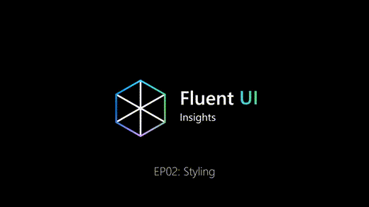
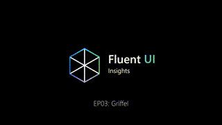

# Fluent UI Web

   

> Fluent UI React is shipping its v9 final stable release. Visit the [Fluent UI React v9 Release page on the wiki](https://github.com/microsoft/fluentui/wiki/Fluent-UI-React-v9-Release) to learn more about the upcoming release schedule.

Fluent UI web represents a collection of utilities, React components, and Web Components for building web applications.

This repo is home to 3 separate projects today. Combining Fluent UI React v9 components with Fluent UI React v8 or v0 components is possible and allows gradual migration to Fluent UI v9.

The following table will help you navigate the 3 projects and understand their differences.

<!-- prettier-ignore-start -->
|   | React Components (v9) | React (v8) | Web Components |
|---| ----- | --------------- | -------------- |
| **Overview**    | New, future-proof and forward looking | Mature | Web Component implementation of Fluent UI. |
| **Used By**     | Microsoft 365 | Office | Edge |
| **Read Me**     | [README.md](/packages/react-components/react-components/README.md) | [README.md](/packages/react/README.md)| [README.md](/packages/web-components/README.md) |
| **Changelog** | [CHANGELOG.md](/packages/react-components/react-components/CHANGELOG.md) | [CHANGELOG.md](/packages/react/CHANGELOG.md) | [CHANGELOG.md](/packages/web-components/CHANGELOG.md) |
| **Repo**        | [packages/react-components](/packages/react-components/react-components) | [./packages/react](/packages/react) | [./packages/web-components](/packages/web-components) |
| **Quick Start** | [Quick Start](https://react.fluentui.dev/?path=/docs/concepts-developer-quick-start--docs) | [Quick Start](https://developer.microsoft.com/en-us/fluentui#/get-started/web) | [See README.md](https://github.com/microsoft/fluentui/tree/master/packages/web-components/README.md) |
| **Docs**        | [https://react.fluentui.dev/](https://react.fluentui.dev/) | [aka.ms/fluentui-react](https://aka.ms/fluentui-react) | [aka.ms/fluentui-web-components](https://aka.ms/fluentui-web-components) |
| **NPM**         | `@fluentui/react-components` | `@fluentui/react`| `@fluentui/web-components` |
| **Version**     |  |  |  |
| **Issues**      | [?label=issues&style=flat-square)](https://github.com/microsoft/fluentui/issues?q=is%3Aissue+is%3Aopen+label%3A%22Fluent+UI+react-components+%28v9%29%22) | [?label=issues&style=flat-square)](https://github.com/microsoft/fluentui/issues?q=is%3Aissue+is%3Aopen+label%3A%22Fluent+UI+react+(v8)%22) |  |
<!-- prettier-ignore-end -->

> Why are there two React versions? Fluent UI v8 is still widely used. We encourage you to migrate to Fluent UI v9. See the [Migration overview](https://react.fluentui.dev/?path=/docs/concepts-migration-from-v8-component-mapping--docs).

## FluentUI Insights

[Fluent UI Insights](https://docs.microsoft.com/en-us/shows/fluent-ui-insights?utm_source=github) is a series that describes the design and decisions behind the Fluent UI design system.

|                                                                                                             EP01: Positioning                                                                                                             |                                                                                                           EP02: Styling                                                                                                           |                                                                                                           EP03: Griffel                                                                                                           |
| :---------------------------------------------------------------------------------------------------------------------------------------------------------------------------------------------------------------------------------------: | :-------------------------------------------------------------------------------------------------------------------------------------------------------------------------------------------------------------------------------: | :-------------------------------------------------------------------------------------------------------------------------------------------------------------------------------------------------------------------------------: |
|  |  |  |

|                                                                                                                          EP04: Foundational APIs                                                                                                                           |                                                                                                              EP05: Theming                                                                                                              |                                                                                                                  EP06: Accessible by default                                                                                                                  |
| :------------------------------------------------------------------------------------------------------------------------------------------------------------------------------------------------------------------------------------------------------------------------: | :-------------------------------------------------------------------------------------------------------------------------------------------------------------------------------------------------------------------------------------: | :-----------------------------------------------------------------------------------------------------------------------------------------------------------------------------------------------------------------------------------------------------------: |
|  |  |  |

## Licenses

All files on the Fluent UI React GitHub repository are subject to the MIT license. Please read the License file at the root of the project.

Usage of the fonts and icons referenced in Fluent UI React is subject to the terms of the [assets license agreement](https://aka.ms/fluentui-assets-license).

## Changelog

You can view the complete list of additions, fixes, and changes in the CHANGELOG.md file for each package.

## Looking for Office UI Fabric React?

The **Office UI Fabric React** project has evolved to **Fluent UI**.

The `office-ui-fabric-react` repo is now this repo (`fluentui` in the Microsoft organization)! The name change should not disrupt any current Fabric usage, repo clones, pull requests, or issue reporting. Links should redirect to the new location. The library formerly known as `office-ui-fabric-react` is now available as `@fluentui/react` (see above table for more information).

We have a lot in store for Fluent UI - [Read our announcement here.](https://developer.microsoft.com/en-us/office/blogs/ui-fabric-is-evolving-into-fluent-ui/)

## Looking for Fluent UI React Northstar?

Fluent UI React Northstar has been superseded by Fluent UI React Components v9 and reached End Of Life in July 2025.

For more details about Fluent UI React Northstar, see its [source](https://github.com/microsoft/fluentui/tree/react-v0/packages/fluentui) and [README.md](https://github.com/microsoft/fluentui/tree/react-v0/packages/fluentui/README.md).

---

This project has adopted the [Microsoft Open Source Code of Conduct](https://opensource.microsoft.com/codeofconduct/). For more information see the [Code of Conduct FAQ](https://opensource.microsoft.com/codeofconduct/faq/) or contact [opencode@microsoft.com](mailto:opencode@microsoft.com) with any additional questions or comments.

## 🌐 Web Resources & Interactive Index
- [CATEGORY THIRD PERSON SHOOTER80](https://learnaction.netlify.app/category-third-person-shooter80.html)
- [HUNGRY NOOB CAFE SIMULATOR](https://welearnaction.onrender.com/hungry-noob-cafe-simulator.html)
- [FURY TANKS](https://welearnaction.onrender.com/fury-tanks.html)
- [CATEGORY CAR 2](https://welearnaction.onrender.com/category-car-2.html)
- [CATEGORY CAR376](https://welearnaction.onrender.com/category-car376.html)
- [CATEGORY PENALTY](https://welearnaction.onrender.com/category-penalty.html)
- [CATEGORY POOL 2](https://welearnaction.onrender.com/category-pool-2.html)
- [CATEGORY EDUCATIONAL](https://welearnaction.onrender.com/category-educational.html)
- [CATEGORY PIXEL313](https://welearnaction.onrender.com/category-pixel313.html)
- [CATEGORY STICKMAN 2](https://welearnaction.onrender.com/category-stickman-2.html)
- [CATEGORY SOCCER60](https://welearnaction.onrender.com/category-soccer60.html)
- [CATEGORY MAHJONG 2](https://welearnaction.onrender.com/category-mahjong-2.html)
- [CATEGORY SIMULATION](https://welearnaction.onrender.com/category-simulation.html)
- [JELLO BUBBLES](https://learnaction.netlify.app/jello-bubbles.html)
- [CATEGORY PREMIUM PERKS71](https://welearnaction.onrender.com/category-premium-perks71.html)
- [CATEGORY CAR](https://welearnaction.onrender.com/category-car.html)
- [CUTE ANIMAL WORLD](https://learnaction.netlify.app/cute-animal-world.html)
- [CATEGORY INCREMENTAL388](https://welearnaction.onrender.com/category-incremental388.html)
- [ANIMAL BLOCK POP PUZZLE](https://learnaction.netlify.app/animal-block-pop-puzzle.html)
- [CATEGORY SHOP49](https://welearnaction.onrender.com/category-shop49.html)
- [CATEGORY RUNNING](https://welearnaction.onrender.com/category-running.html)
- [CATEGORY OBSTACLE](https://learnaction.netlify.app/category-obstacle.html)
- [CATEGORY IDLE](https://learnaction.netlify.app/category-idle.html)
- [CATEGORY MONSTER206](https://learnaction.netlify.app/category-monster206.html)
- [VISUAL MEMORY DRAG DROP](https://learnaction.netlify.app/visual-memory-drag-drop.html)
- [CATEGORY SHOOTER 2](https://learnaction.netlify.app/category-shooter-2.html)
- [CATEGORY MAKEUP CATEGORY](https://learnaction.netlify.app/category-makeup-category.html)
- [CATEGORY FLASH 2](https://learnaction.netlify.app/category-flash-2.html)
- [CATEGORY SURVIVAL366](https://learnaction.netlify.app/category-survival366.html)
- [CATEGORY CASUAL 9](https://welearnaction.onrender.com/category-casual-9.html)
- [CATEGORY COOKING46](https://welearnaction.onrender.com/category-cooking46.html)
- [CATEGORY ONE BUTTON](https://welearnaction.onrender.com/category-one-button.html)
- [CATEGORY SCRATCH17](https://learnaction.netlify.app/category-scratch17.html)
- [CATEGORY MERGE221](https://welearnaction.onrender.com/category-merge221.html)
- [CATEGORY PUZZLE](https://learnaction.netlify.app/category-puzzle.html)
- [CATEGORY CASUAL 5](https://welearnaction.onrender.com/category-casual-5.html)
- [KITTEN NEVER DIES](https://learnaction.netlify.app/kitten-never-dies.html)
- [CATEGORY BRAIN261](https://learnaction.netlify.app/category-brain261.html)
- [CATEGORY DRESS UP 2](https://learnaction.netlify.app/category-dress-up-2.html)
- [CATEGORY MINECRAFT81](https://welearnaction.onrender.com/category-minecraft81.html)
- [XYTRIAN RUNNER](https://learnaction.netlify.app/xytrian-runner.html)
- [CATEGORY LOL41](https://welearnaction.onrender.com/category-lol41.html)
- [CATEGORY STICKMAN](https://welearnaction.onrender.com/category-stickman.html)
- [CATEGORY MAGIC46](https://welearnaction.onrender.com/category-magic46.html)
- [CATEGORY CASUAL 3](https://welearnaction.onrender.com/category-casual-3.html)
- [CATEGORY THINKY](https://welearnaction.onrender.com/category-thinky.html)
- [BLOCK PIXEL GUN APOCALYPSE 3](https://learnaction.netlify.app/block-pixel-gun-apocalypse-3.html)
- [CATEGORY CAR](https://learnaction.netlify.app/category-car.html)
- [CATEGORY 2D1 060](https://learnaction.netlify.app/category-2d1-060.html)
- [UNCLE HIT PUNCH THE DUMMY](https://learnaction.netlify.app/uncle-hit-punch-the-dummy.html)
- [SUPERHERO PHONE SIMULATOR](https://learnaction.netlify.app/superhero-phone-simulator.html)
- [CATEGORY DRESS UP 2](https://welearnaction.onrender.com/category-dress-up-2.html)
- [RED STICKMAN VS CRAFTMANS 2](https://learnaction.netlify.app/red-stickman-vs-craftmans-2.html)
- [HIDDEN OBJECT MY HOTEL](https://learnaction.netlify.app/hidden-object-my-hotel.html)
- [HOME BLOCK STORY](https://learnaction.netlify.app/home-block-story.html)
- [CATEGORY SPEED158](https://welearnaction.onrender.com/category-speed158.html)
- [DRIFT IO](https://learnaction.netlify.app/drift-io.html)
- [BEAUTY WORLD AND FASHION STYLIST](https://learnaction.netlify.app/beauty-world-and-fashion-stylist.html)
- [CATEGORY PUZZLE 4](https://welearnaction.onrender.com/category-puzzle-4.html)
- [CATEGORY CAR 2](https://learnaction.netlify.app/category-car-2.html)
- [PANDA RESTAURANT](https://learnaction.netlify.app/panda-restaurant.html)
- [KING OF THE HILL](https://learnaction.netlify.app/king-of-the-hill.html)
- [CATEGORY SKILL254](https://welearnaction.onrender.com/category-skill254.html)
- [CATEGORY SOCCER60](https://learnaction.netlify.app/category-soccer60.html)
- [SAND SORT COLOR PUZZLE GAME](https://learnaction.netlify.app/sand-sort-color-puzzle-game.html)
- [INDEX20](https://learnaction.netlify.app/index20.html)
- [WILD TANKS](https://learnaction.netlify.app/wild-tanks.html)
- [SNAKE PUZZLE 3D](https://learnaction.netlify.app/snake-puzzle-3d.html)
- [CATEGORY MERGE](https://learnaction.netlify.app/category-merge.html)
- [CATEGORY IDLE448](https://learnaction.netlify.app/category-idle448.html)
- [MAHJONG CLASSIC](https://learnaction.netlify.app/mahjong-classic.html)
- [CATEGORY ESCAPE](https://welearnaction.onrender.com/category-escape.html)
- [CATEGORY CONTROLLER](https://welearnaction.onrender.com/category-controller.html)
- [CATEGORY CAR376](https://learnaction.netlify.app/category-car376.html)
- [CATEGORY HORDE SURVIVAL67](https://learnaction.netlify.app/category-horde-survival67.html)
- [CATEGORY CARDS](https://welearnaction.onrender.com/category-cards.html)
- [CLONEUP STACK YOURSELF](https://learnaction.netlify.app/cloneup-stack-yourself.html)
- [CATEGORY SIMULATION 2](https://welearnaction.onrender.com/category-simulation-2.html)
- [CATEGORY SNAKE](https://welearnaction.onrender.com/category-snake.html)
- [CATEGORY ESCAPE](https://learnaction.netlify.app/category-escape.html)
- [FAST BALL JUMP](https://learnaction.netlify.app/fast-ball-jump.html)
- [CATEGORY PHYSICS371](https://learnaction.netlify.app/category-physics371.html)
- [8 BALL POOL BILLIARDS MULTIPLAYER](https://learnaction.netlify.app/8-ball-pool-billiards-multiplayer.html)
- [CATEGORY AGILITY](https://learnaction.netlify.app/category-agility.html)
- [SPRUNKI 3D ESCAPE](https://learnaction.netlify.app/sprunki-3d-escape.html)
- [CARD SOLITAIRE WORD GAME](https://learnaction.netlify.app/card-solitaire-word-game.html)
- [SERIOUS HEAD](https://learnaction.netlify.app/serious-head.html)
- [PUZZLE BLOCKS](https://learnaction.netlify.app/puzzle-blocks.html)
- [CATEGORY RELAXING223](https://learnaction.netlify.app/category-relaxing223.html)
- [CATEGORY TOWER DEFENSE 2](https://learnaction.netlify.app/category-tower-defense-2.html)
- [CUBATORIA MERGE 2048](https://learnaction.netlify.app/cubatoria-merge-2048.html)
- [CATEGORY CARE](https://learnaction.netlify.app/category-care.html)
- [CATEGORY FPS174](https://learnaction.netlify.app/category-fps174.html)
- [CATEGORY DRESS UP](https://welearnaction.onrender.com/category-dress-up.html)
- [INDEX16](https://learnaction.netlify.app/index16.html)
- [CLICKER KNIGHTS VS DRAGONS](https://learnaction.netlify.app/clicker-knights-vs-dragons.html)
- [CATEGORY TETRIS](https://learnaction.netlify.app/category-tetris.html)
- [ONLINE PORTAL](https://learnaction.netlify.app/)
- [FASHIONISTA CHRISTMAS EVE PARTY](https://learnaction.netlify.app/fashionista-christmas-eve-party.html)
- [ONLINE PORTAL](https://themindzone.pages.dev/)
- [CATEGORY CLASSIC98](https://welearnaction.onrender.com/category-classic98.html)
- [CATEGORY POINT AND CLICK124](https://learnaction.netlify.app/category-point-and-click124.html)
- [CATEGORY FPS](https://welearnaction.onrender.com/category-fps.html)
- [CATEGORY IDLE445](https://welearnaction.onrender.com/category-idle445.html)
- [TERMS](https://theskillquest.pages.dev/terms.html)
- [CATEGORY MISSION206](https://welearnaction.onrender.com/category-mission206.html)
- [TEAM LOYALTY](https://learnaction.netlify.app/team-loyalty.html)
- [TERMS](https://themindplaying.web.app/terms.html)
- [TERMS](https://cryptotify.web.app/terms.html)
- [CATEGORY OBSTACLE299](https://welearnaction.onrender.com/category-obstacle299.html)
- [TERMS](https://iskillplay.web.app/terms.html)
- [CATEGORY PUZZLE 2](https://learnaction.netlify.app/category-puzzle-2.html)
- [CATEGORY MONSTER206](https://welearnaction.onrender.com/category-monster206.html)
- [CATEGORY 1 PLAYER139](https://welearnaction.onrender.com/category-1-player139.html)
- [CATEGORY MINECRAFT](https://welearnaction.onrender.com/category-minecraft.html)
- [CATEGORY FASHION](https://welearnaction.onrender.com/category-fashion.html)
- [BUBBLE SKY](https://learnaction.netlify.app/bubble-sky.html)
- [CATEGORY FOOTBALL](https://welearnaction.onrender.com/category-football.html)
- [INDEX4](https://learnaction.netlify.app/index4.html)
- [CATEGORY SKILL256](https://welearnaction.onrender.com/category-skill256.html)
- [CATEGORY POOL](https://learnaction.netlify.app/category-pool.html)
- [TILE FRUITS](https://learnaction.netlify.app/tile-fruits.html)
- [SITEMAP](https://skillcrafts.github.io/sitemap.html)
- [ONLINE PORTAL](https://quizverses.pages.dev/)
- [LUDO WORLD](https://learnaction.netlify.app/ludo-world.html)
- [CATEGORY OBSTACLE299](https://learnaction.netlify.app/category-obstacle299.html)
- [CHAMPIONS FC](https://learnaction.netlify.app/champions-fc.html)
- [CATEGORY MATCH 3](https://welearnaction.onrender.com/category-match-3.html)
- [ACOX RUNNER](https://learnaction.netlify.app/acox-runner.html)
- [LIGHT ACADEMIA FASHION](https://learnaction.netlify.app/light-academia-fashion.html)
