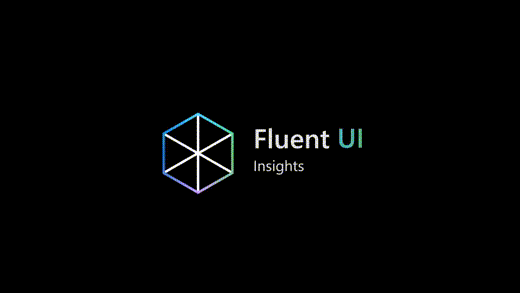

# Fluent UI Web

   

> Fluent UI React is shipping its v9 final stable release. Visit the [Fluent UI React v9 Release page on the wiki](https://github.com/microsoft/fluentui/wiki/Fluent-UI-React-v9-Release) to learn more about the upcoming release schedule.

Fluent UI web represents a collection of utilities, React components, and Web Components for building web applications.

This repo is home to 3 separate projects today. Combining Fluent UI React v9 components with Fluent UI React v8 or v0 components is possible and allows gradual migration to Fluent UI v9.

The following table will help you navigate the 3 projects and understand their differences.

<!-- prettier-ignore-start -->
|   | React Components (v9) | React (v8) | Web Components |
|---| ----- | --------------- | -------------- |
| **Overview**    | New, future-proof and forward looking | Mature | Web Component implementation of Fluent UI. |
| **Used By**     | Microsoft 365 | Office | Edge |
| **Read Me**     | [README.md](/packages/react-components/react-components/README.md) | [README.md](/packages/react/README.md)| [README.md](/packages/web-components/README.md) |
| **Changelog** | [CHANGELOG.md](/packages/react-components/react-components/CHANGELOG.md) | [CHANGELOG.md](/packages/react/CHANGELOG.md) | [CHANGELOG.md](/packages/web-components/CHANGELOG.md) |
| **Repo**        | [packages/react-components](/packages/react-components/react-components/CHANGELOG.md) | [./packages/react](/packages/react) | [./packages/web-components](/packages/web-components) |
| **Quick Start** | [Quick Start](https://react.fluentui.dev/?path=/docs/concepts-developer-quick-start--page) | [Quick Start](https://developer.microsoft.com/en-us/fluentui#/get-started/web) | [See README.md](https://github.com/microsoft/fluentui/tree/master/packages/web-components/README.md) |
| **Docs**        | [https://react.fluentui.dev/](https://react.fluentui.dev/) | [aka.ms/fluentui-react](https://aka.ms/fluentui-react) | [aka.ms/fluentui-web-components](https://aka.ms/fluentui-web-components) |
| **NPM**         | `@fluentui/react-components` | `@fluentui/react`| `@fluentui/web-components` |
| **Version**     |  |  |  |
| **Issues**      | [?label=issues&style=flat-square)](https://github.com/microsoft/fluentui/issues?q=is%3Aissue+is%3Aopen+label%3A%22Fluent+UI+react-components+%28v9%29%22) | [?label=issues&style=flat-square)](https://github.com/microsoft/fluentui/issues?q=is%3Aissue+is%3Aopen+label%3A%22Fluent+UI+react+(v8)%22) |  |
<!-- prettier-ignore-end -->

> Why are there two React versions? Fluent UI v8 is still widely used. We encourage you to migrate to Fluent UI v9. See the [Migration overview](https://react.fluentui.dev/?path=/docs/concepts-migration-overview--page).

## FluentUI Insights

[Fluent UI Insights](https://docs.microsoft.com/en-us/shows/fluent-ui-insights?utm_source=github) is a series that describes the design and decisions behind the Fluent UI design system.

|                                                                                                             EP01: Positioning                                                                                                             |                                                                                                           EP02: Styling                                                                                                           |                                                                                                           EP03: Griffel                                                                                                           |
| :---------------------------------------------------------------------------------------------------------------------------------------------------------------------------------------------------------------------------------------: | :-------------------------------------------------------------------------------------------------------------------------------------------------------------------------------------------------------------------------------: | :-------------------------------------------------------------------------------------------------------------------------------------------------------------------------------------------------------------------------------: |
|  |  |  |

|                                                                                                                          EP04: Foundational APIs                                                                                                                           |                                                                                                              EP05: Theming                                                                                                              |                                                                                                                  EP06: Accessible by default                                                                                                                  |
| :------------------------------------------------------------------------------------------------------------------------------------------------------------------------------------------------------------------------------------------------------------------------: | :-------------------------------------------------------------------------------------------------------------------------------------------------------------------------------------------------------------------------------------: | :-----------------------------------------------------------------------------------------------------------------------------------------------------------------------------------------------------------------------------------------------------------: |
|  |  |  |

## Licenses

All files on the Fluent UI React GitHub repository are subject to the MIT license. Please read the License file at the root of the project.

Usage of the fonts and icons referenced in Fluent UI React is subject to the terms of the [assets license agreement](https://aka.ms/fluentui-assets-license).

## Changelog

You can view the complete list of additions, fixes, and changes in the CHANGELOG.md file for each package.

## Looking for Office UI Fabric React?

The **Office UI Fabric React** project has evolved to **Fluent UI**.

The `office-ui-fabric-react` repo is now this repo (`fluentui` in the Microsoft organization)! The name change should not disrupt any current Fabric usage, repo clones, pull requests or issue reporting. Links should redirect to the new location. The library formerly known as `office-ui-fabric-react` is now available as `@fluentui/react` (see above table for more information).

We have a lot in store for Fluent UI - [Read our announcement here.](https://developer.microsoft.com/en-us/office/blogs/ui-fabric-is-evolving-into-fluent-ui/)

## Looking for Fluent UI React Northstar?

Fluent UI React Northstar has been superseded by Fluent UI React Components v9. For more details about Fluent UI React Northstar, see its [README.md](/packages/fluentui/README.md).

---

This project has adopted the [Microsoft Open Source Code of Conduct](https://opensource.microsoft.com/codeofconduct/). For more information see the [Code of Conduct FAQ](https://opensource.microsoft.com/codeofconduct/faq/) or contact [opencode@microsoft.com](mailto:opencode@microsoft.com) with any additional questions or comments.
