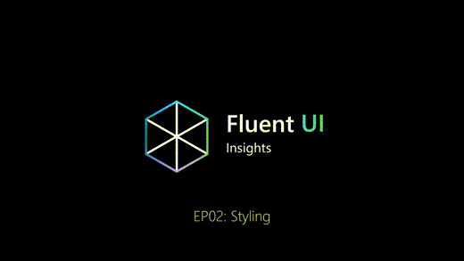
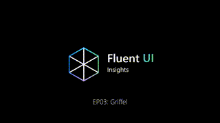

# Fluent UI Web

   

> Fluent UI React 正在发布其 v9 最终稳定版本。请访问 [Wiki 上的 Fluent UI React v9 发布页面](https://github.com/microsoft/fluentui/wiki/Fluent-UI-React-v9-Release) 了解即将发布的更多详情。

Fluent UI Web 是一套用于构建 Web 应用程序的工具库、React 组件和 Web Components 的集合。

本仓库目前包含 3 个独立的项目。将 Fluent UI React v9 组件与 Fluent UI React v8 或 v0 组件结合使用是可行的，这样可以实现向 Fluent UI v9 的逐步迁移。

下表将帮助你了解这 3 个项目及其区别。

<!-- prettier-ignore-start -->
|   | React 组件 (v9) | React (v8) | Web Components |
|---| ----- | --------------- | -------------- |
| **概述**    | 全新、面向未来的前瞻设计 | 成熟稳定 | Fluent UI 的 Web Components 实现。 |
| **使用者**     | Microsoft 365 | Office | Edge |
| **说明文档**     | [README.md](/packages/react-components/react-components/README.md) | [README.md](/packages/react/README.md)| [README.md](/packages/web-components/README.md) |
| **更新日志** | [CHANGELOG.md](/packages/react-components/react-components/CHANGELOG.md) | [CHANGELOG.md](/packages/react/CHANGELOG.md) | [CHANGELOG.md](/packages/web-components/CHANGELOG.md) |
| **仓库路径**        | [packages/react-components](/packages/react-components/react-components) | [./packages/react](/packages/react) | [./packages/web-components](/packages/web-components) |
| **快速开始** | [快速开始](https://react.fluentui.dev/?path=/docs/concepts-developer-quick-start--docs) | [快速开始](https://developer.microsoft.com/en-us/fluentui#/get-started/web) | [查看 README.md](https://github.com/microsoft/fluentui/tree/master/packages/web-components/README.md) |
| **文档**        | [https://react.fluentui.dev/](https://react.fluentui.dev/) | [aka.ms/fluentui-react](https://aka.ms/fluentui-react) | [aka.ms/fluentui-web-components](https://aka.ms/fluentui-web-components) |
| **NPM 包**         | @fluentui/react-components | @fluentui/react| @fluentui/web-components |
| **版本**     |  |  |  |
| **问题**      | [?label=issues&style=flat-square)](https://github.com/microsoft/fluentui/issues?q=is%3Aissue+is%3Aopen+label%3A%22Fluent+UI+react-components+%28v9%29%22) | [?label=issues&style=flat-square)](https://github.com/microsoft/fluentui/issues?q=is%3Aissue+is%3Aopen+label%3A%22Fluent+UI+react+(v8)%22) |  |
<!-- prettier-ignore-end -->

> 为什么会有两个 React 版本？Fluent UI v8 仍被广泛使用。我们建议你迁移到 Fluent UI v9。请参阅 [迁移概述](https://react.fluentui.dev/?path=/docs/concepts-migration-from-v8-component-mapping--docs)。

## FluentUI 洞察

[Fluent UI 洞察](https://docs.microsoft.com/en-us/shows/fluent-ui-insights?utm_source=github) 是一个系列节目，介绍 Fluent UI 设计系统背后的设计理念和决策。

|                                                                                                             第1集：定位                                                                                                             |                                                                                                           第2集：样式                                                                                                           |                                                                                                           第3集：Griffel                                                                                                           |
| :---------------------------------------------------------------------------------------------------------------------------------------------------------------------------------------------------------------------------------------: | :-------------------------------------------------------------------------------------------------------------------------------------------------------------------------------------------------------------------------------: | :-------------------------------------------------------------------------------------------------------------------------------------------------------------------------------------------------------------------------------: |
|  |  |  |

|                                                                                                                          第4集：基础 API                                                                                                                           |                                                                                                              第5集：主题                                                                                                              |                                                                                                                  第6集：默认无障碍                                                                                                                  |
| :------------------------------------------------------------------------------------------------------------------------------------------------------------------------------------------------------------------------------------------------------------------------: | :-------------------------------------------------------------------------------------------------------------------------------------------------------------------------------------------------------------------------------------: | :-----------------------------------------------------------------------------------------------------------------------------------------------------------------------------------------------------------------------------------------------------------: |
|  |  |  |

## 许可证

Fluent UI React GitHub 仓库中的所有文件均受 MIT 许可证约束。请阅读项目根目录下的许可证文件。

使用 Fluent UI React 中引用的字体和图标须遵守[资产许可协议](https://aka.ms/fluentui-assets-license)的条款。

## 更新日志

你可以在每个包的 CHANGELOG.md 文件中查看完整的新增功能、修复和更改列表。

## 在寻找 Office UI Fabric React？

**Office UI Fabric React** 项目已演变为 **Fluent UI**。

`office-ui-fabric-react` 仓库现已更名为此仓库（Microsoft 组织下的 `fluentui`）！此名称更改不会影响任何现有的 Fabric 使用、仓库克隆、拉取请求或问题报告。链接将自动重定向到新位置。原名为 `office-ui-fabric-react` 的库现在以 `@fluentui/react` 的名称提供（更多信息请参见上表）。

我们为 Fluent UI 准备了很多新内容 — [在此阅读我们的公告](https://developer.microsoft.com/en-us/office/blogs/ui-fabric-is-evolving-into-fluent-ui/)。

## 在寻找 Fluent UI React Northstar？

Fluent UI React Northstar 已被 Fluent UI React Components v9 取代，并于 2025 年 7 月达到生命周期终点。

有关 Fluent UI React Northstar 的更多详情，请参阅其[源代码](https://github.com/microsoft/fluentui/tree/react-v0/packages/fluentui)和 [README.md](https://github.com/microsoft/fluentui/tree/react-v0/packages/fluentui/README.md)。

---

本项目已采用 [Microsoft 开源行为准则](https://opensource.microsoft.com/codeofconduct/)。更多信息请参阅[行为准则常见问题](https://opensource.microsoft.com/codeofconduct/faq/)，或联系 [opencode@microsoft.com](mailto:opencode@microsoft.com) 提出任何其他问题或意见。
