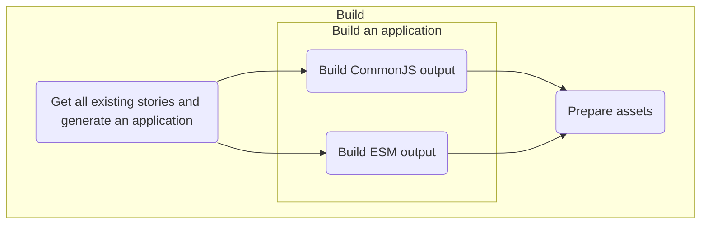
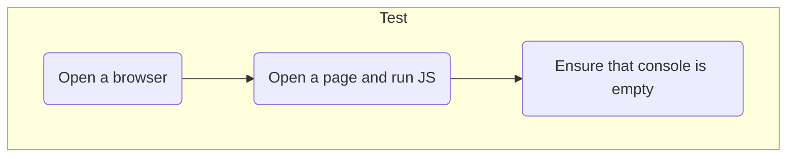

# @fluentui/ssr-tests-v9

**Tests for Server-side rendering (SSR) in [Fluent UI React v9](https://react.fluentui.dev)**.

## Usage

### `build`

```shell
# yarn build
```

This step produces assets that will be used during `test` step, this includes:

- CommonJS output user for server rendering
- ES Modules output used for serving in a browser
- `index.html` with generated markup (simulates server's behavior)

Assets are stored in `dist` folder and generated based on existing stories for v9 components.



### `test`

Uses assets from the `build` step and runs them in a real browser to ensure that there are no errors in console related to SSR.

```shell
# yarn test
```



#### Debugging

All assets are available in `./dist` folder that is available once `build` have been run. You can open `./dist/index.html` in any browser and debug relevant issues.
