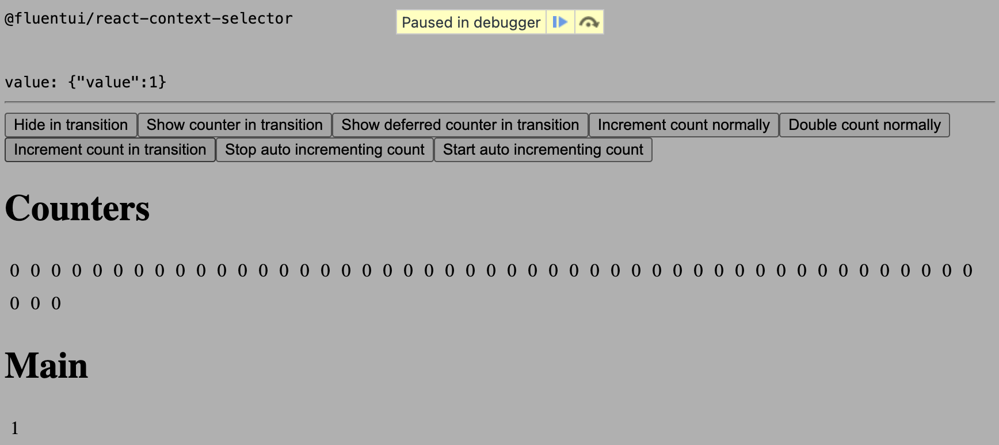

# RFC: Changes to `useContextSelector()`

[@layeshifter](https://github.com/layershifter)

<!-- START doctoc generated TOC please keep comment here to allow auto update -->
<!-- DON'T EDIT THIS SECTION, INSTEAD RE-RUN doctoc TO UPDATE -->

- [Summary](#summary)
- [Current problem](#current-problem)
  - [What is _tearing_?](#what-is-_tearing_)
  - [Where we are _now_?](#where-we-are-_now_)
  - [Exploration](#exploration)
  - [POC](#poc)
- [Options](#options)
  - [Option A: Do nothing (safe)](#option-a-do-nothing-safe)
  - [Option B: Use `useSyncExternalStore()` (probably safe)](#option-b-use-usesyncexternalstore-probably-safe)
  - [Option C: Propagate the value in render (risky)](#option-c-propagate-the-value-in-render-risky)

<!-- END doctoc generated TOC please keep comment here to allow auto update -->

## Summary

We offer a hook named `useContextSelector()` (in the `@fluentui/react-context-selector`) package. This hook allows you to select a specific value from the context using a selector function. The hook prevents the component from re-rendering until the selected value changes.

```jsx
function ListItem(props) {
  // 😎 Bail out if the selected value does not change
  const isActive = useContextSelector(ListValueContext, activeValue => activeValue === props.value /* item value */);

  return (
    <div>
      {props.value}, isActive: {isActive.toString()}
    </div>
  );
}
```

> 💡 This works similarly to [reselect](https://github.com/reduxjs/reselect) for Redux.

This enables us to create collection components, such as `List` and `ListItem`, that are more efficient by avoiding unnecessary re-renders:

```tsx
function App() {
  const [activeValue, setActiveValue] = React.useState(1);
  // 💡 React.memo() could be also used there to bail out from re-renders
  const children = React.useMemo(
    () => (
      <>
        <ListItem value={1} />
        <ListItem value={2} />
        <ListItem value={3} />
      </>
    ),
    [],
  );

  return (
    <>
      <List activeValue={activeValue}>{children}</List>
      <button onClick={() => setActiveValue(2)}>Set value to 2</button>
    </>
  );
}
```

In this example, only the items with `value={1}` and `value={2}` will re-render when the active value changes.

##### Compared to `React.useContext()`

Using `React.useContext()` in this case will cause a re-render for every subscriber whenever the context changes:

```jsx
function ListItem(props) {
  // 👎 Re-render on every context change
  const activeValue = React.useContext(ListValueContext);
  const isActive = activeValue === props.value;

  return (
    <div>
      {props.value}, isActive: {isActive.toString()}
    </div>
  );
}
```

## Current problem

**`useContextSelector()` is not a part of the React.js core**, there have been RFCs about it ([reactjs/rfcs#119: RFC: Context selectors](https://github.com/reactjs/rfcs/pull/119) & [reactjs/rfcs#150: RFC: Speculative Mode](https://github.com/reactjs/rfcs/pull/150)), however none of them were implemented.

> [!IMPORTANT]  
> There is a newly added API under a feature flag (`unstable_useContextWithBailout`, [facebook/react#30407: Add unstable context bailout for profiling](https://github.com/facebook/react/pull/30407)) with an uncertain future that achieves the same functionality. However, it operates on React's internal level and _could_ do it **properly**.

In the same time, our implementation of `useContextSelector()` relies solely on public APIs and has some limitations, such as issues with tearing and additional re-renders to avoid it.

### What is _tearing_?

> Tearing is a situation when a component is rendered with a new value, but the old value is still in the process of being rendered. This can lead to a situation where the components are rendered with a mix of old and new values.

To gain a proper understanding of the topic, please review the following before proceeding:

- [reactwg/react-18#69: What is tearing?](https://github.com/reactwg/react-18/discussions/69)
- [reactwg/react-18#70: Concurrent React for Library Maintainers](https://github.com/reactwg/react-18/discussions/70)

The quote above _sounds scary, right_? Well, it is, but it's not as bad as it seems. We will never have UIs with _stale_ values once the rendering is finished. In the worst case, we will end up with "Level 1":

> **Level 1**
>
> The bare minimum support is to just allow the UI to temporarily tear. With this level of support, application developers can use the library with concurrent features, but may temporarily see inconsistent UIs in their app.
>
> _https://github.com/reactwg/react-18/discussions/70_

### Where we are _now_?

`@fluentui/react-context-selector` is a copy-paste of an older version of `use-context-selector` package. However, there are some expectations that are not met:

> The goal of this library is not performance.
>
> _https://github.com/dai-shi/use-context-selector/issues/100#issuecomment-1412847282_

> The motivation of this library is to make it compatible (as much as possible in userland) with concurrency.
>
> _https://github.com/dai-shi/use-context-selector/issues/100#issuecomment-1411240604_

`use-context-selector` indeed is passing the tests from [`will-this-react-global-state-work-in-concurrent-rendering`](https://github.com/dai-shi/will-this-react-global-state-work-in-concurrent-rendering) repository. But _at what price?_

#### Behavioral benchmark

To benchmark possible options, I've created a simple app that contains basic scenarios similar to those in Fluent UI.

> _Strict Mode is disabled for all scenarios._

- **Scenario 1:** `List` & `ListItem`s (no additional memoization), expected re-renders:
  - 1 for `List`
  - N for `ListItem`s (N = number of items) on every update
- **Scenario 2:** `List` & `ListItem`s (with memoization), expected re-renders:
  - 1 for `List`
  - 2 for `ListItem`s (1 item becomes _active_, 1 item becomes _inactive_) on every update

#### `useContextSelector()` & re-renders

> _This implementation is passing the tearing test ✅_
>
> Example sandbox: https://stackblitz.com/edit/vitejs-vite-e8vsk7

##### Test results

- Scenario 1, _initial render:_ 1 `List` + **2N** `ListItem`s 🚨
  <details>
    <summary>Log</summary>

  ```
  render:List
  render:ListItem {active: true, value: '1'}
  render:ListItem {active: false, value: '2'}
  render:ListItem {active: false, value: '3'}
  render:ListItem {active: false, value: '4'}
  render:ListItem {active: true, value: '1'}
  render:ListItem {active: false, value: '2'}
  render:ListItem {active: false, value: '3'}
  render:ListItem {active: false, value: '4'}
  ```

  </details>

- Scenario 1, _update render:_ 1 `List` + **2N** `ListItem`s 🚨
  <details>
    <summary>Log</summary>

  ```
  render:List
  render:ListItem {active: true, value: '1'}
  render:ListItem {active: false, value: '2'}
  render:ListItem {active: false, value: '3'}
  render:ListItem {active: false, value: '4'}
  render:ListItem {active: false, value: '1'}
  render:ListItem {active: true, value: '2'}
  render:ListItem {active: false, value: '3'}
  render:ListItem {active: false, value: '4'}
  ```

  </details>

- Scenario 2, _initial render:_ 1 `List` + **2N** `ListItem`s 🚨
  <details>
    <summary>Log</summary>

  ```
  render:List
  render:ListItem {active: true, value: '1'}
  render:ListItem {active: false, value: '2'}
  render:ListItem {active: false, value: '3'}
  render:ListItem {active: false, value: '4'}
  render:ListItem {active: true, value: '1'}
  render:ListItem {active: false, value: '2'}
  render:ListItem {active: false, value: '3'}
  render:ListItem {active: false, value: '4'}
  ```

  </details>

- Scenario 2, _update render:_ 1 `List` + **N** `ListItem`s 🚨
  <details>
    <summary>Log</summary>

  ```
  render:List
  render:ListItem {active: false, value: '1'}
  render:ListItem {active: true, value: '2'}
  render:ListItem {active: false, value: '3'}
  render:ListItem {active: false, value: '4'}
  ```

  </details>

_Looks like it doesn't work as expected?_ _Indeed_, but it's intentional:

> If that's the case, it's expected behavior, React 18 disables useReducer early bailout and it's how it works.
>
> _https://github.com/dai-shi/use-context-selector/issues/100#issuecomment-1407291726_

#### `@fluentui/react-context-selector` & re-renders (we use this)

> _This implementation is passing the tearing test ✅_
>
> Example sandbox: https://stackblitz.com/edit/vitejs-vite-h3mmon

We didn't like the behavior described above (_and honestly, it looks more like a bug than something intentional_). Our fork uses `useState()` which has a bailout mechanism, see [microsoft/fluentui#30951](https://github.com/microsoft/fluentui/pull/30951).

> The shim for `useSyncExternalStore()` also uses `useState()` instead of `useReducer()`.
>
> _https://github.com/facebook/react/blob/9eb288e6579333612ed736c4e088669daf90a076/packages/use-sync-external-store/src/useSyncExternalStoreShimClient.js#L90_

##### Test results

- Scenario 1, _initial render:_ 1 `List` + N `ListItem`s ✅
  <details>
    <summary>Log</summary>

  ```
  render:List
  render:ListItem {active: true, value: '1'}
  render:ListItem {active: false, value: '2'}
  render:ListItem {active: false, value: '3'}
  render:ListItem {active: false, value: '4'}
  ```

  </details>

- Scenario 1, _update render:_ 1 `List` + **N+2** `ListItem`s 🚨 (see "Exploration" for details)
  <details>
    <summary>Log</summary>

  ```
  render:List
  /* re-rendered all items, but with _stale_ values */
  render:ListItem {active: true, value: '1'}
  render:ListItem {active: false, value: '2'}
  render:ListItem {active: false, value: '3'}
  render:ListItem {active: false, value: '4'}
  /* re-rendered matched items with proper values */
  render:ListItem {active: false, value: '1'}
  render:ListItem {active: true, value: '2'}
  ```

  </details>

- Scenario 2, _initial render:_ 1 `List` + N `ListItem`s ✅
  <details>
    <summary>Log</summary>

  ```
  render:List
  render:ListItem {active: true, value: '1'}
  render:ListItem {active: false, value: '2'}
  render:ListItem {active: false, value: '3'}
  render:ListItem {active: false, value: '4'}
  ```

  </details>

- Scenario 2, _update render:_ 1 `List` + **2** `ListItem`s ✅
  <details>
    <summary>Log</summary>

  ```
  render:List
  render:ListItem {active: false, value: '1'}
  render:ListItem {active: true, value: '2'}
  ```

  </details>

> **Note on glitchy behavior**
>
> It could be noticed that in the update scenario, three items are re-rendered instead of two 😦 Even though the value of one item never changes, it still gets re-rendered. The logic is correct; it's some kind of issue with the `useState()` bailout mechanism.
>
> ```
> render:List
> render:ListItem {active: false, value: '1'}
> render:ListItem {active: true, value: '2'}
> render:List
> render:ListItem {active: false, value: '1'} # 💣 should not be re-rendered
> render:ListItem {active: false, value: '2'}
> render:ListItem {active: true, value: '3'}
> render:List
> render:ListItem {active: false, value: '2'} # 💣 should not be re-rendered
> render:ListItem {active: false, value: '3'}
> render:ListItem {active: true, value: '4'}
> ```

### Exploration

The good news is that our fork performs better than the original implementation. The bad news is that one scenario still does not work as expected.

Let's dig into why "Scenario 1, update render" is not working as anticipated. We have the following render loop:

```
- render:List (activeValue: 2)
  // re-rendered all items with stale value
- render:ListItem* (activeValue: 1)
- useLayoutEffect:List (activeValue: 2)
  // re-rendered matched items with proper value
- render:ListItem* (activeValue: 2)
```

Let's break it down:

- We render `List`'s children with a _stale_ (from a previous update) value:
  > ```ts
  > const {
  >   value: { current: value }, // ⚠️ currently `value` equals to `1`
  >   // ...
  > } = contextValue; // 💡 `contextValue` is a stable object
  > const selected = selector(value); // `selector` runs with a _stale_ value
  > ```
  >
  > https://github.com/microsoft/fluentui/blob/e3d6a872ead53cce8c5684b4648cd1c57598da95/packages/react-components/react-context-selector/src/useContextSelector.ts#L18-L23
- `List` executes `useLayoutEffect` and propagates the new value to the children via listeners:
  > ```ts
  > useIsomorphicLayoutEffect(() => {
  >   valueRef.current = props.value; // `props.value` equals to `2`
  >   // ...
  >   listeners.forEach(listener => {
  >     listener([versionRef.current, props.value]);
  >   });
  > }, [props.value]);
  > ```
  >
  > https://github.com/microsoft/fluentui/blob/e3d6a872ead53cce8c5684b4648cd1c57598da95/packages/react-components/react-context-selector/src/createContext.ts#L25-L26
- A listener in `ListItem` (in `useContextSelector`) is triggered and re-renders the component if needed (and it's needed):
  > ```ts
  > const dispatch = (
  >   payload:
  >     | undefined // undefined from render below
  >     | readonly [ContextVersion, Value], // from provider effect
  > ) => {
  >   setState(prevState => {
  >     /* ... */
  >   });
  > };
  > ```
  >
  > https://github.com/microsoft/fluentui/blob/e3d6a872ead53cce8c5684b4648cd1c57598da95/packages/react-components/react-context-selector/src/useContextSelector.ts#L26-L64
- We re-render affected `ListItem`s again with a proper value:
  > ```ts
  > const {
  >   value: { current: value }, // ✅ currently `value` equals to `2`
  >   // ...
  > } = contextValue; // 💡 `contextValue` is a stable object
  > const selected = selector(value); // `selector` runs with a _stale_ value
  > ```
  >
  > https://github.com/microsoft/fluentui/blob/e3d6a872ead53cce8c5684b4648cd1c57598da95/packages/react-components/react-context-selector/src/useContextSelector.ts#L18-L23

The question that immediately arises is: _why do we re-render all items with a stale value?_ Well, _we can_, but it will cause issues with tearing. _Or not_?! 🤔

#### Tearing issues

The test (from `will-this-react-global-state-work-in-concurrent-rendering`) renders a set of items (similarly to the `ListItem` component) and updates a value:

- one counter is updated immediately ("Main" section)
- other counters are updated with a delay via `startTransition()` ("Counters" section)

> Deployed examples of the test:
>
> - `@fluentui/react-context-selector`: https://stackblitz.com/edit/stackblitz-starters-accpsb
> - POC with passing a value in render: https://stackblitz.com/edit/stackblitz-starters-ycw2at

To reproduce the issue, we need to:

- Open a deployed example
- Click on the "Show counter in transition" button
- Click on the "Increment count in transition" button
- Observe the logs in the console ("count mismatch" error) 💥

> If a breakpoint is set on `console.error()` in the test we can notice tearing in action:
>
> [](../assets/tearing-example.png)
>
> - "Main" counter is updated immediately and has "1"
> - "Counters" are updated with a delay and have "0" (stale value)

And it seems to be a problem? 🤔 Well, it _seems_ that tearing is by design here: we always render the `List` first and then the `ListItem`s. With the current approach, tearing appears to be unavoidable. For example, it can occur when consumers have controlled state, which is why not only the "Main" counter but also the "value" can go out of sync.

> **Okay, but why it's not an issue with X, Y, Z?**
>
> React 18 has `useSyncExternalStore()` for synchronizing state with an external store — shouldn't that help here? _No_, it will not as the usage pattern is different.
>
> Unlike other libraries that manage state _outside_ of React, we need to propagate state updates _within_ React itself. For example, if our components were never controlled (i.e., if state could not be controlled), we could directly call actions on the store within `ListItem` and avoid consuming/updating the state from `List`.
>
> ```tsx
> import { useSyncExternalStore } from 'use-sync-external-store/shim';
> const List = () => {
>   const [store] = React.useState(() => createStore());
>
>   /**
>    * 💡 `List` does not thing with the value, it's only a provider
>    */
>
>   return <ListContext.Provider value={store}>{/** ... */}</ListContext.Provider>;
> };
>
> const ListItem = ({ value }) => {
>   const store = useListStore();
>
>   const isActive = useSyncExternalStore(store.subscribe, store => store.isActive(value));
>   const onClick = () => store.setActiveItem(value);
>
>   return (
>     <button className={isActive ? 'listitem-active' : 'listitem'} onClick={onClick}>
>       {value}
>     </button>
>   );
> };
> ```
>
> However, as state could be controlled via `props`, we need to propagate the value in render:
>
> ```tsx
> const List = ({ value }) => {
>   const [store] = React.useState(() => createStore());
>
>   React.useLayoutEffect(() => {
>     store.setValue(value);
>   }, [value]);
>
>   return <ListContext.Provider value={store}>{/** ... */}</ListContext.Provider>;
> };
> ```
>
> And this is the point where tearing seems to be _unavoidable by design_ due to our current usage pattern.

### POC

> Example: https://stackblitz.com/edit/vitejs-vite-3gsvqu
>
> Example also contains additional scenarios for `useTranstion()` and `useDeferredValue()` hooks. The goal is to check if tearing is an issue with these hooks.
>
> **Note**: POC is based on `useSyncExternalStore()` shim, but `useSyncExternalStore()` could be also used directly.

- There are no visible issues
- "Scenario 1, _update render_" works as expected
- Passes unit & visual tests ([microsoft/fluentui#32226](https://github.com/microsoft/fluentui/pull/32226))
- Passes **all** tests in the product (Teams)

While there might be tearing, the final result will not contain _stale_ values:

> **Level 1**
>
> With this level of support, application developers can use the library with concurrent features, but may temporarily see inconsistent UIs in their app.
>
> _https://github.com/reactwg/react-18/discussions/70_

#### Can we avoid `useLayoutEffect`?

**Not really.** There will still be situations where we need to propagate the value within effects, particularly when some consumer components are memoized and skip re-renders. If we were to use `useEffect` instead of `useLayoutEffect`, we might encounter cases where the value isn’t propagated in time, making tearing **more** apparent. Additionally, using `useEffect` breaks unit tests in Fluent itself and products 😥

## Decision

### Option A: Do nothing (safe)

It’s simple as that 🙌

It works — it's not perfect, but it functions. The problem arises in a single scenario and **depending** on the use case, it might be acceptable.

> We can also keep an eye on `unstable_useContextWithBailout` and look forward to its eventual implementation in React.
>
> _https://github.com/facebook/react/pull/30407_

## Rejected options

### Option B: Use `useSyncExternalStore()` (probably safe)

Switch to `useSyncExternalStore()` available in React 18 (and the shim for earlier versions). This will resolve the glitch issue and simplify the code, code changes are in [microsoft/fluentui#30950](https://github.com/microsoft/fluentui/pull/30950).

> Note: "Scenario 1, _update render_" will still not work as expected, so **no real improvement** here.

### Option C: Propagate the value in render (risky)

Use "Option B" or POC (which is based on `useSyncExternalStore()` shim) and propagate the value in render:

```tsx
function Provider() {
  // ⬇️ `value` is passed in render, so components rendered
  //     in the same cycle can consume actual value
  store.value = props.value;

  React.useLayoutEffect(() => {
    store.value = value;
    store.notify();
  });
}
```

It will function as expected in terms of behavior, but _might_ introduce additional issues with tearing.
