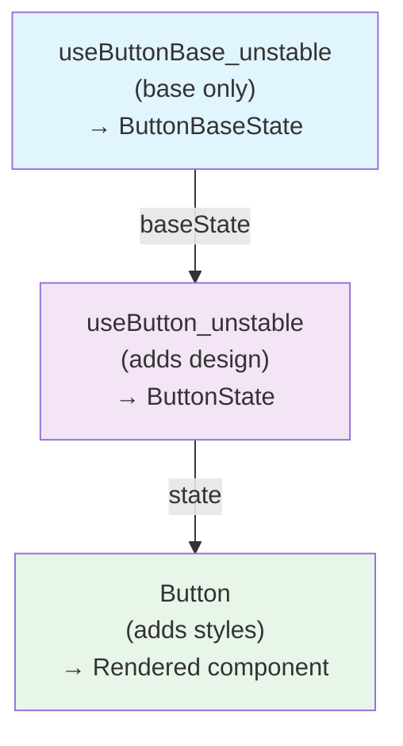

# RFC: Component Base State Hooks

## Contributors

- @dmytrokirpa

## Summary

Base state hooks provide pure component logic, accessibility, and structure for Fluent UI v9 components, without any styling opinions. They are an **advanced, opt-in feature** for teams building completely custom components that are not based on Fluent 2 design.

> **Note:** Most teams should use default components. Use base state hooks only when you need maximum control over rendering and are building a custom design system that significantly diverges from Fluent 2.

**What they include:**

- Component behavior, structure, and ARIA patterns
- Keyboard handling
- Semantic slot structure

**What they exclude:**

- Design props (appearance, size, shape)
- Style logic (Griffel, design tokens)
- Motion logic (animations, transitions)
- Default slot implementations (icons, components)

> [!IMPORTANT]
> Base state hooks provide ARIA attributes and semantic structure, but **not visual accessibility** (e.g., focus indicators, sufficient contrast). You're responsible for implementing these in your custom styles. When using base state hooks, you must ensure your custom styles maintain accessibility standards including visible focus indicators, sufficient color contrast, and appropriate visual feedback for all interactive states.

Base state hooks serve as the foundation layer that styled components are built upon.

## Problem Statement

Teams building custom design systems that significantly diverge from Fluent 2 face a specific challenge: they need Fluent's behavior primitives but want complete control over rendering.

**Who this is for:**

- Teams with established design systems that are fundamentally different from Fluent 2
- Organizations building white-label products requiring highly customized components
- Projects needing complete rendering control for specialized use cases

**Who this is NOT for:**

- Teams wanting to use Fluent 2 with custom branding (use styled components)
- Teams wanting to customize Fluent's styling (use styled components with custom styles)
- Standard applications using Fluent UI (use styled components)

Currently, these advanced users must:

- Import hooks that bundle defaults
- Work with design props they don't need
- Maintain fragile workarounds as Fluent evolves

**Example:** A team building a completely custom design language with their own component architecture (`variant`, `tone`, `emphasis`, custom rendering) still wants Fluent's accessibility and keyboard handling, but has to bundle some code they never use.

Base state hooks solve this by providing **only** the base layer.

## Solution

Introduce base state hooks per component using the naming pattern `use${ComponentName}Base_unstable`:

```tsx
// Import from the package directly
import { useButtonBase_unstable } from '@fluentui/react-button';
```

In this RFC, a "base state hook" refers to a `use{Component}Base_unstable` hook that accepts base props and returns base state.

### Exports and Naming

**Package exports:**

- Base state hooks are exported from individual component packages (e.g., `@fluentui/react-button`)
- They are NOT re-exported from the suite package (`@fluentui/react-components`) initially
- Re-exporting from the suite may be considered in the future based on adoption and feedback

**Naming pattern:**

- Hook name: `use${ComponentName}Base_unstable` (e.g., `useButtonBase_unstable`)
- Props type: `${ComponentName}BaseProps` (e.g., `ButtonBaseProps`)
- State type: `${ComponentName}BaseState` (e.g., `ButtonBaseState`)

The `_unstable` suffix is consistent with Fluent UI's convention for lower-level primitives whose implementation details may evolve.

### Core Principles

| Principle            | Description                                         | Example                                              |
| -------------------- | --------------------------------------------------- | ---------------------------------------------------- |
| **Base only**        | Pure component logic, no visual design              | ARIA attributes, keyboard handling, focus management |
| **No default slots** | Slots are defined, but nothing is filled by default | Icons, components must be passed by consumer         |
| **No styling**       | Bare bones "HTML"                                   | No styles, no design tokens, no animation/motion     |
| **Base types**       | Separate type definitions without design props      | `ButtonBaseProps` vs `ButtonProps`                   |

## Type Definitions

Base state hooks use dedicated types that establish a clear hierarchy:

```tsx
// Base types (component logic only)
export type ButtonBaseProps = ComponentProps<ButtonSlots> & {
  disabled?: boolean;
  disabledFocusable?: boolean;
  iconPosition?: 'before' | 'after';
};

export type ButtonBaseState = ComponentState<ButtonSlots> & {
  disabled: boolean;
  disabledFocusable: boolean;
  iconPosition: 'before' | 'after';
  iconOnly: boolean;
};

// Styled component types (add design props)
export type ButtonProps = ButtonBaseProps & {
  appearance?: 'primary' | 'secondary' | 'outline' | 'subtle' | 'transparent';
  size?: 'small' | 'medium' | 'large';
  shape?: 'rounded' | 'circular' | 'square';
};

export type ButtonState = ButtonBaseState & Required<Pick<ButtonProps, 'appearance' | 'size' | 'shape'>>;
```

Base props/state can still include structure-related layout semantics (for example, `iconPosition`) when they affect slot structure and keyboard/ARIA behavior, not visual design.

This hierarchy enables:

- Base state hooks accept `ButtonBaseProps`, return `ButtonBaseState`
- Regular state hooks (existing) accept `ButtonProps`, return `ButtonState`
- Design concerns layer on top of the base

## Implementation Example

The Button example is representative; the same layering and composition pattern applies across components.

### Component State Hook (Before)

Component state hooks compose base state and design state:

```tsx
import { useButtonBase_unstable } from './useButtonBase';
import type { ButtonProps, ButtonState } from './Button.types';

export const useButton_unstable = (
  props: ButtonProps,
  ref: React.Ref<HTMLButtonElement | HTMLAnchorElement>,
): ButtonState => {
  const {
    // base props
    as = 'button',
    disabled = false,
    disabledFocusable = false,
    icon,
    iconPosition = 'before',

    // design props
    appearance = 'secondary',
    size = 'medium',
    shape = 'rounded',
  } = props;

  // Optional slots only defined if explicitly provided
  const iconShorthand = slot.optional(icon, { elementType: 'span' });

  return {
    // base state
    disabled,
    disabledFocusable,
    iconPosition,
    iconOnly: Boolean(iconShorthand?.children && !props.children),
    root: slot.always<ARIAButtonSlotProps<'a'>>(getIntrinsicElementProps(as, useARIAButtonProps(as, props)), {
      elementType: as,
      defaultProps: {
        ref: ref as React.Ref<HTMLButtonElement & HTMLAnchorElement>,
        type: as === 'button' ? 'button' : undefined,
      },
    }),
    icon: iconShorthand,
    components: { root: as, icon: 'span' },

    // design state
    appearance,
    size,
    shape,
  };
};
```

### Component State Hook (After)

Component state hooks **compose base state hooks and add design state**:

```tsx
import { useButtonBase_unstable } from './useButtonBase';
import type { ButtonProps, ButtonState } from './Button.types';

export const useButton_unstable = (
  props: ButtonProps,
  ref: React.Ref<HTMLButtonElement | HTMLAnchorElement>,
): ButtonState => {
  const { appearance = 'secondary', size = 'medium', shape = 'rounded' } = props;

  return {
    ...useButtonBase_unstable(props, ref),
    appearance,
    size,
    shape,
  };
};
```

### Base State Hook

The code below is illustrative; some type details may be simplified to keep the example readable.

```tsx
import * as React from 'react';
import { type ARIAButtonSlotProps, useARIAButtonProps } from '@fluentui/react-aria';
import { getIntrinsicElementProps, slot } from '@fluentui/react-utilities';
import type { ButtonBaseProps, ButtonBaseState } from './Button.types';

export const useButtonBase_unstable = (
  props: ButtonBaseProps,
  ref: React.Ref<HTMLButtonElement | HTMLAnchorElement>,
): ButtonBaseState => {
  const { as = 'button', disabled = false, disabledFocusable = false, icon, iconPosition = 'before' } = props;

  // Optional slots only defined if explicitly provided
  const iconShorthand = slot.optional(icon, { elementType: 'span' });

  return {
    disabled,
    disabledFocusable,
    iconPosition,
    iconOnly: Boolean(iconShorthand?.children && !props.children),
    root: slot.always<ARIAButtonSlotProps<'a'>>(getIntrinsicElementProps(as, useARIAButtonProps(as, props)), {
      elementType: as,
      defaultProps: {
        ref: ref as React.Ref<HTMLButtonElement & HTMLAnchorElement>,
        type: as === 'button' ? 'button' : undefined,
      },
    }),
    icon: iconShorthand,
    components: { root: as, icon: 'span' },
  };
};
```

This composition centralizes base while keeping design concerns separate.

## Usage Example

Building a custom button with your own design system:

```tsx
import * as React from 'react';
import { useButtonBase_unstable, renderButton_unstable } from '@fluentui/react-button';
import type { ButtonBaseProps, ButtonState } from '@fluentui/react-button';
import './custom-button.css';

type CustomButtonProps = ButtonBaseProps & {
  variant?: 'primary' | 'secondary' | 'tertiary';
  tone?: 'neutral' | 'success' | 'warning' | 'danger';
};

export const CustomButton = React.forwardRef<HTMLButtonElement, CustomButtonProps>(
  ({ variant = 'primary', tone = 'neutral', ...props }, ref) => {
    const state = useButtonBase_unstable(props, ref);

    // Apply your custom class names, might use 3rd party packages like `classnames` or `clsx`
    state.root.className = ['custom-btn', `custom-btn--${variant}`, `custom-btn--${tone}`, state.root.className]
      .filter(Boolean)
      .join(' ');

    if (state.icon) {
      state.icon.className = ['custom-btn__icon', state.icon.className].filter(Boolean).join(' ');
    }

    return renderButton_unstable(state as ButtonState);
  },
);
```

## Benefits

| Audience                            | Benefit                                                                                  |
| ----------------------------------- | ---------------------------------------------------------------------------------------- |
| **Teams building custom libraries** | Pure component logic foundation without visual opinions; complete rendering control      |
| **Fluent UI maintainers**           | Clean separation of concerns; easier testing; single source of truth for component logic |
| **Design system teams**             | Build on proven accessibility without inheriting Fluent's visual design                  |

## Testing Strategy

Test each base state hook for:

| Category          | Verification                                            |
| ----------------- | ------------------------------------------------------- |
| **Structure**     | Returns correct state with all required slots           |
| **Accessibility** | ARIA attributes, keyboard handling work correctly       |
| **Purity**        | No Griffel, design tokens, or motion utilities imported |
| **Slots**         | No default implementations for optional slots           |
| **Refs**          | Refs preserved correctly                                |
| **States**        | Disabled/focusable states handled appropriately         |

## Comparison with Styled Variants

- **Layers**: `use{Component}Base_unstable` (base state hook) → `use{Component}_unstable` (component state hook) → `{Component}` (styled component)
- **Recommended for**: Advanced custom component libraries → Fluent UI internals/customization → most teams
- **Component logic + accessibility**: Present in all three layers
- **Design props**: Only in `use{Component}_unstable` and `{Component}`
- **Default slot implementations**: Only in `use{Component}_unstable` and `{Component}`
- **Style logic / motion logic**: Only in `use{Component}_unstable` and `{Component}`
- **Typical bundle size**: Smallest → medium → largest
- **Control level**: Maximum → high → standard

## Implementation Plan

### Phase 1: Pilot ✅

- [x] Implement PoC
- [x] Validate with partner teams
- [x] Confirm bundle size improvements

### Phase 2: Rollout

| Task                     | Purpose                                               |
| ------------------------ | ----------------------------------------------------- |
| Document type patterns   | Provide guide for `BaseProps` and `BaseState` types   |
| Apply to more components | Roll out to Divider, Menu, Tabs, and other components |
| Update documentation     | Create usage examples and migration guides            |

### Phase 3: Maintenance

- Monitor adoption and collect feedback
- Keep base state hooks aligned with accessibility best practices
- Maintain slot structure stability across updates

## Release Strategy

Base state hooks will be implemented in main branch (internal only) and released experimentally from a feature branch:

### Development and Release Process

| Stage                        | Approach                                                                                                   |
| ---------------------------- | ---------------------------------------------------------------------------------------------------------- |
| **Implementation in main**   | Implement base hooks in main branch WITHOUT exporting them publicly (internal only)                        |
| **Export in feature branch** | Feature branch adds public exports and experimental releases (e.g., `@fluentui/react-button@experimental`) |
| **Partner validation**       | Gather feedback and refine API surface based on real-world usage from experimental releases                |
| **Stable release**           | Merge feature branch to main (only adds exports) and release as stable once approach is validated          |

**Rationale for implementing in main:**

Implementing base hooks in main (without public exports) allows existing hooks to compose them immediately, reducing the maintenance burden of syncing changes between branches. The feature branch only needs to manage the public API surface (exports), making merge conflicts minimal and allowing main branch development to continue without being blocked by the experimental phase.

### Experimental Release Benefits

- Partner teams get early access to test and provide feedback
- API surface can be refined based on actual usage patterns
- Stable releases remain unaffected during validation
- Components can be released incrementally as completed
- Minimal merge conflicts when syncing main to feature branch

### Stability Guarantees

Once base state hooks transition from experimental to stable, they follow the same guarantees as other `_unstable` APIs in Fluent UI:

- **Implementation details** (internal logic, slot structure changes) may change in minor versions
- **Public API surface** (props, state shape, hook signature) will follow semver for breaking changes
- **Accessibility base** (ARIA patterns, keyboard handling) will be maintained and improved without breaking changes when possible
- **Slot structure** will aim for stability, but may evolve with prior communication to minimize impact on consumers

## FAQ

### When should I use base state hooks?

Base state hooks are for advanced use cases only. Use them when:

- Building a completely custom component library or design system that fundamentally differs from Fluent 2
- Creating white-label products requiring complete component architecture customization
- Needing full control over component rendering logic and structure

**For most teams, base state hooks are NOT the right choice.** Instead:

- **Default case:** Use styled components (`Button`) for standard Fluent UI applications
- **Custom styling needs:** Use styled components with `className` prop, `customStyleHooks_unstable`, or design token overrides
- **Complete customization:** Only use base state hooks (`useButtonBase_unstable`) when you need to control rendering and component structure

### How do base state hooks relate to styled components?

Base state hooks are the foundation layer that styled components build upon:



Most teams should use the styled component layer. Base state hooks are only for teams building their own component architecture.

### Do base state hooks guarantee accessibility?

Base state hooks provide correct ARIA attributes, keyboard handling, and semantic structure.

> [!IMPORTANT]
> You're responsible for ensuring custom styles don't interfere with accessibility (e.g., sufficient contrast, visible focus indicators).

### What about accessibility-critical inline styles?

Default base state hooks should not apply styles. The exception is when a specific CSS property is required for accessibility or core functionality (and is currently implemented via Griffel styles). In those cases, apply the minimum inline style needed and document the rationale.

**Examples of accessibility- or functionality-critical styles:**

- **Visually hidden elements**: Some components have elements present in the DOM but hidden via `visibility: hidden` or positioned outside the viewport for screen reader support
- **Portal positioning**: Components like Portal have base positioning (`position: absolute`, `inset: 0`) that may be required for proper functionality
- **Focus management**: Styles that ensure focus indicators or focus traps work correctly

**Implementation approach:**

If inline styles are required, apply the minimum inline style needed in base state hooks on a case-by-case basis. This requires:

1. **Careful investigation**: Identify which styles are truly required for accessibility vs. visual design
2. **Partner validation**: Confirm with partners that inline styles don't break existing implementations
3. **Documentation**: Clearly document why specific inline styles are included

> **Note:** This work is incremental per component. Most components should not require inline styles.

### Why no default slot implementations?

This gives teams maximum control and avoids bundling code they might not use. If you need default implementations for optional slots (like icons), use styled components instead.

### Can I mix base state hooks with styled components?

Yes. You can use base state hooks for some components and styled components for others in the same application.

> [!NOTE]
> We recommend sticking to a single option in your application to avoid UI misalignments.

Keep in mind you'll need to provide styles when using base state hooks.

### Why the `_unstable` suffix?

The `_unstable` suffix is consistent with Fluent UI's convention for hooks. While base state hooks are meant to be used in production, the suffix indicates they're lower-level primitives whose implementation details may evolve.

## Out of Scope

### Render functions

Base state hooks provide only state and accessibility handling. To build complete components, you'll also need render functions to produce markup.

We recommend re-using existing render functions (e.g., `renderButton_unstable`) rather than implementing custom render logic. Components that use portals or complex rendering patterns may require additional considerations. Future guidance on render functions will be provided in the Unstyled Components RFC.

## Future Work

Base state hooks provide the foundation for additional component variants:

- **Unstyled components**: Simple wrappers around base state hooks that provide Fluent's component structure without default styling (future proposal). This RFC does not introduce unstyled components; it describes a prerequisite layer.
