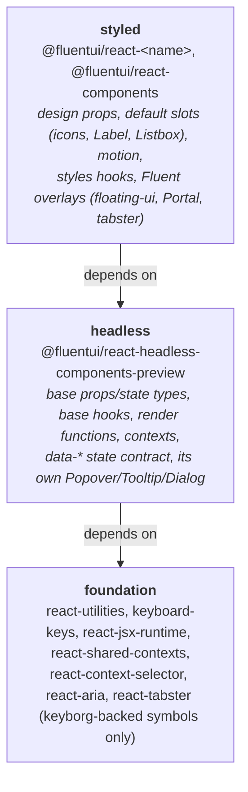

# RFC: Headless-first architecture for Fluent UI React v9

---

_Author: @mainframev_

## Summary

Today the headless layer is built on top of the styled layer: `@fluentui/react-headless-components-preview` depends on
the styled v9 component packages and wraps their `use*Base_unstable` hooks. This RFC turns that around.

1. **Headless becomes the base.** It owns the base props and state types, the base hooks, the render functions and the
   compound contexts. Styled v9 components are built on it. Headless ends with no dependency on any
   `@fluentui/react-<component>` package.
2. **The `data-*` state contract stays in headless.** Styled v9 calls the headless base hooks, which emit no `data-*`
   attributes. No headless `data-*` attribute appears in a v9 type, in v9 DOM or in v9 SSR output, and a lint rule
   guarantees it.
3. **Overlays with their own headless implementation stay as they are.** Headless Popover, Tooltip, Dialog and the
   Menu root are independent implementations on top of the HTML Popover API, `<dialog>` and CSS anchor positioning.
   They do not wrap a v9 base hook, so there is nothing to move, and v9 Popover, Tooltip, Dialog and Menu do not
   become dependent on them. Only components whose headless version wraps a v9 base hook move.

This RFC is about the direction of the dependency only. v9 package names, export maps and repository layout do not
change. Aligning the v9 packaging with the headless one (one package, one subpath per component) is a separate
follow-up that this RFC keeps in mind but does not propose; see [Follow-ups](#4-follow-ups-out-of-scope-keep-in-mind).

The migration is a sequence of small steps. Every step ships on the regular v9 train, needs no major version, and
leaves the repository working.

## Terms

- **Foundation**: the packages headless may import: `react-utilities`, `keyboard-keys`, `react-jsx-runtime`,
  `react-shared-contexts`, `react-context-selector`, `react-aria` and `react-tabster` (keyborg-backed symbols only).
- **Base hook**: `use<Name>Base`. Logic and accessibility for one component; no styles, tokens, motion, icons or
  default slot content, and no `data-*` attributes. After this RFC it lives in headless.
- **Headless hook**: `use<Name>` in headless. The base hook plus the `data-*` mapping. Never called by v9.
- **Styled hook**: `use<Name>_unstable` in a v9 package. The base hook plus design-prop defaults, default slots and
  motion.
- **Behaviour context**: a React context whose fields are read by a base hook (ids, validation state, open state).
  Moves to headless. A context that mixes behaviour fields with a design prop is still a behaviour context.
- **Design-prop context**: a context whose every field is a design prop (`size`, `appearance`, `shape`). Stays
  styled.
- **Behaviour dependency**: a styled package importing another styled package only to call its base logic. Disappears
  from the styled graph.
- **Rendering dependency**: a styled package importing another styled package to render it as a default slot. Stays.
- **Custom headless overlay**: a headless component with its own implementation that wraps no v9 base hook (Popover,
  Tooltip, Dialog, the Menu root). Out of scope.
- **Move**: one package's wrapped components changing ownership in one PR stack: a headless minor that takes the base
  layer, then a v9 patch that consumes it.

## Background

- [Headless components](./headless-components.md) decided that headless components reuse the v9 hooks and render
  functions and expose state as `data-*` attributes, which are a versioned contract.
- [Base state hooks](./base-state-hooks.md) split every v9 hook into `use<Name>Base_unstable` (logic and accessibility
  only: no styles, no tokens, no motion, no default slot content) and `use<Name>_unstable` (the Fluent defaults on top).
  The split is enforced by the `base-hook-no-forbidden-runtime` lint rule in `tools/eslint-rules` and by the
  `verify-bundle-isolation` target, which the workspace plugin adds to every project that has a
  `bundle-isolation.config.json`.

Both RFCs left the base hooks inside the styled packages. This RFC moves their ownership to headless and completes the
split.

## Problem statement

1. **The dependency points the wrong way.** `@fluentui/react-headless-components-preview` depends on 43 styled component
   packages: most of its components call a v9 `use<Name>Base_unstable` hook, add `data-*` attributes and re-export the
   v9 render function. Installing headless therefore installs the styled packages together with Griffel, `react-icons`,
   tabster and motion, and the only thing keeping them out of a consumer's bundle is a bundler-level check
   (`verify-bundle-isolation`), not the dependency graph. Styling already leaks into some base hooks through imports
   (`menuItemClassNames` in `useMenuBase_unstable`, the styled `Listbox` as the default listbox in
   `useComboboxBase_unstable`). Every behaviour fix for headless has to land in a v9 package first.

2. **Styled packages depend on each other for behaviour.** `docs/architecture/layers.md` forbids component-to-component
   dependencies, yet the v9 graph is full of them (Field → Label, Checkbox → Field, Avatar → Badge + Popover + Tooltip,
   Nav → Button + Drawer + Tooltip, and so on) and nothing enforces the rule. Each edge is one of two things:

   - a **behaviour** dependency: `react-checkbox` depends on `react-field` only to call
     `useFieldControlProps_unstable`, which reads the Field context and wires `id`, `aria-labelledby`,
     `aria-describedby`, `aria-invalid` and `required` onto the input. Eleven packages have this edge. It is pure
     logic, which is exactly what headless is for, and today it can only be expressed as a dependency on a styled
     package.
   - a **rendering** dependency: `react-checkbox` depends on `react-label` to render `Label` as the default `label`
     slot. That is a styled concern and belongs where it is.

   How this RFC addresses it: the behaviour edges disappear from the styled graph because the base hooks move to
   headless and call the headless `field` subpath there (section 2 and step 2 show Checkbox). What is left between
   styled packages is rendering only, which is easy to audit and, later, easy to consolidate.

## Goals

- No breaking change for any published v9 or headless import, export, type, class name or version range.
- Everything v9 consumes from headless (base hooks, render functions, base types, behaviour contexts) follows the v9
  breaking-change policy from the moment it moves, whatever the headless version number says. The headless hooks and
  the `data-*` contract keep the preview package's own policy.
- No styling runtime reachable from headless, enforced by the dependency graph and lint, with `verify-bundle-isolation`
  as the end-to-end check rather than the only check.
- The `data-*` state contract stays headless-only. Styled v9 DOM and SSR output does not change.
- Reuse the tooling that exists: `base-hook-no-forbidden-runtime` through its `forbiddenRuntimes` option,
  `@fluentui/no-restricted-imports` from the ESLint plugin, `verify-bundle-isolation` on both projects, and the
  per-subpath `generate-api` and `export-maps-sync` already running on the headless project.

Not in scope: visual changes, replacing Griffel or the `use<Name>Styles_unstable` hooks, new components (including
headless entries for table, tree, list and carousel), renaming or stabilising the headless preview package, unifying
the custom headless overlays (Popover, Tooltip, Dialog, the Menu root) or Provider with their v9 counterparts, consolidating the v9 packages, subpath exports on `@fluentui/react-components`, shim packages, merging
the stories projects.

## Proposal

### 1. Three layers



Three rules:

- Headless imports foundation only. It never imports `@griffel/*`, `@fluentui/react-theme` at runtime, `react-icons`,
  `react-motion*`, `react-portal`, the `tabster` runtime, or a styled package. `react-positioning` stays as it is
  today: headless takes types and `resolvePositioningShorthand` from it for its own CSS anchor `usePositioning`, and
  none of the base hooks headless wraps positions anything (`usePositioning` is called in `useMenu_unstable` and
  `useTagPicker_unstable`, the outer hooks, and headless Menu has its own root `useMenu`). What happens to that
  dependency is decided by the headless positioning strategy RFC (#36807), not here. `react-aria` and `react-tabster`
  are foundation: headless takes
  `useActiveDescendant` and `ActiveDescendantContextProvider` (Combobox, Dropdown, TagPicker), `AriaLiveAnnouncer`
  (Toaster), `useARIAButtonProps` (PopoverTrigger), `useIsNavigatingWithKeyboard` and `KEYBORG_FOCUSIN` from them, and
  every one of those symbols bottoms out in keyborg or plain DOM. The `tabster` runtime is forbidden at the symbol
  level, which is what `base-hook-no-forbidden-runtime` and `verify-bundle-isolation` already check today.
- Styled imports headless and foundation. When a styled package needs another component's behaviour it imports the
  headless subpath (`@fluentui/react-headless-components-preview/field`), never another styled package.
- A styled package may still depend on another styled package to render it as a default slot (Checkbox renders `Label`,
  Avatar renders `Badge`). That is a rendering dependency, it stays explicit in `package.json`, and it never reaches a
  base hook.

### 2. What each layer owns, per component

The lists below use Button as the example; every component follows the same shape.

**Headless exports, from `@fluentui/react-headless-components-preview/button`, under stable names:**

- `ButtonProps` and `ButtonSlots`. Headless `ButtonProps` is today's v9 `ButtonBaseProps`.
- `ButtonBaseState`: the state without `data-*` fields. `ButtonState`: `ButtonBaseState` plus the typed `data-*`
  fields on the slots that emit them, exactly as the headless `Button.types.ts` defines it today.
- `useButtonBase(props, ref)`: today's v9 `useButtonBase_unstable`, moved as is. Returns `ButtonBaseState`. Emits no
  `data-*` attributes.
- `useButton(props, ref)`: `useButtonBase` followed by the `data-*` mapping. Returns `ButtonState`. This is the public
  headless hook and the only place the reserved attributes are written.
- `renderButton(state)`: typed against `ButtonBaseState`, so it serves both hooks and both layers.
- `Button`, `ButtonContextProvider`, `useButtonContext`.

**Styled exports, from `@fluentui/react-button`, unchanged names:**

- `ButtonProps` = headless `ButtonProps` + `appearance`, `shape`, `size`. `ButtonState` = headless `ButtonBaseState` +
  the required design props. v9 types are built on `ButtonBaseState`, so **no `data-*` field appears in any v9 public
  type**.
- `useButton_unstable` = `useButtonBase` + design-prop defaults + default slots + motion. It never calls `useButton`.
- `useButtonStyles_unstable` and `buttonClassNames`, unchanged.
- `renderButton_unstable`, a re-export of the headless render function.
- `useButtonBase_unstable`, `ButtonBaseProps`, `ButtonBaseState`: kept as deprecated aliases of the headless exports for
  the lifetime of v9. Nothing a consumer imports today disappears.

Rules that fall out of this:

- Anything that imports `@fluentui/react-icons`, a styled component (`Label`, `Listbox`) or motion is a styled concern.
  It stays in the styled layer and reaches the base through slot defaults, never through the base hook.
- The styled packages get a lint rule that forbids importing `use<Name>` (as opposed to `use<Name>Base`) from a headless
  subpath, so the `data-*` contract cannot reach v9 by accident.
- Behaviour contexts move to headless and the styled layer re-exports them; context identity is preserved because
  there is one module instance. A context moves whole unless every one of its fields is a design prop. Mixed contexts
  are the common case (Field, Combobox, Avatar, AccordionHeader, Skeleton, Table and TagPicker carry `size` or
  `appearance` next to behaviour fields) and they move as they are: a string union in a context is not a styling
  runtime, and splitting a context would change how many providers a component renders. Button's context is the
  design-prop-only case: its only field is `size`, set by Toolbar, so it stays in `react-button`, and the headless
  `button` subpath stops re-exporting it. That is a headless preview break and is called out in the headless
  changelog.

### 3. Overlays

Headless overlays fall into two groups and this RFC treats them differently.

**Custom headless implementations: Popover, Tooltip, Dialog, and the Menu root.** These do not call a v9 base hook.
They are built on the HTML Popover API, `<dialog>`, the top layer and CSS anchor positioning, and import nothing from
`react-popover`, `react-tooltip` or `react-dialog` beyond a type. Headless `useMenu` is the same kind of thing: its
own root hook on the headless `usePositioning`, not a wrapper of `useMenuBase_unstable`. They stay exactly as they
are. v9 Popover, Tooltip, Dialog and the v9 Menu root keep their floating-ui, `Portal` and tabster implementation and
do not become dependent on the headless ones. Two implementations of these families remain; whether and how to unify
them is a separate decision, not part of this RFC. Provider is treated the same way: headless has its own `Provider`,
v9 has `FluentProvider`, and they stay separate.

**v9-wrapping overlay parts: MenuItem, MenuList, MenuPopover, MenuTrigger, Drawer, Toast, the Combobox, Dropdown and
TagPicker listboxes.** Their headless version calls a v9 base hook today, so they move in step 2 like every other
component. None of those base hooks positions a surface; positioning (`usePositioning` from `react-positioning`),
motion (`presenceMotionSlot`, `useMotionForwardedRef`) and `Portal` all live in the styled outer hooks and stay there.

### 4. Follow-ups (out of scope, keep in mind)

Headless and v9 use two repository and packaging models today. Headless is one package with one export subpath per
component and one stories project; v9 is 60+ packages with root-only exports, a suite barrel and one stories project
per package. Bringing v9 onto the headless model is a natural next step after this RFC, not part of it:

- `@fluentui/react-components` gains `./<name>` subpaths through the same `subpathEntryPoints` and `exportSubpaths`
  settings the headless project already uses; `@fluentui/react-<name>` packages become generated re-export shims whose
  `api.md` stays byte-identical; the per-package stories projects merge into one. That work needs its own RFC with its
  own build-time measurements and consumer story.
- Generators and skills (`react-component`, `v9-component`, `headless-component`) follow whichever layout wins.

What this RFC does to keep that door open: headless subpath names stay aligned with v9 package names, one or more
subpaths per package (`@fluentui/react-headless-components-preview/button` ↔ `@fluentui/react-button`, `tag`,
`tag-group` and `interaction-tag` ↔ `@fluentui/react-tags`); base hooks land once, in
`library/src/components/<Name>` in headless, which is the layout a later consolidation keeps; and on the v9 side every
step stays inside the existing package, so a later consolidation moves each styled file once.

## Migration plan

Each step is independently shippable and lists what it does, when it is done, and what a consumer sees.

### Step 0: Guardrails

No new workspace mechanism is needed; the rules below use what the ESLint plugin and the workspace plugin already
provide.

- In the headless `eslint.config.cjs`, enable `@fluentui/no-restricted-imports` with every `@fluentui/react-<component>`
  package in `forbidden`. The rule already exists and the shared react config already uses it for stories. Warn only
  until step 2 is complete.
- Give headless subpaths node10 type resolution. v9 libraries type-check against built `dist` output with
  `moduleResolution: node`, which ignores `exports`, so `@fluentui/react-headless-components-preview/button` has no
  types from a v9 package today. Headless gets a `typesVersions` block with one entry per subpath, emitted by
  `export-maps-sync` so it never drifts from the export map. Must be in place before the first move in step 2.
- Extend `base-hook-no-forbidden-runtime` through `forbiddenRuntimes` from `tabster` to `@griffel/*`, `react-theme`
  runtime, `react-icons`, `react-motion*`, `react-portal`.
- Add `@fluentui/react-motion` to the headless `bundle-isolation.config.json` `forbiddenPackages`, as the suite config
  already has.
- Add the styled-side lint rule that forbids importing `use<Name>` from a headless subpath.
- Done when the rules run in CI (warn).
- Consumer sees: nothing.

### Step 1: Untangle styling from v9 base hooks

- Menu: `useMenuBase_unstable` replaces `menuItemClassNames.root` with a `data-fui-menu-item` attribute or a role
  selector.
- Combobox, Dropdown: the base hook takes the listbox through a slot default supplied by the outer hook instead of
  importing the styled `Listbox`.
- Checkbox, Combobox, Dropdown, Option, MenuItemCheckbox, MenuItemRadio, MenuItemSwitch, Tag, InteractionTagSecondary,
  TagPickerControl: icons and `Label` live in the same file as the base hook. Move them into the outer hook where they
  are not there already, and split the file so the base hook's module imports nothing styled.
- Carousel, TagGroup, TagPickerControl, MenuSplitGroup, MenuItemSwitch: remove `.styles` imports from hooks.
- Done when the `allowedViolations` list for `BaseHooks.fixture.js` in `react-components/bundle-isolation.config.json`
  (today `@fluentui/react-motion`, `@griffel/core`, `@griffel/react`, `tabster`) is empty for every component that
  moves in step 2.
- Consumer sees: nothing. Patch releases.

### Step 2: Move components, one at a time, dependents first

The unit of work is a package: all of its wrapped components move in one PR stack, so a package is never half on
headless. Per package, with the shape section 2 describes:

1. Headless: move the base hook, render function, base types and behaviour contexts from the v9 package into
   `library/src/components/<Name>` as `use<Name>Base`, `render<Name>` and the headless types; the existing headless
   `use<Name>` keeps the `data-*` step and calls the local base hook; the v9 base-hook tests move with them. Headless
   loses every reference to `@fluentui/react-<name>`: runtime imports, type-only imports and the `package.json` entry.
   A type-only import is enough for Nx to draw a dependency edge, so `.types.ts` files count. Headless minor.
2. Styled: `@fluentui/react-<name>` adds the headless dependency, imports `use<Name>Base` and `render<Name>` from the
   headless subpath, keeps `use<Name>Base_unstable` and the `<Name>Base*` types as plain aliases, and drops the moved
   files. Patch release. The API report gate is "no export removed, no signature changed". The report itself changes
   shape: inline type bodies become re-exports and aliases of headless types, and headless reports for sibling
   components (ToggleButton and SplitButton for Button) change the same way. Reviewers diff the export list, not the
   file.

**Order.** The Nx task graph decides it. A v9 package can depend on headless only while headless cannot reach that
package through the styled packages it still wraps. Otherwise the graph has a cycle (`react-button` → headless →
`react-avatar` → `react-tooltip` → `react-button`) and Nx refuses to run any target with `dependsOn: ^build` on either
side. So packages move dependents first and dependencies last, the reverse of the v9 dependency graph. Computed from
the project graph over the 45 styled packages headless wraps today, a package is movable once no un-moved wrapped
package reaches it. Packages within a round are independent of each other and can move in any order or in parallel:

| Round | Packages                                                                                                                                                                                                                                            |
| ----- | --------------------------------------------------------------------------------------------------------------------------------------------------------------------------------------------------------------------------------------------------- |
| 1     | accordion, breadcrumb, card, checkbox, color-picker, image, message-bar, nav, persona, progress, rating, search, select, skeleton, slider, spinbutton, spinner, swatch-picker, switch, tabs, tag-picker, teaching-popover, textarea, toast, toolbar |
| 2     | combobox, divider, drawer, input, link, overflow, radio, tags                                                                                                                                                                                       |
| 3     | avatar, dialog, field                                                                                                                                                                                                                               |
| 4     | badge, label, popover, tooltip                                                                                                                                                                                                                      |
| 5     | button, menu                                                                                                                                                                                                                                        |

For the custom headless overlays (Popover, Tooltip, Dialog, the Menu root) and for Provider only the type imports and
the `package.json` entries go; nothing else moves. Table, tree, list and carousel have no headless entry today, so
there is no dependency to reverse; they are out of scope. The order is recomputed from the graph before each round,
since dependencies change.

**Behaviour dependencies between base hooks.** A moved base hook keeps importing an un-moved package for behaviour it
needs; that edge points from headless to a package that does not depend on headless yet, so it is harmless. When that
package's turn comes, the same headless minor that moves it rewires every headless consumer to the local copy, and
only then does the v9 package flip. Field is the worked example: Checkbox moves in round 1 and keeps calling
`useFieldControlProps_unstable` from `react-field`; Field moves in round 3 and rewires Checkbox, Input, Combobox and
the eight other callers in the same release.

```ts
// Round 1. headless: library/src/components/Checkbox/useCheckboxBase.ts
// Moved from react-checkbox. Field has not moved yet, so the behaviour import still points at the v9 package.
import { useFieldControlProps_unstable } from '@fluentui/react-field';

export const useCheckboxBase = (props: CheckboxProps, ref: React.Ref<HTMLInputElement>): CheckboxBaseState => {
  props = useFieldControlProps_unstable(props, { supportsLabelFor: true, supportsRequired: true });
  // ...today's useCheckboxBase_unstable body, unchanged
};

// Round 1. v9: react-checkbox/library/src/components/Checkbox/useCheckbox.tsx
// react-checkbox now depends on headless. The rendering dependency on react-label stays.
import { useCheckboxBase } from '@fluentui/react-headless-components-preview/checkbox';
import { Label } from '@fluentui/react-label';

export const useCheckbox_unstable = (props: CheckboxProps, ref: React.Ref<HTMLInputElement>): CheckboxState => {
  const state = useCheckboxBase(props, ref);
  // design-prop defaults, default slots (Label, icons), as today
};

// Round 3. headless: library/src/components/Field/useFieldControlProps.ts
// Moved from react-field/library/src/contexts/useFieldControlProps.ts. Same logic: reads the Field context
// and fills id, aria-labelledby, aria-describedby, aria-invalid and required on the control's props.
export function useFieldControlProps<Props extends FieldControlProps>(
  props: Props,
  options?: FieldControlPropsOptions,
): Props {
  return getFieldControlProps(useFieldContext(), props, options);
}

// Round 3. headless: library/src/components/Checkbox/useCheckboxBase.ts, same release
import { useFieldControlProps } from '../Field/useFieldControlProps';

// Round 3. v9: react-field/library/src/index.ts
// react-field now depends on headless. The public names do not change.
export {
  useFieldControlProps as useFieldControlProps_unstable,
  useFieldContext as useFieldContext_unstable,
  FieldContextProvider,
} from '@fluentui/react-headless-components-preview/field';
```

- Done when headless has no `@fluentui/react-<component>` dependency at all and every v9 package with a headless
  counterpart calls `use<Name>Base` from headless.
- Consumer sees: nothing. DOM output is unchanged because the styled layer calls `use<Name>Base`. Bundle size is
  unchanged because the same code is imported from a different package; the Button proof of concept measured
  34.065 kB before and 33.962 kB after.

### Step 3: Lock in

- `@fluentui/no-restricted-imports` on the headless project and the extended base-hook rule switch from warn to error.
- The `BaseHooks.fixture.js` allow-list is removed.
- `@deprecated` notices on `use<Name>Base_unstable` and the `<Name>Base*` types point at the headless subpath. This
  cannot land earlier: `@typescript-eslint/no-deprecated` fails the package's own lint while sibling components still
  consume the aliases (ToggleButton, CompoundButton, MenuButton and SplitButton for Button), so every sibling in a
  package switches to the headless imports first.
- `docs/architecture/layers.md` and the hook section of `docs/architecture/component-patterns.md` are rewritten to
  match sections 1 and 2.
- Consumer sees: deprecation notices in editors. Nothing else.

## Pros and Cons

### Pros

- Layering is a property of the dependency graph and is enforced by lint, instead of being checked after bundling.
- A single, stable entry point for "Fluent behaviour, my styles", with the `_unstable` surface retired by deprecation
  rather than removal.
- Headless install footprint drops from 43 styled packages to the foundation packages.
- Styled-to-styled behaviour dependencies get a correct target; what remains in the v9 dependency web is rendering
  only, which makes a later packaging consolidation a mechanical move.
- Behaviour fixes land once, in headless, and reach v9 through the dependency.

### Cons

- A multi-quarter migration that touches every v9 package headless wraps today. Mitigated by the
  per-component unit of work and by every step being shippable on its own.
- Every v9 component package depends on a `0.x` preview package. A caret on `0.x` only allows patch bumps, so an app
  that upgrades v9 packages one at a time can end up with two headless copies, which duplicates base hooks and splits
  contexts.
- Two hooks per component in headless (`use<Name>Base` and `use<Name>`) so that the `data-*` contract stays out of v9.
- Popover, Tooltip, Dialog and the Menu root keep two implementations. Open state, dismissal, focus restore and
  keyboard handling for them are still tested twice and can still drift.
