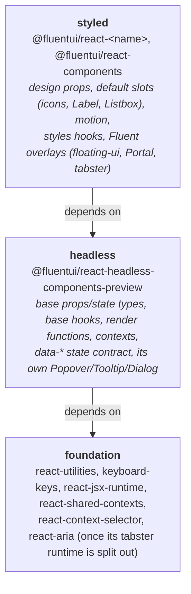

# RFC: Headless-first architecture for Fluent UI React v9

---

_Author: @mainframev_

## Summary

Today the headless layer is built on top of the styled layer: `@fluentui/react-headless-components-preview` depends on
the styled v9 component packages and wraps their `use*Base_unstable` hooks. This RFC turns that around.

1. **Headless becomes the base.** It owns the base props and state types, the base hooks, the render functions and the
   compound contexts. Styled v9 components are built on it. Headless ends with no dependency on any
   `@fluentui/react-<component>` package.
2. **The `data-*` state contract stays in headless.** Styled v9 calls the headless base hooks, which emit no `data-*`
   attributes. No headless `data-*` attribute appears in a v9 type, in v9 DOM or in v9 SSR output, and a lint rule
   guarantees it.
3. **Overlays with their own headless implementation stay as they are.** Headless Popover, Tooltip, Dialog and the
   Menu root are independent implementations on top of the HTML Popover API, `<dialog>` and CSS anchor positioning.
   They do not wrap a v9 base hook, so there is nothing to move, and v9 Popover, Tooltip, Dialog and Menu do not
   become dependent on them. Only components whose headless version wraps a v9 base hook move.

This RFC is about the direction of the dependency only. v9 package names, export maps and repository layout do not
change. Aligning the v9 packaging with the headless one (one package, one subpath per component) is a separate
follow-up that this RFC keeps in mind but does not propose; see [Follow-ups](#4-follow-ups-out-of-scope-keep-in-mind).

The migration is a sequence of small steps. Every step ships on the regular v9 train, needs no major version, and
leaves the repository working.

## Background

- [Headless components](./headless-components.md) decided that headless components reuse the v9 hooks and render
  functions and expose state as `data-*` attributes, which are a versioned contract.
- [Base state hooks](./base-state-hooks.md) split every v9 hook into `use<Name>Base_unstable` (logic and accessibility
  only: no styles, no tokens, no motion, no default slot content) and `use<Name>_unstable` (the Fluent defaults on top).
  The split is enforced by the `base-hook-no-forbidden-runtime` lint rule in `tools/eslint-rules` and by the
  `verify-bundle-isolation` target, which the workspace plugin adds to every project that has a
  `bundle-isolation.config.json`.

Both RFCs left the base hooks inside the styled packages. This RFC moves their ownership to headless and completes the
split.

## Problem statement

1. **The dependency points the wrong way.** `@fluentui/react-headless-components-preview` depends on 43 styled component
   packages: most of its components call a v9 `use<Name>Base_unstable` hook, add `data-*` attributes and re-export the
   v9 render function. Installing headless therefore installs the styled packages together with Griffel, `react-icons`,
   tabster and motion, and the only thing keeping them out of a consumer's bundle is a bundler-level check
   (`verify-bundle-isolation`), not the dependency graph. Styling already leaks into some base hooks through imports
   (`menuItemClassNames` in `useMenuBase_unstable`, the styled `Listbox` as the default listbox in
   `useComboboxBase_unstable`). Every behaviour fix for headless has to land in a v9 package first.

2. **Styled packages depend on each other for behaviour.** `docs/architecture/layers.md` forbids component-to-component
   dependencies, yet the v9 graph is full of them (Field → Label, Checkbox → Field, Avatar → Badge + Popover + Tooltip,
   Nav → Button + Drawer + Tooltip, and so on) and nothing enforces the rule. Each edge is one of two things:

   - a **behaviour** dependency: `react-checkbox` depends on `react-field` only to call
     `useFieldControlProps_unstable`, which reads the Field context and wires `id`, `aria-labelledby`,
     `aria-describedby`, `aria-invalid` and `required` onto the input. Eleven packages have this edge. It is pure
     logic, which is exactly what headless is for, and today it can only be expressed as a dependency on a styled
     package.
   - a **rendering** dependency: `react-checkbox` depends on `react-label` to render `Label` as the default `label`
     slot. That is a styled concern and belongs where it is.

   How this RFC addresses it: the behaviour edges disappear from the styled graph because the base hooks move to
   headless and call the headless `field` subpath there (section 2 and step 2 show Checkbox). What is left between
   styled packages is rendering only, which is easy to audit and, later, easy to consolidate.

## Goals

- No breaking change for any published v9 or headless import, export, type, class name or version range.
- No styling runtime reachable from headless, enforced by the dependency graph and lint, with `verify-bundle-isolation`
  as the end-to-end check rather than the only check.
- The `data-*` state contract stays headless-only. Styled v9 DOM and SSR output does not change.
- Reuse the tooling that exists: `base-hook-no-forbidden-runtime` through its `forbiddenRuntimes` option,
  `@fluentui/no-restricted-imports` from the ESLint plugin, `verify-bundle-isolation` on both projects, and the
  per-subpath `generate-api` and `export-maps-sync` already running on the headless project.

Not in scope: visual changes, replacing Griffel or the `use<Name>Styles_unstable` hooks, new components, renaming or
stabilising the headless preview package, unifying the custom headless overlays (Popover, Tooltip, Dialog, the Menu
root) with their v9 counterparts, consolidating the v9 packages, subpath exports on `@fluentui/react-components`, shim packages, merging
the stories projects.

## Proposal

### 1. Three layers



Three rules:

- Headless imports foundation only. It never imports `@griffel/*`, `@fluentui/react-theme` at runtime, `react-icons`,
  `react-motion*`, `react-portal`, `react-positioning`, the `tabster` runtime, or a styled package. Today
  `react-positioning` is a headless dependency, but all headless takes from it is types (`Position`, `Alignment`,
  `PositioningShorthandValue`, `PositioningVirtualElement`, `PositioningImperativeRef`) and one pure function,
  `resolvePositioningShorthand`, used by its own CSS anchor `usePositioning`. None of the base hooks headless wraps
  positions anything: `usePositioning` is called in `useMenu_unstable` and `useTagPicker_unstable`, the outer hooks,
  and headless Menu has its own root `useMenu`. Step 1 moves the types and the parser out of the floating-ui runtime
  so the dependency can be dropped.
- Styled imports headless and foundation. When a styled package needs another component's behaviour it imports the
  headless subpath (`@fluentui/react-headless-components-preview/field`), never another styled package.
- A styled package may still depend on another styled package to render it as a default slot (Checkbox renders `Label`,
  Avatar renders `Badge`). That is a rendering dependency, it stays explicit in `package.json`, and it never reaches a
  base hook.

v9 depends on the preview package as it is. Caret ranges on `0.x` pin the minor, so a headless minor release bumps the
dependent v9 packages through the normal beachball dependency bump. That is acceptable and already how the suite tracks
its component packages.

### 2. What each layer owns, per component

The lists below use Button as the example; every component follows the same shape.

**Headless exports, from `@fluentui/react-headless-components-preview/button`, under stable names:**

- `ButtonProps` and `ButtonSlots`. Headless `ButtonProps` is today's v9 `ButtonBaseProps`.
- `ButtonBaseState`: the state without `data-*` fields. `ButtonState`: `ButtonBaseState` plus the typed `data-*`
  fields on the slots that emit them, exactly as the headless `Button.types.ts` defines it today.
- `useButtonBase(props, ref)`: today's v9 `useButtonBase_unstable`, moved as is. Returns `ButtonBaseState`. Emits no
  `data-*` attributes.
- `useButton(props, ref)`: `useButtonBase` followed by the `data-*` mapping. Returns `ButtonState`. This is the public
  headless hook and the only place the reserved attributes are written.
- `renderButton(state)`: typed against `ButtonBaseState`, so it serves both hooks and both layers.
- `Button`, `ButtonContextProvider`, `useButtonContext`.

**Styled exports, from `@fluentui/react-button`, unchanged names:**

- `ButtonProps` = headless `ButtonProps` + `appearance`, `shape`, `size`. `ButtonState` = headless `ButtonBaseState` +
  the required design props. v9 types are built on `ButtonBaseState`, so **no `data-*` field appears in any v9 public
  type**.
- `useButton_unstable` = `useButtonBase` + design-prop defaults + default slots + motion. It never calls `useButton`.
- `useButtonStyles_unstable` and `buttonClassNames`, unchanged.
- `renderButton_unstable`, a re-export of the headless render function.
- `useButtonBase_unstable`, `ButtonBaseProps`, `ButtonBaseState`: kept as deprecated aliases of the headless exports for
  the lifetime of v9. Nothing a consumer imports today disappears.

Rules that fall out of this:

- Anything that imports `@fluentui/react-icons`, a styled component (`Label`, `Listbox`) or motion is a styled concern.
  It stays in the styled layer and reaches the base through slot defaults, never through the base hook.
- The styled packages get a lint rule that forbids importing `use<Name>` (as opposed to `use<Name>Base`) from a headless
  subpath, so the `data-*` contract cannot reach v9 by accident.
- Contexts move to headless; the styled layer re-exports them. Context identity is preserved because there is one
  module instance.

### 3. Overlays

Headless overlays fall into two groups and this RFC treats them differently.

**Custom headless implementations: Popover, Tooltip, Dialog, and the Menu root.** These do not call a v9 base hook.
They are built on the HTML Popover API, `<dialog>`, the top layer and CSS anchor positioning, and import nothing from
`react-popover`, `react-tooltip` or `react-dialog` beyond a type. Headless `useMenu` is the same kind of thing: its
own root hook on the headless `usePositioning`, not a wrapper of `useMenuBase_unstable`. They stay exactly as they
are. v9 Popover, Tooltip, Dialog and the v9 Menu root keep their floating-ui, `Portal` and tabster implementation and
do not become dependent on the headless ones. Two implementations of these families remain; whether and how to unify
them is a separate decision, not part of this RFC.

**v9-wrapping overlay parts: MenuItem, MenuList, MenuPopover, MenuTrigger, Drawer, Toast, the Combobox, Dropdown and
TagPicker listboxes.** Their headless version calls a v9 base hook today, so they move in step 3 like every other
component. None of those base hooks positions a surface; positioning (`usePositioning` from `react-positioning`),
motion (`presenceMotionSlot`, `useMotionForwardedRef`) and `Portal` all live in the styled outer hooks and stay there.

### 4. Follow-ups (out of scope, keep in mind)

Headless and v9 use two repository and packaging models today. Headless is one package with one export subpath per
component and one stories project; v9 is 60+ packages with root-only exports, a suite barrel and one stories project
per package. Bringing v9 onto the headless model is a natural next step after this RFC, not part of it:

- `@fluentui/react-components` gains `./<name>` subpaths through the same `subpathEntryPoints` and `exportSubpaths`
  settings the headless project already uses; `@fluentui/react-<name>` packages become generated re-export shims whose
  `api.md` stays byte-identical; the per-package stories projects merge into one. That work needs its own RFC with its
  own build-time measurements and consumer story.
- Generators and skills (`react-component`, `v9-component`, `headless-component`) follow whichever layout wins.

What this RFC does to keep that door open: headless subpath names and v9 package names stay one to one
(`@fluentui/react-headless-components-preview/button` ↔ `@fluentui/react-button`); base hooks move once, into
`library/src/components/<Name>` in headless, which is the layout a later consolidation keeps; and on the v9 side every
step stays inside the existing package, so a later consolidation moves each styled file once.

## Migration plan

Each step is independently shippable and lists what it does, when it is done, and what a consumer sees.

### Step 0: Guardrails

No new workspace mechanism is needed; the rules below use what the ESLint plugin and the workspace plugin already
provide.

- In the headless `eslint.config.cjs`, enable `@fluentui/no-restricted-imports` with every `@fluentui/react-<component>`
  package in `forbidden`. The rule already exists and the shared react config already uses it for stories. Warn only
  until step 3 is complete.
- Extend `base-hook-no-forbidden-runtime` through `forbiddenRuntimes` from `tabster` to `@griffel/*`, `react-theme`
  runtime, `react-icons`, `react-motion*`, `react-portal`, `react-positioning`.
- Add `@fluentui/react-motion` to the headless `bundle-isolation.config.json` `forbiddenPackages`, as the suite config
  already has.
- Add the styled-side lint rule that forbids importing `use<Name>` from a headless subpath.
- Done when the rules run in CI (warn).
- Consumer sees: nothing.

### Step 1: Untangle styling from v9 base hooks

- Menu: `useMenuBase_unstable` replaces `menuItemClassNames.root` with a `data-fui-menu-item` attribute or a role
  selector.
- Combobox, Dropdown: the base hook takes the listbox through a slot default supplied by the outer hook instead of
  importing the styled `Listbox`.
- Checkbox, Combobox, Dropdown, Option, MenuItemCheckbox, MenuItemRadio, MenuItemSwitch, Tag, InteractionTagSecondary,
  TagPickerControl: icons and `Label` live in the same file as the base hook. Move them into the outer hook where they
  are not there already, and split the file so the base hook's module imports nothing styled.
- Carousel, TagGroup, TagPickerControl, MenuSplitGroup, MenuItemSwitch: remove `.styles` imports from hooks.
- Positioning: move the shared positioning types and the pure `resolvePositioningShorthand` parser from
  `react-positioning` into `react-utilities` (or a types-only entry that both packages import), then drop
  `react-positioning` from the headless `package.json`. `react-positioning` re-exports them, so nothing changes for
  its consumers.
- Done when the `allowedViolations` list for `BaseHooks.fixture.js` in `react-components/bundle-isolation.config.json`
  (today `@fluentui/react-motion`, `@griffel/core`, `@griffel/react`, `tabster`) is empty for every component that
  moves in step 3.
- Consumer sees: nothing. Patch releases.

### Step 2: Headless gains `field` and `label`

Checkbox, Input, Combobox and eight other components call `useFieldControlProps_unstable` from `react-field`, so Field
and Label have to be real headless base logic before any of them can move. Today headless `field` and `label` wrap
`useFieldBase_unstable` and `useLabelBase_unstable` from the v9 packages; after this step the direction is reversed.

```ts
// headless: library/src/components/Field/useFieldControlProps.ts
// Moved from react-field/library/src/contexts/useFieldControlProps.ts. Same logic: reads the Field context
// and fills id, aria-labelledby, aria-describedby, aria-invalid and required on the control's props.
export function useFieldControlProps<Props extends FieldControlProps>(
  props: Props,
  options?: FieldControlPropsOptions,
): Props {
  return getFieldControlProps(useFieldContext(), props, options);
}

// headless: library/src/components/Checkbox/useCheckboxBase.ts (step 3, shown here for the dependency)
import { useFieldControlProps } from '../Field/useFieldControlProps';

export const useCheckboxBase = (props: CheckboxProps, ref: React.Ref<HTMLInputElement>): CheckboxBaseState => {
  props = useFieldControlProps(props, { supportsLabelFor: true, supportsRequired: true });
  // ...today's useCheckboxBase_unstable body, unchanged
};

// v9: react-field/library/src/index.ts
// react-field now depends on headless. The public names do not change.
export {
  useFieldControlProps as useFieldControlProps_unstable,
  useFieldContext as useFieldContext_unstable,
  FieldContextProvider,
} from '@fluentui/react-headless-components-preview/field';

// v9: react-checkbox/library/src/components/Checkbox/useCheckbox.tsx (step 3)
// The behaviour dependency on react-field is gone; the rendering dependency on react-label stays.
import { useCheckboxBase } from '@fluentui/react-headless-components-preview/checkbox';
import { Label } from '@fluentui/react-label';

export const useCheckbox_unstable = (props: CheckboxProps, ref: React.Ref<HTMLInputElement>): CheckboxState => {
  const state = useCheckboxBase(props, ref);
  // design-prop defaults, default slots (Label, icons), as today
};
```

- Done when `react-field` and `react-label` depend on headless and headless no longer depends on them.
- Consumer sees: nothing.

### Step 3: Move components, one at a time

Per component, one PR stack:

1. Headless: move the base hook, render function, base types and contexts from the v9 package into
   `library/src/components/<Name>` as `use<Name>Base`; the existing headless `use<Name>` keeps the `data-*` step and
   calls the local base hook. Headless minor.
2. Styled: `@fluentui/react-<name>` imports `use<Name>Base` and `render<Name>` from the headless subpath, keeps the
   deprecated aliases, and drops the moved files. Patch on every touched v9 package; its `api.md` is unchanged except
   for the `@deprecated` tags.

Order, so that every move finds its dependencies already in headless: button, divider, badge, image, link, skeleton,
spinner, progress-bar, text, checkbox, radio, switch, input, textarea, select, slider, spinbutton, search, tabs,
accordion, card, tags, toolbar, breadcrumb, message-bar, rating, avatar and persona, swatch-picker, color-picker, the
non-overlay parts of nav, then table, tree, list and carousel, which have no headless entry today and gain one as part
of the move, and last the v9-wrapping overlays: menu, drawer, toast, the combobox, dropdown and tag-picker listboxes.

- Done when headless has no `@fluentui/react-<component>` dependency at all.
- Consumer sees: nothing. DOM output is unchanged because the styled layer calls `use<Name>Base`.

### Step 4: Lock in

- `@fluentui/no-restricted-imports` on the headless project and the extended base-hook rule switch from warn to error.
- The `BaseHooks.fixture.js` allow-list is removed.
- `@deprecated` notices on `use<Name>Base_unstable` and the `<Name>Base*` types point at the headless subpath.
- `docs/architecture/layers.md` and the hook section of `docs/architecture/component-patterns.md` are rewritten to
  match sections 1 and 2.
- Consumer sees: deprecation notices in editors. Nothing else.

## Pros and Cons

### Pros

- Layering is a property of the dependency graph and is enforced by lint, instead of being checked after bundling.
- A single, stable entry point for "Fluent behaviour, my styles", with the `_unstable` surface retired by deprecation
  rather than removal.
- Headless install footprint drops from 43 styled packages to the foundation packages.
- Styled-to-styled behaviour dependencies get a correct target; what remains in the v9 dependency web is rendering
  only, which makes a later packaging consolidation a mechanical move.
- Behaviour fixes land once, in headless, and reach v9 through the dependency.

### Cons

- A multi-quarter migration that touches every v9 package except Popover, Tooltip and Dialog. Mitigated by the
  per-component unit of work and by every step being shippable on its own.
- Every v9 component package depends on a `0.x` preview package.
- Two hooks per component in headless (`use<Name>Base` and `use<Name>`) so that the `data-*` contract stays out of v9.
- Popover, Tooltip, Dialog and the Menu root keep two implementations. Open state, dismissal, focus restore and
  keyboard handling for them are still tested twice and can still drift.
