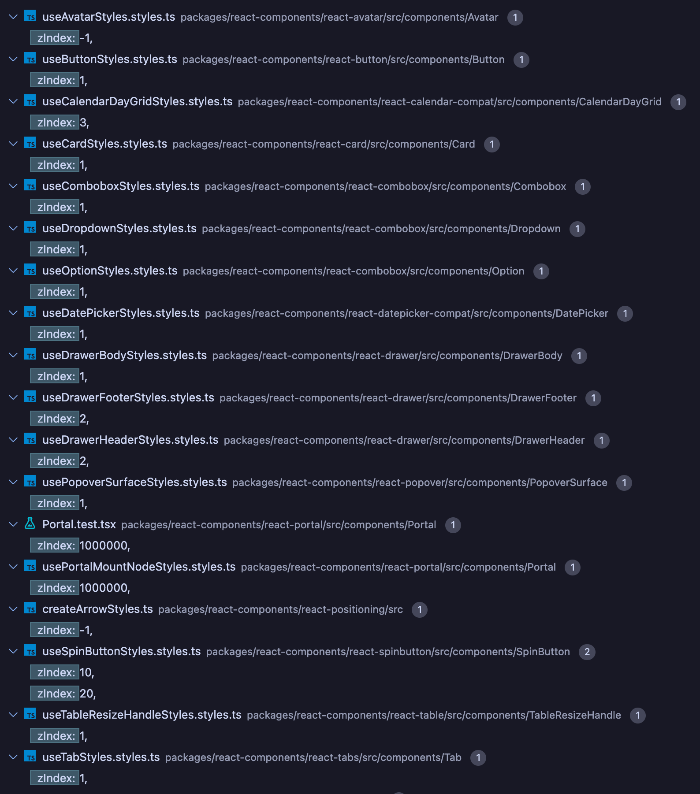

# RFC: z-index handling

---

[@marcosmoura](https://github.com/marcosmoura)

- [RFC: z-index handling](#rfc-z-index-handling)
  - [Summary](#summary)
  - [Background](#background)
  - [Problem statement](#problem-statement)
  - [Detailed Design or Proposal](#detailed-design-or-proposal)
  - [Research](#research)
    - [CSS Isolation and stacking context](#css-isolation-and-stacking-context)
  - [Layering/elevation concept](#layeringelevation-concept)
    - [What will be covered](#what-will-be-covered)
    - [What won't be covered](#what-wont-be-covered)
  - [Implementation](#implementation)
    - [Pros](#pros)
    - [Cons](#cons)
  - [Discarded Options](#discarded-options)
    - [Expose a named map of layers to z-index values (similarly to typography styles)](#expose-a-named-map-of-layers-to-z-index-values-similarly-to-typography-styles)
      - [Pros](#pros-1)
      - [Cons](#cons-1)
    - [React Context for setting z-index values](#react-context-for-setting-z-index-values)
      - [Pros](#pros-2)
      - [Cons](#cons-2)

## Summary

This RFC outlines the ideas and implementation details for effectively handle z-index globally within Fluent UI components, with a particular focus on standardizing layers across the library.

## Background

In [v0](https://github.com/microsoft/fluentui/blob/c3f4b77f8160185518b1fea6d74be239519fba73/packages/style-utilities/src/styles/zIndexes.ts#L1-L11) and [v8](https://github.com/microsoft/fluentui/blob/c3f4b77f8160185518b1fea6d74be239519fba73/packages/fluentui/react-northstar/src/themes/teams/siteVariables.ts#L72-L79), naming conventions were defined to represent the z-index values for each layer. However, for v9, values were not used consistently across the library, leading to a lack of standardization and potential conflicts between components as well as with custom styles in the partner side.

## Problem statement

The current z-index handling in Fluent UI v9 is not consistent across components. This inconsistency can be observed by performing a simple code search in the repository:


## Detailed Design or Proposal

The creation of a global z-index system will help to standardize the values across the library, making it easier to manage and avoid conflicts between components. This system will also provide a way to easily override the z-index values for custom components and applications.

## Research

### CSS Isolation and stacking context

[CSS Isolation](https://developer.mozilla.org/en-US/docs/Web/CSS/isolation) is a new feature that allows developers to create a new stacking context for an element. This means that the element and its children will be rendered isolated from the rest of the page. This can be useful explicitly for components that require a z-index control.
The problem for our case is that we render most of our components that require a z axis control in a portal, which by itself creates a new stacking context. For the elements rendered in a portal, the z-index is relative to the portal element and we need a way to define the priority of them.

## Layering/elevation concept

As stated by [Fluent 2 design guidelines](https://fluent2.microsoft.design/elevation), objects/components have a defined elevation value to express its importance and create the sense of hierarchy of layers. These layers should have well defined shadow and z-axis values. Currently, the library have [shadows already defined](https://github.com/marcosmoura/fluentui/blob/943d1f166c5929ff65a683fbed3885434f16f2b9/packages/tokens/src/utils/shadows.ts#L6), but lacking the z-axis values.

### What will be covered

This proposal utilize this elevation system to define layers that translate into z-axis values, and those can be used by the components. The concepts are:

- Each layer have a well-thought z-index number mapped to it
- Multiple components can occupy the same layer, if they share the same importance level in the stack (e.g. Drawer and Nav)
- A component can be defined without a z-index. Its placement fallbacks to its position within the [stack context](https://web.dev/learn/css/z-index/#stacking-context).

### What won't be covered

- Negative z-indexes. Components can define negative z-index values to represent background objects. Since this is very subjective, it'll be up to the component to define its own negative z-index values.
- Correlation between shadows and z-indexes. Even though it might be related, this is out of the scope of this proposal. If necessary, it can be covered by a follow-up RFC.

## Implementation

> [!NOTE]
> The approach here only standardize the layers and define z-index values for them. This is great for the current state of our components that can define arbitrary values, but won't solve a very specific problem: Defining priority for similar UI elements. e.g. Two Dropdowns are created. Which of them should have higher priority and therefore be displayed on top?

Expose the z-index values as tokens. This would map the layers into token values that can be used anywhere in styles.

The layers can be defined as follows:

```ts
// packages/tokens/src/types.ts

/**
 * Design tokens for z-index groups and levels
 */
export type ZIndexTokens = {
  zIndexBackground: string;
  zIndexContent: string;
  zIndexOverlay: string;
  zIndexPopup: string;
  zIndexMessages: string;
  zIndexFloating: string;
  zIndexPriority: string;
  zIndexDebug: string;
};
```

```ts
// packages/tokens/src/global/zIndexes.ts

import type { ZIndexTokens } from '../types';

/**
 * ZIndex global defaults
 */
export const zIndexes: ZIndexTokens = {
  zIndexBackground: '0', // Elevation 0
  zIndexContent: '1', // Elevation 2
  zIndexOverlay: '1000', // Elevation 4
  zIndexPopup: '2000', // Elevation 8
  zIndexMessages: '3000', // Elevation 16
  zIndexFloating: '4000', // Elevation 28
  zIndexPriority: '5000', // Elevation 64
  zIndexDebug: '6000', // Used for debugging
};
```

```ts
// Fluent/partner code

import { tokens } from '@fluentui/theme';

const styles = {
  root: {
    zIndex: tokens.zIndexOverlay /* var(--zIndexOverlay, 1000) */,
  },
};
```

In case the partner wants to override the z-index values, they can do so by providing a theme with the new values:

```ts
// Fluent/partner code
import { FluentProvider, Theme, webLightTheme } from '@fluentui/react-components';

const customTheme: Theme = {
  ...webLightTheme,
  // 👇 customized values
  zIndexOverlay: 100000,
};

function App() {
  return <FluentProvider theme={customTheme} />;
}
```

<!-- FIXME: Update section after alignment with designers -->

_NOTE: The names above are not final and only serve as an example. As of the moment this RFC was introduced, there are ongoing discussions with the Design team to define all the layers. This RFC will be updated before the final approval to include the definitive names._

### Pros

- 👍 Clear separation by group of UI elements
- 👍 Easy to override, extend and update
- 👍 Partners can override the tokens through themes

### Cons

- 👎 Naming convention can be hard
- 👎 Bloating the tokens with more variables
- 👎 Not possible to validate for user errors. Partners can override the tokens freely.

## Discarded Options

The options below were explored but discarded due to the complexity of the implementation. It can be revisited in the future if necessary.

### Expose a named map of layers to z-index values (similarly to typography styles)

Exposes a named map of layers to z-index values. This map can be used by components to define their z-index values.
This would required the creation of a new file and export under `@fluentui/tokens`, to make the map available.

The layers can be defined as follows:

```ts
// packages/tokens/src/global/zIndexes.ts

import { ZIndexLayers } from '../types';

/**
 * Global z-index values for elements
 */
export const zIndexes: ZIndexLayers = {
  background: 0, // default
  content: 1, // content - header, footer, sidebar
  overlay: 1000, // overlay elements - drawer, nav
  popup: 2000, // popup layers - popups, modals, dialogs
  messages: 3000, // communication elements - banners, messages, toasts, snackbar
  floating: 4000, // floating elements - dropdowns, teaching
  priority: 5000, // priority elements - tooltips
  debug: 6000, // debug - error overlays, debug messages
};
```

```ts
// Fluent/partner code

import { zIndexes } from '@fluentui/theme';

const styles = {
  root: {
    zIndex: zIndexes.overlay,
  },
};
```

<!-- FIXME: Update section after alignment with designers -->

_NOTE: The names above are not final and only serve as an example. As of the moment this RFC was introduced, there are ongoing discussions with the Design team to define all the layers. This RFC will be updated before the final approval to include the definitive names._

#### Pros

- 👍 Clear separation by group of UI elements
- 👍 Easy to override on Fluent side, extend and update

#### Cons

- 👎 Naming convention can be hard
- 👎 The values would be fixed globally and not possible for partners to override

### React Context for setting z-index values

This context would provide a way to set the z-index values for components and retrieve them when necessary. That allows partners to set the z-index themselves delegating the decision of the z-index order, priority and values to the application. It would be possible to set z-index ordering for multiple elements in the same layer.

```tsx
// partner side
import { FluentProvider } from '@fluentui/react-components';

const App = () => {
  const zIndex = {
    background: 0,
    content: 1,
    overlay: 1000,
    popup: 2000,
    messages: 3000,
    floating: 4000,
    priority: 5000,
    debug: 6000,
  };

  return (
    <FluentProvider zIndex={zIndex}>
      <Component1 />
      <Component2 />
    </FluentProvider>
  );
};
```

```tsx
import { useZIndex } from '@fluentui/react-components';

// component side
export const useComponent_unstable = (props: ComponentProps, ref: React.Ref<HTMLElement>): ComponentState => {
  const { overlay } = useZIndex();

  return {
    components: {
      root: 'div',
    },

    root: slot.always(
      {
        ref,
        ...props,
        style: {
          zIndex: overlay,
        },
      },
      {
        elementType: 'div',
      },
    ),
  };
};
```

Or alternatively, a hook that could be used to set the z-index style directly:

```tsx
import { useZIndexStyle } from '@fluentui/react-components';

// component side
export const useComponent_unstable = (props: ComponentProps, ref: React.Ref<HTMLElement>): ComponentState => {
  useZIndexStyle('overlay', ref);

  return {
    components: {
      root: 'div',
    },

    root: slot.always(
      {
        ref,
        ...props,
      },
      {
        elementType: 'div',
      },
    ),
  };
};
```

Another possibility would be to use a hook to set z-index priority between two elements:

```tsx
import { useZIndexPriority } from '@fluentui/react-components';

// component side
export const Component = (props: ComponentProps) => {
  const drawerStartRef = React.useRef();
  const drawerEndRef = React.useRef();
  const navRef = React.useRef();

  /*
   * This would control the z-index of the elements based on the layering group,
   * incrementing based on the priority list
   */
  useZIndexPriority('overlay', [drawerStartRef, drawerEndRef, navRef]);

  return (
    <>
      <Drawer position="start" ref={drawerStartRef} /> // z-index 2003
      <Drawer position="end" ref={drawerEndRef} /> // z-index 2002
      <Nav ref={navRef} /> // z-index 2001
    </>
  );
};
```

#### Pros

- 👍 Allows partners to set the z-index values individually per context

#### Cons

- 👎 Inline styles
- 👎 Merging styles
- 👎 One more Context included in the tree
