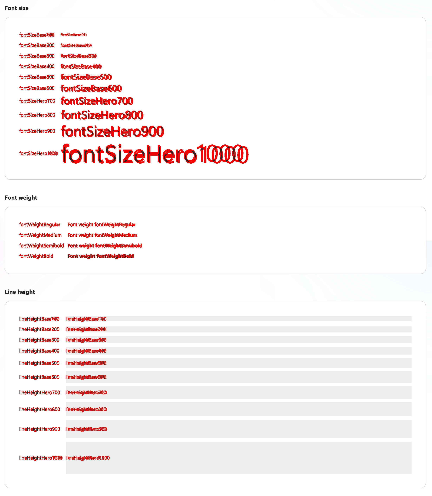

# RFC: Fonts in v9: Segoe Sans vs Segoe UI

<!--
An RFC can be anything. A question, a suggestion, a plan. The purpose of this template is to give some structure to help folks write successful RFCs. However, don't feel constrained by this template; use your best judgement.

Tips for writing a successful RFC:

- Favor simple language that make your point, fancy words obfuscate // Speak plainly.
- Try to stay concise, but don't gloss over important details
- Feel free to add necessary diagrams in the RFC assets folder
- Try to write a neutral problem statement, not one that motivates your desired solution
- Remember, "Writing is thinking". It's natural to realize new ideas while writing your proposal
-->

---

[@emmayjiang](https://github.com/emmayjiang)

<!-- If substantial updates are made add an "Updated on: $date" below, don't replace the original date -->

## Summary

<!-- Explain the proposed change -->

This proposal of this RFC is to change the font from Segoe UI to Segoe Sans.

## Background

Fluent v9 currently uses the font Segoe UI, which is a static font: a typeface produced as several different fonts, with each font representing a specific combination of width, weight, and style.

Segoe Sans is a variable font, a single font file that includes an entire font family, allowing for many different variations in style without the need to use a separate file for each.

## Problem statement

<!--
Why are we making this change? What problem are we solving? What do we expect to gain from this?

This section is important as the motivation or problem statement is independent from the proposed change. Even if this RFC is not accepted this Motivation can be used for alternative solutions.
-->

The current font Segoe UI, a static font, denies designers of the flexibility they can get with a variable font. In addition, the baseline of Segoe UI is not true center, which requires adjustments in components on a case-by-case basis, which is time consuming.

## Detailed Design or Proposal

<!-- This is the bulk of the RFC. Explain the proposal or design in enough detail for the intended audience to understand. -->

This RFC proposes that we switch the font used in the repo from Segoe UI to Segoe Sans.

Because Segoe Sans is a variable font, the main concern is that content may shift significantly within existing components, and that layouts might need adjusting with isn't possible via theme.

### Testing

To compare Segoe Sans to Segoe UI, I used [odiff](https://github.com/dmtrKovalenko/odiff), a pixel-by-pixel image visual difference tool, to determine the visual differences in components using the two fonts.

One example comparison can be seen below:

> 
>
> - There is a shift horizontally, but the horizontal difference is not major enough to impact components and layouts.
> - There are minimal differences vertically in most of the smaller fonts. Only when it gets to the larger font sizes are there shifts vertically, but the vertical shifts can be attributed to the sum of the vertical shifts present in the lines above it.

All of the generated odiffs can be found [here](https://microsoft-my.sharepoint-df.com/:w:/p/jiangemma/EUwftxmDj29FshIoqrdDhCsBGbZGvi91Fo6a78Yf3S-s7w?e=0B2dyQ).

### Conclusion

We determined through testing that switching to Segoe Sans from Segoe UI does not cause a huge impact to our components, and we don't expect any changes to be necessary to support this change. There will be some visual shifting on some of the larger display fonts, but never in a way that would require us to modify the line-height or margins of our existing controls.

## Pros and Cons

<!-- Enumerate the pros and cons of the proposal. Make sure to think about and be clear on the cons or drawbacks of this proposal. If there are multiple proposals include this for each. -->

### Pros

- Segoe Sans, as a variable font, gives a lot more flexibility; with variable fonts, designers can access a wide range of typographic variations (like weight, width, and slant) from a single file, allowing for more dynamic designs without needing multiple font files.
- The baseline of Segoe Sans is true center, while Segoe UI is not. Currently with Segoe UI, adjustments in component designs are made on a case-by-case basis, so avoiding this will save time for designers.

### Cons

- Segoe Sans, due to its nature as a variable font, is slightly larger in file size than Segoe UI, but not by much.

## Discarded Solutions

<!-- As you enumerate possible solutions, try to keep track of the discarded ones. This should include why we discarded the solution. -->

N/A
