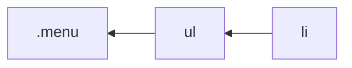

# Styles Handbook

[@layeshifter](https://github.com/layershifter)

This document covers how to use [Griffel][griffel] CSS-in-JS (used in Fluent UI React v9) to efficiently style components.

## Table of contents

<!-- START doctoc generated TOC please keep comment here to allow auto update -->
<!-- DON'T EDIT THIS SECTION, INSTEAD RE-RUN doctoc TO UPDATE -->

- [Introduction](#introduction)
- [Core concepts](#core-concepts)
  - [Atomic CSS](#atomic-css)
  - [`makeStyles`](#makestyles)
    - [Limitations](#limitations)
    - [Performance caveat](#performance-caveat)
  - [`mergeClasses`](#mergeclasses)
    - [Order of arguments determines results](#order-of-arguments-determines-results)
    - [⚠️ Only combine classes with `mergeClasses`](#%EF%B8%8F-only-combine-classes-with-mergeclasses)
  - [`makeResetStyles`](#makeresetstyles)
    - [Hybrid approach (Using `makeStyles` and `makeResetStyles` together)](#hybrid-approach-using-makestyles-and-makeresetstyles-together)
  - [RTL styles](#rtl-styles)
    - [CSS variables caveat](#css-variables-caveat)
  - [Understanding selector complexity](#understanding-selector-complexity)
- [Best practices](#best-practices)
  - [Writing styles](#writing-styles)
    - [Use `tokens` over direct colors](#use-tokens-over-direct-colors)
    - [Avoid rule duplication](#avoid-rule-duplication)
    - [Avoid `!important`](#avoid-important)
    - [Use structured styles](#use-structured-styles)
  - [Performance](#performance)
    - [Use `mergeClasses` once for an element](#use-mergeclasses-once-for-an-element)
    - [Avoid unnecessary RTL transforms by using `@noflip`](#avoid-unnecessary-rtl-transforms-by-using-noflip)
  - [Nested selectors](#nested-selectors)
    - [Use nested selectors with pseudo classes](#use-nested-selectors-with-pseudo-classes)
    - [Apply classes directly to elements](#apply-classes-directly-to-elements)
    - [Avoid complicated selectors](#avoid-complicated-selectors)
    - [Avoid input pseudo classes](#avoid-input-pseudo-classes)

<!-- END doctoc generated TOC please keep comment here to allow auto update -->

# Introduction

Griffel is a hybrid CSS-in-JS that features a runtime option like any other CSS-in-JS solution and [Ahead-of-time compilation][griffel-aot] with [CSS extraction][griffel-css-extraction] to reduce runtime footprint and improve performance.

# Core concepts

## Atomic CSS

Griffel uses Atomic CSS to generate classes. In Atomic CSS every property-value is written as a single CSS rule.

```css
/* Monolithic classes */
/* Can be applied only to a specific button */
.button {
  display: flex;
  align-items: center;
}

/* Atomic CSS */
/* Can be applied to any element that needs these rules */
.display-flex {
  display: flex;
}
.align-items-center {
  align-items: center;
}
```

[Learn more][griffel-atomic-css] about Atomic CSS.

> 💡 **Note:** All examples in this document use `@griffel/react` package. However, if you're a Fluent UI consumer please use `@fluentui/react-components` in imports.

## `makeStyles`

`makeStyles` is used to define style permutations in components and is used for style overrides. It returns a [React hook][react-hook] that should be called inside a component:

```js
import { makeStyles } from '@griffel/react';

const useClasses = makeStyles({
  button: { display: 'flex' },
  icon: { paddingLeft: '5px' },
});

function Component(props) {
  const classes = useClasses();

  return <button className={classes.button} />;
}
```

### Limitations

`makeStyles()` does not support [CSS shorthands][griffel-css-shorthands-support] in styles definitions. However, Griffel provides a set of [`shorthands` functions][griffel-css-shorthands] to mimic them:

```js
import { makeStyles, shorthands } from '@griffel/react';

const useClasses = makeStyles({
  root: {
    // ❌ This is not supported, TypeScript compiler will throw, styles will not be inserted to DOM
    padding: '2px 4px 8px 16px',
    // ✅ Use shorthand functions to avoid writting CSS longhands
    ...shorthands.padding('2px', '4px', '8px', '16px'),
  },
});
```

> 💡 **Note:** Most of the functions follow syntax matching CSS properties, but each value should be a separate argument:

```js
// ❌ Will produce wrong results:
//   {
//     paddingBottom: "2px 4px"
//     paddingLeft: "2px 4px"
//     paddingRight: "2px 4px"
//     paddingTop: "2px 4px"
//   }
shorthands.padding('2px 4px');
// ✅ Correct output:
//   {
//     paddingBottom: "2px"
//     paddingLeft: "4px"
//     paddingRight: "4px"
//     paddingTop: "2px"
//   }
shorthands.padding('2px', '4px');
```

### Performance caveat

Atomic CSS generates more classes than a standard approach with monolithic classes. Usually it's not a problem, but there are cases when performance [may degrade][griffel-recalc-performance], for example when elements have more than 100 classes. This does not happen usually as there are only a limited number of CSS properties that can be applied to a DOM element:

```js
import { makeStyles, shorthands } from '@griffel/react';

const useClasses = makeStyles({
  root: {
    display: 'flex',
    alignItems: 'center',
    ...shorthands.padding('4px'),
  },
});
// ⬇️⬇️⬇️
// produces 6 classes (1 + 1 + 4 for expanded padding)
```

> 💡**Tip:** Preview generated classes in the [Try out][griffel-try-out] sandbox.

However, "CSS rule explosion" can happen when using nested selectors, [pseudo classes][mdn-pseudo-classes]/selectors and [At-rules][mdn-at-rules]:

```js
import { makeStyles, shorthands } from '@griffel/react';

const useClasses = makeStyles({
  root: {
    ...shorthands.padding('4px'),
    ...shorthands.margin('4px'),

    ':hover': {
      ...shorthands.padding('4px'),
      ...shorthands.margin('4px'),
    },

    '::before': {
      display: 'block',
      content: "' '",
    },

    '@media (forced-colors: active)': {
      ...shorthands.padding('4px'),
      ...shorthands.margin('4px'),
    },
  },
});
// ⬇️⬇️⬇️
// produces 26 classes ((4+4)+(4+4)+2+(4+4))
```

Such cases might be unavoidable by design, [the `makeResetStyles` section](#makeresetstyles) covers APIs to address this problem.

## `mergeClasses`

The [`mergeClasses() API`][griffel-merge-classes] should be used when multiple Griffel styles are used on the same element.

```js
import { makeStyles, shorthands } from '@griffel/react';

const useClasses = makeStyles({
  root: {
    /* styles */
  },
  foo: {
    /* styles */
  },
  bar: {
    /* styles */
  },
});

function Component(props) {
  const classes = useClasses();
  const className = mergeClasses(
    classes.root,
    props.foo && classes.foo /* styles specific for "foo" */,
    props.bar && classes.bar /* styles specific for "bar" */,
  );

  return <div className={className} />;
}
```

### Order of arguments determines results

Unlike native CSS, the output of mergeClasses() is affected by the order of the classes passed in, allowing for control over priority of style overrides.

```js
import { mergeClasses, makeStyles } from '@griffel/react';

const useClasses = makeStyles({
  blue: { color: 'blue' },
  red: { color: 'red' },
});

function Component(props) {
  // ℹ️ Order of arguments determines the results

  const redClassName = mergeClasses(classes.blue, classes.red);
  // 👆 { color: 'red' }
  const blueClassName = mergeClasses(classes.red, classes.blue);
  // 👆 { color: 'blue' }

  /* --- */
}
```

### ⚠️ Only combine classes with `mergeClasses`

It is not possible to simply concatenate classes returned by `useClasses()` hooks. Always use `mergeClasses()` to merge classes as results of concatenation can contain duplicated classes and lead to non-deterministic results.

```js
import { makeStyles, mergeClasses } from '@griffel/react';

const useClasses = makeStyles({
  rootA: { display: 'flex' },
  rootB: { display: 'grid' },
});

function App(props) {
  const classes = useClasses();

  // ✅ Returns "class-display-grid"
  const correctClasses = mergeClasses(classes.rootA, classes.rootB);
  // 🔴 Never concatenate class strings, returns "class-display-flex class-display-grid"
  const wrongClasses = classes.rootA + ' ' + classes.rootB;
}
```

## `makeResetStyles`

This API works similarly to `makeStyles` and is used to generate styles as a single monolithic class to avoid the "CSS rules explosion" problem.

```js
import { makeResetStyles } from '@griffel/react';

const useBaseClassname = makeResetStyles({
  padding: '4px',
  margin: '4px',
});

function Component(props) {
  const baseClassname = useBaseClassname();

  return <button className={baseClassname} />;
}
```

> ⚠️ **Note:** Only one class generated by `makeResetStyles()` can be applied to an element. Otherwise, behavior will be non-deterministic since styles are not merged and deduplicated, the results will depend on order of insertion.

### Hybrid approach (Using `makeStyles` and `makeResetStyles` together)

We recommend using [`makeResetStyles` API][griffel-make-reset-styles] to define the base styles for a component and use `makeStyles` to override or enhance the base styles at runtime:

```jsx
import { makeStyles, makeResetStyles, mergeClasses, shorthands } from '@griffel/react';

const useBaseClassname = makeResetStyles({
  ':hover': {
    padding: '4px',
    /* other styles */
  },
  '::before': {
    display: 'block',
    content: "' '",
  },
  '@media (forced-colors: active)': {
    padding: '4px',
    /* other styles */
  },
});
// ⬇️⬇️⬇️
// produces 1 class

const useClasses = makeStyles({
  circular: {
    ...shorthands.borderRadius('10px'),
  },
  primary: {
    color: 'pink',
  },
});
// ⬇️⬇️⬇️
// produces 4/1 classes to be conditionally applied

function Component(props) {
  const baseClassName = useBaseClassname();
  const classes = useClasses();

  const className = mergeClasses(baseClassName, props.circular && classes.circular, props.primary && classes.primary);

  return <div className={className} />;
}
```

## RTL styles

`makeStyles` & `makeResetStyles` perform automatic flipping of properties and values in Right-To-Left (RTL) text direction.

```js
import { makeStyles } from '@griffel/react';

const useClasses = makeStyles({
  root: {
    paddingLeft: '10px',
  },
});
```

⬇️⬇️⬇️

```css
/* Will be applied in LTR */
.frdkuqy {
  padding-left: 10px;
}
/* Will be applied in RTL */
.f81rol6 {
  padding-right: 10px;
}
```

`FluentProvider` is used to determine the text direction for computed styles. The default text direction is Left-To-Right (LTR).

```jsx
import { FluentProvider } from '@fluentui/react-components';

function App() {
  return (
    <>
      <FluentProvider>
        {/* Inner components will have styles for LTR */}
        {/* ... */}
      </FluentProvider>
      <FluentProvider dir="rtl">
        {/* Inner components will have styles for RTL */}
        {/* ... */}
      </FluentProvider>
    </>
  );
}
```

### CSS variables caveat

Values that contain CSS variables (or our `tokens`) might not be always converted, for example:

```js
import { makeStyles } from '@griffel/react';

const useClasses = makeStyles({
  root: {
    // ⚠️ "boxShadow" will not be flipped in this example
    boxShadow: 'var(--box-shadow)',
  },
});
```

In this case, please apply your own styles with the text direction from the `useFluent()` hook:

```js
import { makeStyles } from '@griffel/react';

const useClasses = makeStyles({
  root: {
    boxShadow: 'var(--box-shadow)',
  },
  rtl: {
    boxShadow: 'var(--box-shadow-in-rtl)',
  },
});

function App() {
  const classes = useClasses();
  const { dir } = useFluent();
  const className = mergeClasses(classes.root, dir === 'rtl' && classes.rtl);

  /* --- */
}
```

## Understanding selector complexity

CSS Selectors are matched by browser engines from [right to left (bottom-up parsing)][stackoverflow-selectors-match]:



```css
.menu ul li {
  color: #00f;
}
```

> The browser first checks for `li`, then `ul`, and then `.menu`.

It means that we need to understand the selectors that we are writing and avoid _wide_ selectors. Let's use the component below as an example:

```jsx
import { makeStyles } from '@griffel/react';

const useClasses = makeStyles({
  test: {
    color: 'orange',

    '> *': {
      color: 'red',
    },
    '> h1': {
      color: 'magenta',
    },
    '> div': {
      color: 'green',
    },
    '> .ui-button': {
      color: 'blue',
    },
  },
});

function App() {
  const classes = useClasses();

  return (
    <>
      <div className={classes.test}>
        <h1>Hello World</h1>
        <button class="ui-button">A button</button>
      </div>

      {/* Renders 500 empty divs */}
      {Array.from({ length: 500 }, (_, i) => (
        <div key={i} />
      ))}
    </>
  );
}
```

##### No selector (best)

Only matches the element that the class is applied to.

- selector `.fe3e8s9`
- match_attempts **1**
- match_count **1**

##### `> *` (worst)

"\*" matches all elements on the page.

- selector `.fzbuleu > *`
- match_attempts **503**
- match_count **2**

##### `> h1` (non ideal)

Targets all `h1` tags on page.

- selector `.fohk16y > h1`
- match_attempts **1**
- match_count **1**

The performance in this example is acceptable because the page only has a single `h1` tag, **this will not be a case in a real app**.

##### `> div` (non ideal)

The selector is similar to the previous case, but now it targets all `div` tags. All the example contains 501 `div`, the performance problem is more obvious here.

- selector `.fq4d7o6 > div`
- match_attempts **501**
- match_count **1**

#### Targeting a classname (better)

This kind of selectors may not be the most efficient for pages with 1000 elements of the class 'ui-button', but it is the most effective as it targets only elements with that specific class.

- selector `.fqhvij7 > .ui-button`
- match_attempts **1**
- match_count **1**

It is recommended to use this method in situations where pseudo selectors or pseudo classes are used, for example:

```js
import { makeStyles } from '@griffel/react';

const useClasses = makeStyles({
  test: {
    ':hover': {
      '> .ui-button': {
        color: 'blue',
      },
    },
  },
});
```

# Best practices

## Writing styles

### Use `tokens` over direct colors

Fluent UI React v9 provides [design tokens][fluent-colors] for consistent theming.

```js
import { makeStyles } from '@griffel/react';
import { tokens } from '@fluentui/react-theme';

const useClasses = makeStyles({
  // ❌ Don't do
  rootA: { color: 'red' /* brand foreground */ },
  // ✅ Do
  rootB: { color: tokens.colorBrandForeground1 },
});
```

Exact colors should never be used in Fluent UI code and we do not recommend their use in applications either. The exception is [system-colors][mdn-system-colors] used by forced colors mode (inside media queries):

```js
import { makeStyles } from '@griffel/react';

const useClasses = makeStyles({
  button: {
    '@media (forced-colors: active)': {
      color: 'ButtonText',
    },
  },
});
```

### Avoid rule duplication

Styles written for components should follow these rules:

- base styles should contain most of the CSS definitions that are applicable to base state
  - use `makeResetStyles` to define them
- styles for permutations should be granular
- base styles should not be duplicated by permutations

```js
import { makeStyles, makeResetStyles, mergeClasses, shorthands } from '@griffel/react';
import { tokens } from '@fluentui/react-theme';

const useBaseClassName = makeResetStyles({
  display: 'flex',
  color: tokens.colorNeutralForeground1,
  padding: '10px',
});
const useClasses = makeStyles({
  // ❌ Don't do
  //  "display" & "padding" with the same values are defined in base styles
  primary: {
    display: 'flex',
    ...shorthands.padding('10px'),
    backgroundColor: tokens.colorBrandBackground,
    color: tokens.colorBrandForeground1,
  },
  // ✅ Do
  primary: {
    backgroundColor: tokens.colorBrandBackground,
    color: tokens.colorBrandForeground1,
  },
});

function App(props) {
  const baseClassName = useBaseClassName();
  const classes = useClasses();
  const className = mergeClasses(baseClassName, props.primary && classes.primary);

  /* --- */
}
```

### Avoid `!important`

Our styles are written in way to allow predictable and simple style overrides, `!important` should not be necessary to override any styles:

```js
import { makeStyles, mergeClasses, shorthands } from '@griffel/react';

const useClasses = makeStyles({
  base: {
    // ❌ Don't do
    display: 'flex !important',
  },
});
```

### Use structured styles

To make your code simpler, consider grouping styles that have similar conditions in `mergeClasses()` calls, and then apply them without the use of additional conditions at all.

```js
import { makeStyles, makeResetStyles, mergeClasses, shorthands } from '@griffel/react';

const useBaseClassName = makeResetStyles({
  display: 'flex',
  fontSize: '16px',
});
const useClasses = makeStyles({
  small: { fontSize: '12px' },
  medium: {
    /* defined in base styles */
  },
  large: { fontSize: '20px' },
});

function Component(props) {
  const baseClassName = useBaseClassName();
  const classes = useClasses();

  const className = mergeClasses(baseClassName, classes[props.size]);

  /* --- */
}
```

## Performance

### Use `mergeClasses` once for an element

`mergeClasses` is a performant function, however it's not expected that it will be called multiple times for the same element.

```js
// ❌ Don't do
function Component(props) {
  const baseClassName = useBaseClassName();
  const classes = useClasses();

  const classesForFoo = mergeClasses(/* ---- */);
  const className = mergeClasses(baseClassName, classesForFoo, mergeClasses(/* ---- */), mergeClasses(/* ---- */));

  /* --- */
}
```

Conditions to apply styles might be complex, in this case consider extracting them to separate variables:

```js
// ✅ Do
function Component(props) {
  const baseClassName = useBaseClassName();
  const classes = useClasses();

  const conditionForFoo = /* ---- */ true;
  const className = mergeClasses(baseClassName, conditionForFoo && classes.foo /* other condition */);

  /* --- */
}
```

### Avoid unnecessary RTL transforms by using `@noflip`

You can also control which rules you don't want to flip by adding a `/* @noflip */` CSS comment to your rule:

```js
import { makeStyles } from '@griffel/react';

const useClasses = makeStyles({
  root: {
    paddingLeft: '10px /* @noflip */',
  },
});
```

⬇️⬇️⬇️

```css
/* Will be applied in LTR & RTL */
.f6x5cb6 {
  padding-left: 10px;
}
```

`@noflip` also works with `shorthands.*` functions:

```js
import { makeStyles } from '@griffel/react';

const useClasses = makeStyles({
  root: {
    ...shorthands.borderLeft('5px /* @noflip */', 'solid /* @noflip */', 'red /* @noflip */'),
  },
});
```

⬇️⬇️⬇️

```css
/* Will be applied in LTR & RTL */
.f1h8qh3y {
  border-left-width: 5px;
}

.f150p1cp {
  border-left-style: solid;
}

.f1sim4um {
  border-left-color: red;
}
```

This feature can be useful to define direction specific animations:

```js
import { makeStyles } from '@griffel/react';

const useClasses = makeStyles({
  ltr: {
    animationName: {
      '0%': { left: '0% /* @noflip */' },
      '100%': { left: '100% /* @noflip */' },
    },
  },
  rtl: {
    animationName: {
      '100%': { right: '-100% /* @noflip */' },
      '0%': { right: '100% /* @noflip */' },
    },
  },
});
```

In this case automatic flipping is disabled and will produce less CSS: 2 classes instead of 4.

## Nested selectors

Use nested selectors responsibly in styles because they can cause "CSS rule explosion".

### Use nested selectors with pseudo classes

Use nested selectors when they are combined with pseudo classes:

```js
import { makeResetStyles, mergeClasses, shorthands } from '@griffel/react';
import { tokens } from '@fluentui/react-theme';

const useBaseClassName = makeResetStyles({
  base: {
    // ✅ Do
    // Shows filled icon on hover
    ':hover': {
      [`& .${iconFilledClassName}`]: {
        display: 'inline',
      },
      [`& .${iconRegularClassName}`]: {
        display: 'none',
      },
    },
  },
});
```

### Apply classes directly to elements

Do not use nested selectors to target an element or slot if you can apply classes directly on it.

```jsx
import { makeStyles, mergeClasses, shorthands } from '@griffel/react';
import { tokens } from '@fluentui/react-theme';

const useClasses = makeStyles({
  slotA: {
    backgroundColor: tokens.colorNeutralBackground1,
    // ❌ Don't do
    // You can apply classes directly to that "div"
    '> div': {
      color: tokens.colorNeutralForeground1,
    },
  },

  // ✅ Do
  slotA: {
    backgroundColor: tokens.colorNeutralBackground1,
  },
  slotB: {
    color: tokens.colorNeutralForeground1,
  },
});

function App(props) {
  const classes = useClasses();

  return (
    <div className={classes.slotA}>
      {/* 💡 Classes can be passed directly to this element */}
      <div className={classes.slotB} />
    </div>
  );
}
```

### Avoid complicated selectors

Keep selectors simple to produce reusable CSS rules:

- CSS rules that are unique cannot be reused in other areas
  ```css
  /*    ⬇️ cannot be reused in other components  */
  .hash .some-unique-class {
    display: flex;
  }
  ```
- Complicated selectors produce bigger bundle size with AOT

  ```js
  makeStyles({
    rootA: {
      display: 'flex',
    },
    rootB: {
      '> .some-classname': {
        '> .other-classname': {
          display: 'flex',
          alignItems: 'center',
        },
      },
    },
  });
  ```

  ⬇️⬇️⬇️

  ```css
  /* ✅ no selectors */
  .f22iagw {
    display: flex;
  }

  /* ⚠️ with complex selectors */
  .f1312jvm > .some-classname > .other-classname {
    display: flex;
  }
  .f1c58nry > .some-classname > .other-classname {
    align-items: center;
  }
  ```

- Complicated selectors are hard to override as overrides should match component's styles

  ```js
  // On component's side (library code)
  makeResetStyles({
    '> .some-classname': {
      '> .other-classname': {
        ':hover': {
          display: 'flex',
          alignItems: 'center',
        },
      },
    },
  });
  // 🟡 On consumer side (application code)
  //    Works, but it's hard for a consumer to guess it
  makeStyles({
    foo: {
      '> .some-classname > .other-classname:hover': {
        display: 'flex',
        alignItems: 'center',
      },
    },
  });
  ```

```js
import { makeStyles, makeResetStyles, mergeClasses, shorthands } from '@griffel/react';
import { tokens } from '@fluentui/react-theme';

// ❌ Don't do
// Avoid complex selectors i.e. simplify them
const useBaseClassName = makeResetStyles({
  '> .foo-classname': {
    '> .bar-classname': {
      '> .baz-classname': {
        display: 'flex',
        alignItems: 'center',
      },
    },
  },
});

// ✅ Do
// Apply classes directly to an element
const useBaseBazClasses = makeResetStyles({
  display: 'flex',
  alignItems: 'center',
});
```

### Avoid input pseudo classes

Instead of usage [input pseudo classes][mdn-input-pseudo-classes] in styles, prefer to use JS state.

- Produces less classes on an element
- Selectors for overrides are simpler
- These pseudo classes are **only** supported by input elements

```jsx
import { makeStyles, mergeClasses, shorthands } from '@griffel/react';
import { tokens } from '@fluentui/react-theme';

// ❌ Don't do
const useBaseClassName = makeResetStyles({
  color: tokens.colorNeutralForeground1,
  ':checked': {
    color: tokens.colorNeutralForeground2,
  },
});

// ✅ Do
const useBaseClassName = makeResetStyles({
  color: tokens.colorNeutralForeground1,
});
const useClasses = makeStyles({
  checked: {
    color: tokens.colorNeutralForeground2,
  },
});

function Checkbox(props) {
  const [checked, setChecked] = React.useState();

  const baseClassName = useBaseClassName();
  const classes = useClasses();

  return <input className={mergeClasses(baseClassName, checked && classes.checked)} checked={checked} />;
}
```

[fluent-colors]: https://react.fluentui.dev/?path=/docs/theme-colors--page
[griffel]: https://griffel.js.org
[griffel-aot]: https://griffel.js.org/react/ahead-of-time-compilation/introduction
[griffel-atomic-css]: https://griffel.js.org/react/guides/atomic-css
[griffel-css-extraction]: https://griffel.js.org/react/css-extraction/introduction
[griffel-css-shorthands]: https://griffel.js.org/react/api/shorthands
[griffel-css-shorthands-support]: https://griffel.js.org/react/guides/limitations/#css-shorthands-are-not-supported
[griffel-make-reset-styles]: https://griffel.js.org/react/api/make-reset-styles
[griffel-merge-classes]: https://griffel.js.org/react/api/merge-classes
[griffel-recalc-performance]: https://griffel.js.org/react/guides/atomic-css#recalculation-performance
[griffel-try-out]: https://griffel.js.org/try-it-out/
[mdn-at-rules]: https://developer.mozilla.org/en-US/docs/Web/CSS/At-rule
[mdn-match-media]: https://developer.mozilla.org/en-US/docs/Web/API/Window/matchMedia
[mdn-pseudo-classes]: https://developer.mozilla.org/en-US/docs/Web/CSS/Pseudo-classes
[mdn-input-pseudo-classes]: https://developer.mozilla.org/en-US/docs/Web/CSS/Pseudo-classes#input_pseudo-classes
[mdn-system-colors]: https://developer.mozilla.org/en-US/docs/Web/CSS/system-color
[react-hook]: https://reactjs.org/docs/hooks-intro.html
[stackoverflow-selectors-match]: https://stackoverflow.com/a/5813672/6488546
[youtube-atomic-css-scale]: https://youtu.be/9JZHodNR184?t=764
[youtube-css-specificity]: https://youtu.be/a8TFywbXBt0?t=104
