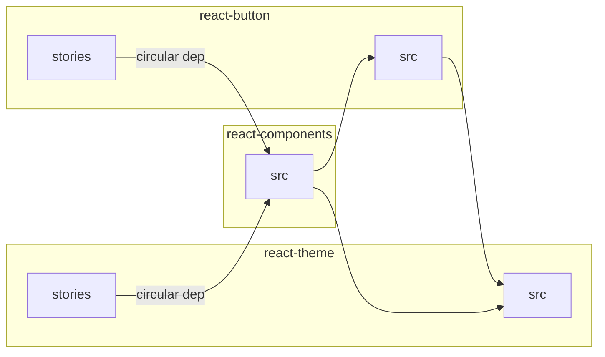
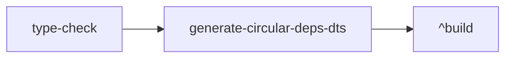

# RFC: Type Checking performance

<!--
An RFC can be anything. A question, a suggestion, a plan. The purpose of this template is to give some structure to help folks write successful RFCs. However, don't feel constrained by this template; use your best judgement.

Tips for writing a successful RFC:

- Simple plain words that make your point, fancy words obfuscate
- Try to stay concise, but don't gloss over important details
- Try to write a neutral problem statement, not one that motivates your desired solution
- Remember, "Writing is thinking". It's natural to realize new ideas while writing your proposal
-->

---

Contributors: @Hotell

_Feb 2024_

<!-- If substantial updates are made add an "Updated on: $date" below, don't replace the original date -->

## Summary

During our research about "[Faster CI](https://github.com/microsoft/fluentui/issues/27359)" we discovered various opportunities for improvement.

This RFC will tackle "Stop using TS path aliases on CI" problem, aka _make type-checking fast 🚅_.

## Problem statement

<!--
Why are we making this change? What problem are we solving? What do we expect to gain from this?

This section is important as the motivation or problem statement is indepenent from the proposed change. Even if this RFC is not accepted this Motivation can be used for alternative solutions.

In the end, please make sure to present a neutral Problem statement, rather than one that motivates a particular solution
-->

v9 and some cross project libraries/apps use **TS path aliases**, which provide excellent DX and blazing fast Application Bundling speeds with tools like swc or esbuild.

We also leverage TS solution config files within our libraries, and **use `tsc -b` for type checking**.

While enabling excellent DX and support for modern bundlers(esbuild,swc), this setup adds **huge performance penalty** on `type-checking` execution, because TSC needs to traverse and parse all the source files (every referenced/imported package) on every run.

By opting out from TS path aliases as of today for generating `d.ts` and running type-checking `tsc --noEmit`, we can gain significant performance boost.

**Speed metrics (from research):**

> Commands run on CI

| command                                                | before(path aliases) | after(no path aliases) | delta |
| ------------------------------------------------------ | -------------------- | ---------------------- | ----- |
| `yarn buildci`                                         | 48m 41s              | 41m 00s                | +16%  |
| `yarn workspace @fluentui/react-components type-check` | 45s                  | 7s                     | +85%  |

While we already have `type-check` just-script task which tweaks path alias mappings to point to generated `.d.ts` instead `.ts` source files, we cannot use it for v9 packages, because **every v9 library with storybook and stories has a circular dependency between package and react-components suite**.



This (circular dependencies) makes it impossible generate `dts` first and run type-checks against those (task graph execution fails).

## Detailed Design or Proposal

We need to be able to use `type-check` task for all packages

> 💡 `type-check` task uses path aliases mapped to `.d.ts` generated definitions instead of project source files.

<!-- This is the bulk of the RFC. Explain the proposal or design in enough detail for the inteded audience to understand. -->

There are multiple options how to achieve this.

1. generate problematic(circular) dependencies types(`.d.ts`) first manually before `type-check` runs
2. get rid of circular dependencies

### 1. generate problematic(circular) dependencies types(`.d.ts`) first manually before `type-check` runs

We can imperatively traverse graph and generate `d.ts` for packages that cause circular dependencies as can bee seen in this [PR](https://github.com/microsoft/fluentui/pull/28002/files#diff-38d7f0411164173eb390d7191ad068bfe70935082bc37198b6b35b00408b2b42).

This dts generation can be done in 2 ways:

**1. generate tasks first, then run builds**

> EXAMPLE Logic: https://github.com/microsoft/fluentui/pull/28002/files#diff-7915b9b726a397ae7ba6af7b9703633d21c031ebf21682f3ee7e6a4ec52837a5
>
> EXAMPLE PR: https://github.com/microsoft/fluentui/pull/28002

```yml
- script: node ./scripts/executors/src/type-check-ci-hack.js --base $(targetBranch)
    displayName: type-check perf preparation
- script: yarn buildci $(sinceArg)
```

**Pros:**

- none

**Cons:**

- bad DX for local machine

**2. Leverage task graph orchestration and define dependency on every v9 `type-check`**

> EXAMPLE Logic: https://github.com/microsoft/fluentui/pull/30577/files#diff-624201bdc18cf7b31fdca43ca08549cbd4db08cf5fa3fc9dfb51b0141669b1b8
>
> EXAMPLE PR: https://github.com/microsoft/fluentui/pull/30577

```jsonc
// @filename <package-root>/project.json
{
  "targets": {
    "type-check": {
      "dependsOn": [
        /* global nx task/script that will be run automatically - its cached so it will do work only once  */
        "generate-circular-deps-dts"
      ]
    }
  }
}
```

With this the flow would be



**Pros:**

- declarative approach
- same behaviour on CI and local machine (NOTE: we run into race-conditions within MVP)

**Cons:**

- all problematic packages needs to override `targets#type-check` with `dependsOn` declaration
- problems with current task orchestrator caching
- huge peak of CPU usage

#### Solution overall Pros and Cons

**Pros:**

- no package scaffold changes needed

**Cons:**

- brittle solution for future library requirements
- manual processing and resolution of dependency graph + maintenance
- adding more technical depth and magic on build layer
- "hack" that is not solving circular dependencies

### 2. get rid of circular dependencies

We have 2 options on how to get rid of circular dependencies

- stop importing from react-components suite within stories
- move/encapsulate problematic parts of code to separate packages.

#### 2.1 stop importing from react-components suite within stories

```diff
-import {Button} from '@fluentui/react-components'
+import {Button} from '@fluentui/react-button'
```

##### Solution overall Pros and Cons

**Pros:**

- no magic resolution of dependency tree behind the scenes

**Cons:**

- might run into circulars in the future so this approach won't scale
- AST transforms needed for storybook rendering

#### 2.2 move/encapsulate problematic parts of code to separate packages

In our case (ATM) making contents of `stories/` a separate package

There are 2 approaches how we can approach this:

**1. flat folder structure**

```diff
react-components/
+  react-text-stories/
+  |- .storybook
+  |- src
+  |- package.json
+  |- project.json
   react-text/
-  |- .storybook/
-  |- stories/
   |- src/
   |- package.json
   |- project.json
```

**Pros:**

- no changes to existing library implementation
- consistency between node and web packages (flat folder structure)

**Cons:**

- significant increase of folders within `react-components/`

  - this will increase with every new scoped domain boundary introduction (`react-text-vr-test` etc)

**2. nested folder structure**

```diff
react-components/
  react-text/
- |- .storybook/
- |- src/
- |- package.json
- |- project.json
  |- stories/
+   |- .storybook
+   |- src/
+   |- package.json
+   |- project.json
+ |- library/
+   |- src/
+   |- package.json
+   |- project.json
```

**Pros:**

- clean domain encapsulation under root domain (package folder name)
  - easy migration of integration tests, vr-tests under the root(package folder) domain in the future
- folders amount within `react-components/` stays the same

**Cons:**

- ~~changes to existing library implementation (github git history will be less accessible because of file "MOVEs")~~
  - github properly resolves renames now ! -> https://github.com/Hotell/fluentui/commits/rfc/v9-project-domain-changes-implementation-mvp/packages/react-components/react-menu/library/package.json
- ? consistency between node and web packages
  - node packages don't have stories -> in order to be consistent we would need to move all implementation in a `libraries` subfolder (another nesting)

##### Solution overall Pros and Cons

**Pros:**

- clean domain separation that scales / future-proof
- no "hacks"
- ability to turn on eslint rules to prevent circular dependencies
- ability to leverage stories implementation further if needed:
  - shipping demos to npm if needed
  - leveraging storybook stories for more tests https://storybook.js.org/docs/writing-tests

**Cons:**

- scaffold gymnastics and generator tweaks

## Conclusion

We gonna implement solution `2.2 move/encapsulate problematic parts of code to separate packages` with `nested folder structure` option.

## Discarded Solutions

<!-- As you enumerate possible solutions, try to keep track of the discarded ones. This should include why we discarded the solution. -->

## Open Issues

- https://github.com/microsoft/fluentui/issues/27359
