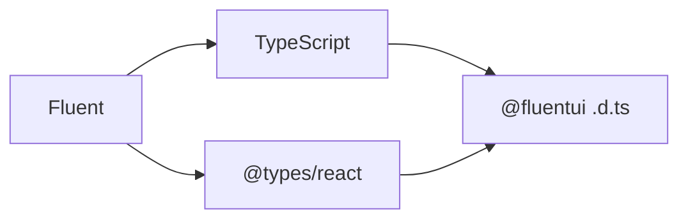

# RFC: Fluent UI TypeScript contract

---

_List contributors to the proposal: @hotell_

_Date the RFC was originally authored: July 2025_

_Target end date for feedback: July 2025_

---

## Summary

This RFC proposes a comprehensive set of guidelines and best practices for defining and evolving TypeScript type contracts within the Fluent UI library. The primary goals are to:

1. **Establish an official TypeScript contract** that provides clear expectations for both contributors and consumers
2. **Define breaking vs. non-breaking changes** when modifying type definitions to ensure consistent versioning
3. **Provide compatibility guarantees** for supported TypeScript versions and compiler configurations
4. **Document handling of external dependencies** (TypeScript compiler updates, React type changes) that are outside our direct control

This contract will help maintain API stability, reduce unexpected breaking changes in consumer CI pipelines, and provide clear migration paths when type changes are necessary.

### Change Types Summary

The following table summarizes all possible type changes and their impact on versioning:

| Change Type                       | Breaking Change | Version Bump | Control Level   | Examples                                                                |
| --------------------------------- | --------------- | ------------ | --------------- | ----------------------------------------------------------------------- |
| **Relaxing (Widening) Types**     | ✅ No           | Minor/Patch  | ✅ Full Control | Union to string, required to optional properties, widening generics     |
| **Restricting (Narrowing) Types** | 🚨 Yes          | Major        | ✅ Full Control | String to union, optional to required properties, constraining generics |
| **Extending Types**               | ✅ No           | Minor        | ✅ Full Control | Adding union members, optional properties, function overloads           |
| **Changing Type Signature**       | 🚨 Yes          | Major        | ✅ Full Control | String to number, removing properties, changing function signatures     |
| **TypeScript Emit Changes**       | ⚠️ No\*         | Minor/Patch  | ❌ No Control   | Optional property emission (TS 5.4), stricter checks in new TS versions |
| **@types/react Changes**          | ⚠️ Depends\*\*  | Minor/Patch  | ❌ No Control   | @types/react updates, React.FC changes, prop type modifications         |

**Legend:**

- \*TypeScript emit changes are not considered breaking from Fluent UI's perspective, but may affect consumers
- \*\*React type changes may cause breaking changes in consumer code, Fluent embraces using internal types to mitigate issues that can occur
- ✅ Full Control: Changes we make directly to our type definitions
- ❌ No Control: External dependency changes that affect our consumers

## Background

Until now, Fluent UI v9 has shipped type definitions (.d.ts files), although it never officially announced the TypeScript contract. This RFC will provide an official Fluent UI TypeScript contract to establish a reliable communication channel with consumers while ensuring the reliability of our product.

## Problem statement

While TypeScript type definitions that we ship with our packages via `.d.ts` files don't affect runtime in any way, they might create unwanted issues/churn within consumers CI pipelines, if those pipelines use TypeScript for type-checking or transpilation, if we introduce some non-compatible change either caused by direct change or indirect change ( TypeScript emit changes, React types changes).

While we have some amount of safety gates in place to make sure our types are not changed in breaking way ( via api-extractor and ts-minbar automation ),  the contract is still relatively brittle because there are 2 major entities directly affecting us and all our user, which we have no control about

- TypeScript
- React types (@types/react, @types/react-dom)
  - not shipped with official react / react-dom



**TypeScript**

- Doesn't follow semver
- Introduces breaking changes as needed in patch or minor version bumps
  - example: Emitter changes without opt-out introduced in TS 5.4, e.g., https://www.typescriptlang.org/tsconfig/#exactOptionalPropertyTypes

**React types**

- React doesn't ship official TypeScript types, unlike other modern JavaScript frameworks (Preact, Angular, Vue, SolidJS, etc.)
- Types are acquired from the OSS-maintained DefinitelyTyped project via @types/react and @types/react-dom
- These types don't align 100% with official React releases
- May ship direct or indirect breaking changes without major version bumps
  - Example of direct breaking change: https://github.com/DefinitelyTyped/DefinitelyTyped/issues/46691
  - Example of indirect breaking change: https://github.com/microsoft/fluentui/pull/34572
- Ships [migration CLI](https://github.com/eps1lon/types-react-codemod)
  - Not always accurate
  - Prone to false positives

## Detailed Design or Proposal

Going forward, we are committed to following our outlined official TypeScript types contract (support).

### TypeScript Version support

- Support TypeScript versions N-3 major versions (where N is the latest stable version)
  - Currently, the supported version range is >= 5.4 <= 5.8
  - Older versions might work but are not guaranteed to work as expected
  - Users on older versions can leverage type down-leveling to some extent to get themselves unblocked

### TypeScript Compiler Flags support

TypeScript supports a plethora of various configuration flags affecting both emit and type-checking. Fluent emits and guarantees full compatibility against the following setup:

- `strict: true` https://www.typescriptlang.org/tsconfig/#strict
- `skipLibCheck: false` https://www.typescriptlang.org/tsconfig/#skipLibCheck
  - While applications are encouraged to use `skipLibCheck: true`, reusable libraries and extensions of Fluent shipping correct type definitions is crucial to maintain proper soundness and API contract

### TypeScript Emitter changes

New TypeScript versions can introduce stricter checks or new features that might implicitly make existing types behave or emit differently, even without explicit changes to our library's type definitions. These are generally outside our control and are not considered a Breaking Change.
These changes will be noted in Fluent release notes, eg "chore: migrate to TypeScript x.x.".

_Example:_

> This is an example of how TypeScript compiler updates can affect end users without any changes to Fluent UI's source code or type definitions.

TS 5.4 changes how optional types are emitted

- Source  type User = { foo?: string }
- Emit ( <5.4 ) type User = { foo?: string | undefined }
- Emit ( >=5.4 ) type User = { foo?: string }

If user has `exactOptionalPropertyTypes` enabled and was explicitly assigning `undefined` to optional value, after this change it will throw TS Error, which needs to be fixed in user code.

```ts
// TypeScript < 5.4 - This worked
const user: User = { foo: undefined };

// TypeScript 5.4+ - This now throws an error
// @ts-expect-error Type 'undefined' is not assignable to type 'string'
const user: User = { foo: undefined };

// Correct approaches that work in all versions:
const userOK: User = {}; // Omit the property
const userOK2: User = { foo: 'bar' }; // Provide a valid value
```

### Change Types

The following chapters outline known/possible type changes affecting our APIs and how these changes will impact our versioning.

> 💡 NOTE:
>
> - Breaking change = major bump
> - Non-breaking change = minor/patch bump (depending on the change)

#### Relaxing (Widening) Types

-> ✅ No breaking change

> **💡 NOTE:** The most impactful type widening pattern is turning a type to `any`, which might affect users in some scenarios by triggering `noImplicitAny` TypeScript errors.

```ts
// 1. Relaxing strict unions to widened type
// From string literal union
type ButtonProps = { size: 'small' | 'medium' | 'large' };

// To string (bottom type)
type ButtonProps = { size: string };
```

```ts
// 2. Widening to `any` or `unknown`
// From
type TextProps = { children: React.ReactNode | () => React.ReactNode };

// To `any`
type TextProps = { children: any };
// NOTE: Might trigger TS errors - Unexpected any
```

```ts
// 3. Making required properties optional
// From
type UserProps = { name: string; email: string };

// To - making email optional
type UserProps = { name: string; email?: string };
```

```ts
// 4. Widening generic constraints
// From
interface ListProps<T extends string> {
  items: T[];
}

// To - allowing any type
interface ListProps<T = any> {
  items: T[];
}
```

```ts
// 6. Forbidden/Invalid type "widening" - this is actually changing the signature!

// From
type TextProps = { children: React.ReactNode | () => React.ReactNode };

// To (WRONG) - 🚨 this is Type Restricting kind of change!
type TextProps = { children: React.ReactNode };

// To (GOOD) - relaxing only part of union
type TextProps = { children: React.ReactNode | (() => any) };
```

#### Restricting (Narrowing) Types

-> 🚨 Most likely a breaking change (depends on actual change)

```ts
// 1. From bottom type to restrictive union -> Breaking Change
// From - bottom type (string)
type ButtonProps = { size: string };

// To - restrictive string literal -> Breaking Change
// @ts-expect-error "Type '"hello"' is not assignable to type '"small" | "medium" | "large""
type ButtonProps = { size: 'small' | 'medium' | 'large' };
```

```ts
// 2. Non-breaking expansion with template literal types
// From - bottom type (string)
type ButtonProps = { size: string };

// To - Expansion without Breaking Change, while improving DX
type ButtonProps = { size: 'small' | 'medium' | 'large' | (string & {}) };
```

```ts
// 3. Making optional properties required -> Breaking Change
// From
type UserProps = { name: string; email?: string };

// To - making email required
// @ts-expect-error Property 'email' is missing in type '{ name: string; }'
type UserProps = { name: string; email: string };
```

```ts
// 4. Constraining generic types -> Breaking Change
// From
interface ListProps<T = any> {
  items: T[];
}

// To - adding constraints
// @ts-expect-error Type 'number' does not satisfy the constraint 'string'
interface ListProps<T extends string> {
  items: T[];
}
```

```ts
// 5. Narrowing function parameter types - Breaking Change
// From
type EventHandler = (event: Event) => void;

// To - more specific event type
// @ts-expect-error Argument of type 'Event' is not assignable to parameter of type 'MouseEvent'
type EventHandler = (event: MouseEvent) => void;
```

#### Extending Types

-> ✅ No breaking change / minor (feature) bump

```ts
// 1. Adding new union members
// From
type ButtonProps = { size: 'small' | 'medium' | 'large' };

// To - adding new size option
type ButtonProps = { size: 'small' | 'medium' | 'large' | 'xlarge' };
```

```ts
// 2. Adding optional properties
// From
type User = {
  name: string;
};

// To - adding optional property/method (non-breaking)
type User = {
  name: string;
  age?: number;
};
// Note: if age were required, that would be a breaking change
```

```ts
// 3. Adding overloads to functions
// From
function createElement(type: string): Element;

// To - adding overload
function createElement(type: string): Element;
function createElement(type: string, props: object): Element; // New overload
```

```ts
// 4. Adding default generic parameters
// From
interface ComponentProps<T> {
  data: T;
}

// To - adding default type
interface ComponentProps<T = Record<string, unknown>> {
  data: T;
}
```

#### Changing Type Signature

-> 🚨 Breaking change

```ts
// From
type ButtonProps = { size: string };

// To
// @ts-expect-error - 'string' cannot be assigned to 'number'
type ButtonProps = { size: number };
```

```ts
// From
type User = {
  name: string;
  age: number;
};

// To
// @ts-expect-error - Object literal may only specify known properties, and 'age' does not exist in type 'User'
type User = {
  name: string;
};
```
