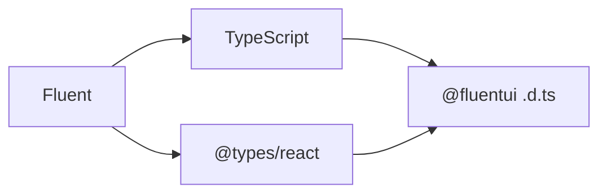

# RFC: Fluent UI TypeScript contract

---

_List contributors to the proposal:_

- _@hotell_

_Date the RFC was originally authored: July 2025_

_Target end date for feedback: July 2025_

---

## Summary

This RFC proposes a set of guidelines and best practices for defining and evolving TypeScript type contracts within Fluent UI library.
The goal is to establish official guide to both contributors and users, and provide clear definitions of what constitutes a breaking change when modifying types.

## Background

Until now FluentUI v9 shipped type definitions (.d.ts) although it never officially announced the typings contract. This RFC will provide official FluentUI and TypeScript contract, to establish official communication channel to consumers of Fluent while keeping them assured about reliability of our product.

## Problem statement

While TypeScript type definitions that we ship with our packages via .d.ts files don't affect runtime in any way, they might create unwanted issues/churn within consumers CI pipelines, if those pipelines use TypeScript for type-checking or transpilation, if we introduce some non-compatible change either caused by direct change or indirect change ( TypeScript emit changes, React types changes).

While we have some amount of safety gates in place to make sure our types are not changed in breaking way ( via api-extractor and ts-minbar automation ),  the contract is still relatively brittle because there are 2 major entities directly affecting us and all our user, which we have no control about

- TypeScript
- React types (@types/react, @types/react-dom)
  - not shipped with official react / react-dom



**TypeScript**

- Doesn't follow semver
- Introduces breaking changes whenever needed as patch or minor version bumpEmitter changes without opt out introduced in TS 5.4, eg https://www.typescriptlang.org/tsconfig/#exactOptionalPropertyTypes

**React types**

-React doesn't ship official TypeScript types, unlike other modern JavaScript frameworks of today ( Preact, Angular, Vue, SolidJS, etc )
-types are acquired from OSS maintained DefinitelyTyped project via @types/react and @types/react-domthese types don't align 100% with official react releases

- might ship direct or indirect Breaking Changes without major bump
  - example of direct / https://github.com/DefinitelyTyped/DefinitelyTyped/issues/46691
  - example of indirect / https://github.com/microsoft/fluentui/pull/34572
- ships [migration CLI](https://github.com/eps1lon/types-react-codemod)
  - not accurate
  - opting into false positives

## Detailed Design or Proposal

Going forward we are committed to follow our outlined official TypeScript types contract(support)

### TypeScript Version support

- support TypeScript versions N-3 major versions (where N is latest stable version )
  - ATM the supported version range >= 5.4 <= 5.8
  - Older versions might work but are not guaranteed to work as expected
  - Users on older versions can leverage type down-leveling to some extent to get themselves unblocked

### TypeScript Compiler Flags support

TS supports a plethora of various configuration flags affecting both emit and type-check. Fluent emits and guarantees full compatibility against following setup:

- `strict: true` https://www.typescriptlang.org/tsconfig/#strict
- `skipLibCheck: false` https://www.typescriptlang.org/tsconfig/#skipLibCheck
  - while Applications are encouraged to use skipLibCheck: true , re-usable libraries and extensions of fluent shipping correct type definitions is crucial to maintain proper Soundness and API contract

### TypeScript Emitter changes

New TypeScript versions can introduce stricter checks or new features that might implicitly make existing types behave or emit differently, even without explicit changes to our library's type definitions. These are generally outside our control and are not considered a Breaking Change.
These changes will be noted in Fluent release notes, eg "chore: migrate to TypeScript x.x.".

_Example:_

TS 5.4 changes how optional types are emitted

- Source  type User = { foo?: string }
- Emit ( <5.4 ) type User = { foo?: string | undefined }
- Emit ( >=5.4 ) type User = { foo?: string }

If user has `exactOptionalPropertyTypes` enabled and was explicitly assigning `undefined` to optional value, after this change it will throw TS Error, which needs to be fixed in user code.

```ts
// TS <5.4
const user: User = { foo: undefined };

// TS 5.4+
// @ts-expect-error
const user: User = { foo: undefined };

const userOK: User = {};
const userOK2: User = { foo: 'bar' };
```

### Change Types

The following chapters outline known/possible type changes affecting our APIs and how these changes will impact our versioning.

> 💡 NOTE:
>
> - breaking change = major bump
> - nonbreaking change = minor/patch bump ( depending on the change )

#### Relaxing(widening) Types

-> ✅ no breaking change

> **💡 NOTE:** Most affecting type widening pattern is to turn a type to `any`, which might affect users in some scenarios triggering "noImplicitAny" TS Error

```ts
// 1. Relaxing strict unions to widened type
// From string literal union
type ButtonProps = { size: 'small' | 'medium' | 'large' };

// To string (bottom type)
type ButtonProps = { size: string };
```

```ts
// 2. Widening to `any` or `unknown`
// From
type TextProps = { children: React.ReactNode | ()=>React.ReactNode }

// To `any`
type TextProps = { children: any }
// NOTE: Might trigger TS errors - Unexpected any
```

```ts
// 3 Forbidden/Invalid type "widening"

// From
type TextProps = { children: React.ReactNode | ()=>React.ReactNode }

// To (WRONG) - 🚨 this is Changing Type Signature !
type TextProps = { children: React.ReactNode }

// To (GOOD) - relaxing only part of union
type TextProps = { children: React.ReactNode | ()=>any }
```

#### Restricting(Narrowing) Types

-> 🚨 most likely a breaking change (depends on actual change)

```ts
// From - bottom type (string)
type ButtonProps = { size: string };

// To - restrictive string literal ->  Breaking Change
// @ts-expect-error "Type '"hello"' is not assignable to type '"small" | "medium" | "large""
type ButtonProps = { size: 'small' | 'medium' | 'large' };
```

```ts
// From - bottom type (string)
type ButtonProps = { size: string };

// To - Expansion without Breaking Change, while improving DX
type ButtonProps = { size: 'small' | 'medium' | 'large' | ({} & string) };
```

#### Extending Types

-> ✅ no breaking change / minor(feature) bump

```ts
// From
type ButtonProps = { size: 'small' | 'medium' | 'large' };
type User = {
  name: string;
};

// To
type ButtonProps = { size: 'small' | 'medium' | 'large' | 'xlarge' };
// Note: if age would be required that would be Breaking Change
type User = {
  name: string;
  age?: number;
};
```

#### Changing Type signature

-> 🚨 breaking change

```ts
// From
type ButtonProps = { size: string };

// To
// @ts-expect-error - 'string' cannot be assigned to 'number'
type ButtonProps = { size: number };
```

```ts
// From
type User = {
  name: string;
  age: number;
};

// To
// @ts-expect-error - Object literal may only specify known properties , and 'age' does not exist in type 'User'
type User = {
  name: string;
};
```
