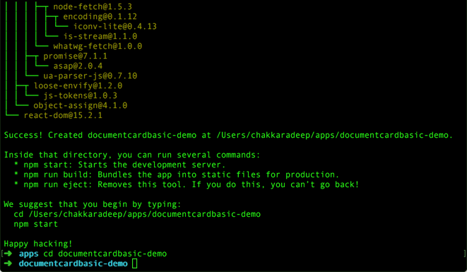
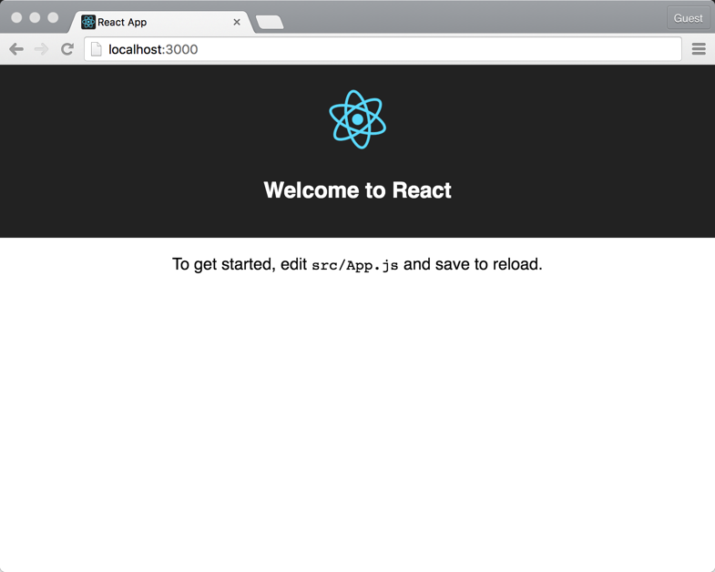
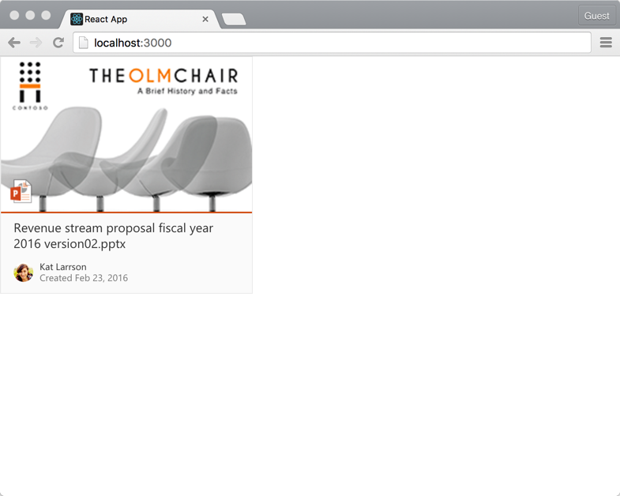

## Overview
In this tutorial, let's build a simple react app with a DocumentCard fabric component.

## Prerequisites
### Node.js and npm
Install [Node.js and npm](https://nodejs.org/en/) if you haven't already installed in your machine. It is recommended you at least install node `version 4.x.x` and npm `version 3.x.x`.

>You can check your node and npm version by running `node -v` and `npm -v` respectively.

### create-react-app package
We will use [Create React App](https://facebook.github.io/react/blog/2016/07/22/create-apps-with-no-configuration.html) to quickly create a react app for the tutorial.

Once node and npm is installed, type the following command in a console to install the `create-react-app` npm package.

```
npm install -g create-react-app
```

### Visual Studio Code
Download and install [Visual Studio Code](https://code.visualstudio.com/).

>We will use Visual Studio Code as our code editor for this tutorial. Feel free to use your favorite code editor of choice if you do not want to use Visual Studio Code.

## Step 1: Create react app
In a console, type the following command to create a simple react app.

```
create-react-app documentcardbasic-demo
```

This will install the required depedencies and scaffold a simple react app.



Once its complete, navigate to the `documentcardbasic-demo` folder.

```
cd documentcardbasic-demo
```

Type the following command to launch the react app in your browser.

```
npm start
```



## Step 2: Install office-ui-fabric-react package
To use Office UI Fabric React components in your project, you will need to first install the ofifce-ui-fabric-react npm package. Type the following in the console to install the package:

```
npm install office-ui-fabric-react --save
```

>If you have `npm start` command still running, terminate the command by pressing `Ctrl+C`.

## Step 3: Add DocumentCardBasic component
Open the `documentcardbasic-demo` project folder in Visual Studio Code.

Open the file `src\App.js` and replace the existing code inside `render` method to only return the `DocumentCard` component:

```jsx
<div>
  <DocumentCard onClickHref='http://bing.com'>
      <DocumentCardPreview
        previewImages={ [
          {
            previewImageSrc: require('./documentpreview.png'),
            iconSrc: require('./iconppt.png'),
            width: 318,
            height: 196,
            accentColor: '#ce4b1f'
          }
        ] }
      />
      <DocumentCardTitle title='Revenue stream proposal fiscal year 2016 version02.pptx'/>
      <DocumentCardActivity
        activity='Created Feb 23, 2016'
        people={
          [
            { name: 'Kat Larrson', profileImageSrc: require('./avatarkat.png') }
          ]
        }
        />
    </DocumentCard>
</div>
```
`DocumentCard` component contains the `DocumentCardPreview`, `DocumentCardTitle` and `DocumentCardActivity` components that help you describe the document card.

Since office-ui-fabric-react is an npm module, we will need to import the document card component in the `App` component.

Add the following import statement at the top of the `src\App.js` file just below `import './App.css'`:

```js
import {
  DocumentCard,
  DocumentCardPreview,
  DocumentCardTitle,
  DocumentCardActivity
} from 'office-ui-fabric-react/lib/DocumentCard';
```

Notice how we import only the specific component module from `lib` folder instead of importing the entire `office-ui-fabric-react` module.

Save the `src\App.js` file.

Below is an example of how you can similarly import other components:

```js
import { Button } from 'office-ui-fabric-react/lib/Button';
```

Open `index.html` file.

Office UI Fabric react components provide support for Left-to-Right (LTR) and Right-to-Left (RTL) rendering out of the box.

You can specify the default direction in your `index.html`. Add the `dir` attribute with the value `ltr` to the `<html>` element:

```html
<html lang="en" dir="ltr">
```

Load Office UI Fabric styles by linking to the Office UI Fabric CDN. Add the following to the `<head`> element:

```html
<link rel="stylesheet" href="https://appsforoffice.microsoft.com/fabric/2.2.0/fabric.min.css">
```

Save the file.

Copy the following images from GitHub to `src` folder.
* [avatar-kat.png](./images/avatar-kat.png)
* [icon-ppt.png](./images/icon-ppt.png)
* [document-preview.png](./images/document-preview.png)

## Step 4: Preview document card
Switch to the console and type the following to preview your app in the browser:

```
npm start
```

You should see the document card component in your app.



## Next steps
Congratulations! You have successfully built a simple react app with an Office UI Fabric React component.

As next steps, try using other components like DetailsLists, Callout etc.,


