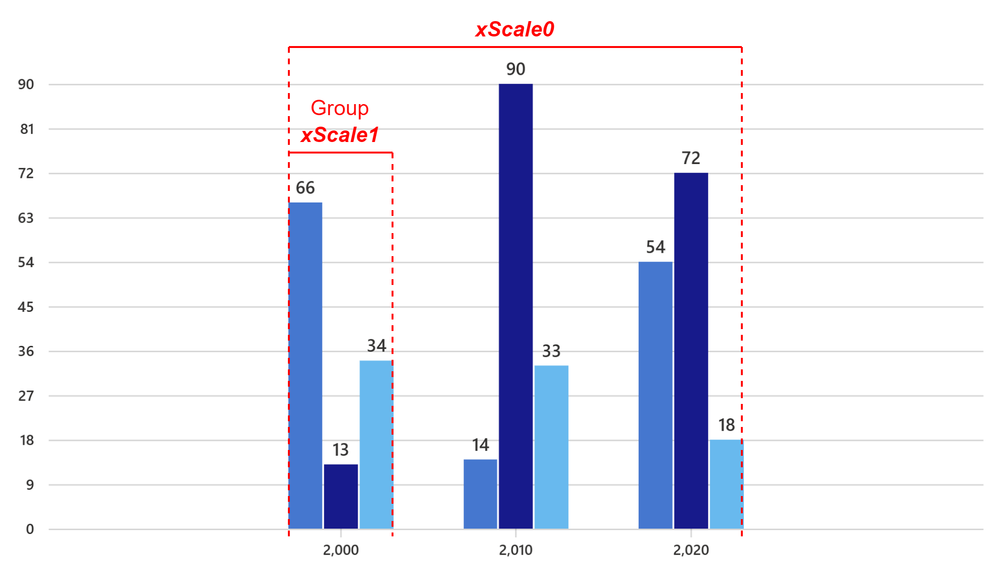

# Implementing 2:1 spacing

## Discrete Axis


As per design specs, there should be a minimum space of 8px before the first bar and after the last bar of a vertical bar chart. Let’s call this space `MIN_DOMAIN_MARGIN`.

```
const MIN_DOMAIN_MARGIN = 8;
```

The total space available to render the bars:

```
const totalWidth = containerWidth - (this.margins.left! + MIN_DOMAIN_MARGIN) - (this.margins.right! + MIN_DOMAIN_MARGIN);
```

where\
`containerWidth` is the total width of the SVG,\
`margins` define the space from the SVG edges that must be excluded before rendering the bars. It helps to prevent the bars from overlapping with the axis labels.

Construct a scale to define the geometry of the bars:

```
const xBarScale = d3ScaleBand()
    .domain(this._xAxisLabels)
    .range([this.margins.left! + MIN_DOMAIN_MARGIN, containerWidth - this.margins.right! - MIN_DOMAIN_MARGIN])
    .paddingInner(2 / 3);
```

where\
`_xAxisLabels` is an array of labels in the x-axis,\
`paddingInner` is the ratio of the range that is reserved for blank space between bands (bars).

$$
paddingInner = {spaceBetweenBars \over spaceBetweenBars + barWidth}
$$

$$
spaceBetweenBars = 2 * barWidth
$$

$$
\implies paddingInner = {2 \over 3}
$$


### Problem

The bandwidth generated by the scale can be different from the bar width provided by the user.

### Solution

As per design specs, the default bar width is 16px. Users can adjust it with values ranging from 1px to 24px.

```
let barWidth = Math.min(this.props.barWidth || 16, 24);
```

The total space required to render the bars of provided width with 2:1 spacing:

```
const reqWidth = this._xAxisLabels.length * barWidth + (this._xAxisLabels.length - 1) * barWidth * 2;
```

where\
`_xAxisLabels.length` is equal to the maximum number of bars.

```
this._domainMargin = MIN_DOMAIN_MARGIN;
```

where\
`_domainMargin` keeps track of the blank space before the first bar and after the last bar.

If more space is available after rendering the bars, center align the chart.

```
if (totalWidth >= reqWidth) {
    this._domainMargin += (totalWidth - reqWidth) / 2;
}
```

If more space is required to render the bars of provided width, decrease the bar width to maintain 2:1 spacing.

```
else {
    const maxBandwidth = totalWidth / (this._xAxisLabels.length + (this._xAxisLabels.length - 1) * 2);
    barWidth = maxBandwidth;
}
```

where\
`maxBandwidth` is the maximum possible bar width such that the bars can be rendered within the total available space with 2:1 spacing. Derived from the formula for `reqWidth`.

Make the adjusted bar width available to use everywhere inside the component:

```
this._barWidth = barWidth;
```

Update the scale range to take the extra space into account by replacing `MIN_DOMAIN_MARGIN` with `_domainMargin`:

```
const xBarScale = d3ScaleBand()
    .domain(this._xAxisLabels)
    .range([this.margins.left! + this._domainMargin, containerWidth - this.margins.right! - this._domainMargin])
    .paddingInner(2 / 3);
```


### Problem

The domain (x-axis labels) doesn’t sync with the bars.

### Solution

Create a function to generate margins for the domain, taking the extra space into account:


_VerticalStackedBarChart.base.tsx_

Pass the function and the same inner padding to the `CartesianChart` common component where the axes are created:


_VerticalStackedBarChart.base.tsx_

Update parameters of the function that creates the axis:


_CartesianChart.base.tsx_

Set the inner padding while constructing the scale for the axis:


_utilities.ts_


### Special Case: GroupedVerticalBarChart



Construct a scale to define the geometry of the bars in a group:

```
const X1_INNER_PADDING = 0.1;

const xScale1 = d3ScaleBand()
    .domain(this._keys)
    .range([0, xScale0.bandwidth()])
    .paddingInner(X1_INNER_PADDING);
```

where\
`_keys` is an array of strings that identify the bars in a group.

$$
x1InnerPadding = {spaceBetweenBars \over spaceBetweenBars + barWidth}
$$

$$
\implies spaceBetweenBars = {x1InnerPadding \over 1 - x1InnerPadding} * barWidth
$$

```
const BAR_GAP_RATE = X1_INNER_PADDING / (1 - X1_INNER_PADDING);
```

$$
\implies spaceBetweenBars = barGapRate * barWidth
$$

Construct a scale to define the geometry of the groups:

```
const xScale0 = d3ScaleBand()
    .domain(this._xAxisLabels)
    .range([this.margins.left! + this._domainMargin, containerWidth! - this.margins.right! - this._domainMargin])
    .paddingInner(2 / (2 + this._keys.length + (this._keys.length - 1) * BAR_GAP_RATE));
```

where\
`_keys.length` is equal to the number of bars in a group.

$$
x0InnerPadding = {spaceBetweenGroups \over spaceBetweenGroups + groupWidth}
$$

$$
spaceBetweenGroups = 2 * barWidth
$$

$$
groupWidth = numBarsInGroup * barWidth + (numBarsInGroup - 1) * spaceBetweenBars
$$

$$
\implies x0InnerPadding = {2 \over 2 + numBarsInGroup + (numBarsInGroup - 1) * barGapRate}
$$

Create a function to generate margins for the domain, taking the extra space into account:


_GroupedVerticalBarChart.base.tsx_

Pass the function and the same inner padding to the `CartesianChart` common component where the axes are created:


_GroupedVerticalBarChart.base.tsx_

**Note:** The bars and the x-axis use separate scales for rendering, and code changes are done to sync these scales. A better solution would be to share the same scale with both, but doing so will need a lot of refactoring in the shared/common code.
