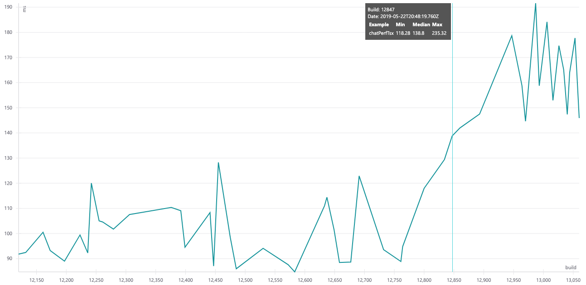

# Performance measuring

_You can't improve what you can't measure._

As part of Fluent UI build pipeline we run a set of performance tests in order to avoid any regressions. This document describes the workflow.

## Measures

### Performance examples

For individual Fluent UI components there are usage examples in public docsite. Besides these _usage_ examples there are also _performance_ examples (currently not available in the public docsite). Compared to _usage_ examples, _performance_ examples render components with more data (ie list of 30 chat messages) so it takes more time (~100ms) to render them and makes any changes in render times visible (and distinguishable from jitter).

Current perf examples measure performance of a single component. At the moment there are no compound perf examples, like a whole page built using several Fluent UI components.

### Getting the numbers

To get a performance number, [Puppeteer](https://github.com/GoogleChrome/puppeteer) is used to render a performance example in headless Chrome and measure the **first render time**.

To stabilize the numbers, the example is rendered 50 times and median value is used.

## Workflow

1. With each GIT commit, build pipeline is executed in CircleCI. As part of the build, we run the performance tests for all performance examples.
2. Performance results are then stored to an external storage.
3. In Fluent UI docsite running locally (not currently available in public docsite) for each measured component a performance chart is displayed, showing measures from the last 50 test runs.

The following picture shows a chart for `Chat` component:

- x-axis: build number (newer builds on right)
- y-axis: first render time in milliseconds (the lower the better)
- tooltip: details about highlighted build

The example chart shows that something around build 12847 had decreased performance by ~50%.

## Automatic PR gates

There is a plan to introduce an automated check for PR builds: measure performance and block the PR if performance had significantly decreased compared to master.

However, current numbers are not stable enough to be used for automatic gates. From the example above it may be seen that even without any relevant changes in code, the results still vary in range of ~20%.

One of the reasons can be that the tests are run on a shared CI machine with non-deterministic performance and load.

**This makes it to be not possible to enable reliable automatic PR gates for performance. At the same time, still, there are performance charts that make all serious performance degradations being discoverable.**

## Bundle size

Not only the rendering speed is affecting perceived performance. The size of the package (which affects application launch time) is equally important. For that reason bundle size measures are also taken - for the whole react package, as well as for individual themes and components.

Bundle size numbers are stored at the same infrastructure used for storing performance measures - however, they are not displayed anywhere yet.

## Future plans

- explore possible ways to make the measurements more stable
- add perf examples (charts) for more components and more variants
- add perf examples for compound examples (whole app page example built with multiple Fluent UI components)
- make perf charts available in public docsite (https://aka.ms/fluent-ui)
- make bundle size charts available in docsite

## FAQ

### Are all components and all their variants covered?

No. Examples are added as needed. With a perf issue discovered, a new perf example is added to cover related area.
