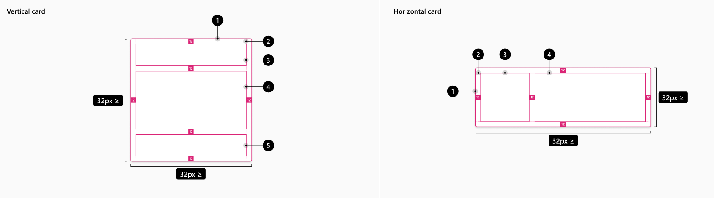

# @fluentui/react-card Spec

## Background

A cards main function is to provide the scaffolding for hosting actions and content for a single topic within a card sized object. It is a framework for organizing content within the confines of a card.

The card itself should not have content or actions built in, but provide the mechanisms for it to be displayed.

### Fabric (v8)

Example:

```jsx
<DocumentCard
  aria-label="Default Document Card with large file name. Created by Annie Lindqvist a few minutes ago."
  onClickHref="http://bing.com"
>
  <DocumentCardPreview {...previewProps} />
  <DocumentCardTitle title="Filename" />
  <DocumentCardActivity activity="Created a few minutes ago" people={DocumentCardActivityPeople} />
</DocumentCard>
```

### Northstar (v0)

```jsx
<Card>
  <CardHeader>
    <Flex gap="gap.small">
      <Avatar
        image="https://fabricweb.azureedge.net/fabric-website/assets/images/avatar/RobertTolbert.jpg"
        label="Forward Division Analyst"
        name="Lura Hermiston"
        status="unknown"
      />
      <Flex column>
        <Text content="Lura Hermiston" weight="bold" />
        <Text content="Forward Division Analyst" size="small" />
      </Flex>
    </Flex>
  </CardHeader>
  <CardBody>Sit quaerat dolorem quos sit et dolorem asperiores.</CardBody>
</Card>
```

## Prior Art

- [Open UI research](https://github.com/openui/open-ui/pull/134)
- [Convergence epic](https://github.com/microsoft/fluentui/issues/19336)

## Comparison of [Fabric DocumentCard](https://developer.microsoft.com/en-us/fluentui#/controls/web/documentcard) and [Northstar Card](https://fluentsite.z22.web.core.windows.net/0.57.0/components/card/definition)

Fabric's DocumentCard seems tied to a specific format, Office focused, while Northstar's Card is more generic.
DocumentCard has components for each specific need of a card that displays documents as it offers image previews/file lists, user activity and other related things.
Card goes for a more structural and generic approach to a card component and is closer to the vision for the v9 Card.

### Components

| Purpose                                                                                                                    | Fabric               | Northstar         | Matching? |
| -------------------------------------------------------------------------------------------------------------------------- | -------------------- | ----------------- | --------- |
| Main component wrapper                                                                                                     | DocumentCard         | Card              | ✅        |
| Component to add actions like sharing                                                                                      | DocumentCardActions  | CardTopControls   | ⚠️        |
| Component to render an image                                                                                               | DocumentCardImage    | CardPreview       | ⚠️        |
| Hybrid component to render an image preview for a document or list of documents. Possibly redundant with DocumentCardImage | DocumentCardPreview  |                   | ❌        |
| Adds an icon/logo to the card                                                                                              | DocumentCardLogo     |                   | ❌        |
| Wrapper for the right side of horizontal cards                                                                             | DocumentCardDetails  |                   | ❌        |
| Show document activity (user list)                                                                                         | DocumentCardActivity |                   | ❌        |
| Link element                                                                                                               | DocumentCardLocation |                   | ❌        |
| Extra text component with a grayed out background                                                                          | DocumentCardStatus   |                   | ❌        |
| Header of the card                                                                                                         |                      | CardHeader        | ❌        |
| Body of the card                                                                                                           |                      | CardBody          | ❌        |
| Footer of the card                                                                                                         |                      | CardFooter        | ❌        |
| Wrapper to render in column format                                                                                         |                      | CardColumn        | ❌        |
| Allows for content to expand on hover                                                                                      |                      | CardExpandableBox | ❌        |

...

## API Proposal

### Components

| Component  | Purpose                                                                  |
| ---------- | ------------------------------------------------------------------------ |
| Card       | Wrapper for the main content of a card.                                  |
| CardHeader | Optional header slot for the card.                                       |
| CardBody   | Main slot of the Card                                                    |
| CardFooter | Optional footer slot for the card. (non-applicable for horizontal cards) |

### Card

| Property       | Values                                              | Default    | Purpose                                                                          |
| -------------- | --------------------------------------------------- | ---------- | -------------------------------------------------------------------------------- |
| orientation    | `vertical`, `horizontal`                            | `vertical` | Orientation of the card                                                          |
| size           | `smallest`, `smaller`, `small`, `medium`, `large`   | `medium`   | Define the minimum size of the card. Smaller sizes only apply to horizontal card |
| scale          | 🚧                                                  |            |                                                                                  |
| interactive    | boolean                                             | false      | Allows the card itself to be clickable                                           |
| appearance     | `filled`, `filled-alternative`, `outline`, `subtle` | `filled`   | Define the appearance of the card                                                |
| selectable 🚧  | boolean                                             |            |                                                                                  |
| expandable 🚧  | boolean                                             |            |                                                                                  |
| contextMenu 🚧 |                                                     |            |                                                                                  |
| disabled       | boolean                                             | false      | Makes the card disabled                                                          |

### CardHeader

| Property | Values | Default | Purpose |
| -------- | ------ | ------- | ------- |
|          |        |         |         |

## Anatomy

You can find below a visual representation of how the Card component will organize it's content.



Label:

1. Card
2. container
3. CardHeader
4. CardBody
5. CardFooter

## Sample Code

...

## Behaviours

...

## Accesibility

...
