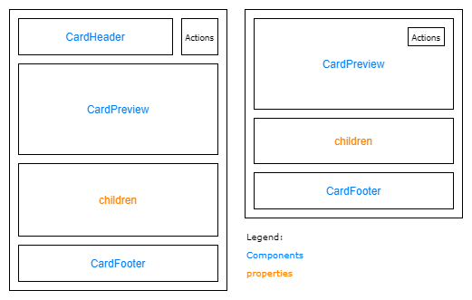
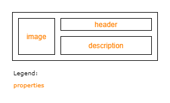

# @fluentui/react-card Spec

## Background

A cards main function is to provide the scaffolding for hosting actions and content for a single topic within a card sized object. It is a framework for organizing content within the confines of a card.

The card itself should not have content or actions built in, but provide the mechanisms for it to be displayed.

### Fabric (v8)

Example:

```jsx
<DocumentCard
  aria-label="Default Document Card with large file name. Created by Annie Lindqvist a few minutes ago."
  onClickHref="http://bing.com"
>
  <DocumentCardPreview {...previewProps} />
  <DocumentCardTitle title="Filename" />
  <DocumentCardActivity activity="Created a few minutes ago" people={DocumentCardActivityPeople} />
</DocumentCard>
```

### Northstar (v0)

```jsx
<Card>
  <CardHeader>
    <Flex gap="gap.small">
      <Avatar
        image="https://fabricweb.azureedge.net/fabric-website/assets/images/avatar/RobertTolbert.jpg"
        label="Forward Division Analyst"
        name="Lura Hermiston"
        status="unknown"
      />
      <Flex column>
        <Text content="Lura Hermiston" weight="bold" />
        <Text content="Forward Division Analyst" size="small" />
      </Flex>
    </Flex>
  </CardHeader>
  <CardBody>Sit quaerat dolorem quos sit et dolorem asperiores.</CardBody>
</Card>
```

## Prior Art

- [Open UI research](https://github.com/openui/open-ui/pull/134)
- [Convergence epic](https://github.com/microsoft/fluentui/issues/19336)

## Comparison of [Fabric DocumentCard](https://developer.microsoft.com/en-us/fluentui#/controls/web/documentcard) and [Northstar Card](https://fluentsite.z22.web.core.windows.net/0.57.0/components/card/definition)

Fabric's DocumentCard seems tied to a specific format, Office focused, while Northstar's Card is more generic.
DocumentCard has components for each specific need of a card that displays documents as it offers image previews/file lists, user activity and other related things.
Card goes for a more structural and generic approach to a card component and is closer to the vision for the v9 Card.

### Components

| Purpose                                                                                                                    | Fabric               | Northstar         | Matching? |
| -------------------------------------------------------------------------------------------------------------------------- | -------------------- | ----------------- | --------- |
| Main component wrapper                                                                                                     | DocumentCard         | Card              | ✅        |
| Component to add actions like sharing                                                                                      | DocumentCardActions  | CardTopControls   | ⚠️        |
| Component to render an image                                                                                               | DocumentCardImage    | CardPreview       | ⚠️        |
| Hybrid component to render an image preview for a document or list of documents. Possibly redundant with DocumentCardImage | DocumentCardPreview  |                   | ❌        |
| Adds an icon/logo to the card                                                                                              | DocumentCardLogo     |                   | ❌        |
| Wrapper for the right side of horizontal cards                                                                             | DocumentCardDetails  |                   | ❌        |
| Show document activity (user list)                                                                                         | DocumentCardActivity |                   | ❌        |
| Link element                                                                                                               | DocumentCardLocation |                   | ❌        |
| Extra text component with a grayed out background                                                                          | DocumentCardStatus   |                   | ❌        |
| Header of the card                                                                                                         |                      | CardHeader        | ❌        |
| Body of the card                                                                                                           |                      | CardBody          | ❌        |
| Footer of the card                                                                                                         |                      | CardFooter        | ❌        |
| Wrapper to render in column format                                                                                         |                      | CardColumn        | ❌        |
| Allows for content to expand on hover                                                                                      |                      | CardExpandableBox | ❌        |

...

## API Proposal

### Components

| Component   | Purpose                                                                  |
| ----------- | ------------------------------------------------------------------------ |
| Card        | Wrapper for the main content of a card.                                  |
| CardHeader  | Optional header slot for the card.                                       |
| CardBody    | Main slot of the Card                                                    |
| CardPreview | Previewing the document/article presented in the card through an image   |
| CardFooter  | Optional footer slot for the card. (non-applicable for horizontal cards) |

### Card

#### Anatomy



#### API

| Property    | Values                                                                               | Default    | Purpose                                                                                   |
| ----------- | ------------------------------------------------------------------------------------ | ---------- | ----------------------------------------------------------------------------------------- |
| orientation | `vertical`, `horizontal`                                                             | `vertical` | Orientation of the card                                                                   |
| size        | `smallest`, `smaller`, `small`, `medium`, `large`                                    | `medium`   | Define the minimum size of the card. Smaller sizes only apply to horizontal card          |
| scale       | `fixed`, `auto-width`, `auto-height`, `auto`, `fluid-width`, `fluid-height`, `fluid` | `auto`     | Manages how the card handles it's scaling depending on the content                        |
| onClick     | function                                                                             | undefined  | Function to call when clicking the card. Makes the card assume the interactive appearance |
| appearance  | `filled`, `filled-alternative`, `outline`, `subtle`                                  | `filled`   | Define the appearance of the card                                                         |
| selectable  | boolean                                                                              | false      | Makes the card selectable by adding a checkbox to the _Actions_ area                      |
| selected    | boolean                                                                              | false      | Set to `true` if card is selected                                                         |
| expandable  | boolean                                                                              | false      | Allow card to expand to show whole content                                                |
| context     | _slot_                                                                               | undefined  | Slot for the context menu, when right-clicking the card                                   |
| disabled    | boolean                                                                              | false      | Makes the card disabled                                                                   |

#### `scale` property

- `fixed`: Size of the card is fixed.
- `auto-width`: `width` is set to `fit-content`.
- `auto-height`: `height` is set to `fit-content`.
- `auto`: `width` and `height` are set to `fit-content`.
- `fluid-width`: `width` is set to `100%`.
- `fluid-height`: `height` is set to `100%`.
- `fluid`: `width` and `height` are set to `100%`.

### CardHeader

#### Anatomy



#### API

| Property    | Values | Default   | Purpose                                           |
| ----------- | ------ | --------- | ------------------------------------------------- |
| image       | _slot_ | undefined | Logo or image to better contextualize the content |
| title       | _slot_ | undefined | Main title of the card                            |
| description | _slot_ | undefined | Further description of the content                |

### CardBody

This component has no custom props and only ensures the proper positioning of content and itself within the card.

### CardPreview

#### API

| Property | Values | Default   | Purpose                                                  |
| -------- | ------ | --------- | -------------------------------------------------------- |
| src      | string | undefined | Source of the media to be displayed on the `img` element |
| alt      | string | undefined | Alternative text to describe the media presented         |

### CardFooter

This component has no custom props and only ensures the proper positioning of content and itself within the card.

## Sample Code

### Compact

```jsx
<Card orientation="horizontal">
  <CardHeader image={} title="Team offsite 2020" description="Onedrive > Files" />
</Card>
```

### App

```jsx
<Card>
  <CardHeader image={} title="App Name" description="Developer" />
  <CardBody>
    Donut chocolate bar oat cake. Dragée tiramisu lollipop bear claw. Marshmallow pastry jujubes toffee sugar plum.
  </CardBody>
</Card>
```

### Task

```jsx
<Card>
  <CardHeader title="Alert in Teams when a new document is uploaded in channel" description="By Microsoft" />
  <CardFooter>
    <span>Automated</span>
    <span>3290 uses</span>
  </CardFooter>
</Card>
```

### Image

```jsx
<Card>
  <CardPreview src="monkey.png" alt="image of monkey" />
  <CardBody>
    <div>
      <span>Length</span>
      <span>4.6-39.6 IN</span>
      <span>11.7-100.6 cm</span>
    </div>
    <div>
      <span>Diet</span>
      <span>Omnivore</span>
      <span>nuts, fruits, eggs</span>
    </div>
  </CardBody>
  <CardFooter>
    <Button>Share</Button>
  </CardFooter>
</Card>
```

## Behaviours

...

## Accesibility

...
