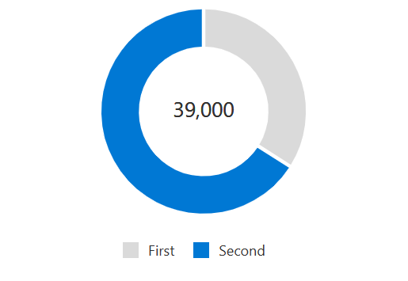

# Component testing - Donut chart test plan

## Subcomponents: Pie and Legend

## Library used: jest and (enzyme or react testing library)

### Test case 1: [Snapshot testing] [Component]

- Renders donut chart correctly with data. - [enzyme]

### Test case 2: [Snapshot testing] [Individual Props] Renders donut chart with:

- HideTooltip prop set to “true”. - [enzyme]
- HideLegend prop set to “true”. - [enzyme]
- EnabledLegendsWrapLines prop set to “true”. - [enzyme]
- ValueInsideDonut set to a string / number. - [enzyme]

### Test case 3: [Specific DOM elements] Renders individual elements on a prop change:

- Should mount legend when hideLegend prop is set to “false”. - [enzyme]
- Should mount callout when hideTootip prop is set to “false”. - [enzyme]
- Should not render onRenderCalloutPerStack with just data as a prop. - [enzyme]
- Should render onRenderCalloutPerDataPoint when the prop is given otherwise should not render onRenderCalloutPerDataPoint. - [enzyme]

### Test case 4: [Mouse events – Donut chart] Renders individual elements on mouse events:

- On mouseOver on the donut chart should render callout. - [enzyme]
- On mouseMove on Pie 1 (step 1) -> mouseLeave (step 2) -> mouseMove on Pie 2 (step 3), html in step 1 should not be the same as in step 3. - [enzyme]
- On mouseover with onRenderCalloutPerDataPoint prop provided, should render the custom callout. [enzyme]
- On mouseOver, callout should be defined, on mouseLeave, callout should disappear. - [enzyme]

### Test case 5: [Mouse events – Legends] Renders individual elements on mouse events:

- On mouseOver should highlight the corresponding pie. - [RTL]
- On mouseOver should change the value inside donut with the legend value. - [enzyme]
- On click should highlight the corresponding pie with aria-selected set to “true” and tabIndex set to 0. - [RTL]
- On mouseOut after mouseOver on first legend, should have opacity 0.1 for second Pie initially (during mouseOver on first legend) and opacity set to 1 for both the Pies on mouseOut. - [RTL]

### Test case 6: [Keyboard events – Donut chart] Renders individual elements on keyboard events:

- On focus should render the corresponding callout. - [RTL]
- On blur should remove focus from the corresponding Pie. - [RTL]
