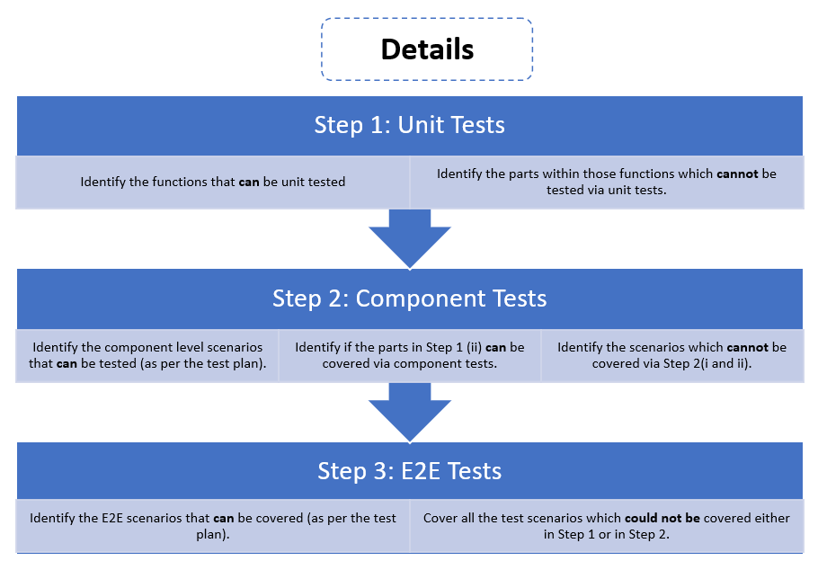
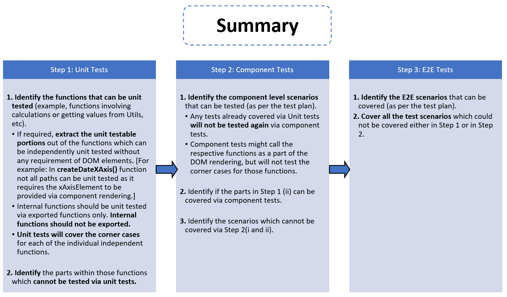
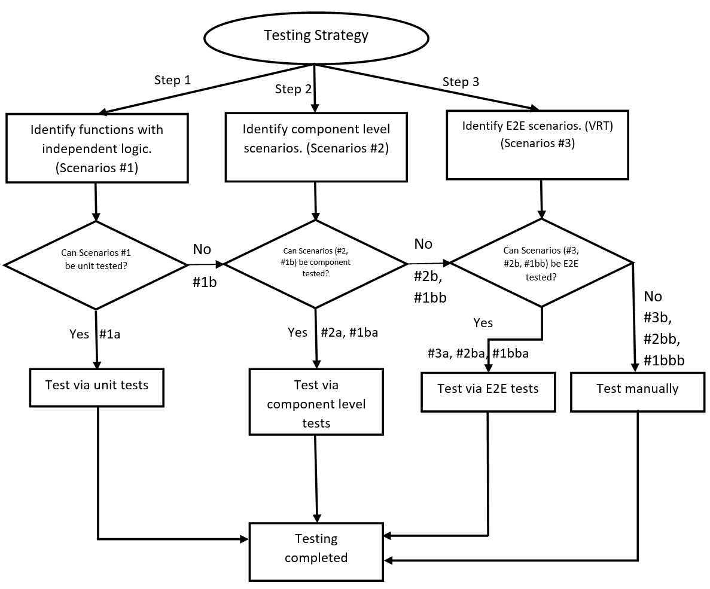
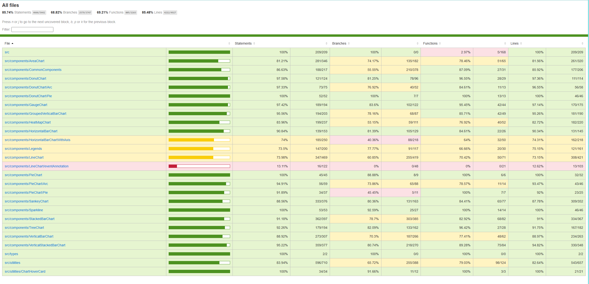
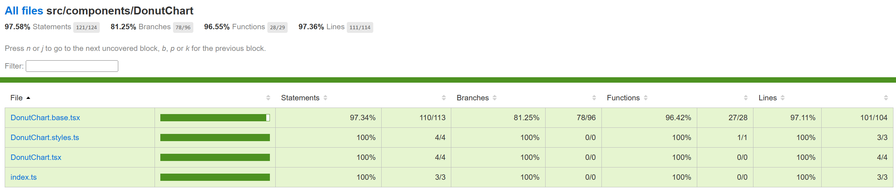

**Details**

**Summary**

**Flowchart**

Details on the above mentioned steps:

| **Step** | **Description**                                                                                                                                                                                                                                                                                          | **Tool to be used**                                                                                            |
| -------- | -------------------------------------------------------------------------------------------------------------------------------------------------------------------------------------------------------------------------------------------------------------------------------------------------------- | -------------------------------------------------------------------------------------------------------------- |
| #1       | Scenarios for unit tests.                                                                                                                                                                                                                                                                                | Jest                                                                                                           |
| #1a      | Scenarios which can be unit tested.                                                                                                                                                                                                                                                                      | Jest                                                                                                           |
| #1b      | Scenarios which cannot be unit tested.                                                                                                                                                                                                                                                                   | Jest                                                                                                           |
| #1ba     | Scenarios defined in unit tests which cannot be unit tested but can be tested at the component level by headless rendering of components without a browser.                                                                                                                                              | React Testing Library + Jest                                                                                   |
| #1bb     | Scenarios defined in unit tests which cannot be unit tested and cannot be tested at the component level by headless rendering of components without a browser. These scenarios may be tested by actual browser rendering using an automation tool or may need to be covered as a part of manual testing. | (React Testing Library + Jest) **OR** (E2E test automation tool like Cypress/Playwright) **OR** Manual testing |
| #1bba    | Scenarios defined in unit tests which cannot be unit tested and cannot be tested at the component level by headless rendering of components without a browser. These scenarios can be tested by actual browser rendering using an automation tool.                                                       | React Testing Library + Jest                                                                                   |
| #1bbb    | Scenarios defined in unit tests which cannot be unit tested, cannot be tested at the component level by headless rendering of components without a browser and cannot be tested by actual browser rendering using an automation tool. These scenarios need to be covered as a part of manual testing.    | Manual testing                                                                                                 |
| #2       | Scenarios for component tests.                                                                                                                                                                                                                                                                           | React Testing Library + Jest                                                                                   |
| #2a      | Scenarios defined in component tests which can be tested at the component level by headless rendering of components without a browser.                                                                                                                                                                   | React Testing Library + Jest                                                                                   |
| #2b      | Scenarios defined in component tests which cannot be tested at the component level by headless rendering of components without a browser. These scenarios need to be covered either by actual rendered in a browser using an automation tool or tested as a part of manual testing.                      | (E2E test automation tool like Cypress/Playwright) **OR** Manual testing                                       |
| #2ba     | Scenarios defined in component tests which cannot be tested at the component level by headless rendering of components without a browser. These scenarios can be covered by actual rendered in a browser using an automation tool.                                                                       | E2E test automation tool like Cypress/Playwright                                                               |
| #2bb     | Scenarios defined in component tests which can neither be tested at the component level by headless rendering of components without a browser nor by actual rendered in a browser using an automation tool. These scenarios need to be covered using manual testing.                                     | Manual testing                                                                                                 |
| #3       | Scenarios for E2E tests.                                                                                                                                                                                                                                                                                 | E2E test automation tool like Cypress/Playwright                                                               |
| #3a      | Scenarios defined in E2E tests which can be tested by actual rendering in a browser using a E2E test automation tool.                                                                                                                                                                                    | E2E test automation tool like Cypress/Playwright                                                               |
| #3b      | Scenarios defined in E2E tests which cannot be tested by actual rendering in a browser using a E2E test automation tool. These scenarios need to be tested manually.                                                                                                                                     | Manual testing                                                                                                 |

Test Completion:

1. Unit tests / Component tests / Automation tests coverage is at least 90%
2. Manual test coverage is 100%.

Run tests:

1. Yarn update-snapshots
2. Yarn test

Steps to Measure Test Coverage:

1. Run "yarn test --coverage --coverageReporters=html" from cmd
2. Open "packages\react-charting\coverage\index.html" to view the test coverage.

Currently, the code coverage for master branch:

Commit Id: "1da7bd9a64b1fdf4a3944edc52dc5e851ca47548"

**Example: How to Add Tests for Donut Chart**

**Step 1 [Unit Tests]:**

1. Identify the functions that can be unit tested (example, functions having calculations or getting values from Utils, etc).

If required, extract the unit testable portions out of the functions which can be independently unit tested without any requirement of DOM elements.

1. **convertToLocaleString()** [src/components/DonutChart/DonutChart.base.tsx]
2. **getAccessibleDataObject()** [src/components/DonutChart/DonutChart.base.tsx]
3. **\_valueInsideDonut()** [src/components/DonutChart/DonutChart.base.tsx]
4. **wrapTextInsideDonut()** [src/components/DonutChart/Pie.tsx]
5. **\_computeTotalValue()** [src/components/DonutChart/Pie.tsx]

6. Identify the parts within those functions which cannot be tested via unit tests.

7. **wrapTextInsideDonut() -** cannot be unit tested as it requires the tspan length to be calculated using Browser Functions like **getComputedTextLength()**
8. **\_computeTotalValue() -** depends on the data prop passed down from the DonutChart.base to Pie during component rendering

**Step 2 [Component Tests]:**

1. Identify the component level scenarios that can be tested (as per the test plan). - Component Test Plan
2. Identify if the parts in Step 1 (ii) can be covered via component tests.

3. **\_computeTotalValue() -** can be covered by component tests by passing the data prop during component rendering.

4. Identify the scenarios which cannot be covered via Step 2(I and ii).

5. **wrapTextInsideDonut() -** cannot be unit/component tested as it requires the tspan length to be calculated using Browser Functions like **getComputedTextLength()**

**Step 3 [E2E Tests]:**

1. Identify the E2E scenarios that can be covered (as per the test plan) - Visual Regression with Interaction Test Plan – Donut Chart
2. Cover all the test scenarios which could not be covered either in Step 1 or in Step 2.

3. **wrapTextInsideDonut() -** can be covered by E2E tests as the component is now rendered in a browser.

Sample PRs and Test Plans:

1. Unit tests: [Adding unit tests for donut chart by srmukher · Pull Request #27424 · microsoft/fluentui (github.com)](https://github.com/microsoft/fluentui/pull/27424/files)

2. Component test plan and component tests: [Component testing - Donut chart by srmukher · Pull Request #27033 · microsoft/fluentui (github.com)](https://github.com/microsoft/fluentui/pull/27033)

3. Test Plans: https://github.com/microsoft/fluentui/tree/master/packages/react-charting/docs/TestPlans

**Test categorization**

| **Group 1** | **Group 2** | **Group 3**          | **Group 4**       | **Group 5** | **Group 6** | **Group 7** | **Group 8** | **Group 9** |
| ----------- | ----------- | -------------------- | ----------------- | ----------- | ----------- | ----------- | ----------- | ----------- |
| Line        | Donut       | Vertical bar         | Stacked bar       | Area        | Tree        | Sankey      | HeatMap     | Legends     |
|             | Pie         | Vertical Stacked bar | Multi stacked bar | Sparkline   |             |             |             | Utilities   |
|             | Gauge       | Grouped Vertical bar | Horizontal bar    |             |             |             |             |

Setup: [Setup · microsoft/fluentui Wiki (github.com)](https://github.com/microsoft/fluentui/wiki/Setup)

**Conclusion:**

As per our discussion with Martin on being consistent with Fluent library and due to the limitation of Enzyme not being compatible with the newer React 18, "My comment on the PR was more about going into the future and actual [Office 365 common dependency alignment,](https://nam06.safelinks.protection.outlook.com/?url=https%3A%2F%2Fteams.microsoft.com%2Fl%2Fmessage%2F19%3A383bdf2ab03e4d9db0a86225b08a61cd%40thread.tacv2%2F1675850066705%3FtenantId%3D72f988bf-86f1-41af-91ab-2d7cd011db47%26groupId%3D4026aab5-5f82-4e6b-baac-324d6275db35%26parentMessageId%3D1675850066705%26teamName%3D1JS%2520Developers%26channelName%3DGeneral%26createdTime%3D1675850066705&data=05%7C01%7CSreetama.Mukherjee%40microsoft.com%7C2d55d9a4ea77434cf46908db31433ec1%7C72f988bf86f141af91ab2d7cd011db47%7C1%7C0%7C638157937130123054%7CUnknown%7CTWFpbGZsb3d8eyJWIjoiMC4wLjAwMDAiLCJQIjoiV2luMzIiLCJBTiI6Ik1haWwiLCJXVCI6Mn0%3D%7C3000%7C%7C%7C&sdata=U6pTMegvDbdv7FCrbwQlDVlghHeXMra4yw2bASLskI8%3D&reserved=0) where they are going to migrate to react 18 within repos, which makes enzyme useless as there are no adapters that work with react 18.

From architectural POV context, enzyme was never a good choice, but because react community evolving and learning patterns it got very big adoption even within fluent.

I'd encourage folks within your team to plan ahead and starting using solution that don't test that much low-level details, which often creates brittle tests, by leveraging [react testing library](https://nam06.safelinks.protection.outlook.com/?url=https%3A%2F%2Ftesting-library.com%2Fdocs%2Freact-testing-library%2Fintro%2F&data=05%7C01%7CSreetama.Mukherjee%40microsoft.com%7C2d55d9a4ea77434cf46908db31433ec1%7C72f988bf86f141af91ab2d7cd011db47%7C1%7C0%7C638157937130278718%7CUnknown%7CTWFpbGZsb3d8eyJWIjoiMC4wLjAwMDAiLCJQIjoiV2luMzIiLCJBTiI6Ik1haWwiLCJXVCI6Mn0%3D%7C3000%7C%7C%7C&sdata=5J3WzB04YevaW%2BuTYhdcjWJP0osltgG4wvrQH8qhSjA%3D&reserved=0) and its ecosystem. "

**[Any New Test we add should be using React Testing Library.]**
