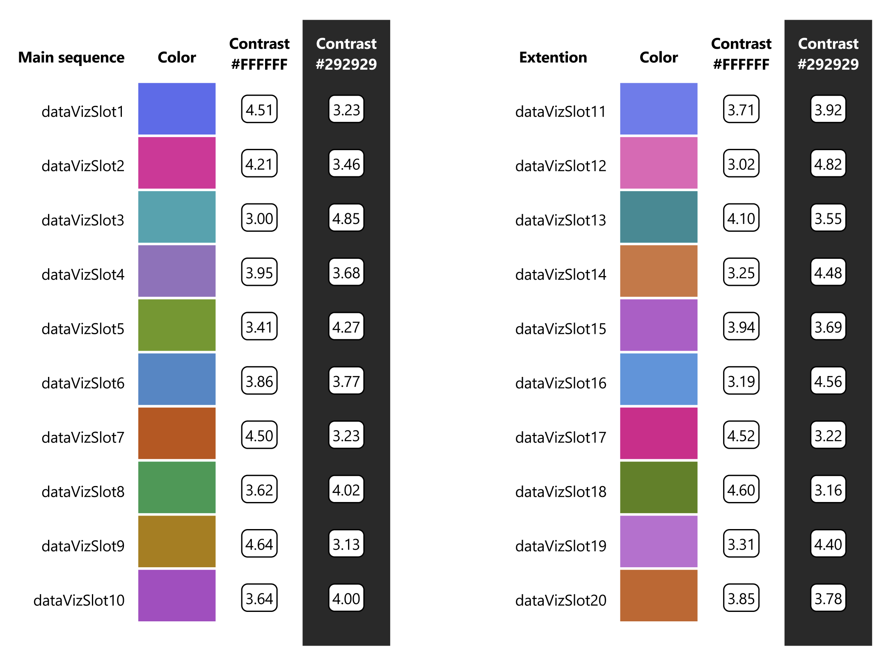
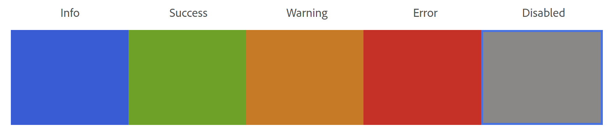

# Colors

The color prop is currently optional for curves and lines in AreaChart and LineChart, respectively. If color is not provided, the chart elements will be rendered with colors from the default palette. The users can provide custom colors or use colors from these palettes:

## Qualitative Palette



This is the default color palette for data visualization. Currently, it has only 20 colors (including extension colors). We cycle through these colors sequentially to paint the chart elements without color.

To use colors from this palette:

```
import { QualitativePalette } from '@fluentui/react-charting';
```

Access colors like this:

```
color: QualitativePalette.dataVizSlot1,
```

## Semantic Palette



To use colors from this palette:

```
import { SemanticPalette } from '@fluentui/react-charting';
```

Access colors like this:

```
color: SemanticPalette.info,
```
