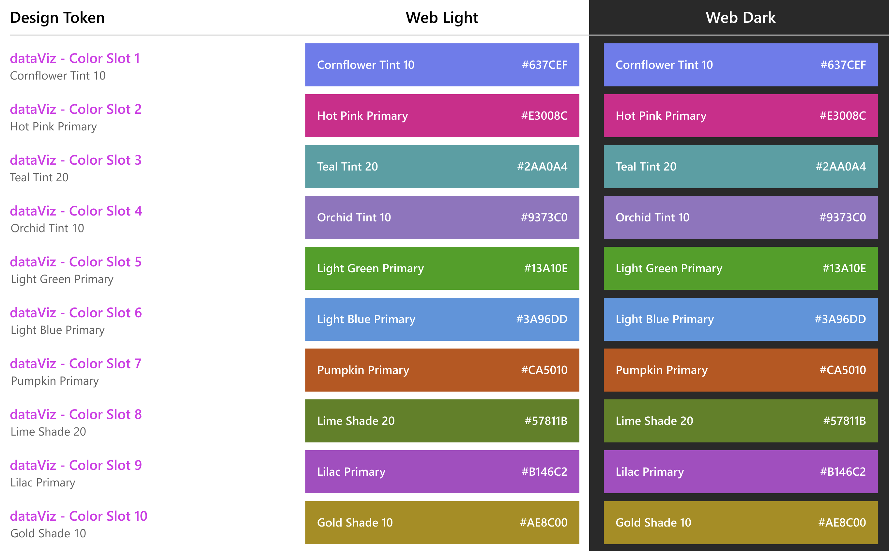
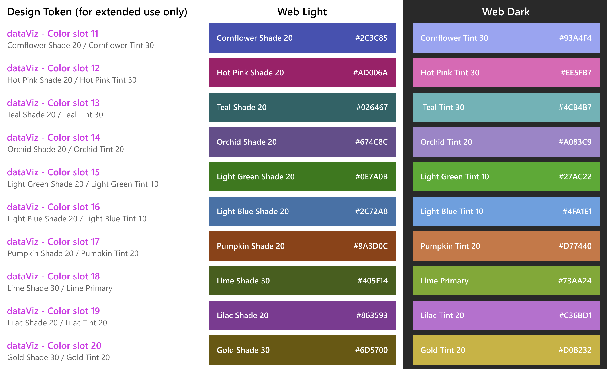

# Colors

We provide the following 3 ways to specify colors for the data series.

## 1. Use CSS colors

The users can supply custom colors for the data series using named colors, hex codes, RGB, HSL, and other browser-supported color formats. The users will be responsible for managing the contrast ratio between adjacent data series and adjusting the color in relation to the light and dark themes.

```js
import * as React from 'react';
import { IChartProps, ILineChartPoints, LineChart } from '@fluentui/react-charting';

const dataSeries: ILineChartPoints[] = [
  {
    legend: 'Line 1',
    data: [
      { x: 20, y: 50 },
      { x: 40, y: 80 },
    ],
    color: 'red', // #ff0000, rgb(255, 0, 0), hsl(0, 100%, 50%), etc.
  },
];
const chartData: IChartProps = {
  chartTitle: 'Line chart',
  lineChartData: dataSeries,
};

const App = () => {
  return <LineChart data={chartData} />;
};
export default App;
```

## 2. Omit color prop

The users can omit the color prop for the data series. The color will be chosen automatically from the default color palette. See below for more details on the palette.

```js
import * as React from 'react';
import { IChartProps, ILineChartPoints, LineChart } from '@fluentui/react-charting';

const dataSeries: ILineChartPoints[] = [
  {
    legend: 'Line 1',
    data: [
      { x: 20, y: 50 },
      { x: 40, y: 80 },
    ],
    // Notice the absent color prop here.
  },
];
const chartData: IChartProps = {
  chartTitle: 'Line chart',
  lineChartData: dataSeries,
};

const App = () => {
  return <LineChart data={chartData} />;
};
export default App;
```

## 3. Use colors from palette

The users can pick colors from our data visualization color palette, which is categorized into the following two types.

### Qualitative Color Palette





Each qualitative color is distinct from the others. This type of palette is ideal for visualizations displaying categorical variables that are unrelated to one another. This is our **default color palette**, which totals 40 colors, including 10 base colors and 30 extension colors. We cycle through these colors sequentially to paint the data series without color.

To use colors from this palette:

1. Import `DataVizPalette` from the charting package.
2. Choose from the available colors like this:
   `DataVizPalette.color<slot_number>`, where `slot_number` ranges from 1 to 40.

```js
import * as React from 'react';
import { DataVizPalette, IChartProps, ILineChartPoints, LineChart } from '@fluentui/react-charting';

const dataSeries: ILineChartPoints[] = [
  {
    legend: 'Line 1',
    data: [
      { x: 20, y: 50 },
      { x: 40, y: 80 },
    ],
    color: DataVizPalette.color1, // .color2, .color3, ....., .color40
  },
];
const chartData: IChartProps = {
  chartTitle: 'Line chart',
  lineChartData: dataSeries,
};

const App = () => {
  return <LineChart data={chartData} />;
};
export default App;
```

### Semantic Color Palette


Semantic color represents a clear message as well as status, such as success, error, warning, info and so on. Each color has the same basic meaning in all contexts.

To use colors from this palette:

1. Import `DataVizPalette` from the charting package.
2. Choose from the 7 available colors like this:
   `DataVizPalette.<status>`, where `status` can be one of the following:
   - `highError`
   - `error`
   - `warning`
   - `success`
   - `highSuccess`
   - `disabled`
   - `info`

```js
import * as React from 'react';
import { DataVizPalette, IChartProps, ILineChartPoints, LineChart } from '@fluentui/react-charting';

const dataSeries: ILineChartPoints[] = [
  {
    legend: 'Line 1',
    data: [
      { x: 20, y: 50 },
      { x: 40, y: 80 },
    ],
    color: DataVizPalette.info, // .success, .warning, .error, .disabled, .highSuccess, .highError
  },
];
const chartData: IChartProps = {
  chartTitle: 'Line chart',
  lineChartData: dataSeries,
};

const App = () => {
  return <LineChart data={chartData} />;
};
export default App;
```
