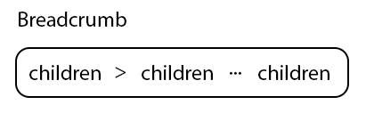

# @fluentui/react-breadcrumb Spec

## Background

Breadcrumbs should be used as a navigational aid in your app or site. They indicate the current page's location within a hierarchy and help the user understand where they are in relation to the rest of that hierarchy.

### Fabric (v8)

```jsx
import { Breadcrumb, IBreadcrumbItem } from '@fluentui/react/lib/Breadcrumb';

const items: IBreadcrumbItem[] = [
  { text: 'Files', key: 'Files', onClick: _onBreadcrumbItemClicked },
  { text: 'This is folder 1', key: 'f1', onClick: _onBreadcrumbItemClicked },
  { text: 'This is folder 2 with a long name', key: 'f2', onClick: _onBreadcrumbItemClicked },
  { text: 'This is folder 3 long', key: 'f3', onClick: _onBreadcrumbItemClicked },
  { text: 'This is non-clickable folder 4', key: 'f4' },
  { text: 'This is folder 5', key: 'f5', onClick: _onBreadcrumbItemClicked, isCurrentItem: true },
];

export const BreadcrumbStaticExample: React.FunctionComponent = () => {
  return (
    <Breadcrumb
      items={items}
      maxDisplayedItems={3}
      ariaLabel="Breadcrumb with static width"
      overflowAriaLabel="More items"
    />
  );
};

function _onBreadcrumbItemClicked(ev: React.MouseEvent<HTMLElement>, item: IBreadcrumbItem): void {
  console.log(`Breadcrumb item with key "${item.key}" has been clicked.`);
}
```

### Northstar (v0)

```jsx
import { Breadcrumb } from '@fluentui/react-northstar';
import { ChevronEndMediumIcon } from '@fluentui/react-icons-northstar';

const BreadcrumbExampleIconDivider = props => (
  <Breadcrumb aria-label="breadcrumb">
    <Breadcrumb.Item>
      <Breadcrumb.Link href="">Home</Breadcrumb.Link>
    </Breadcrumb.Item>
    <Breadcrumb.Divider>
      <ChevronEndMediumIcon />
    </Breadcrumb.Divider>
    <Breadcrumb.Item>
      <Breadcrumb.Link href="">Store</Breadcrumb.Link>
    </Breadcrumb.Item>
    <Breadcrumb.Divider>
      <ChevronEndMediumIcon />
    </Breadcrumb.Divider>
    <Breadcrumb.Item aria-current="page">T-shirt</Breadcrumb.Item>
  </Breadcrumb>
);
```

## Prior Art

- [Open UI research](https://open-ui.org/components/breadcrumb)
- [Convergence epic](https://github.com/microsoft/fluentui/issues/26480)

### Comparison of [Fabric Breadcrumb](https://developer.microsoft.com/en-us/fluentui#/controls/web/breadcrumb) and [Northstar Breadcrumb](https://fluentsite.z22.web.core.windows.net/0.57.0/components/breadcrumb/definition)

### Components

| Purpose                                                               | Fabric     | Northstar         | Matching? |
| --------------------------------------------------------------------- | ---------- | ----------------- | --------- |
| Breadcrumb is a component that indicates the path of the current page | Breadcrumb | Breadcrumb        | ⚠️        |
| BreadcrumbItem an actionable item within a Breadcrumb                 |            | BreadcrumbItem    | ❌        |
| BreadcrumbDivider divides BreadcrumbItem components within Breadcrumb |            | BreadcrumbDivider | ❌        |
| BreadcrumbLink represents a anchor to be used inside the Breadcrumb   |            | BreadcrumbLink    | ❌        |

## Sample Code

```jsx
const BreadcrumbV9Example = props => (
  <Breadcrumb aria-label="breadcrumb">
    <BreadcrumbItem>
      <BreadcrumbButton href="#">
        Home
      </BreadcrumbButton>
    </BreadcrumbItem>
    <BreadcrumbItem>
      <BreadcrumbButton href="#">
        Gallery
      </BreadcrumbButton>
    </BreadcrumbItem>
    <BreadcrumbItem current={true}>
      <BreadcrumbButton href="#">
        About
      </BreadcrumbButton>
    </BreadcrumbItem>
  </Breadcrumb>
  </>
);
```

## Variants

### Breadcrumb item variants

- Link - BreadcrumbButton component with `as="a"` and `href` attributes.
- Dropdown menu - can be added by a partner using JSX composition.

### Icon

Breadcrumb items can have icons.

### Size

Breadcrumb can have the following sizes: `small`, `medium` and `large`.

### Tooltip

Tooltips appear on collapsed menu or truncated name of item.

### Dropdown menu

Dropdown contains collapsed items.

## API

## Structure

### Components

| Component         | Purpose                                                                 |
| ----------------- | ----------------------------------------------------------------------- |
| Breadcrumb        | Wrapper for the Breadcrumb component. Contains `nav` and `ol` elements. |
| BreadcrumbDivider | Divider component                                                       |
| BreadcrumbItem    | `li` element. Can contain BreadcrumbButton component.                   |
| BreadcrumbButton  | Breadcrumb Button                                                       |

### Breadcrumb

#### Anatomy



#### DOM

```HTML
<nav aria-label="breadcrumb">
  <ol>
  {children}
  </ol>
</nav>
```

#### Breadcrumb structure:

- root `nav` element
- list `ol` element

#### API

| Property  | Values                     | Default  | Purpose                        |
| --------- | -------------------------- | -------- | ------------------------------ |
| focusMode | `tab`, `arrow`             | `tab`    | Sets focus mode                |
| size      | `small`, `medium`, `large` | `medium` | Defines size of the Breadcrumb |

### BreadcrumbItem

#### Anatomy


BreadcrumbItem can be:

- Button/Link - BreadcrumbButton component is used inside BreadcrumbItem.
- Non-clickable content (text and/or icon).
- Dropdown Menu

#### DOM

Non-clickable element

```HTML
<li>
  {children}
</li>
```

Link

```HTML
<li>
  <a href="#">
    {children}
  </a>
</li>
```

Button

```HTML
<li>
  <button>
    {children}
  </button>
</li>
```

Usage

```jsx
<BreadcrumbItem>
  Item 1
</BreadcrumbItem>
<BreadcrumbItem>
  <BreadcrumbButton onClick={() => console.log('smth...')}>
    Item 2
  </BreadcrumbButton>
</BreadcrumbItem>
<BreadcrumbItem>
  <BreadcrumbButton href="#" as="a">
    Item 2
  </BreadcrumbButton>
</BreadcrumbItem>
```

#### API

| Property | Values  | Default | Purpose                |
| -------- | ------- | ------- | ---------------------- |
| current  | boolean | false   | Indicates current page |

#### Breadcrumb icon

```jsx
<BreadcrumbItem>
  <BreadcrumbButton icon={<IconComponent />}>Item</BreadcrumbButton>
</BreadcrumbItem>
<BreadcrumbItem icon={<IconComponent />}>
  Item
</BreadcrumbItem>
```

### BreadcrumbDivider

#### DOM

```HTML
  <li class="fui-BreadcrumbDivider">
    <svg
      aria-hidden="true"
      fill="currentColor"
      height="16"
      viewBox="0 0 16 16"
      width="16"
      xmlns="http://www.w3.org/2000/svg"
    >
      <path d="M5.65 3.15a.5.5 0 000 .7L9.79 8l-4.14 4.15a.5.5 0 00.7.7l4.5-4.5a.5.5 0 000-.7l-4.5-4.5a.5.5 0 00-.7 0z" fill="currentColor" />
    </svg>
  </li>
```

Type of the divider is passed from the `Breadcrumb` component. In case if partner wants to have a custom divider it should be passed as `children` prop.
The slash divider is only used in a small breadcrumb.

```jsx
<Breadcrumb size="large" >
  <BreadcrumbItem>Item</BreadcrumbItem>
  <BreadcrumbDivider>
    <ArrowRight16Filled />
  </BreadcrumbDivider>
  <BreadcrumbItem>Item</BreadcrumbItem>
</Breadcrumb>
<Breadcrumb size="small" dividerType="slash">
  <BreadcrumbItem>Item</BreadcrumbItem>
  <BreadcrumbDivider />
  <BreadcrumbItem>Item</BreadcrumbItem>
</Breadcrumb>
```

### BreadcrumbButton

```jsx
<BreadcrumbButton onClick={() => console.log('smth...')}>Button Item</BreadcrumbButton>
```

#### API

| Property | Values  | Default | Purpose                |
| -------- | ------- | ------- | ---------------------- |
| current  | boolean | false   | Indicates current page |
| icon     | _slot_  |         | Sets icon              |

Under the hood @fluentui/react-button component is used.

## Behaviors

#### Overflow

The default position of ellipses should be the second element because from a UX perspective root folder should be shown.

#### Collapse functionality turns on when:

- There's not enough space
- When `maxDisplayedItems` prop is provided and number of items is bigger than `maxDisplayedItems`.

By default `Overflow` component is used to hide items when there's not enough space.
Also, `maxDisplayedItems` prop can be provided. By default `maxDisplayedItems` is equal `6` elements.
This logic can be combined with `Overflow` component.

Getting `overflowItems` is handled by `partitionBreadcrumbItems` method.

```js
const DEFAULT_OVERFLOW_INDEX = 1;
export type PartitionBreadcrumbItemsOptions<T> = {
  items: readonly T[];
  maxDisplayedItems?: number;
  overflowIndex?: number;
};

export type PartitionBreadcrumbItems<T> = {
  startDisplayedItems: readonly T[];
  overflowItems?: readonly T[];
  endDisplayedItems?: readonly T[];
};

/**
 * Get the displayed items and overflow items based on the array of BreadcrumbItems.
 *
 * @param options - Configure the partition options
 *
 * @returns Three arrays split into displayed items and overflow items based on maxDisplayedItems.
 */
export const partitionBreadcrumbItems = <T>(
  options: PartitionBreadcrumbItemsOptions<T>,
): PartitionBreadcrumbItems<T> => {
  // implementation
  return {
    startDisplayedItems,
    overflowItems,
    endDisplayedItems,
  };
};
```

In case if there are no overflowItems original array is returned.

```jsx
const { startDisplayedItems, overflowItems, endDisplayedItems } = partitionBreadcrumbItems({
  items,
  maxDisplayedItems: 4,
  overflowIndex: 2,
});
<Breadcrumb size="large">
  {startDisplayedItems.map(item => renderButton(item))}
  {overflowItems && renderMenu(overflowItems)}
  {endDisplayedItems &&
    endDisplayedItems.map(item => {
      const isLastItem = item.key === buttonItems.length - 1;
      return renderButton(item, isLastItem);
    })}
</Breadcrumb>;
```

It should be done by the partners using JSX composition.
For Menu `@fluentui/react-menu` component should be used.

`maxDisplayedItems` and `overflowIndex` are part of `partitionBreadcrumbItems` which is helper in Breadcrumb utils.

#### Truncate long names:

Currently truncation of long names should be done by partners. It's recommended to truncate a name when there are more than 30 symbols.

### Mouse

#### Breadcrumb item as Button


Breadcrumb can have the folloing states:

- Rest
- Hover
- Pressed
- Selected
- Focused
- Disabled
- Active


#### Non-interactive Breadcrumb Item

Non-interactive style variation for places where the Breadcrumb is purely representational or informational. Usually this instance is mostly used to describe file path location, etc.


#### Tooltip

Tooltip is shown `onHover` on collapsed menu or items with long names.


Tooltipls can be multiline. It is recommended to use content no longer than 80 symbols.
Interactive items have tooltips when their names are longer than 30 symbols.
Non-interactive Breadcrumb runs the entire available space where the control is placed.
If the space is limited, the string will truncate the end of it.

### Keyboard

When navigating via keyboard, focus will be place initially on the first breadcrumb item. Left and right arrow keys move through the breadcrumb items.


- Tab => Focus on breadcrumb trail or the first item only.
- Arrow => Move focus to items in the string.
- Enter or Space => Selects the item; opens the page; expand collapsed items.

#### Collapsed items - Menu

If the overflow button is in focus, `Enter`, `Arrow down` or `Space` activate the overflow menu.


- Enter, Arrow Down or Space => Expand collapsed items.

## Accessibility

Use the `tab` key to navigate to the first item of the string and `arrow` keys to move through previous and next items.
Each item is conisdered a ListItem with nested links.
Tab stops don't apply for non-interactive Breadcrumbs.


Use button roles for actions in the same space (overflow).


### Truncated text


