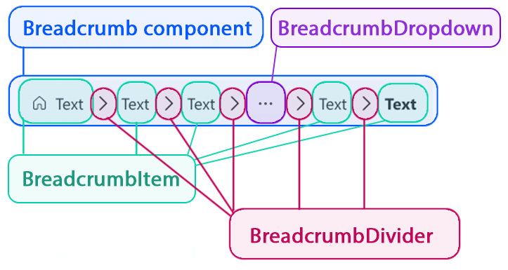

# @fluentui/react-breadcrumb Spec

## Background

Breadcrumbs should be used as a navigational aid in your app or site. They indicate the current page's location within a hierarchy and help the user understand where they are in relation to the rest of that hierarchy.

### Fabric (v8)

```jsx
import { Breadcrumb, IBreadcrumbItem } from '@fluentui/react/lib/Breadcrumb';

const items: IBreadcrumbItem[] = [
  { text: 'Files', key: 'Files', onClick: _onBreadcrumbItemClicked },
  { text: 'This is folder 1', key: 'f1', onClick: _onBreadcrumbItemClicked },
  { text: 'This is folder 2 with a long name', key: 'f2', onClick: _onBreadcrumbItemClicked },
  { text: 'This is folder 3 long', key: 'f3', onClick: _onBreadcrumbItemClicked },
  { text: 'This is non-clickable folder 4', key: 'f4' },
  { text: 'This is folder 5', key: 'f5', onClick: _onBreadcrumbItemClicked, isCurrentItem: true },
];

export const BreadcrumbStaticExample: React.FunctionComponent = () => {
  return (
    <Breadcrumb
      items={items}
      maxDisplayedItems={3}
      ariaLabel="Breadcrumb with static width"
      overflowAriaLabel="More items"
    />
  );
};

function _onBreadcrumbItemClicked(ev: React.MouseEvent<HTMLElement>, item: IBreadcrumbItem): void {
  console.log(`Breadcrumb item with key "${item.key}" has been clicked.`);
}
```

### Northstar (v0)

```jsx
import { Breadcrumb } from '@fluentui/react-northstar';
import { ChevronEndMediumIcon } from '@fluentui/react-icons-northstar';

const BreadcrumbExampleIconDivider = props => (
  <Breadcrumb aria-label="breadcrumb">
    <Breadcrumb.Item>
      <Breadcrumb.Link href="">Home</Breadcrumb.Link>
    </Breadcrumb.Item>
    <Breadcrumb.Divider>
      <ChevronEndMediumIcon />
    </Breadcrumb.Divider>
    <Breadcrumb.Item>
      <Breadcrumb.Link href="">Store</Breadcrumb.Link>
    </Breadcrumb.Item>
    <Breadcrumb.Divider>
      <ChevronEndMediumIcon />
    </Breadcrumb.Divider>
    <Breadcrumb.Item aria-current="page">T-shirt</Breadcrumb.Item>
  </Breadcrumb>
);
```

## Prior Art

- [Open UI research](https://open-ui.org/components/breadcrumb)
- [Convergence epic](https://github.com/microsoft/fluentui/issues/26480)

### Comparison of [Fabric Breadcrumb](https://developer.microsoft.com/en-us/fluentui#/controls/web/breadcrumb) and [Northstar Breadcrumb](https://fluentsite.z22.web.core.windows.net/0.57.0/components/breadcrumb/definition)

### Components

| Purpose                                                                | Fabric     | Northstar         | Matching? |
| ---------------------------------------------------------------------- | ---------- | ----------------- | --------- |
| Breadcrumb is a component that indicates the path of the current page  | Breadcrumb | Breadcrumb        | ⚠️        |
| BreadcrumbItem an actionable item within a Breadcrumb                  |            | BreadcrumbItem    | ❌        |
| BreadcrumbDivider divides BreadcrumbItem components within Breadcrumb  |            | BreadcrumbDivider | ❌        |
| An BreadcrumbLink represents a anchor to be used inside the Breadcrumb |            | BreadcrumbLink    | ❌        |

## Sample Code

```jsx
const BreadcrumbV9Example = props => (
  <Breadcrumb aria-label="breadcrumb">
    <BreadcrumbItem as="a" href="#">
      Home
    </BreadcrumbItem>
    <BreadcrumbItem as="a" href="#">
      Gallery
    </BreadcrumbItem>
    <BreadcrumbItem as="a" href="#">
      About
    </BreadcrumbItem>
  </Breadcrumb>
  </>
);
```

## Variants

### Appearance

Breadcrumb can be:

- transparent (default)
- subtle

### BreadcrumbItem variants

- Non-clickable element
- Button
- Link
- Dropdown menu (added by a user)

### Icon

BreadcrumbItem can have an icon with text or just icon.

### Size

Breadcrumb can have the following sizes: `small`, `medium` and `large`.

### Tooltip

Tooltips appear on collapsed menu or truncated name of item.

### Dropdown menu

Dropdown contains collapsed items.

## API

## Structure



### Components

| Component         | Purpose                                                                 |
| ----------------- | ----------------------------------------------------------------------- |
| Breadcrumb        | Wrapper for the Breadcrumb component. Contains `nav` and `ol` elements. |
| BreadcrumbDivider | Divider component                                                       |
| BreadcrumbItem    | Contains `li` element as a wrapper. Can contain button and link         |
| BreadcrumbMenu    | Can contain subfolders or hidden items.                                 |

### Breadcrumb

#### Anatomy


#### DOM

```HTML
<nav aria-label="breadcrumb">
  <ol>
  {children}
  </ol>
</nav>
```

#### Breadcrumb structure:

- root `nav` element
- list `ol` element
- `divider` - a BreadcrumbDivider component
- `menu` - a BreadcrumbMenu component

#### API

| Property           | Values                                  | Default       | Purpose                                                                                  |
| ------------------ | --------------------------------------- | ------------- | ---------------------------------------------------------------------------------------- |
| appearance         | `transparent`, `subtle`                 | `transparent` | Sets appearance                                                                          |
| divider            | _slot_                                  | `chevron`     | Sets type of divider                                                                     |
| menu               | _slot_                                  | undefined     | Sets custom dropdown menu                                                                |
| focusMode          | `off`, `no-tab`, `tab-exit`, `tab-only` | `off`         | Sets the focus behavior for the Breadcrumb.                                              |
| iconPosition       | `before`, `after`                       | `before`      | Sets icon position for all the icons                                                     |
| maxDisplayedItems  | number                                  | undefined     | If items count more than `maxDisplayedItems` only this number of items will be displayed |
| overflowIndex      | number                                  | 1             | Index of item where BreadcrumbMenu should be shown                                       |
| size               | `small`, `medium`, `large`              | `medium`      | Defines size of the Breadcrumb                                                           |
| truncateNameLength |                                         |               | Amount of symbols for truncated name                                                     |

### BreadcrumbItem

#### Anatomy


BreadcrumbItem can be:

- Button
- Link
- Non-clickable content
- Dropdown Menu
- Icon (optional)

It can contain a tooltip.

#### DOM

Non-clickable element

```HTML
<li>
  {children}
</li>
```

Link

```HTML
<li>
  <a href="#">
    {children}
  </a>
</li>
```

Button

```HTML
<li>
  <button>
    {children}
  </button>
</li>
```

Usage

```jsx
<BreadcrumbItem>
  Item 1
</BreadcrumbItem>
<BreadcrumbItem as="button" onClick={() => console.log('smth...')}>
  Item 2
</BreadcrumbItem>
<BreadcrumbItem as="a" href="#">
  Item 3
</BreadcrumbItem>
```

#### API

| Property     | Values                                  | Default   | Purpose                                          |
| ------------ | --------------------------------------- | --------- | ------------------------------------------------ |
| as           | `a`, `button`                           | `button`  | Defines what component to render, button or link |
| active       | boolean                                 | false     | Indicates if the item is active                  |
| disabled     | boolean                                 | false     | Disables Breadcrumb item                         |
| focusMode    | `off`, `no-tab`, `tab-exit`, `tab-only` | `off`     | Sets the focus behavior for the Breadcrumb.      |
| icon         | _slot_                                  |           | Sets icon                                        |
| iconPosition | `before`, `after`                       | `before`  | Sets icon position                               |
| tooltip      | _slot_                                  | undefined | Sets custom tooltip                              |

#### Breadcrumb icon

An icon can be SVG or image.
The icon might be added as a prop:

```jsx
<BreadcrumbItem icon={<IconComponent />}>Item 1</BreadcrumbItem>
<BreadcrumbItem icon="../path/name.png">Item 1</BreadcrumbItem>
<BreadcrumbItem>
  <SomeSVG />
  Item 1
</BreadcrumbItem>
```

### BreadcrumbDivider

#### DOM

```HTML
<li aria-hidden="true">
  {children}
</li>
```

#### API

| Property | Values                               | Default   | Purpose              |
| -------- | ------------------------------------ | --------- | -------------------- |
| divider  | `chevron`, `slash`, custom component | `chevron` | Sets type of divider |

### BreadcrumbMenu

Dropdown menu is used for collapsed items and subfolders.
BreadcrumbMenu uses @fluentui/react-menu component.

## Migration

### Fabric (v8) property mapping

This should be moved to MIGRATION.md later.
Here's how the API of v8's `Breadcrumb` compares to the one from v9's `Breadcrumb` component:

#### Props that remain as is

- `maxDisplayedItems`
- `overflowIndex` => Optional index where overflow items will be collapsed.

#### New props

- `appearance`
- `iconPosition`
- `truncateNameLength`

#### Props no longer supported with an equivalent functionality in Breadcrumb V9:

- `className` => Slot system supports it by default. We don't need to provide it explicitly.
- `items` => Use `children` prop instead.
- `componentRef`
- `dividerAs` => Divider is a separate component. Type of divider is passed to the Breadcrumb component.
- `focusZoneProps` => use `focusMode` instead.

- `overflowButtonAs` => Custom component for the overflow button. - use custom overflow button instead.
- `styles`
- `theme`

  TODO: decide what to do with the folliwing props:

- `onGrowData` => Method that determines how to group the length of the breadcrumb. Return undefined to never increase breadcrumb length.
- `onReduceData` => Method that determines how to reduce the length of the breadcrumb. Return undefined to never reduce breadcrumb length.
- `overflowAriaLabel` => Aria label for the overflow button.

#### Props no longer supported

- `onRenderOverflowIcon` => Render a custom overflow icon in place of the default icon `...`.

As BreadcrumbItem part of `children` prop, a user decides how to render an item.
The following props are not needed anymore.

- `onRenderItem` => Custom render function to render each crumb. Default renders as a link.
- `onRenderItemContent` => Custom render function to render the content within a crumb. Default renders the text.
- `tooltipHostProps` => Extra props for the TooltipHost which wraps each breadcrumb item.

Fabric Breadcrumb `items` prop as part of `IBreadcrumbData` interface contains the following props:
BreadcrumbItem component contains similar props in V9.

- `key` => not supported
- `text` => use `children` prop of BreadcrumbItem component.
- `as` => type('h1' | 'h2' | 'h3' | 'h4' | 'h5' | 'h6' | 'a') - Optional prop to render the item as a heading of your choice. You can also use this to force items to render as links instead of buttons (by default, any item with a href renders as a link, and any item without a href renders as a button). This is not generally recommended because it may prevent activating the link using the keyboard. In V9 It's part of BreadcrumbItem prop.
- `href` => URL to navigate to when this breadcrumb item is clicked. If provided, the breadcrumb will be rendered as a link.
- `isCurrentItem` => Whether this is the breadcrumb item the user is currently navigated to. If true, aria-current="page" will be applied to this breadcrumb item.
- `onClick` => Callback for when the breadcrumb item is selected.
- `onRender` => A function to render the outer content of the crumb (the link).
- `onRenderContent` => A function to render the inner content of the crumb (the text inside the link).
- `role` => Optional role for the breadcrumb item (which renders as a button by default)

#### Property Mapping

| v8 `Breadcrumb`     | v9 `Breadcrumb`     |
| ------------------- | ------------------- |
| `ariaLabel`         |                     |
| `className`         |                     |
| `componentRef`      |                     |
| `dividerAs`         | `divider`           |
| `focusZoneProps`    | `focusMode`         |
| `maxDisplayedItems` | `maxDisplayedItems` |

### Northstar property mapping

#### Props which are repeating in each component

These props are the same in all the components.
`as` prop had different defaults in different components.
BreadcrumbDivider has default `span`. BreadcrumbLink has `a` and Breadcrumb has `nav`.

- `accessibility` => Accessibility behavior if overridden by the user.
- `as` => type React.ElementType - An element type to render as (string or component).
- `className`
- `content` => Shorthand for primary content.
- `design` => type ComponentDesignProp
- `styles` =>
- `variables` => Override for theme site variables to allow modifications of component styling via themes.

#### Property Mapping

| Northstar `Breadcrumb` | v9 `Breadcrumb` |
| ---------------------- | --------------- |
| `accessibility`        |                 |
| `as`                   | `as`            |
| `className`            |                 |
| `content`              |                 |
| `design`               |                 |
| `styles`               |                 |
| `variables`            |                 |

#### Breadcrumb component:

- `size` => use as it is.

#### BreadcrumbItem component:

- `active` => Indicates if the link is the active.
- `disabled` => The Breadcrumb Item can be disabled.

#### Property Mapping

| Northstar `BreadcrumbItem` | v9 `BreadcrumbItem` |
| -------------------------- | ------------------- |
| `active`                   | `active`            |
| `disabled`                 | `disabled`          |

## Behaviors

#### Overflow

The default position of ellipses should be the second element because from a UX perspective root folder should be shown.

#### Collapse functionality:

Collapse turns on when:

- There's not enough space
- When `maxDisplayedItems` prop is provided and number of items is bigger than `maxDisplayedItems`.

#### Truncate long names:

This value should be customizable

### Mouse

#### Breadcrumb item as Button


#### Breadcrumb item as Link


Breadcrumb can have the folloing states:

- Rest
- Hover
- Pressed
- Selected
- Focused
- Disabled
- Active


#### Non-interactive Breadcrumb Item

Non-interactive style variation for places where the Breadcrumb is purely representational or informational. Usually this instance is mostly used to describe file path location, etc.


#### Tooltip

Tooltip is shown `onHover` on collapsed menu or items with long names.


### Keyboard

When navigating via keyboard, focus will be place initially on the first breadcrumb item. Left and right arrow keys move through the breadcrumb items.


- Tab => Focus on breadcrumb trail or the first item only.
- Arrow => Move focus to items in the string.
- Enter or Space => Selects the item; opens the page; expand collapsed items.

#### Collapsed items - Menu

If the overflow button is in focus, `Enter`, `Arrow down` or `Space` activate the overflow menu.


- Enter, Arrow Down or Space => Expand collapsed items.

## Accessibility

Design WIP

### Narrator guidance

Base accessibility information is included in the design document. After the spec is filled and review, outcomes from it need to be communicated to design and incorporated in the design document.

- Decide whether to use **native element** or folow **ARIA** and provide reasons
- Identify the **[ARIA](https://www.w3.org/TR/wai-aria-practices-1.2/) pattern** and, if the component is listed there, follow its specification as possible.
- Identify accessibility **variants**, the `role` ([ARIA roles](https://www.w3.org/TR/wai-aria-1.1/#role_definitions)) of the component, its `slots` and `aria-*` props.
- Describe the **keyboard navigation**: Tab Oder and Arrow Key Navigation. Describe any other keyboard **shortcuts** used
- Specify texts for **state change announcements** - [ARIA live regions
  ](https://developer.mozilla.org/en-US/docs/Web/Accessibility/ARIA/ARIA_Live_Regions) (number of available items in dropdown, error messages, confirmations, ...)
- Identify UI parts that appear on **hover or focus** and specify keyboard and screen reader interaction with them
- List cases when **focus** needs to be **trapped** in sections of the UI (for dialogs and popups or for hierarchical navigation)
- List cases when **focus** needs to be **moved programatically** (if parts of the UI are appearing/disappearing or other cases)
