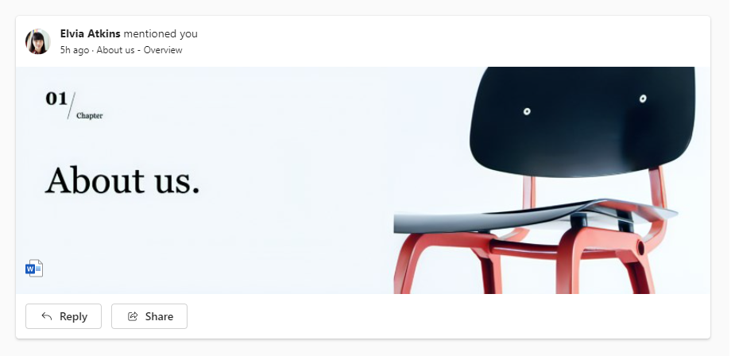

# @fluentui/react-card [ALPHA]

**React Card components for [Fluent UI React](https://react.fluentui.dev)**

**⚠️ Please note that functionality is still being added to this package. Due to lockstep versioning, the version of this package is aligned with the others in _react-components_.**

These are not production-ready components and **should never be used in a product**. This space is useful for testing new components whose APIs might change before final release.

## Usage

To import React Card components:

```js
import { Card, CardPreview, CardHeader, CardFooter } from "@fluentui/react-components/unstable';
```

Example Card usage:



```jsx
import { Share16Regular, ArrowReply16Regular } from '@fluentui/react-icons';
import { Button, Body1, Caption1 } from '@fluentui/react-components';
import { Card, CardHeader, CardPreview, CardFooter } from '@fluentui/react-components/unstable';

const App = () => (
  <>
    <Card>
      <CardHeader
        image={
          
        }
        header={
          <Body1>
            <b>Elvia Atkins</b> mentioned you
          </Body1>
        }
        description={<Caption1>5h ago · About us - Overview</Caption1>}
      />
      <CardPreview
        logo={
          
        }
      >
        
      </CardPreview>
      <CardFooter>
        <Button icon={<ArrowReply16Regular />}>Reply</Button>
        <Button icon={<Share16Regular />}>Share</Button>
      </CardFooter>
    </Card>
  </>
);
```

## Specification

See the [Spec.md](./Spec.md) file for background information on the design/engineering decisions of the component.

## API

For information about the components, please refer to the [API documentation](https://react.fluentui.dev/?path=/docs/preview-components-card--default).

## Migration

For migration information, have a look at the [migration guide](./MIGRATION.md).
