# @fluentui/react-card Spec

## Background

A card's main function is to provide the scaffolding for hosting actions and content for a single topic within a card sized object. It is a framework for organizing content within the confines of a card.

The card itself should not have content or actions built in, but provide the mechanisms for it to be displayed.

### Fabric (v8)

Example:

```jsx
<DocumentCard
  aria-label="Default Document Card with large file name. Created by Annie Lindqvist a few minutes ago."
  onClickHref="http://bing.com"
>
  <DocumentCardPreview {...previewProps} />
  <DocumentCardTitle title="Filename" />
  <DocumentCardActivity activity="Created a few minutes ago" people={DocumentCardActivityPeople} />
</DocumentCard>
```

### Northstar (v0)

```jsx
<Card>
  <CardHeader>
    <Flex gap="gap.small">
      <Avatar
        image="https://fabricweb.azureedge.net/fabric-website/assets/images/avatar/RobertTolbert.jpg"
        label="Forward Division Analyst"
        name="Lura Hermiston"
        status="unknown"
      />
      <Flex column>
        <Text content="Lura Hermiston" weight="bold" />
        <Text content="Forward Division Analyst" size="small" />
      </Flex>
    </Flex>
  </CardHeader>
  <CardBody>Sit quaerat dolorem quos sit et dolorem asperiores.</CardBody>
</Card>
```

## Prior Art

- [Open UI research](https://github.com/openui/open-ui/pull/134)
- [Convergence epic](https://github.com/microsoft/fluentui/issues/19336)

## Comparison of [Fabric DocumentCard](https://developer.microsoft.com/en-us/fluentui#/controls/web/documentcard) and [Northstar Card](https://fluentsite.z22.web.core.windows.net/0.57.0/components/card/definition)

Fabric's DocumentCard seems tied to a specific format, Office focused, while Northstar's Card is more generic.
DocumentCard has components for each specific need of a card that displays documents as it offers image previews/file lists, user activity and other related things.
Card goes for a more structural and generic approach to a card component and is closer to the vision for the v9 Card.

### Components

| Purpose                                                                                                                    | Fabric               | Northstar         | Matching? |
| -------------------------------------------------------------------------------------------------------------------------- | -------------------- | ----------------- | --------- |
| Main component wrapper                                                                                                     | DocumentCard         | Card              | ✅        |
| Component to add actions like sharing                                                                                      | DocumentCardActions  | CardTopControls   | ⚠️        |
| Component to render an image                                                                                               | DocumentCardImage    | CardPreview       | ⚠️        |
| Hybrid component to render an image preview for a document or list of documents. Possibly redundant with DocumentCardImage | DocumentCardPreview  |                   | ❌        |
| Adds an icon/logo to the card                                                                                              | DocumentCardLogo     |                   | ❌        |
| Wrapper for the right side of horizontal cards                                                                             | DocumentCardDetails  |                   | ❌        |
| Show document activity (user list)                                                                                         | DocumentCardActivity |                   | ❌        |
| Link element                                                                                                               | DocumentCardLocation |                   | ❌        |
| Extra text component with a grayed out background                                                                          | DocumentCardStatus   |                   | ❌        |
| Header of the card                                                                                                         |                      | CardHeader        | ❌        |
| Body of the card                                                                                                           |                      | CardBody          | ❌        |
| Footer of the card                                                                                                         |                      | CardFooter        | ❌        |
| Wrapper to render in column format                                                                                         |                      | CardColumn        | ❌        |
| Allows for content to expand on hover                                                                                      |                      | CardExpandableBox | ❌        |

...

## API Proposal

### Components

| Component   | Purpose                                                                  |
| ----------- | ------------------------------------------------------------------------ |
| Card        | Wrapper for the main content of a card.                                  |
| CardHeader  | Optional header slot for the card.                                       |
| CardPreview | Previewing the document/article presented in the card through an image   |
| CardFooter  | Optional footer slot for the card. (non-applicable for horizontal cards) |

### Card

#### Anatomy

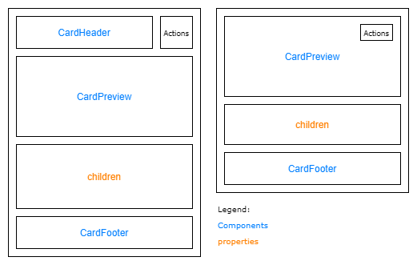

#### DOM

```HTML
<div role="group">
  {children}
</div>
```

#### API

| Property    | Values                                                                               | Default    | Purpose                                                                          |
| ----------- | ------------------------------------------------------------------------------------ | ---------- | -------------------------------------------------------------------------------- |
| orientation | `vertical`, `horizontal`                                                             | `vertical` | Orientation of the card                                                          |
| size        | `smallest`, `smaller`, `small`, `medium`, `large`                                    | `medium`   | Define the minimum size of the card. Smaller sizes only apply to horizontal card |
| scale       | `fixed`, `auto-width`, `auto-height`, `auto`, `fluid-width`, `fluid-height`, `fluid` | `auto`     | Manages how the card handles it's scaling depending on the content               |
| appearance  | `filled`, `filled-alternative`, `outline`, `subtle`                                  | `filled`   | Define the appearance of the card                                                |
| selectable  | boolean                                                                              | false      | Makes the card selectable by adding a checkbox to the _Actions_ area             |
| selected    | boolean                                                                              | false      | Set to `true` if card is selected                                                |
| expandable  | boolean                                                                              | false      | Allow card to expand to show whole content                                       |
| disabled    | boolean                                                                              | false      | Makes the card and card selection disabled (not propagated to children)          |
| focusMode   | `off`, `no-tab`, `tab-exit`, `tab-only`                                              | `off`      | Sets the focus behavior for the card.                                            |

#### `scale` property

- `fixed`: Size of the card is fixed.
- `auto-width`: `width` is set to `fit-content`.
- `auto-height`: `height` is set to `fit-content`.
- `auto`: `width` and `height` are set to `fit-content`.
- `fluid-width`: `width` is set to `100%`.
- `fluid-height`: `height` is set to `100%`.
- `fluid`: `width` and `height` are set to `100%`.

#### `focusMode` property

The three allowed focus behaviours (`no-tab`, `tab-exit`, `tab-only`) map to the behaviors provided by Tabster.

- `off`

  The card will not focusable.

- `no-tab` (`trapFocus` in Tabster)

  This behaviour traps the focus inside of the Card when pressing the `Enter` key and will only release focus when pressing the `Escape` key.

- `tab-exit` (`limited` in Tabster)

  This behaviour traps the focus inside of the Card when pressing the `Enter` key but will release focus when pressing the `Tab` key on the last inner element.

- `tab-only` (`unlimited` in Tabster)

  This behaviour will cycle through all elements inside of the Card when pressing the `Tab` key and then release focus after the last inner element.

#### Context menu

Context menu should be handled in conjunction with the @fluentui/react-menu component. A simple usage example would be:

```jsx
<Menu openOnContext>
  <MenuTrigger>
    <Card />
  </MenuTrigger>

  <MenuPopover>
    <MenuList>
      <MenuItem>Share</MenuItem>
      <MenuItem>Dismiss</MenuItem>
    </MenuList>
  </MenuPopover>
</Menu>
```

`react-card` documentation will contain more elaborate examples to cover the different use cases.

### CardHeader

#### Anatomy

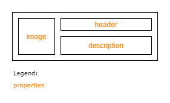

#### DOM

```HTML
<div>
  <div>{image}</div>
  <div>
    {header}
    {description}
  </div>
</div>
```

#### API

| Property    | Values | Default   | Purpose                                           |
| ----------- | ------ | --------- | ------------------------------------------------- |
| image       | _slot_ | undefined | Logo or image to better contextualize the content |
| header      | _slot_ | undefined | Header of the card                                |
| description | _slot_ | undefined | Further description of the content                |

### CardPreview

#### Anatomy

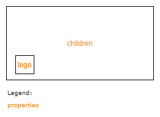

#### DOM

```HTML
<div>
  {children}
  <div>
    {logo}
  </div>
</div>
```

#### API

| Property | Values | Default   | Purpose                                        |
| -------- | ------ | --------- | ---------------------------------------------- |
| logo     | _slot_ | undefined | A logo/file type to add over the image preview |

### CardFooter

#### Anatomy

This component has no custom props and only ensures the proper positioning of content and itself within the card.

#### DOM

```HTML
<div>{children}</div>
```

## Sample Code

### Compact

```jsx
<Card orientation="horizontal">
  <CardHeader image={} header="Team offsite 2020" description="Onedrive > Files" />
</Card>
```

### App

```jsx
<Card>
  <CardHeader image={} header="App Name" description="Developer" />
  <span>
    Donut chocolate bar oat cake. Dragée tiramisu lollipop bear claw. Marshmallow pastry jujubes toffee sugar plum.
  </span>
</Card>
```

### Task

```jsx
<Card>
  <CardHeader header="Alert in Teams when a new document is uploaded in channel" description="By Microsoft" />
  <CardFooter>
    <span>Automated</span>
    <span>3290 uses</span>
  </CardFooter>
</Card>
```

### Image

```jsx
<Card>
  <CardPreview src="monkey.png" alt="image of monkey" />
  <div>
    <span>Length</span>
    <span>4.6-39.6 IN</span>
    <span>11.7-100.6 cm</span>
  </div>
  <div>
    <span>Diet</span>
    <span>Omnivore</span>
    <span>nuts, fruits, eggs</span>
  </div>
  <CardFooter>
    <Button>Share</Button>
  </CardFooter>
</Card>
```

## Behaviours

### Mouse

### Interactive cards

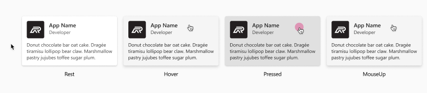

The card surface can be used as a clickable target

1. Rest

2. OnHover

   Cursor style changes to pointer, background color & elevation values change to show card is an actionable element

3. OnClick

   Executes action assigned to card i.e. “Open file, Open link in browser etc...”

### Non-interactive cards with interactive child components

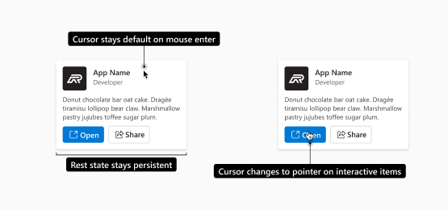

Cards that have multiple actions within them cannot be clickable. We preserve the use of `EnterKey` for moving focus to actionable controls inside the card.

1. OnMouseEnter / Hover

   Cursor style stays at default, rest state stays persistent no visual feedback is applied to the card surface

2. Hover & onClick

   Hover state only applies to actionable items within card i.e. buttons, links etc. Cursor changes to pointer (or follows behavior of that component) ”

#### Selectable cards

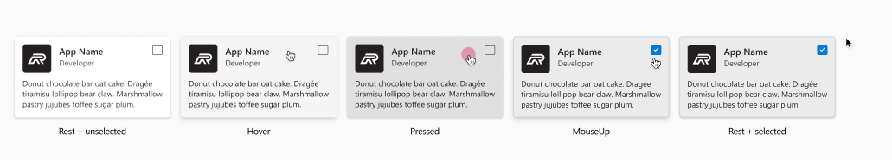

Clicking the card surface can toggle the checkbox state to `selected`. Note that checkboxes are composed together as an additional component and are not provided by default.

1. Rest

   Default state is `unselected`

2. Hover

   Cursor style changes to `pointer`, background color and elevation follows interactive styling to show visual feedback.

3. Pressed

   Cursor does not change background color and elevation follows interactive styling to show visual feedback for pressed state.

4. onClick

   Card and Checkbox are both in selected state, clicking again toggles components to unselected state.

### Non-interactive selectable cards

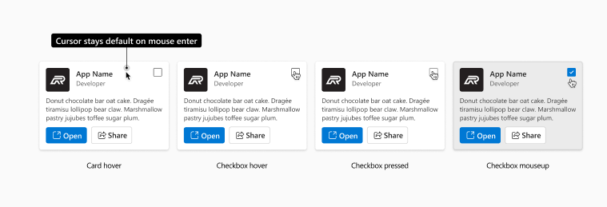

Cards that have multiple actionable child components are expected to not be clickable. We preserve the use of `EnterKey` for moving focus to actionable controls inside the card, therefore the card surface should not be used to set the state of the card but is reliant on the checkbox or similar inputs to set the card state.

If users have a scenario that requires them to use actionable components within a clickable Card then the bubbling of events is expected to be managed by the users themselves.

If users have a scenario that requires them to use actionable components within a clickable Card then the bubbling of events is expected to be managed by the users themselves.

- OnMouseEnter / Hover

  Cursor style stays at default, rest state stays persistent no visual feedback is applied to the card surface

- Hover & onClick (Checkbox)

  Hover state & pressed state applies to checkbox component

- onClick (Checkbox)

  Card and Checkbox are both in selected state, clicking again toggles components to unselected state

#### Disabled

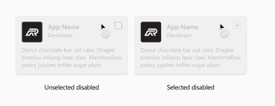

In scenarios where a selectable card may be disabled both the card and the checkbox should be set to disabled.
Hovering the card changes the cursor style to not-allowed

1. Unselected disabled

   - Label: Selectable Card
   - Role: Group
   - State: Disabled, unselected

2. Selected disabled

   - Label: Selectable Card
   - Role: Group
   - State: Disabled, selected

### Keyboard

### Interactive cards

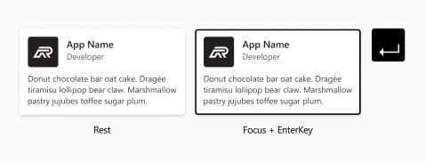

1. Rest

2. Keyboard interaction

   `EnterKey` Perfoms action on card “Open file, Open link in browser etc...”.

### Non-interactive cards with interactive child components

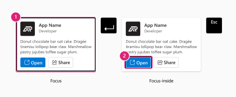

1. Focus

   Initial focus is set on card, to access items within the card use `EnterKey` or `Spacebar`.

2. Focus-Inside

   Focus moves to first actionable item in the card. Use `ArrowKeys` or `TabKey` to move focus to child elements within the card. To exit card use `EscKey`, to move focus back to card.

#### Selectable cards

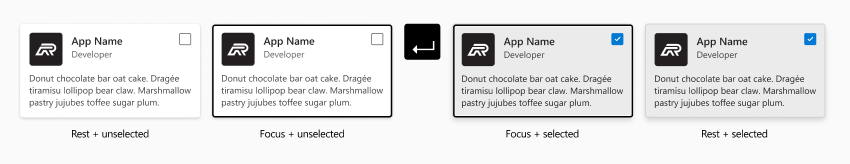

1. Rest

   Default state is ‘unselected’

2. Focus

   Focus rectangle is shown on card

3. Focus

   Use spacebar to toggle state (selected/unselected)

### Non-interactive selectable cards


1. Focus

   Initial focus is set on card, to access items within the card use `EnterKey` or `Spacebar`.

2. Focus-Inside

   Focus moves to first actionable item in the card. Use `ArrowKeys` or `TabKey` to move focus to child elements within the card. To exit card use `EscKey`, to move focus back to card.

3. Checkbox-Focus

   Depending on your tab order of items within the card, the number of keystrokes will vary.

4. `SpaceBar` or `EnterKey` while focused on the Checkbox

   Will toggle both Card and Checkbox to selected state. Keying again will toggle to unselected.

### Disabled

If a card is in a disabled state it should not receive focus from the tab order. And navigation to actionable child elements within the card should not be possible.

## Accessibility

> ⚠️ Note: All other accessibility information, not covered in this section, is provided throughout the spec.

Each card is of `role="group"`.

### Narrator guidance

### Interactive cards

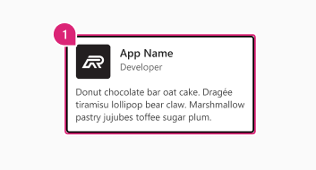

1. Label: App Card
2. Role: Group
3. State: Focus
4. Helper text: Use enterKey to perform action

#### Selectable cards

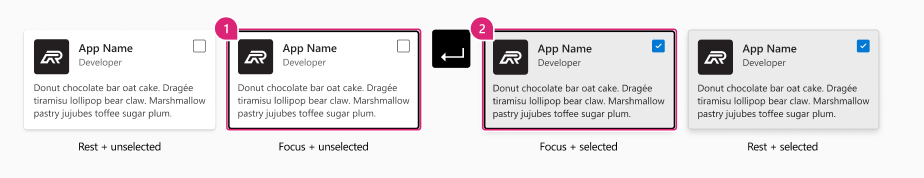

1 Focus + unselected

1. Label: Select this card
2. Role: Group
3. State: Focus + unselected
4. Helper text: Use enterKey or spacebar to toggle state to selected

2 Focus + selected

1. Label: Unselect this card
2. Role: Group
3. State: Focus + selected
4. Helper text: Use enterKey or spacebar to toggle state to unselected

#### Non-interactive cards

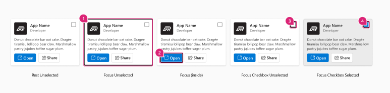

1 Focus + unselected

1. Label: App Card
2. Role: Group
3. State: Focus
4. Helper text: Use enterKey to access controls within the card

2 Focus (inside)

1. Label: Open App
2. Role: Button
3. State: Focus
4. Helper text: Use enterkey to open app in new window

3 Focus Checkbox unselected

1. Label: Share App
2. Role: Button
3. State: Focus
4. Helper text: Use enter key to open share dialog

4 Focus Checkbox selected

1. Label: Select card
2. Role: Checkbox
3. State: Unselected
4. Helper text: Use spacebar or enter key to select this item

#### Disabled

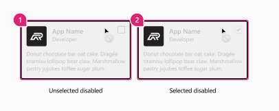

If a card is in a disabled state it should not receive focus from the tab order.

1 Unselected disabled

1. Label: Selectable Card
2. Role: Group
3. State: Disabled, unselected

2 Selected disabled

1. Label: Selectable Card
2. Role: Group
3. State: Disabled, selected
