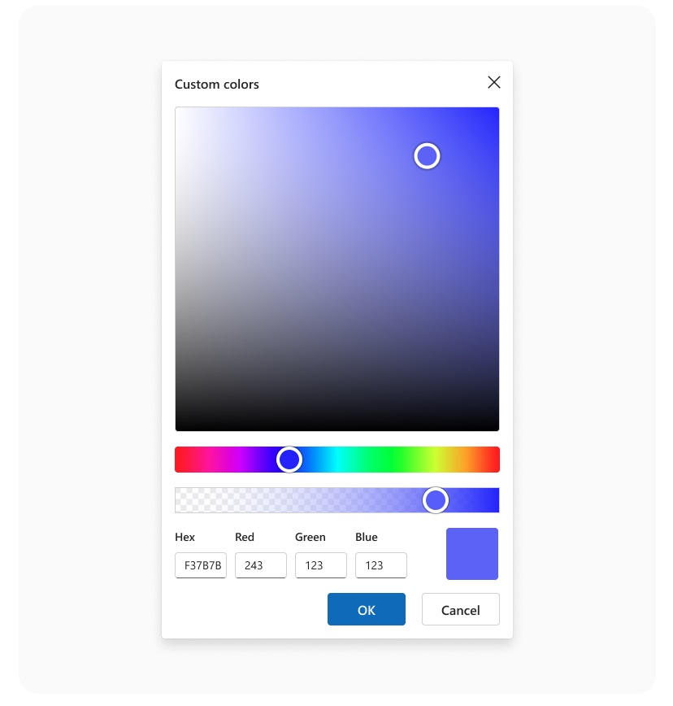
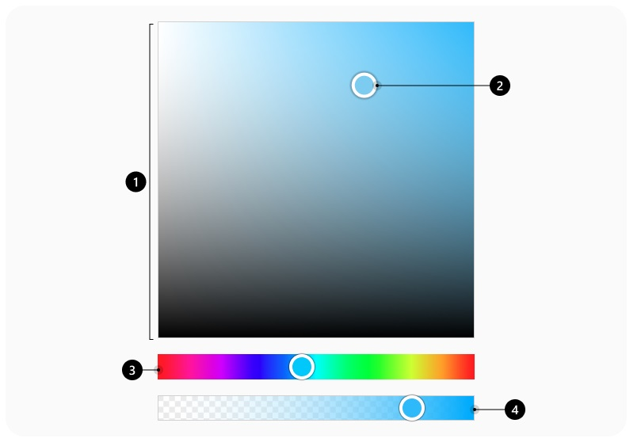
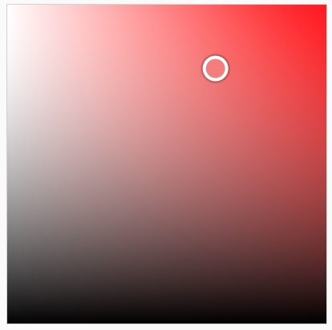
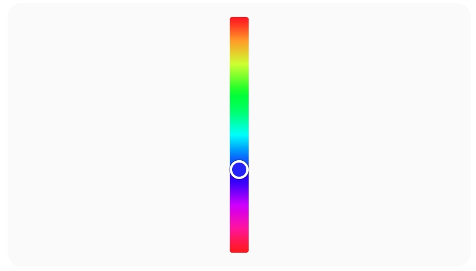
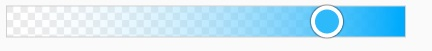
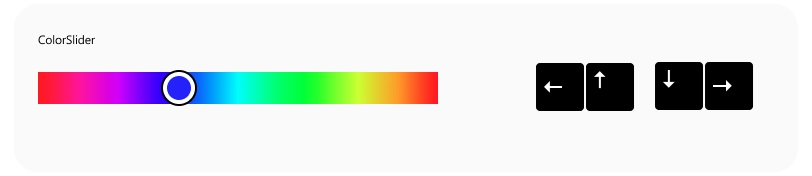
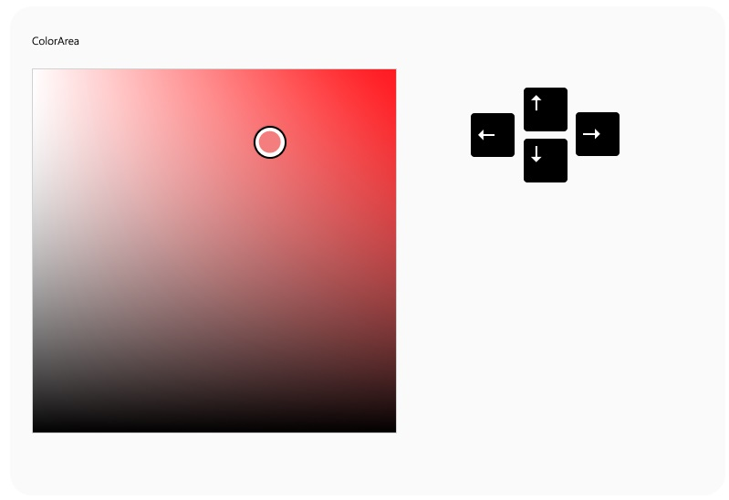
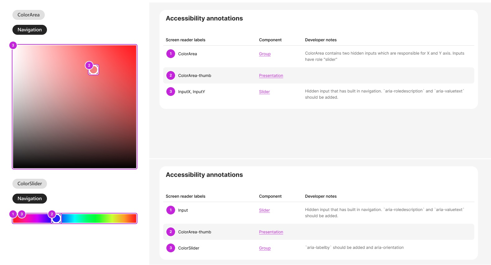

# @fluentui/react-color-picker-preview Spec

## Background

The ColorPicker is used to browse through and select colors.
By default, it lets people navigate through colors on a color spectrum; or specify a color in either Red-Green-Blue (RGB); or alpha color code; or Hexadecimal textboxes.

## Prior Art

- [Convergence epic](https://github.com/microsoft/fluentui/issues/31778)

### Fabric (v8)

```jsx
import * as React from 'react';
import {
  ColorPicker,
  ChoiceGroup,
  IChoiceGroupOption,
  getColorFromString,
  IColor,
  IColorPickerStyles,
  IColorPickerProps,
} from '@fluentui/react';

const white = getColorFromString('#ffffff')!;

const ColorPickerBasicExample: React.FunctionComponent = () => {
  const [color, setColor] = React.useState(white);
  const [showPreview, setShowPreview] = React.useState(true);
  const [alphaType, setAlphaType] = React.useState<IColorPickerProps['alphaType']>('alpha');

  const updateColor = React.useCallback((ev: any, colorObj: IColor) => setColor(colorObj), []);

  return (
    <>
      <ColorPicker
        color={color}
        onChange={updateColor}
        alphaType={alphaType}
        showPreview={showPreview}
        styles={colorPickerStyles}
        strings={{
          hueAriaLabel: 'Hue',
        }}
      />
    </>
  );
};
```

### 3rd party Design Systems

- Adobe Spectrum
  - [ColorPicker](https://react-spectrum.adobe.com/react-spectrum/ColorPicker.html)
  - [ColorArea](https://react-spectrum.adobe.com/react-spectrum/ColorArea.html)
  - [ColorSlider](https://react-spectrum.adobe.com/react-spectrum/ColorSlider.html)

### Components

| Purpose                                                                  | Fabric (V8)    | V9          | Matching? |
| ------------------------------------------------------------------------ | -------------- | ----------- | --------- |
| Component responsible for color editing using ColorArea and ColorSliders | ColorPicker    | ColorPicker | ⚠️        |
| ColorArea allows user to pick a color using two channels                 | ColorRectangle | ColorArea   | ⚠️        |
| ColorSlider allows user to pick a color using individual channel         | ColorSlider    | ColorSlider | ⚠️        |
| AlphaSlider allows user to pick a color using alpha channel              |                | AlphaSlider | ❌        |

## Sample Code

```jsx
import {
  ColorPicker,
  ColorArea,
  ColorSliderProps,
  AlphaSlider,
  HueSlider,
  ColorPickerOnSelectEventHandler,
} from '@fluentui/react-color-picker-preview';

export const Default = () => {
  const COLOR = 'rgba(0, 255, 170, 1)';
  const [selectedColor, setSelectedColor] = React.useState(COLOR);
  const handleChange: ColorPickerOnSelectEventHandler = (_, data) => {
    setSelectedColor(data.selectedColorHex);
  };

  return (
    <>
      <ColorPicker color={selectedColor} onChange={handleChange}>
        <ColorArea />
        <AlphaSlider />
        <HueSlider />
      </ColorPicker>
      <div style={{ backgroundColor: `${selectedColor}` }} />
    </>
  );
};
```

## Variants

### Slider variants

- horizontal (default)
- vertical

ColorSliders might represent different color channels.

### Shapes

- `square` (default)
- `rounded`

### Size

Size will be the same as in Office products.
For custom sizes users might want to customize it via CSS.

### States

- `rest`
- `focused`

### Color support

- RGB(A)
- Hex
- HSL(A)
- HSV/HSB

## API

### ColorPicker

| Property   | Values              | Default   | Purpose                                |
| ---------- | ------------------- | --------- | -------------------------------------- |
| color      | `string`            |           | Sets color value                       |
| onChange   | `function`          | undefined | Callback called when color is selected |
| shape      | `square`, `rounded` | `square`  | Sets shape                             |
| step       | `number`            | 1         | Step for arrow navigation              |
| customStep | `number`            | 3         | Fast navigation                        |

Input fields with color values will be in `renderUtils`. It will contain default ColorPicker which has all colors represented and a preview swatch. This functionality is similar to V8.

```ts
import { ColorPickerLayout } from '@fluentui/react-color-picker-preview';
```

```tsx
export const Default = () => {
  const COLOR = 'rgba(0, 255, 170, 1)';
  const [selectedColor, setSelectedColor] = React.useState(COLOR);
  const handleChange: ColorPickerOnSelectEventHandler = (_, data) => {
    setSelectedColor(data.selectedColorHex);
  };

  return (
    <>
      <ColorPickerLayout
        color={selectedColor}
        onChange={handleChange}
        showAlphaSlider={true}
        showPreview={true}
        channels={['hex', 'rgb']}
      />
      <div style={{ backgroundColor: `${selectedColor}` }} />
    </>
  );
};
```



Validation of color fields will be in `utils`. Validation should not allow entering incorrect values to the input fields.

For color manipulation and conversion `tinycolor` library will be used.

| Slots | Values | Default | Description                 |
| ----- | ------ | ------- | --------------------------- |
| root  | `div`  | `div`   | The root of the ColorPicker |

### ColorArea

| Property   | Values              | Default   | Purpose                                |
| ---------- | ------------------- | --------- | -------------------------------------- |
| customStep | `number`            | 3         | Fast step for the slider               |
| onChange   | `function`          | undefined | Callback called when color is selected |
| shape      | `square`, `rounded` | `square`  | Sets shape                             |
| step       | `number`            | 1         | Step for the slider                    |
| valueX     | `string`            |           | Value of the slider on X axis          |
| valueY     | `string`            |           | Value of the slider on Y axis          |

| Slots   | Values  | Default | Description                                                         |
| ------- | ------- | ------- | ------------------------------------------------------------------- |
| root    | `div`   | `div`   | The root of the ColorArea element                                   |
| thumb   | `div`   | `div`   | The draggable icon used to select a given value from the ColorArea. |
| sliderX | `input` | `input` | Input for X axis                                                    |
| sliderY | `input` | `input` | Input for Y axis                                                    |

### ColorSlider

| Property   | Values                   | Default      | Purpose                                |
| ---------- | ------------------------ | ------------ | -------------------------------------- |
| customStep | `number`                 | 3            | Fast step for the slider               |
| max        | `number`                 | 360          | The max value of the Slider.           |
| min        | `number`                 | 0            | The min value of the Slider.           |
| onChange   | `function`               | undefined    | Callback called when color is selected |
| orient     | `horizontal`, `vertical` | `horizontal` | Orientation of a slider                |
| shape      | `square`, `rounded`      | `square`     | Sets shape                             |
| step       | `number`                 | 1            | Step for the slider                    |
| value      | `string`                 |              | Value of the slider                    |

| Slots  | Values  | Default | Description                                                      |
| ------ | ------- | ------- | ---------------------------------------------------------------- |
| root   | `div`   | `div`   | The root of the ColorSlider element                              |
| thumb  | `div`   | `div`   | The draggable icon used to select a given value from the Slider. |
| slider | `input` | `input` | Input for slider                                                 |
| rail   | `div`   | `div`   | It is used to visibly display the min and max selectable values. |

### AlphaSlider

| Property     | Values                   | Default      | Purpose                                |
| ------------ | ------------------------ | ------------ | -------------------------------------- |
| customStep   | `number`                 | 3            | Fast step for the slider               |
| max          | `number`                 | 100          | The max value of the Slider.           |
| min          | `number`                 | 0            | The min value of the Slider.           |
| onChange     | `function`               | undefined    | Callback called when color is selected |
| orient       | `horizontal`, `vertical` | `horizontal` | Orientation of a slider                |
| overlayColor | `string`                 | undefined    | Overlay color                          |
| shape        | `square`, `rounded`      | `square`     | Sets shape                             |
| step         | `number`                 | 1            | Step for the slider                    |
| value        | `string`                 |              | value of the slider                    |

| Slots  | Values  | Default | Description                                                      |
| ------ | ------- | ------- | ---------------------------------------------------------------- |
| root   | `div`   | `div`   | The root of the AlphaSlider element                              |
| thumb  | `div`   | `div`   | The draggable icon used to select a given value from the Slider. |
| slider | `input` | `input` | Input for slider                                                 |
| rail   | `div`   | `div`   | It is used to visibly display the min and max selectable values. |

## Structure

### Components

| Component   | Purpose                                      |
| ----------- | -------------------------------------------- |
| ColorPicker | Renders ColorPicker                          |
| ColorArea   | Renders two-dimensional gradient background. |
| ColorSlider | Renders individual color channel             |
| AlphaSlider | Renders slider with alpha channel            |

#### ColorPicker component



#### DOM

```HTML
<div role="group" class="fui-ColorPicker" arial-label="ColorPicker">
  <!-- Content rendered here -->
</div>
```

#### ColorArea component



#### DOM

```HTML
<div role="group" class="fui-ColorArea" aria-label="Saturation and brightness" aria-valuetext="Saturation 54 brightness 35">
  <input id="sliderX" type="range" class="fui-ColorArea__inputX" value="96" role="slider">
  <input id="sliderY" type="range" class="fui-ColorArea__inputY" value="0" role="slider">
  <div class="fui-ColorArea__thumb" role="presentation"></div>
</div>
```

#### ColorSlider component

##### Horizontal


##### Vertical



#### DOM

```HTML
<div class="fui-ColorSlider" role="group">
  <input id="slider" type="range" value="100" aria-valuetext="100, red" max="360">
  <div class="fui-ColorSlider__rail" ></div>
  <div class="fui-ColorSlider__thumb" role="presentation"></div>
</div>
```

#### AlphaSlider component



#### DOM

```HTML
<div class="fui-AlphaSlider" role="group">
  <input id="slider" type="range" role="slider" value="100" aria-valuetext="100, red">
  <div class="fui-AlphaSlider__rail" ></div>
  <div class="fui-AlphaSlider__thumb" role="presentation"></div>
</div>
```

## Migration

### Fabric (v8) property mapping

#### New props

- `customStep`
- `shape`
- `step`

#### Supported Props

- `color`
- `onChange`

#### Props no longer supported with an equivalent functionality in ColorPicker V9:

- `className` => Slot system supports it by default. We don't need to provide it explicitly.
- `styles` => Use style customization through `className` instead.
- `theme`

#### Props no longer supported

- `alphaType`
- `componentRef`
- `showPreview`
- `strings`
- `tooltipProps`

#### ColorArea component

#### New props

- `customStep`
- `shape`
- `step`
- `valueX`
- `valueY`

#### Props supported

- `color`

#### ColorSlider component

#### New props

- `customStep`
- `shape`
- `orient`
- `step`

#### Props supported

- `value`
- `onChange`

#### Props no longer supported with an equivalent functionality in ColorPicker V9:

- `minValue` => Use `min` instead
- `maxValue` => Use `max` instead
- `type` => in case of support channels it'll be `channel` instead
- `isAlpha` => use `AlphaSlider` component instead
- `overlayColor` => part of `AlphaSlider` component
- `thumbColor` => is calculated automatically or can be customized via CSS

#### Property Mapping

| v8 `ColorPicker` | v9 `ColorPicker`           |
| ---------------- | -------------------------- |
| `value`          | `value`                    |
| `onChange`       | `onChange`                 |
| `maxValue`       | `max`                      |
| `minValue`       | `min`                      |
| `shape `         |                            |
| `type`           | `channel`                  |
| `isAlpha`        | `AlphaSlider` component    |
| `overlayColor`   | In `AlphaSlider` component |
| `thumbColor`     |                            |
|                  | `customStep`               |
|                  | `shape`                    |
|                  | `orient`                   |
|                  | `step`                     |

## Behaviors

### Mouse

On `click` color is selected and color thumb is moved to the selected position. Color thumb should represent selected color.

States:

1. Rest
2. Focus
3. OnClick

   Color is selected.

### Keyboard Navigation

In a `horizontal` orientation top/right arrows move to the right, bottom/left arrows move to the left.

| Key                  | Result                                                         |
| -------------------- | -------------------------------------------------------------- |
| Arrows               | Color thumb is focused. Color is selected                      |
| `Home/End/PgUp/PgDn` | Can be used another configuration for the step to move faster. |
| `Tab`                | Navigation between color sliders and Color Area                |

##### Color/Alpha Slider



##### ColorArea



### Screen readers

On navigation and color select the screen reader should read the following:

1. `aria-labelby` of the root component, e.g. "ColorPicker"
2. `aria-roledescription` of the input slider, e.g. "2D slider"
3. `aria-valuetext` with the color description.

**Example**: "ColorPicker, 2D slider, Red 10, Green 132, Blue 228, Azure Radiance"

## Accessibility

Use `tab` key to navigate between ColorArea and Color sliders. Use arrows keys to select a color.

**Root element of ColorSlider and ColorArea:**

- role `group`
- `aria-labelby`

For vertical Slider `aria-orientation="vertical"`

**ColorThumb:**

- role `presentation`

**ColorArea X/Y inputs and Color/AlphaSlider:**

- role `slider`
- `aria-roledescription`
- `aria-valuetext`


