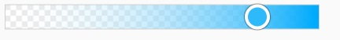

# @fluentui/react-color-picker Spec

## Background

The ColorPicker allows users to browse and select colors.
By default, it enables navigation through a color spectrum and operates in HSV/HSL format.
However, it is also possible to specify a color using Red-Green-Blue (RGB), an alpha color code, or hexadecimal values in the text boxes.

## Prior Art

[Convergence epic](https://github.com/microsoft/fluentui/issues/31778)

### Fabric (v8)

```jsx
import * as React from 'react';
import {
  ColorPicker,
  ChoiceGroup,
  IChoiceGroupOption,
  getColorFromString,
  IColor,
  IColorPickerStyles,
  IColorPickerProps,
} from '@fluentui/react';

const white = getColorFromString('#ffffff')!;

const ColorPickerBasicExample: React.FunctionComponent = () => {
  const [color, setColor] = React.useState(white);
  const [showPreview, setShowPreview] = React.useState(true);
  const [alphaType, setAlphaType] = React.useState<IColorPickerProps['alphaType']>('alpha');

  const updateColor = React.useCallback((ev: any, colorObj: IColor) => setColor(colorObj), []);

  return (
    <>
      <ColorPicker
        color={color}
        onChange={updateColor}
        alphaType={alphaType}
        showPreview={showPreview}
        styles={colorPickerStyles}
        strings={{
          hueAriaLabel: 'Hue',
        }}
      />
    </>
  );
};
```

### 3rd party Design Systems

- Adobe Spectrum
  - [ColorPicker](https://react-spectrum.adobe.com/react-spectrum/ColorPicker.html)
  - [ColorArea](https://react-spectrum.adobe.com/react-spectrum/ColorArea.html)
  - [ColorSlider](https://react-spectrum.adobe.com/react-spectrum/ColorSlider.html)

### Components

| Purpose                                                                  | Fabric (V8)    | Spectrum    | V9          | Matching? |
| ------------------------------------------------------------------------ | -------------- | ----------- | ----------- | --------- |
| Component responsible for color editing using ColorArea and ColorSliders | ColorPicker    | ColorPicker | ColorPicker | ⚠️        |
| ColorArea allows user to pick a color using two channels                 | ColorRectangle | ColorArea   | ColorArea   | ⚠️        |
| ColorSlider allows user to pick a color using individual channel         | ColorSlider    | ColorSlider | ColorSlider | ⚠️        |
| AlphaSlider allows user to pick a color using alpha channel              |                |             | AlphaSlider | ❌        |

## Sample Code of proposed API below

```jsx
import {
  ColorPicker,
  ColorArea,
  ColorSliderProps,
  AlphaSlider,
  ColorSlider,
  ColorPickerOnSelectEventHandler,
} from '@fluentui/react-color-picker';

export const Default = () => {
  const [selectedColor, setSelectedColor] = React.useState({ h: 109, s: 1, v: 0.9, a: 1 });
  const handleChange: ColorPickerProps['onChange'] = (_, data) => setSelectedColor(data.selectedColorHex);

  return (
    <>
      <ColorPicker color={selectedColor} onChange={handleChange}>
        <ColorArea />
        <AlphaSlider />
        <ColorSlider />
      </ColorPicker>
      <div style={{ backgroundColor: tinycolor(color).toRgbString() }} />
    </>
  );
};
```

## Variants

### Layouts

- horizontal (default)
- vertical

ColorSliders might represent different color channels.

### Shapes

- `square`
- `rounded` (default)

### Size

Size will be the same as in Office products.
For custom sizes users might want to customize it via CSS.

### States

- `rest`
- `focused`

### Color support

- RGB(A)
- Hex
- HSL(A)
- HSV/HSB

## API

### ColorPicker

| Property      | Values              | Default   | Purpose                                |
| ------------- | ------------------- | --------- | -------------------------------------- |
| color         | `HSV`               |           | Sets color value in HSV format         |
| onColorChange | `function`          | undefined | Callback called when color is selected |
| shape         | `square`, `rounded` | `rounded` | Sets shape                             |

Color has an `HSV` type because the correct functioning of the component requires coordinates. In some parts of the ColorArea, the color is the same, and therefore it should be calculated using coordinates. Color manipulations will be done on the user end in the desired format.

`onColorChange` event returns data which contains a new color.


For color manipulation and conversion [tinycolor](https://www.npmjs.com/package/@ctrl/tinycolor) library will be used.

| Slots | Values | Default | Description                 |
| ----- | ------ | ------- | --------------------------- |
| root  | `div`  | `div`   | The root of the ColorPicker |

### ColorArea

| Property     | Values              | Default   | Purpose                                 |
| ------------ | ------------------- | --------- | --------------------------------------- |
| color        | `HSV`               |           | Sets color value in HSV format          |
| defaultColor | `HSV`               |           | Sets color for uncontrollable ColorArea |
| onChange     | `function`          | undefined | Callback called when color is selected  |
| shape        | `square`, `rounded` | `rounded` | Sets shape                              |

| Slots   | Values  | Default | Description                                                         |
| ------- | ------- | ------- | ------------------------------------------------------------------- |
| root    | `div`   | `div`   | The root of the ColorArea element                                   |
| thumb   | `div`   | `div`   | The draggable icon used to select a given value from the ColorArea. |
| sliderX | `input` | `input` | Input for X axis                                                    |
| sliderY | `input` | `input` | Input for Y axis                                                    |

### ColorSlider

| Property     | Values                       | Default   | Purpose                                   |
| ------------ | ---------------------------- | --------- | ----------------------------------------- |
| channel      | `hue`, `saturation`, `value` | `hue`     | Sets color channel                        |
| color        | `HSV`                        |           | Sets color value in HSV format            |
| defaultColor | `HSV`                        |           | Sets color for uncontrollable ColorSlider |
| onChange     | `function`                   | undefined | Callback called when color is selected    |
| shape        | `square`, `rounded`          | `rounded` | Sets shape                                |
| vertical     | `boolean`                    | `false`   | Orientation of a slider                   |

| Slots  | Values  | Default | Description                                                      |
| ------ | ------- | ------- | ---------------------------------------------------------------- |
| root   | `div`   | `div`   | The root of the ColorSlider element                              |
| thumb  | `div`   | `div`   | The draggable icon used to select a given value from the Slider. |
| slider | `input` | `input` | Input for slider                                                 |
| rail   | `div`   | `div`   | It is used to visibly display the min and max selectable values. |

### AlphaSlider

AlphaSlider has the same props and slots as ColorSlider except `transparent` prop.
| Property | Values | Default | Purpose |
| ------------ | ---------------------------- | --------- | ----------------------------------------- |
| transparent | `boolean` | `false` | The `transparency` property determines how the alpha channel is interpreted |

## Structure

### Components

| Component   | Purpose                                      |
| ----------- | -------------------------------------------- |
| ColorPicker | Renders ColorPicker                          |
| ColorArea   | Renders two-dimensional gradient background. |
| ColorSlider | Renders individual color channel             |
| AlphaSlider | Renders slider with alpha channel            |

#### ColorPicker component


#### DOM

```HTML
<div role="group" class="fui-ColorPicker" arial-label="ColorPicker">
  <!-- Content rendered here -->
</div>
```

#### ColorArea component


#### DOM

```HTML
<div role="group" class="fui-ColorArea" aria-label="Gradient area">
  <input id="sliderX" type="range" class="fui-ColorArea__inputX" value="96" aria-label="saturation">
  <input id="sliderY" type="range" class="fui-ColorArea__inputY" value="0" aria-label="brightness">
  <div class="fui-ColorArea__thumb"></div>
</div>
```

#### ColorSlider component

##### Horizontal


##### Vertical


#### DOM

```HTML
<div class="fui-ColorSlider" role="group">
  <input id="slider" type="range" value="100" aria-label="red" max="360">
  <div class="fui-ColorSlider__rail" ></div>
  <div class="fui-ColorSlider__thumb"></div>
</div>
```

#### AlphaSlider component



#### DOM

```HTML
<div class="fui-AlphaSlider" role="group">
  <input id="slider" type="range"  value="100" aria-label="red">
  <div class="fui-AlphaSlider__rail" ></div>
  <div class="fui-AlphaSlider__thumb"></div>
</div>
```

## Behaviors

### Mouse

On `click` color is selected and color thumb is moved to the selected position. Color thumb should represent selected color.

States:

1. Rest
2. Focus
3. OnClick

   Color is selected.

### Keyboard Navigation

In a `horizontal` orientation top/right arrows move to the right, bottom/left arrows move to the left.

| Key         | Result                                          |
| ----------- | ----------------------------------------------- |
| Arrows      | Color thumb is focused. Color is selected       |
| `PgUp/PgDn` | Can be used for faster navigation               |
| `Home/End`  | Navigates to the beginning or end of a Slider   |
| `Tab`       | Navigation between color sliders and Color Area |

##### Color/Alpha Slider


##### ColorArea


### Screen readers

On navigation and color select the screen reader should read the following:

1. `aria-labelledby` of the root component, e.g. "ColorPicker, 2D slider"
2. `aria-label` of the input element with the color description.

**Example**: "ColorPicker, 2D slider, Red 10, Green 132, Blue 228, Azure Radiance"

## Accessibility

Use `tab` key to navigate between ColorArea and Color sliders. Use arrows keys to select a color.

**Root element of ColorSlider and ColorArea:**

- role `group`
- `aria-labelledby`

For vertical Slider `aria-orientation="vertical"`

**ColorArea X/Y inputs and Color/AlphaSlider:**

- `aria-label`


