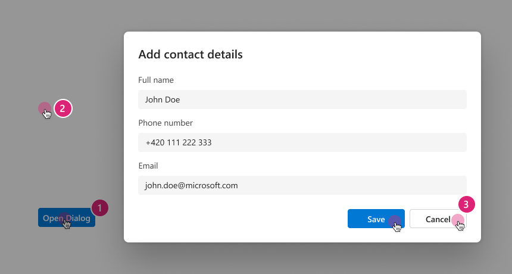
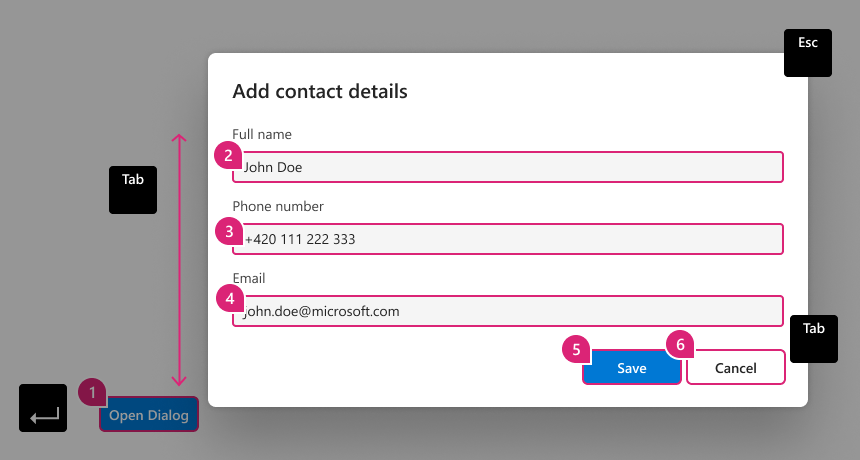
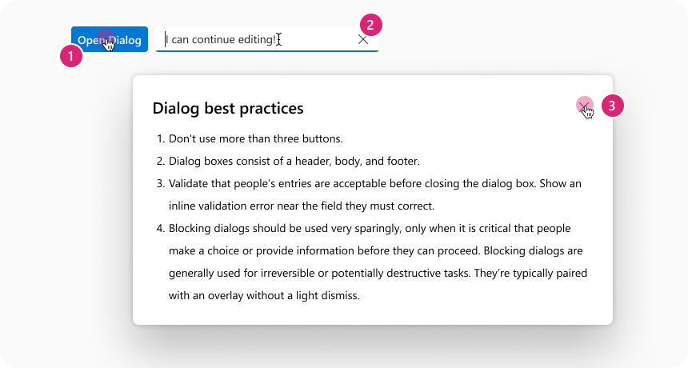
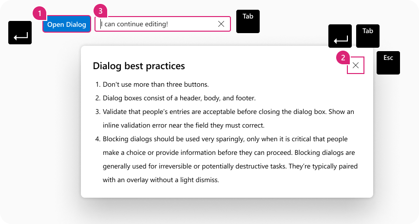
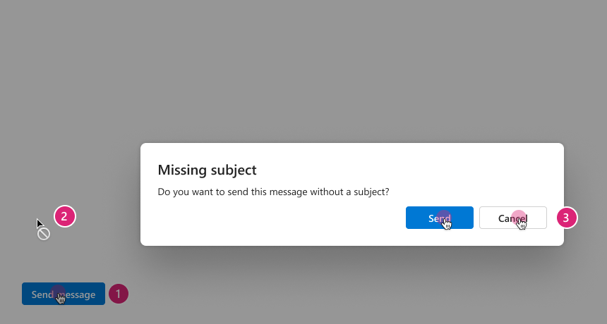
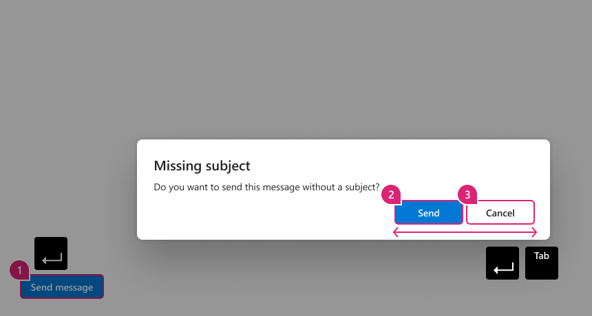

# Dialog

## Background

This spec defines the default function of a `Dialog` a window overlaid on either the primary window or another dialog window. Windows under a modal dialog are inert. That is, users cannot interact with content outside an active dialog window. Inert content outside an active dialog is typically visually obscured or dimmed so it is difficult to discern, and in some implementations, attempts to interact with the inert content cause the dialog to close.

The interactions that result in the opening/closing of the `Dialog` component should be configurable.

## Prior Art

- All mentions of v7 or v8 refer to Fabric - `@fluentui/react` ([docsite](https://developer.microsoft.com/en-us/fluentui#/))
- All mentions of v0 refer to Northstar - `@fluentui/react-northstar` ([docsite](https://fluentsite.z22.web.core.windows.net/))

- [Github epic](https://github.com/microsoft/fluentui/issues/20953)
- [Open UI Research](https://open-ui.org/components/dialog.research)
- Dialogs in 3rd party UI systems:
  - [Carbon](https://react.carbondesignsystem.com/?path=/docs/components-modal--default)
  - [Chakra UI](https://chakra-ui.com/docs/overlay/modal)
  - [FAST](https://explore.fast.design/components/fast-dialog)
  - [Material UI](https://mui.com/components/dialogs/)
  - [Radix](https://www.radix-ui.com/docs/primitives/components/dialog)
  - [Reach UI](https://reach.tech/dialog/)
  - [Reakit](https://reakit.io/docs/dialog/)
    - [Ariakit](https://github.com/reakit/reakit/tree/v2)
  - [Spectrum](https://react-spectrum.adobe.com/react-spectrum/Dialog.html)

### Comparison between v0 and v8

Note that the below code samples are not meant to be complete, but to highlight differences between the two libraries. Please refer to official docsites for actual API references.

#### v8

In v8 there are Dialog and Modal components which are relevant to the Dialog component for v9. The Dialog component was intended to be used primarily for confirming actions, whereas Modal component was intended to be used for lengthy content that may contain forms and other controls. This spec will only cover the comparison to the Dialog component.

The visibility of the dialog is controlled through the `hidden` prop whose its value should be a react state boolean provided from the consumer.

[Documentation for v8 Dialog](https://developer.microsoft.com/en-us/fluentui#/controls/web/dialog)

Sample code:

```jsx
  <DefaultButton secondaryText="Opens the Sample Dialog" onClick={toggleHideDialog} text="Open Dialog" />

  <Dialog
    hidden={hideDialog}
    onDismiss={toggleHideDialog}
    dialogContentProps={dialogContentProps}
    modalProps={modalProps}
  >
    <DialogFooter>
      <PrimaryButton onClick={toggleHideDialog} text="Send" />
      <DefaultButton onClick={toggleHideDialog} text="Don't send" />
    </DialogFooter>
  </Dialog>

```

#### v0

In v0, the Dialog component expects all the content through props, including the content, actions etc. The dialog component uses the `trigger` prop that expects a React component to control its visibility. The element passed to this prop will be rendered in-place where the dialog is defined.

[Documentation for v0 Dialog](https://fluentsite.z22.web.core.windows.net/components/dialog/definition)

```jsx
<Dialog
  cancelButton="Connect protocol"
  confirmButton="Transmit capacitor"
  content="Connect driver"
  header="Transmit capacitor"
  headerAction="Generate protocol"
  trigger={<Button content="A trigger" />}
/>
```

## API

The `Dialog` should implement a `children` based API as is one of the standards across all the surveyed alternatives as a part of Open UI research in [Prior Art](#prior-art). The component will leverage the use of `context` in the interaction and data flows of child compound components.

Sample usages will be give in the following section of this document [Sample code](#sample-code)

### Dialog

The root level component serves as an interface for interaction with all possible behaviors exposed. It provides context down the hierarchy to `children` compound components to allow functionality. This component expects to receive as children either a `DialogSurface` or a `DialogTrigger` and a `DialogSurface` (or some component that will eventually render one of those compound components) in this specific order

```tsx
type DialogSlots = {};

type DialogProps = ComponentProps<DialogSlots> & {
  /**
   * Dialog variations.
   *
   * `modal`: When this type of dialog is open, the rest of the page is dimmed out and cannot be interacted with. The tab sequence is kept within the dialog and moving the focus outside the dialog will imply closing it. This is the default type of the component.
   *
   * `non-modal`: When a non-modal dialog is open, the rest of the page is not dimmed out and users can interact with the rest of the page. This also implies that the tab focus can move outside the dialog when it reaches the last focusable element.
   *
   * `alert`: is a special type of modal dialogs that interrupts the user's workflow to communicate an important message or ask for a decision. Unlike a typical modal dialog, the user must take an action through the options given to dismiss the dialog, and it cannot be dismissed through the dimmed background or escape key.
   *
   * @default 'modal'
   */
  modalType?: 'modal' | 'non-modal' | 'alert';
  /**
   * Controls the open state of the dialog
   * @default undefined
   */
  open?: boolean;
  /**
   * Default value for the uncontrolled open state of the dialog.
   * @default false
   */
  defaultOpen?: boolean;
  /**
   * Callback fired when the component changes value from open state.
   * @default undefined
   */
  onOpenChange?(event: MouseEvent | KeyboardEvent, data: DialogOpenChangeData): void;
};

type DialogOpenChangeData = {
  /**
   * The event source of the callback invocation
   */
  type: 'escapeKeyDown' | 'backdropClick' | 'triggerClick';
  /**
   * The next value for the internal state of the dialog
   */
  open: boolean;
};
```

### DialogTrigger

A non-visual component that wraps its child and configures them to be the trigger that will open or close a `Dialog`. This component should only accept one child.

In case the trigger is used outside `Dialog` component it'll still provide basic [ARIA related attributes](#aria-roles-and-states) to it's wrapped child, but it won't be able to alter the dialog `open` state anymore, in that case the user must provide a [`controlled state`](#controlled-dialog)

```typescript
export type DialogTriggerProps = {
  /**
   * Explicitly declare if the trigger is responsible for opening or
   * closing a Dialog visibility state.
   * @default 'open' // if it's outside DialogSurface
   * @default 'close' // if it's inside DialogSurface
   */
  action?: 'open' | 'close';
  /**
   * Explicitly require single child or render function
   * to inject properties
   */
  children: (React.ReactElement & { ref?: React.Ref<unknown> }) | (() => React.ReactElement | null);
};
```

### DialogSurface

The `DialogSurface` component represents the visual part of a `Dialog` as a whole, it contains everything that should be visible.

```tsx
type DialogSurfaceSlots = {
  /**
   * Dimmed background of dialog.
   * The default backdrop is rendered as a `<div>` with styling.
   * This slot expects a `<div>` element which will replace the default backdrop.
   * The backdrop should have `aria-hidden="true"`.
   *
   * By default if `DialogSurface` is `<dialog>` element the backdrop is ignored,
   * since native `<dialog>` element supports [::backdrop](https://developer.mozilla.org/en-US/docs/Web/CSS/::backdrop)
   */
  backdrop?: Slot<'div'>;
  root: NonNullable<Slot<'dialog', 'div'>>;
};

type DialogTitleProps = ComponentProps<DialogSurfaceSlots>;
```

### DialogTitle

The `DialogTitle` component expects to have a title/header and when `Dialog` is `non-modal` a close (X icon) button is provided through `action` slot by default.

```tsx
type DialogTitleSlots = {
  /**
   * By default this is a div, but can be a heading.
   */
  root: Slot<'div', 'h1' | 'h2' | 'h3' | 'h4' | 'h5' | 'h6'>;
  /**
   * By default a Dialog with modalType='non-modal' will have a close button action
   */
  action?: Slot<'div'>;
};

type DialogTitleProps = ComponentProps<DialogTitleSlots>;
```

### DialogBody

The `DialogBody` is a container where the content of the dialog is rendered. Apart from styling, this component does not have other behavior.

```tsx
type DialogBodySlots = {
  root: Slot<'div'>;
};

type DialogBodyProps = ComponentProps<DialogBodySlots>;
```

### DialogActions

`DialogActions` is a container for the actions of the dialog. Apart from styling, this component does not have other behavior.

```tsx
type DialogActionsSlots = {
  root: Slot<'div'>;
};

type DialogActionsProps = ComponentProps<DialogActionsSlots>;
```

## Sample Code

The below samples do not represent the definitive props of the final implemented component, but represent the ideal final implementations. Can be subject to change during the implementation phase.

### Basic Dialog

```tsx
const dialog = <Dialog>
  <DialogTrigger>
    <Button>Open Dialog</Button>
  <DialogTrigger>
  <DialogSurface>
    This is as basic as it gets.
  </DialogSurface>
</Dialog>
```

```html
<!-- expected DOM output  -->
<button aria-haspopup="true" class="fui-button">Open Dialog</button>
<!-- ... portal ... -->
<div aria-hidden="true" class="fui-dialog-backdrop"></div>
<div aria-modal="true" role="dialog" class="fui-dialog-content">This is as basic as it gets</div>
```

### Alert Dialog

An alert dialog is a modal dialog that interrupts the user's workflow to communicate an important message and acquire a response. Examples include action confirmation prompts and error message confirmations. The alertdialog role enables assistive technologies and browsers to distinguish alert dialogs from other dialogs so they have the option of giving alert dialogs special treatment, such as playing a system alert sound.

```tsx
const dialog = <Dialog type="alert">
  <DialogTrigger>
    <Button>Open Dialog</Button>
  <DialogTrigger>
  <DialogSurface>
    <DialogTitle>
        This is an alert
    </DialogTitle>
    <DialogBody>
      This is going to be inside the dialog
    </DialogBody>
    <DialogActions>
      <DialogTrigger type="close">
        <Button>Close</Button>
      </DialogTrigger>
      <Button>Action</Button>
    </DialogActions>
  </DialogSurface>
</Dialog>
```

```html
<button aria-haspopup="true" class="fui-button">Open Dialog</button>
<!-- ... portal ... -->
<div aria-hidden="true" class="fui-dialog-backdrop"></div>
<div
  aria-describedby="fui-dialog-body-id"
  aria-labelledby="fui-dialog-title-id"
  aria-modal="true"
  role="alertdialog"
  class="fui-dialog-content"
>
  <div id="fui-dialog-title-id" class="fui-dialog-title">
    <span>Title</span>
    <!-- action -->
  </div>
  <div id="fui-dialog-body-id" class="fui-dialog-body">This is going to be inside the dialog</div>
  <div class="fui-dialog-actions">
    <button class="fui-button">Close</button>
    <button class="fui-button">Action</button>
  </div>
</div>
<!-- ... portal ... -->
```

### Controlled Dialog

```tsx
const CustomDialog = () => {
  const [isOpen, setIsOpen] = React.useState(false);
  const handleOpenChange = (ev, { open }) => setIsOpen(open);
  const handleOpen = () => setIsOpen(true);
  return (
    <>
      {/*
        the trigger component is still useful outside of the Dialog,
        to provide ARIA attributes, but it will no longer speak with the dialog.
        A controlled state is required in this case
      */}
      <DialogTrigger>
        <Button onClick={handleOpen}>Button outside Dialog Context</Button>
      </DialogTrigger>
      <Dialog open={isOpen} onOpenChange={handleOpenChange}>
        <DialogSurface>
          <DialogTitle>This is an alert</DialogTitle>
          <DialogBody>This is going to be inside the dialog</DialogBody>
          <DialogActions>
            {/*
              In this case the trigger can be used to request close through `onOpenChange`,
              as it's inside Dialog context
            */}
            <DialogTrigger type="close">
              <Button>Close</Button>
            </DialogTrigger>
            <Button>Action</Button>
          </DialogActions>
        </DialogSurface>
      </Dialog>
    </>
  );
};
```

```html
<button aria-haspopup="true" class="fui-button">Open Dialog</button>
<!-- ... portal ... -->
<div aria-hidden="true" class="fui-dialog-backdrop"></div>
<div
  aria-describedby="fui-dialog-body-id"
  aria-labelledby="fui-dialog-title-id"
  aria-modal="true"
  role="dialog"
  class="fui-dialog-content"
>
  <div id="fui-dialog-title-id" class="fui-dialog-title">
    <span>Title</span>
    <!-- action -->
  </div>
  <div id="fui-dialog-body-id" class="fui-dialog-body">This is going to be inside the dialog</div>
  <div class="fui-dialog-actions">
    <button class="fui-button">Close</button>
    <button class="fui-button">Action</button>
  </div>
</div>
<!-- ... portal ... -->
```

### Async Input submission dialog

```tsx
function AsyncConfirmDialog() {
  const [input, setInput] = useState('');
  const [state, sendInput] = useSendInput();
  const [isOpen, setIsOpen] = useState(false);
  const handleInputChange = ev => {
    setInput(ev.target.value.trim());
  };
  const handleOpenChange = (ev, { open }) => {
    setIsOpen(open);
    setInput(''); // clean up on cancel/close
  };
  const handleSubmit = async ev => {
    ev.preventDefault();
    await sendInput(input); // sending data on confirm
    setIsOpen(false);
  };
  return (
    <>
      <Dialog open={isOpen} onOpenChange={handleOpenChange}>
        <DialogTrigger>
          <Button>Open Dialog</Button>
        </DialogTrigger>
        <DialogSurface>
          <DialogTitle>This is a dialog</DialogTitle>
          <DialogBody>
            <form id="form-id" onSubmit={handleSubmit}>
              <Input required placeholder="Some input..." value={input} onChange={handleInputChange} />
            </form>
          </DialogBody>
          <DialogActions>
            <DialogTrigger type="close">
              <Button>Close</Button>
            </DialogTrigger>
            <Button disabled={input === ''} form="form-id" type="submit">
              {state === 'idle' && 'Submit'}
              {state === 'submitting' && 'Submitting...'}
            </Button>
          </DialogActions>
        </DialogSurface>
      </Dialog>
    </>
  );
}
```

### Opting out of native `<dialog>`

```tsx
const dialog = <Dialog>
  <DialogTrigger>
    <Button>Open Dialog</Button>
  <DialogTrigger>
  <DialogSurface as="div">
    This is as basic as it gets.
  </DialogSurface>
</Dialog>
```

```html
<!-- expected DOM output  -->
<button aria-haspopup="true" class="fui-button">Open Dialog</button>
<!-- ... portal ... -->
<div aria-hidden="true" class="fui-dialog-backdrop"></div>
<div aria-modal="true" role="dialog" class="fui-dialog-content">This is as basic as it gets</div>
```

## Migration

_TBA: Link to migration guide doc_

## Behaviors

Dialog will use **Tabster** to handle the keyboard navigation and ensure focus trapping.

The below references were used to decide appropriate keyboard interaction from an a11y perspective.

- https://www.w3.org/WAI/ARIA/apg/patterns/dialogmodal/
- https://www.w3.org/WAI/ARIA/apg/example-index/dialog-modal/dialog.html
- https://www.w3.org/WAI/ARIA/apg/example-index/dialog-modal/alertdialog.html

### Modal

#### Mouse & Touch



1. Clicking on the trigger (element / button component) a Dialog is displayed with a dimmed background.
2. Clicking on the dimmed background dismisses the dialog.
3. The dialog can be dismissed also when confirmation button is clicked (footer).

#### Keyboard



1. **(1)** TabKey to set focus on Trigger, use EnterKey to open.
2. **(2-6)** Focus is moved to the first focusable control inside the dialog.
3. **(5-6)** After the dialog is dismissed, keyboard focus should be moved back to where it was before it moved into the dialog. Otherwise the focus can be dropped to the beginning of the page. Or if the item is no longer available it can be moved to the next logical location in that region i.e. next / previous item.
4. **TabKey** Moves focus to next focusable element inside the dialog. When focus is on the last focusable element in the dialog, moves focus to the next focusable action in the browser window.
5. **Shift+Tab** Moves focus to previous focusable element inside the dialog. When focus is on the first focusable element in the dialog, moves focus to the last focusable action within the browser window.
6. **EscKey** Closes the dialog, returning focus to the trigger, in case the trigger is gone or not possible to focus, the use might require to setup focus manually.

### Non-Modal

#### Mouse & touch



1. Clicking on the trigger (element / button component) a Dialog is displayed without a dimmed background.
2. A user can continue to interact with elements on the page behind the dialog.
3. Clicking the dismiss button (X icon in header), or cancel/dismiss buttons (footer) will close the dialog.

#### Keyboard



1. **(1)** **TabKey** to set focus on Trigger, use **EnterKey** to open.
2. - **(2a)** Focus is moved to the default focusable control inside the dialog.
   - **(2b)** **EnterKey** on dismiss action to close dialog,
3. After the dialog is dismissed, keyboard focus should be moved back to where it was before it moved into the dialog. Otherwise the focus can be dropped to the beginning of the page.
4. **TabKey** Moves focus to next focusable element inside the dialog, once you get to the end of the focusable items within the dialog focus moves to next actionable item outside of the dialog container.
5. **Shift+Tab** Moves focus to previous focusable element inside the dialog and back to the trigger control.
6. **EscKey** Closes the dialog when the focus is on the dialog.

### Alert dialog

#### Mouse & Touch



1. Clicking on the trigger (element / button component) a Dialog is displayed with a dimmed background.
2. Windows under the dialog are are inert, their scrolling is blocked and clicking on the dimmed background will not close the dialog.
3. Clicking the dismiss button (X icon in header), or cancel/dismiss buttons (footer) will dismiss the dialog.

#### Keyboard



1. **(1)** **TabKey** to set focus on Trigger, use **EnterKey** to open.
2. **(2 & 3)** Focus is automatically set to the first focusable element inside the dialog
3. **EnterKey** Confirms or cancels the alert message and dialog is dismissed.
4. **TabKey** Moves focus to next focusable element inside the dialog. When focus is on the last focusable element in the dialog, moves focus to the next focusable action in the browser window.
5. **Shift+Tab** Moves focus to previous focusable element inside the dialog. When focus is on the first focusable element in the dialog, moves focus to the last focusable action within the browser window.

## Accessibility

> ⚠️ _Note: All other accessibility information, not covered in this section, is provided throughout the spec._

The dialog component follows the [Dialog WAI-Aria design pattern](https://www.w3.org/WAI/ARIA/apg/patterns/dialogmodal/).

### Aria roles and states

#### Modal

- Trigger button
  - [`aria-haspopup="dialog"`](https://w3c.github.io/aria/#aria-haspopup)
- Dialog
  - [`role="dialog"`](https://w3c.github.io/aria/#dialog)
  - [`aria-modal=true`](https://w3c.github.io/aria/#aria-modal)
  - [`aria-labelledby={dialog-title-idref}`](https://w3c.github.io/aria/#aria-labelledby)
  - [`aria-describedby={dialog-body-idref}`](https://w3c.github.io/aria/#aria-describedby)

#### Non-modal

- Trigger button
  - [`aria-haspopup="dialog"`](https://w3c.github.io/aria/#aria-haspopup)
- Dialog
  - [`role="dialog"`](https://w3c.github.io/aria/#dialog)
  - [`aria-modal=false`](https://w3c.github.io/aria/#aria-modal)
  - [`aria-labelledby={dialog-title-idref}`](https://w3c.github.io/aria/#aria-labelledby)
  - [`aria-describedby={dialog-body-idref}`](https://w3c.github.io/aria/#aria-describedby)

#### Alert dialog

- Trigger button
  - [`aria-haspopup="dialog"`](https://w3c.github.io/aria/#aria-haspopup)
- Dialog
  - [`role="alertdialog"`](https://w3c.github.io/aria/#dialog)
  - [`aria-modal=true`](https://w3c.github.io/aria/#aria-modal)
  - [`aria-labelledby={dialog-title-idref}`](https://w3c.github.io/aria/#aria-labelledby)
  - [`aria-describedby={dialog-body-idref}`](https://w3c.github.io/aria/#aria-describedby)
