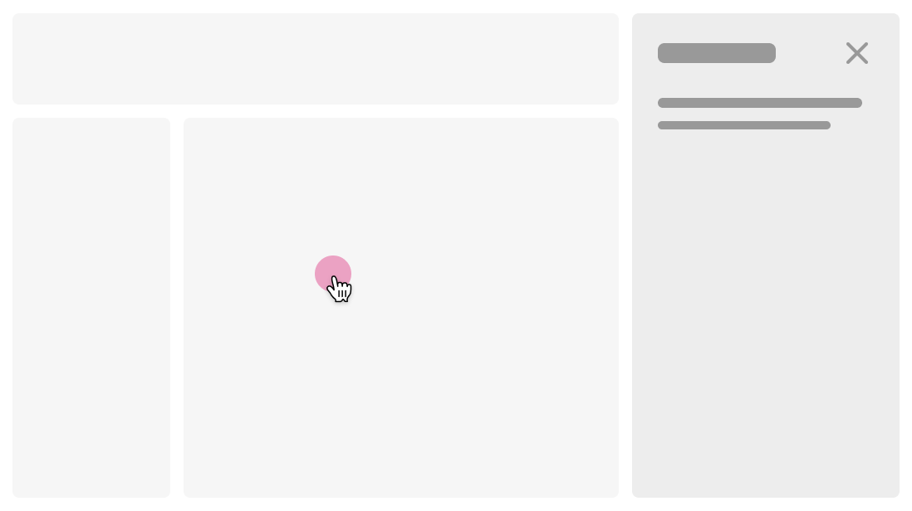
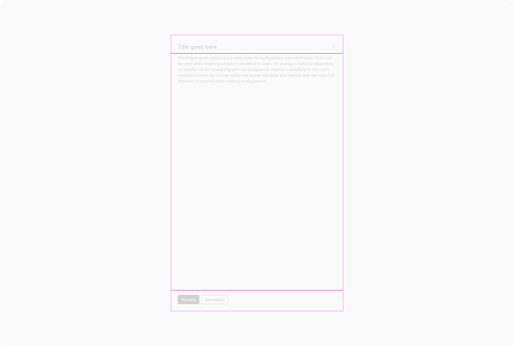
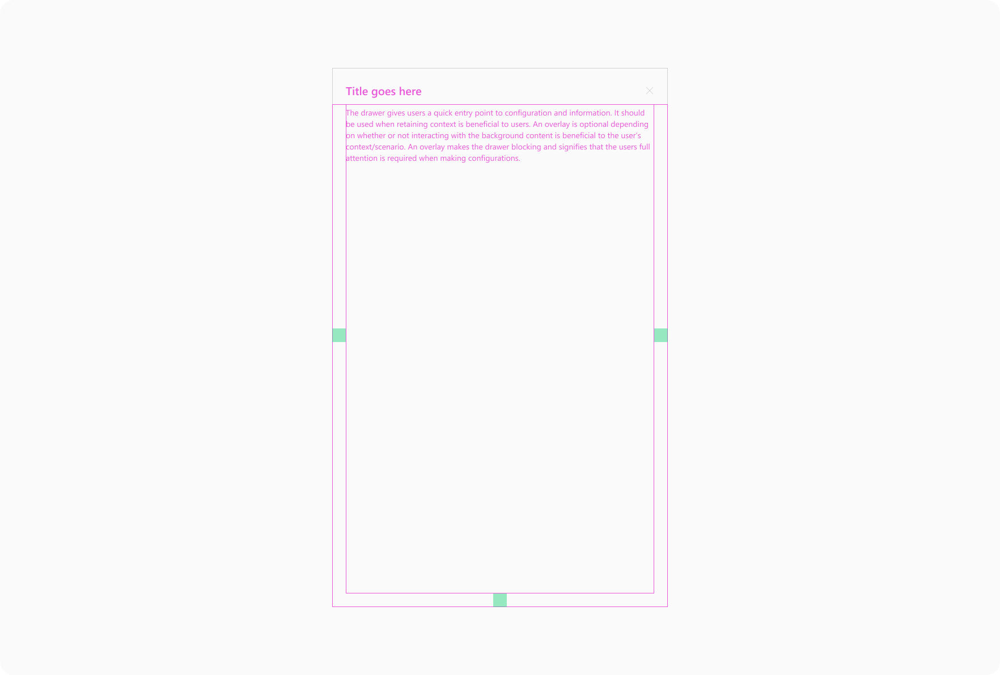
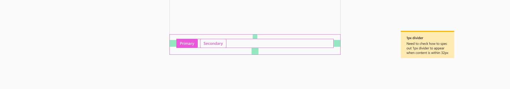
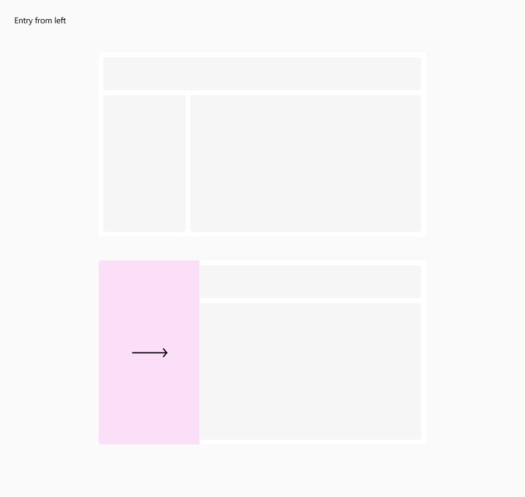
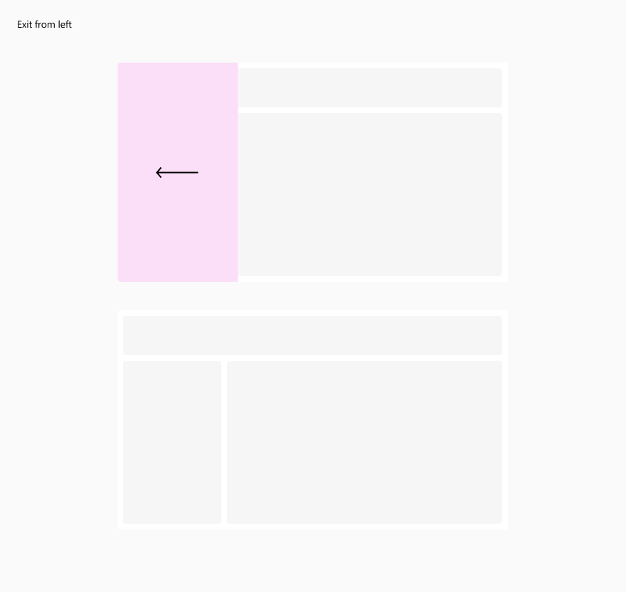
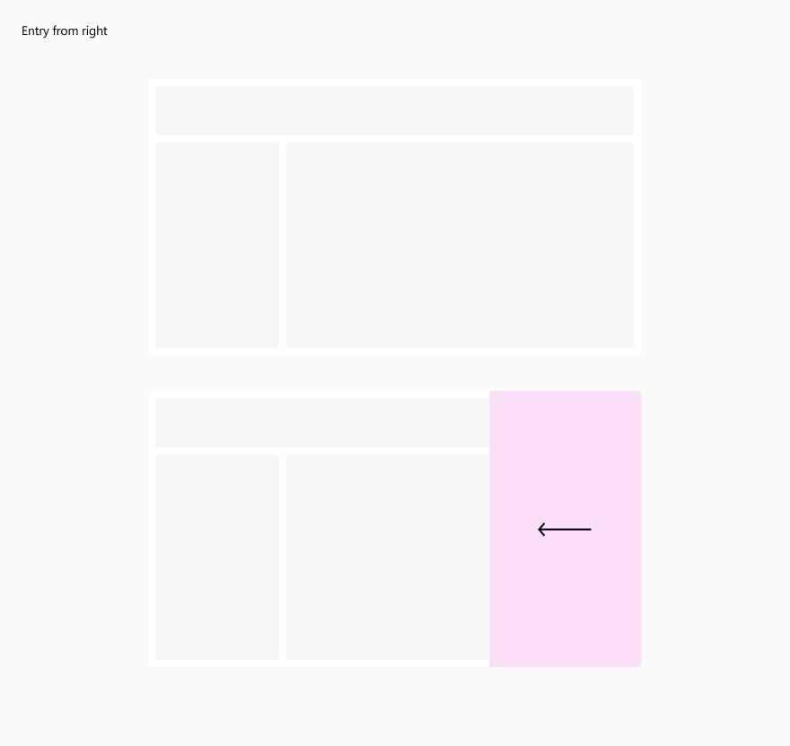
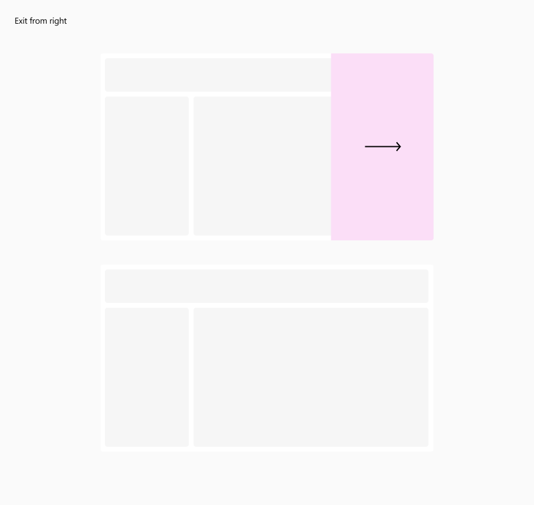

# @fluentui/react-drawer Spec

## Background

A Drawer's main function is to contain supplementary content and are used for complex creation, edit, or management experiences. For example, viewing details about an item in a list or editing settings. It is also useful to host navigational elements that can be visible at all times.

The Drawer don't have any content built in, but has mechanisms to display it in a structured way.

## Prior Art

- [Convergence Epic](https://github.com/microsoft/fluentui/issues/26420)

### Fabric (v8)

The [Panel component](https://developer.microsoft.com/en-us/fluentui#/controls/web/panel) on v8's version is very similar to what Drawer component is structured. It has an opinionated way to provide content, like header text and a close button.

```tsx
<Panel headerText="Sample panel" isOpen={isOpen} onDismiss={dismissPanel} closeButtonAriaLabel="Close">
  <p>Content goes here.</p>
</Panel>
```

### Northstar (v0)

There is not prior implementation for this component in v0

### 3rd party Design Systems

- [Chakra UI](https://chakra-ui.com/docs/components/drawer)
- Material Design
  - [Official implementation](https://github.com/material-components/material-components-web-react/tree/master)
  - [Material UI](https://mui.com/material-ui/react-drawer/)
- [Radix UI](https://design-system.modulz-deploys.com/#sheet)
  - [Sheet component](https://github.com/radix-ui/design-system/blob/master/components/Sheet.tsx)
- [React Suite](https://rsuitejs.com/components/drawer/)
- [Ant Design](https://ant.design/components/drawer)

## Sample Code

```tsx
<Drawer open={open} onOpenChange={(_, { open }) => setOpen(open)}>
  <p>Content goes here.</p>
</Drawer>
```

## Variants

### Type

`overlay`:
Opens on top of everything like a dialog and blocks all the page content. Can be dismissed.


`inline`:
Push the siblings content when open and it is non-blocking. Can be hidden to bring focus to the main content of the page.


### Size

- `small` (default): 320px
- `medium`: 592px
- `large`: 940px
- `full`: 100vw
- `custom`: Can be freely customized by providing a number. It cannot be extended beyond screen limits. If the size is larger than the screen size, it'll act as a `full` Drawer.

### Modal

By default, the `overlay` acts as a modal, rendering an overlay scrim behind the drawer surface. This can be toggled off. \*

<small>\* This prop DO NOT affect `inline` Drawers in any way.</small>

## API

### Drawer

| Property     | Values                                     | Default   | Description                                             |
| ------------ | ------------------------------------------ | --------- | ------------------------------------------------------- |
| type         | `overlay`, `inline`                        | `overlay` | Set the [type](#type) of Drawer                         |
| position     | `left`, `right`                            | `left`    | Set the position of the Drawer                          |
| size         | `small`, `medium`, `large`, `full`, number | `small`   | The drawer width [size](#size)                          |
| modal        | boolean                                    | `true`    | Set the visibility of the `overlay` scrim               |
| open         | boolean                                    | `false`   | Define the Drawer visibility                            |
| defaultOpen  | boolean                                    | `false`   | Define the Drawer visibility on first render            |
| onOpenChange | function                                   | undefined | Callback called when drawer changes its visibility      |
| separator    | boolean                                    | `false`   | Define if the `inline` drawer should render a separator |

| Slots         | Values          | Default         | Description                                       |
| ------------- | --------------- | --------------- | ------------------------------------------------- |
| root          | `div`           | `div`           | The root drawer element                           |
| dialog        | `Dialog`        | `Dialog`        | The dialog element for the `overlay` type         |
| dialogSurface | `DialogSurface` | `DialogSurface` | The dialog surface element for the `overlay` type |

### DrawerHeader

| Slots      | Values   | Default  | Description                                              |
| ---------- | -------- | -------- | -------------------------------------------------------- |
| root       | `header` | `header` | The root drawer element                                  |
| title      | `div`    | `div`    | The drawer title                                         |
| navigation | `div`    | `div`    | The drawer top navigation                                |
| actions    | `div`    | `div`    | The drawer actions to be rendered side-by-side the title |

- [DrawerHeader types](../src/components/DrawerHeader/DrawerHeader.types.ts)

### DrawerContent

No props

| Slots | Values | Default | Description                     |
| ----- | ------ | ------- | ------------------------------- |
| root  | `div`  | `div`   | The root drawer content element |

- [DrawerContent types](../src/components/DrawerContent/DrawerContent.types.ts)

### DrawerFooter

No props

| Slots | Values   | Default  | Description                    |
| ----- | -------- | -------- | ------------------------------ |
| root  | `footer` | `footer` | The root drawer footer element |

- [DrawerFooter types](../src/components/DrawerFooter/DrawerFooter.types.ts)

## Structure

### Components

| Component     | Purpose                                                                                                                |
| ------------- | ---------------------------------------------------------------------------------------------------------------------- |
| Drawer        | Renders a plain Drawer and render its children                                                                         |
| DrawerHeader  | Renders a `header` in a structured way. Ideal to display title and actions                                             |
| DrawerContent | Renders a scrollable `div` that holds the drawer main content                                                          |
| DrawerFooter  | Renders a `footer` element that holds the drawer main actions. Often used to have buttons such as confirmation actions |

#### Drawer component



- `overlay` type:

```html
<div class="fui-Drawer" tabindex="-1" role="dialog" aria-modal="true" aria-labelledby="the-title-element-id">
  <!-- Content rendered here -->
</div>
```

- `inline` type:

```html
<div class="fui-Drawer" tabindex="-1" aria-labelledby="the-title-element-id">
  <!-- Content rendered here -->
</div>
```

#### DrawerHeader component


```html
<header class="fui-DrawerHeader" tabindex="-1" aria-labelledby="the-title-element-id">
  <!-- The title content is free, but ideally this should be a heading element -->
  <div class="fui-DrawerHeader__title" id="the-title-element-id">Title goes here</div>

  <div class="fui-DrawerHeader__actions">
    <button type="button" aria-label="Close drawer panel">
      <!-- Close button content -->
    </button>
  <div>
</header>
```


```html
<header tabindex="-1" aria-labelledby="the-title-element-id">
  <nav class="fui-DrawerHeader__navigation">
    <button type="button" aria-label="Return back to content">
      <!-- Back button content -->
    </button>

    <button type="button" aria-label="Refresh content">
      <!-- Refresh button content -->
    </button>

    <button type="button" aria-label="Open settings">
      <!-- Settings button content -->
    </button>

    <button type="button" aria-label="Close drawer panel">
      <!-- Close button content -->
    </button>
  </nav>

  <!-- The title content is free, but ideally this should be a heading element -->
  <div class="fui-DrawerHeader__title" id="the-title-element-id">Title goes here</div>
</header>
```

#### DrawerContent component



```html
<div class="fui-DrawerContent">
  <!-- Content rendered here -->
</div>
```

#### DrawerFooter component



```html
<footer class="fui-DrawerFooter">
  <button type="button">Primary</button>
  <button type="button">Secondary</button>
</footer>
```

## Behaviors

### `Drawer`

A drawer can be triggered by any button on the screen. When invoked, it slides in from either the left or right side of the screen. How they will behave depends from its `type`:

#### `overlay`

The drawer overlays on top of the main surface. In case the overlay is a modal (by default), it renders an overlay scrim that blocks the whole screen.
All the mouse, touch, keyboard and screen readers behaviors will follow the same specs as the [Dialog component](https://github.com/microsoft/fluentui/blob/master/packages/react-components/react-dialog/docs/Spec.md#behaviors).

#### `inline`

The drawer pushes content on the main surface to the side to fit. It renders as a `div` element wherever its placed in the DOM order.






## Accessibility

Drawer uses the Dialog under the hood and all accessibility implementation, concerns and recommendations are described in the [Dialog component](https://github.com/microsoft/fluentui/blob/master/packages/react-components/react-dialog/docs/Spec.md#behaviors) spec.
