# Priority Overflow Engine Spec

This document is the working specification for the `@fluentui/priority-overflow` engine that sits underneath `@fluentui/react-overflow`.

It is intentionally focused on the engine itself: queues, measurement, lifecycle, invariants, and browser cost.

## Scope

- Engine package: `packages/react-components/priority-overflow/src/`
- Main engine entry point: `createOverflowManager()`

For the React integration layer, see `docs/react-overflow-react-bridge.md`.

For open design directions, refactor ideas, and unresolved questions, see `docs/overflow-northstar.md`.

## One-sentence model

The engine keeps two priority queues of item ids, measures the observed container and registered elements, then repeatedly moves items between the visible and invisible queues until occupied size fits within available size while publishing a canonical snapshot and optional callbacks.

## Core concepts

### Overflow item

An overflow item is a registered DOM element with:

- `id`: stable identity
- `priority`: lower priority hides earlier
- `pinned`: never overflow
- `groupId`: optional grouping key

### Overflow menu

An optional DOM element whose size is only counted when at least one item is hidden, or when `hasHiddenItems` is true. This lets the engine reserve room for a "more" button.

### Divider

An optional group-owned element whose visibility follows the group. Dividers are counted in occupied size only when the group is at least partially visible.

### Visible and invisible queues

The engine stores ids in two heaps:

- `visibleItemQueue`: the next candidate to hide is at the top
- `invisibleItemQueue`: the next candidate to show is at the top

The comparator uses three rules:

1. Pinned items rank above non-pinned items.
2. Higher `priority` ranks above lower `priority`.
3. Ties are broken by DOM order using `compareDocumentPosition`, with `overflowDirection` deciding whether the start or end of the container hides first.

## Flow overview

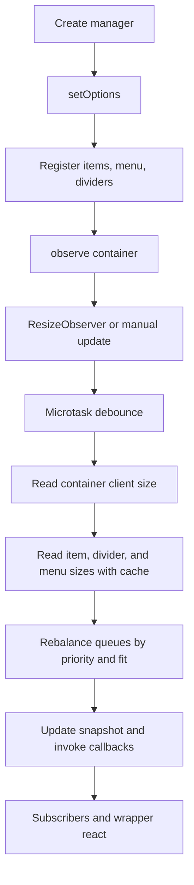

## Lifecycle

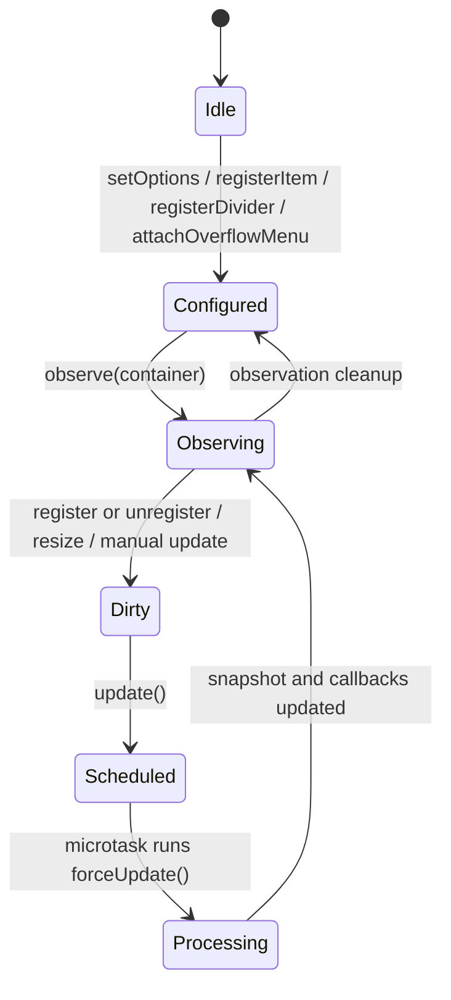

## Detailed lifecycle

### 1. Construction

`createOverflowManager()` allocates:

- the visible and invisible priority queues
- a per-pass size cache `Map<HTMLElement, number>`
- item and divider registries
- a group manager for `visible | hidden | overflow`
- mutable options and container references

At this point, nothing is observed and no DOM reads happen.

### 2. Configuration

`setOptions(options)` mutates the live options object independently from observation.

That means configuration and attachment are separate concerns:

- options can change without recreating observation
- callback handlers can be replaced incrementally
- observation does not implicitly own all other runtime relationships

The engine still keeps `onUpdateOverflow` and `onUpdateItemVisibility` in its options object, but they are no longer the only readable output channel because the manager also maintains a canonical `OverflowSnapshot`.

### 3. Runtime connections

The manager uses paired setup and cleanup boundaries for its runtime relationships.

`observe(container)`:

- stores the container reference
- reconnects the `ResizeObserver`
- enqueues any already-known items that are not yet in either queue
- schedules an update
- returns a cleanup function that detaches observation and resets the current snapshot to empty

`registerItem(item)`:

- inserts the item into the registry
- updates group membership when `groupId` exists
- enqueues the item immediately if observation is already active
- schedules an update
- returns a cleanup function that removes the item from queues and registries

`attachOverflowMenu(element)`:

- stores the overflow menu reference
- schedules an update
- returns a cleanup function that detaches that same menu element

`registerDivider(divider)`:

- stores the divider by `groupId`
- sets the divider's group attribute
- returns a cleanup function that removes the divider registration

Important: the engine still exposes `removeItem()` as a lower-level removal helper, but the preferred lifecycle model is the cleanup returned from `registerItem()`.

### 4. Update scheduling

`update()` is microtask-debounced in production. Multiple resize and registration events in the same tick collapse into one `forceUpdate()` run.

That means the lifecycle is usually:

1. DOM changes happen
2. `ResizeObserver` fires or code calls `update()`
3. a microtask is queued
4. the queued task performs one rebalance pass

### 5. Processing pass

`forceUpdate()` calls `processOverflowItems()`.

The algorithm:

1. Clears the size cache.
2. Reads available size as `container.clientWidth` or `clientHeight` minus `padding`.
3. Repairs priority ordering if the best hidden item outranks the worst visible item.
4. Runs two show/hide rounds to stabilize the state.
5. Rebuilds the canonical snapshot and notifies listeners when queue tops changed, or when `forceDispatch` was set.

The two-round design matters when a new item is added as visible by default and the first pass has not yet settled into the best visible/invisible split.

## Rebalance algorithm

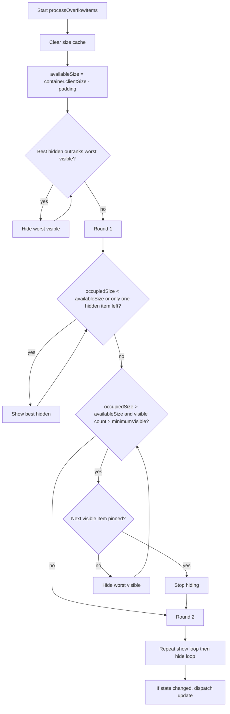

## Occupied size model

`occupiedSize()` computes:

- sum of `offsetWidth` or `offsetHeight` for all visible items
- plus visible dividers for visible or partially visible groups
- plus overflow menu size when any item is hidden, or when `hasHiddenItems` is true

This is the central fit function:

$$
occupied = \sum visibleItems size(item) + \sum activeDividers size(divider) + overflowMenuSize
$$

and the container is considered stable when:

$$
occupied \le availableSize
$$

## Group lifecycle

Grouping is a thin state machine layered on top of the base queue model.

Each group tracks two sets:

- `visibleItemIds`
- `invisibleItemIds`

Its visibility state is:

- `visible`: at least one visible item and no hidden items
- `hidden`: no visible items
- `overflow`: both visible and hidden items exist

Divider behavior is tied to the last visible item in a group:

- when hiding the last visible item, the divider gets `data-overflowing`
- when showing the first visible item again, the divider becomes visible again

## Pinning model

Pinning is not a separate algorithm. It is a comparator rule plus a stop condition:

- pinned items compare above all non-pinned items
- if the next candidate to hide is pinned, the hide loop stops

So pinning affects queue ordering but does not add new passes or new DOM reads.

## Browser pipeline cost model

The engine does work in three layers:

### 1. JavaScript / scheduler cost

This includes:

- queue enqueue, dequeue, peek, remove
- set and map updates for groups and size cache
- DOM attribute writes for visibility markers
- callback dispatch

This is the predictable, CPU-bound part.

### 2. Layout-related cost

This comes from reading:

- `container.clientWidth` or `clientHeight`
- item `offsetWidth` or `offsetHeight`
- divider size
- overflow menu size

These properties can force layout if the DOM or styles are dirty at the time of the read.

Important nuance: when the update was triggered by `ResizeObserver`, the browser has already performed layout for the size change that caused the observer callback. In that path, many reads are likely to hit already-computed geometry. When updates are triggered directly after DOM writes, reads are more likely to force a synchronous layout.

### 3. Style, paint, and composite cost

The engine itself mostly writes attributes such as `data-overflowing`. In the React wrapper, those attributes map to `display: none` for overflowing items.

That means the engine can cause:

- style recalculation because selectors depend on attributes
- layout because `display: none` changes box participation
- paint because visible content changed
- sometimes compositing updates, depending on the surrounding page

There is no animation or transform-based hiding in the base model, so hiding an item is usually a layout-affecting change, not a compositor-only change.

## Complexity summary

Let:

- `n` = number of items
- `g` = number of groups with dividers
- `k` = number of items that change visibility in one pass

### Heap operations

- `enqueue` and `dequeue`: $O(\log n)$
- `peek`: $O(1)$
- `remove`: $O(n)$ because it uses `indexOf` before heapify

### Per-pass size computation

`occupiedSize()` walks:

- all currently visible items
- all groups to decide visible divider contribution

So each `occupiedSize()` call is $O(v + g)$ where `v` is the visible item count, worst-case $O(n + g)$.

### Full rebalance pass

The show/hide loops can call `occupiedSize()` many times. In the worst case, if many items toggle during one pass, total JS work trends toward quadratic behavior because the algorithm repeatedly recomputes aggregate occupied size from scratch.

Conservative worst-case bound for a large rebalance:

$$
O(k \cdot (n + g) + k \log n)
$$

and when `k \approx n`, that behaves like roughly $O(n^2)$ JS work for the pass.

This is the most important cost characteristic of the base model.

## Feature cost breakdown

### Base model cost

The base model includes:

- two heaps
- size cache clearing per pass
- repeated aggregate size computation
- queue moves and callback dispatch

This is where nearly all algorithmic cost lives.

### Grouping cost

Grouping adds:

- one extra map lookup per item move
- one or two `Set` mutations per moved item
- group visibility recomputation for that group, which is $O(1)$
- divider visibility attribute writes
- divider contribution in `occupiedSize()`, which adds an $O(g)$ scan over groups

Impact assessment:

- JS overhead per moved item: low
- additional DOM reads: only divider size when divider is active
- aggregate pass overhead: moderate when `g` is large because every `occupiedSize()` call scans groups

### Pinning cost

Pinning adds:

- one boolean branch inside item comparison
- one boolean guard in the hide loop

Impact assessment:

- JS overhead: negligible
- DOM overhead: none directly
- practical effect: can reduce work if many items become unhideable early, but can also leave the layout in an overflowed state if pinned items consume too much space

### Overflow menu cost

The menu adds:

- one more measured element when overflow exists
- one threshold effect: showing the last hidden item may remove the menu itself, so the algorithm intentionally attempts to reveal the last hidden item even if it might initially appear not to fit

Impact assessment:

- JS overhead: low
- layout sensitivity: moderate because the menu size changes the equilibrium point

### Minimum visible cost

`minimumVisible` only adds a numeric stop condition in the hide loop.

Impact assessment:

- JS overhead: negligible
- DOM overhead: none directly
- functional effect: may allow the container to remain overflowed if the minimum is too high to satisfy the physical space available

## When does it force layout?

High-risk cases for synchronous layout:

- add or remove many items, then call `update()` in the same tick
- mutate styles or classes affecting widths before the microtask runs
- read overflow state and then synchronously mutate layout again in response

Lower-risk cases:

- pure container resizes observed through `ResizeObserver`
- repeated measurements in the same pass, because `sizeCache` prevents duplicate width and height reads for the same element

## Why the size cache helps

Without the size cache, `occupiedSize()` would re-read the same geometry repeatedly during one rebalance pass. Since the loops can call `occupiedSize()` several times, repeated `offsetWidth` and `clientWidth` reads would inflate both scripting time and layout risk.

The cache reduces repeated geometry reads inside one pass to roughly one read per involved element.

It does not reduce:

- the number of items iterated in each `occupiedSize()` call
- style/layout invalidation caused by visibility changes
- cross-pass reads after subsequent updates

## Mental model for performance

If you want a quick mental budget:

- registration-heavy churn costs are mostly queue mutation plus some linear `remove` work
- resize-heavy steady state costs are mostly repeated aggregate size scans
- the expensive browser part is not the heap; it is geometry reads plus `display: none` toggles that can trigger layout and paint

In practical terms, the engine is usually fine for toolbar-sized collections. The model becomes more expensive when all of these are true at once:

- many items
- frequent width changes
- many items cross the threshold on each update
- many groups and active dividers
- updates happen while layout is already dirty

## Outputs

The engine now has two output channels.

### 1. Canonical snapshot and subscription

Every dispatched pass rebuilds:

- `hasOverflow`
- `overflowCount`
- `itemVisibility`
- `groupVisibility`

Subscribers registered through `subscribe(listener)` are notified after the snapshot is updated.

This is the stable readable state channel used by the React selector hooks.

### 2. Optional callbacks

The manager still invokes:

- `onUpdateItemVisibility`
- `onUpdateOverflow`

These remain useful for imperative side effects such as applying `data-overflowing` attributes, but they are no longer the only way to observe engine state.

## Scenario atlas

This section turns the abstract algorithm into concrete situations. The goal is to answer two questions for each case:

1. What does the engine do?
2. Where does the browser spend time?

### Scenario 1: Initial mount and everything fits

This is the cheapest successful path.

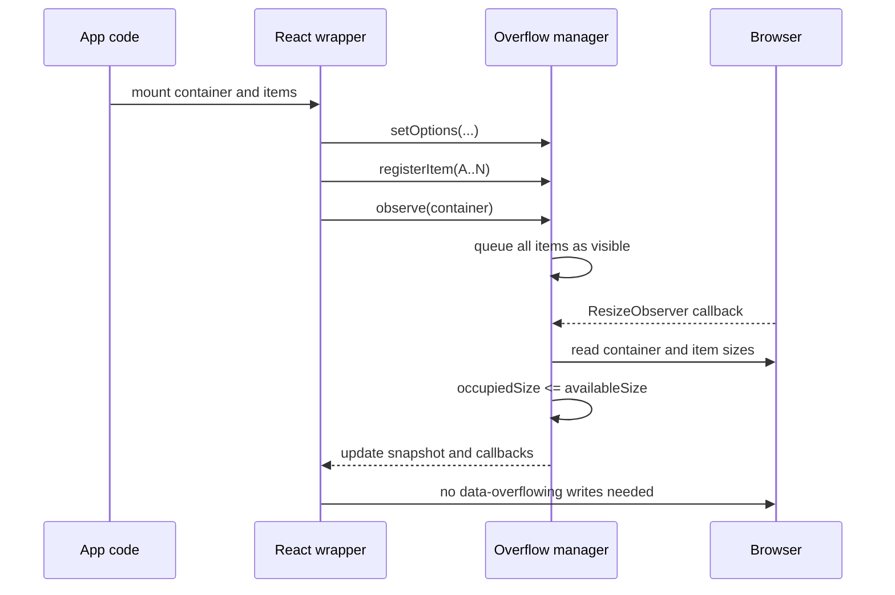

Functionally:

- all items start visible
- the first processing pass confirms they fit
- the overflow menu stays size-neutral if no items are hidden and `hasHiddenItems` is false

Cost profile:

- JS: low to moderate, mostly registration plus one measurement pass
- layout: one container read plus one read per item
- paint: minimal because nothing gets hidden after the pass
- composite: negligible

Interesting nuance:

- this path still measures everything once
- the first mount forces a dispatch even if queue tops did not change, because `forceDispatch` starts as true

### Scenario 2: Initial mount already overflows

This is the first truly interesting case because the engine has to discover the stable split between visible and hidden items.

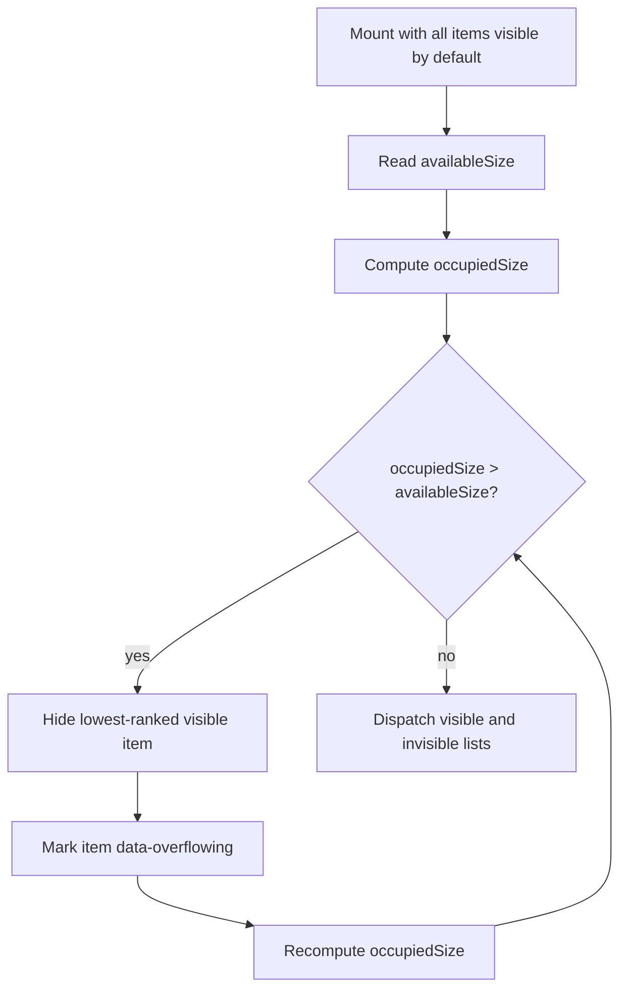

Functionally:

- all items begin life in the visible queue
- the hide loop repeatedly removes the worst visible candidate
- once the first item hides, the overflow menu may enter the occupied-size equation, which can force one more hide than a naive width sum would suggest

Cost profile:

- JS: proportional to how many items need to be hidden
- layout: repeated size reads, but many are cached within the pass
- paint: visible because items transition to `display: none`
- composite: still minor; the expensive step is layout and repaint

This is often the most expensive single mount-time case.

### Scenario 3: Container shrinks gradually

This is the steady-state resize path most people care about for toolbars.

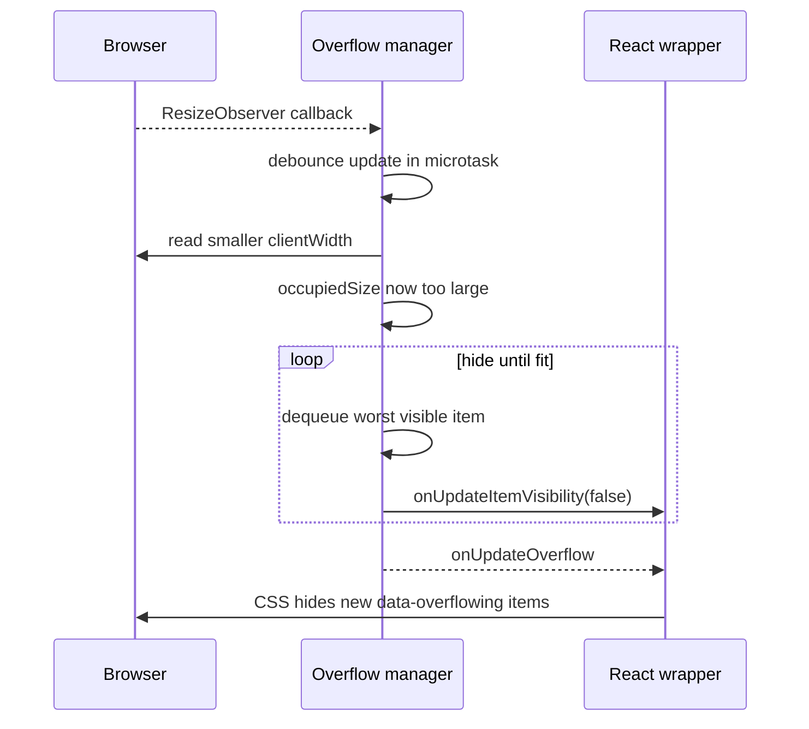

Functionally:

- no registration churn is needed
- only the container size changed
- visible items hide one by one in queue order until the toolbar fits again

Cost profile:

- JS: moderate when only a few items cross the threshold
- layout: usually less risky than direct DOM mutation because the update comes after a resize observation
- paint: each newly hidden item can trigger visible repaint of the toolbar region

This is the path where the current implementation is usually acceptable in practice.

### Scenario 4: Container grows and hidden items return

Growth is not just the reverse of shrink. The overflow menu threshold makes it slightly asymmetric.

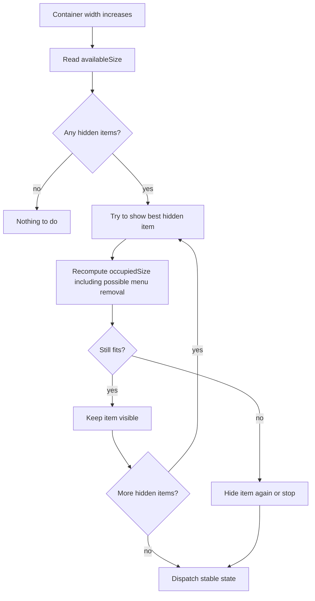

Functionally:

- the show loop promotes the best hidden item back to visible
- the algorithm has a special case for the last hidden item because removing the overflow menu may free enough space to make that last item fit

Cost profile:

- JS: moderate if many items become visible again
- layout: similar measurement pattern to shrinking
- paint: repaint of newly shown items and possible menu disappearance

Interesting nuance:

- the last hidden item is worth an extra attempt because one visible item can replace both itself and the menu footprint

### Scenario 5: Add a new low-priority item while already full

This is common in dynamic toolbars where commands appear conditionally.

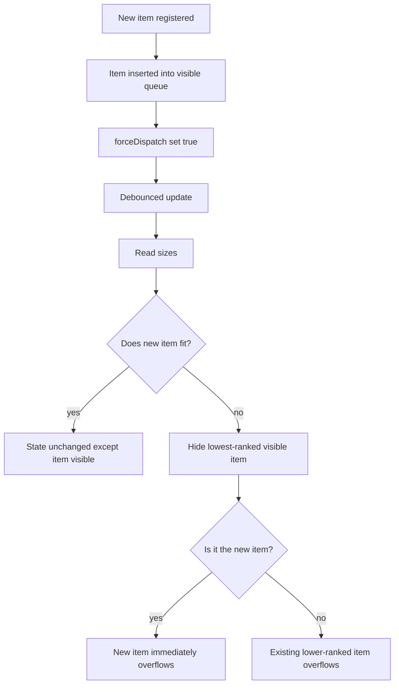

Functionally:

- new items start visible by default
- if the toolbar was already near capacity, the new item often overflows immediately on the next pass
- `forceDispatch` ensures consumers hear about the change even if queue tops happen to look similar

Cost profile:

- JS: low to moderate
- layout: one pass of measurements
- paint: only if the stable set changes

Interesting nuance:

- the double-round processing exists partly to stabilize cases like this, where a newly inserted visible item disturbs the optimal split

### Scenario 6: Add a new high-priority item that should displace a visible low-priority item

This is where the priority repair step matters.

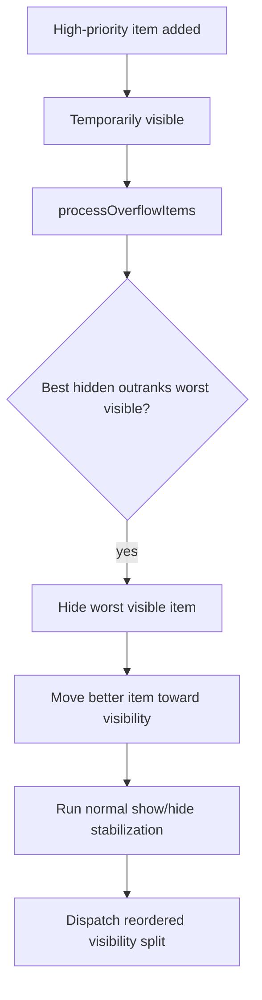

Functionally:

- a new important command can bump out a weaker visible command even if the total visible count stays the same
- this is not a pure width problem; it is a width-plus-priority rebalance

Cost profile:

- JS: slightly higher than the low-priority add case because the repair loop may run before normal fit logic
- layout: same general measurement footprint
- paint: one item may disappear while another appears

This is a good example of why the engine uses queues rather than a simple left-to-right cutoff.

### Scenario 7: Remove a visible item from a full toolbar

This is a relatively favorable case.

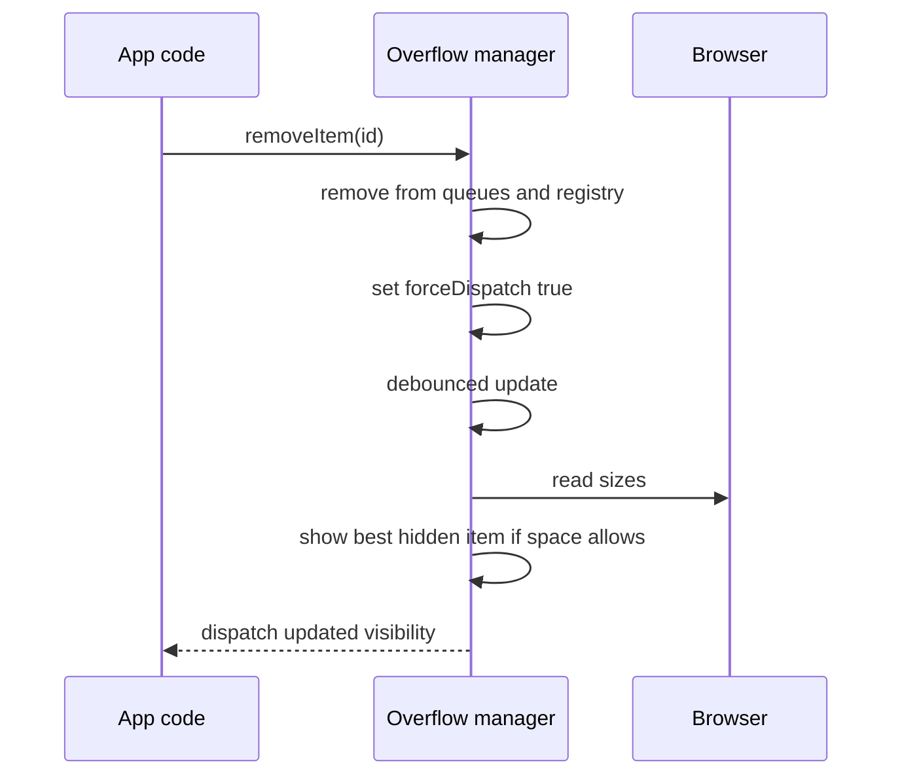

Functionally:

- removing a visible item may free enough room for one hidden item to return
- because `remove()` on the priority queue uses `indexOf`, item removal has a linear queue-search component before heap repair

Cost profile:

- JS: moderate for large `n` because removal is $O(n)$ in the queue implementation
- layout: one rebalance pass
- paint: modest; often one item appears and one disappears, or only one appears

### Scenario 8: Grouped items partially overflow

This is the most interesting extension feature.

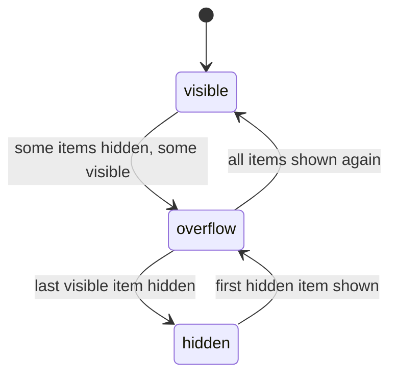

Functionally:

- each item move updates two sets inside the group manager
- a group enters `overflow` when at least one item is visible and at least one is hidden
- a divider stays visible while the group is `visible` or `overflow`
- the divider hides when the last visible item in that group disappears

Cost profile:

- JS: base model cost plus set bookkeeping
- layout: divider size may participate in `occupiedSize()`
- paint: divider visibility toggles can repaint even when no new command becomes visible

Interesting nuance:

- grouping changes semantics more than it changes raw cost
- the main additional cost comes from divider accounting inside every `occupiedSize()` call

### Scenario 9: Entire group disappears

This is a special grouped case worth separating because the divider behavior changes sharply.

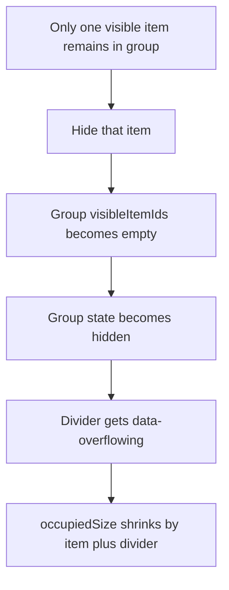

Functionally:

- hiding the last visible item has a two-part footprint change: the item goes away and the divider goes away too
- that means groups can create slightly discontinuous layout changes compared with independent items

Cost profile:

- JS: low incremental overhead
- layout: the divider disappearing can help the next item fit earlier than expected
- paint: visible because both command and divider styling change

### Scenario 10: Pinned items consume too much width

This is the clearest example of a case where the engine cannot solve the physical constraint.

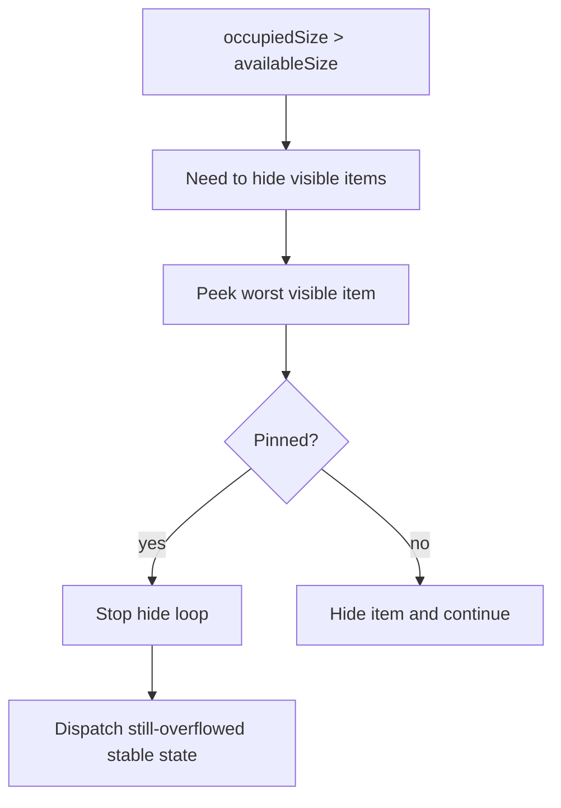

Functionally:

- pinned items act like an unshrinkable frontier
- if the next hide candidate is pinned, the algorithm stops, even if the container still does not fit
- the result can be a visually overfull container or clipped layout depending on surrounding CSS

Cost profile:

- JS: very low incremental pinning overhead
- layout: unchanged from base model until the stop condition is reached
- paint: depends on how much overflow remains visible in the page layout

Important design implication:

- pinning is cheap computationally but can make the UI impossible to satisfy geometrically

### Scenario 11: `minimumVisible` prevents full convergence

This is similar to pinning, but the hard stop is a count rather than item identity.

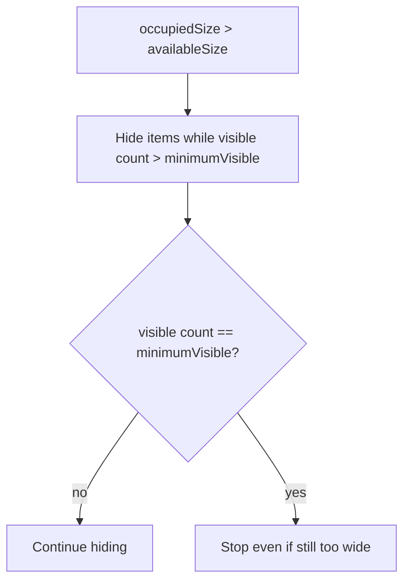

Functionally:

- the engine respects the configured minimum visible count
- it may stop before true geometric fit is reached

Cost profile:

- JS: negligible feature overhead
- layout: same as the base model up to the stop point
- paint: same as ordinary hiding

### Scenario 12: Overflow menu with `hasHiddenItems = true`

This case matters when hidden items exist outside the engine's own item registry.

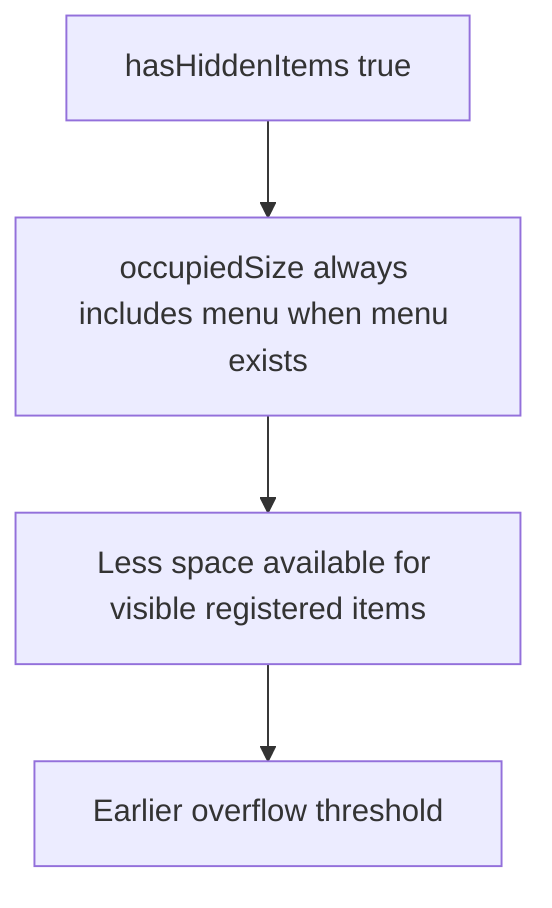

Functionally:

- the menu is charged against occupied size even if the engine itself currently has no invisible registered items
- this creates a more conservative fit line

Cost profile:

- JS: negligible
- layout: one extra measured element in passes where the menu exists
- paint: no special extra cost beyond menu visibility itself

### Scenario 13: Burst of registration changes in one tick

This is the best-case scenario for the debounce design.

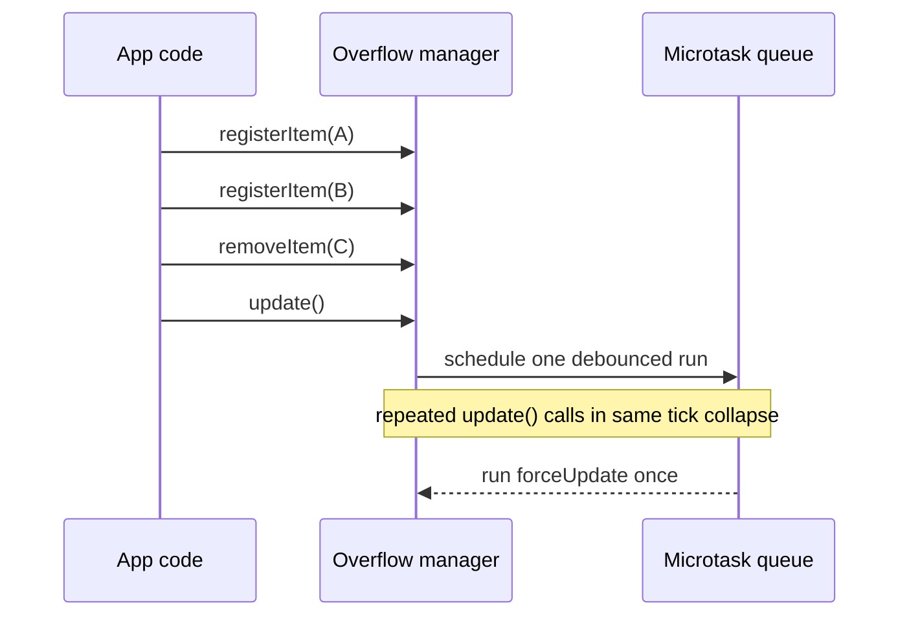

Functionally:

- multiple mutations collapse into one processing pass
- this avoids repeated layout work and repeated callback churn inside the same macrotask

Cost profile:

- JS: much better than processing each mutation separately
- layout: one pass instead of many
- paint: one consolidated visible-state update

This is one of the strongest design choices in the current engine.

### Scenario 14: Worst-case thrash on a large toolbar

This is the pathological case to keep in mind when estimating upper bounds.

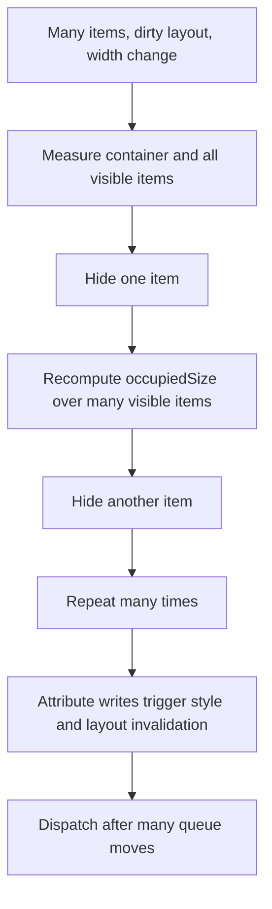

Functionally:

- many items cross the threshold in a single pass
- the engine repeatedly recomputes aggregate occupied size after each move
- style invalidation from `display: none` interacts with geometry reads

Cost profile:

- JS: the closest thing to the documented worst case
- layout: highest risk of forced reflow if layout was dirty before the reads
- paint: potentially substantial because many items disappear or reappear
- composite: still secondary to layout and paint

This is where the rough $O(n^2)$ behavior becomes noticeable.

## Scenario comparison

| Scenario                    | Engine behavior               | JS cost           | Layout risk       | Paint impact        | Notes                                 |
| --------------------------- | ----------------------------- | ----------------- | ----------------- | ------------------- | ------------------------------------- |
| Initial mount, all fit      | one pass, no hides            | low               | low to medium     | low                 | measures all once                     |
| Initial mount, overflow     | repeated hides                | medium to high    | medium            | medium              | often most expensive mount path       |
| Container shrink            | hide until fit                | medium            | medium            | medium              | typical toolbar case                  |
| Container grow              | show until fit                | medium            | medium            | medium              | menu threshold makes it asymmetric    |
| Add low-priority item       | likely self-overflows         | low to medium     | low to medium     | low to medium       | stabilized by second round            |
| Add high-priority item      | displace weaker visible item  | medium            | low to medium     | medium              | uses priority repair loop             |
| Remove visible item         | maybe reveal one hidden item  | medium            | low to medium     | low to medium       | queue remove is $O(n)$                |
| Partial grouped overflow    | update group sets and divider | medium            | medium            | medium              | semantic complexity more than raw CPU |
| Pinned frontier reached     | stop hiding early             | low               | medium            | low to medium       | may stay geometrically overflowed     |
| `minimumVisible` reached    | stop hiding early             | low               | medium            | low to medium       | also may stay overflowed              |
| Burst mutations in one tick | collapse to one pass          | low relative cost | low relative risk | low relative impact | best-case scheduling behavior         |
| Worst-case thrash           | many repeated size scans      | high              | high              | high                | main pathological upper bound         |

## How to read these scenarios in DevTools

If you profile the engine in browser tooling, expect to see these signatures:

- `ResizeObserver` callback or microtask scheduling before the main update work
- scripting time around queue churn and callback dispatch
- layout work clustered around `clientWidth`, `offsetWidth`, `clientHeight`, and `offsetHeight` reads
- style and paint work after attribute changes that lead to `display: none`

Rough interpretation guide:

- mostly scripting time: many queue moves or large visible-item scans
- mostly layout time: geometry reads are hitting dirty layout
- mostly paint time: many items or dividers are changing visibility in a visually rich toolbar

## Practical ranking of feature cost

If you need a simple ordering from most impactful to least impactful, this is the right mental model:

1. Base repeated measurement and rebalance loop
2. Number of items that cross visibility threshold in a pass
3. Group dividers and group bookkeeping
4. Overflow menu threshold effects
5. Queue removal during churn
6. Pinning and `minimumVisible` guards

The important takeaway is that grouping and pinning are not the main reason the system costs what it costs. The dominant factor is still repeated aggregate measurement combined with layout-affecting visibility changes.

## Worked example

This section walks through one concrete pass with numbers. The point is not that every toolbar looks like this, but that the current algorithm becomes much easier to reason about when you can watch the visible and invisible sets evolve.

### Setup

Assume a horizontal container with:

- `container.clientWidth = 420`
- `padding = 10`
- `availableSize = 410`
- overflow menu width `M = 40`
- no groups
- no pinned items
- `overflowDirection = 'end'`
- lower priority hides first

Items in DOM order:

| Item | Width | Priority |
| ---- | ----: | -------: |
| A    |    90 |      100 |
| B    |    80 |       80 |
| C    |    70 |       60 |
| D    |    65 |       40 |
| E    |    60 |       20 |

Total width if all are visible:

$$
90 + 80 + 70 + 65 + 60 = 365
$$

In this first state, all items fit because:

$$
365 \le 410
$$

So the stable state is:

- visible: `A B C D E`
- invisible: none
- overflow menu not counted

### Now shrink the container

Assume the container shrinks to:

- `container.clientWidth = 280`
- `padding = 10`
- `availableSize = 270`

If all items remain visible, occupied size is still 365, so the engine must hide items.

### Pass trace

#### Step 1: Evaluate current size

$$
occupied = 365
$$

Since $365 > 270$, the hide loop starts.

The lowest-ranked visible item is `E`, so `E` moves to the invisible queue.

State:

- visible: `A B C D`
- invisible: `E`

Now the overflow menu becomes active because there is at least one hidden item.

New occupied size:

$$
90 + 80 + 70 + 65 + 40 = 345
$$

The menu matters here. Hiding a 60px item only reduced occupied size by 20px because the 40px menu appeared.

#### Step 2: Still too wide

Since $345 > 270$, hide the next lowest-ranked visible item: `D`.

State:

- visible: `A B C`
- invisible: `D E`

Occupied size:

$$
90 + 80 + 70 + 40 = 280
$$

Still too wide.

#### Step 3: Hide one more item

Hide `C`.

State:

- visible: `A B`
- invisible: `C D E`

Occupied size:

$$
90 + 80 + 40 = 210
$$

Now:

$$
210 \le 270
$$

So the hide loop can stop.

### Show-loop sanity pass

The engine runs two rounds of show/hide stabilization. After landing on `A B` visible, it tries to see whether the best hidden item can come back.

The best hidden item is `C` with width 70.

If `C` is shown again, occupied size becomes:

$$
90 + 80 + 70 + 40 = 280
$$

That does not fit, so `C` stays hidden.

Final stable state:

- visible: `A B`
- invisible: `C D E`
- overflow menu visible

### Trace diagram

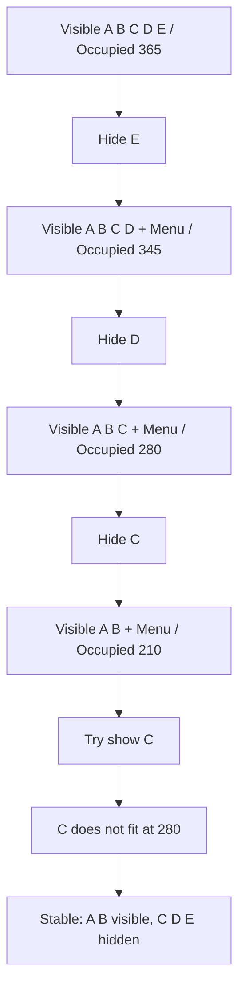

### What this example teaches

- the menu creates a threshold discontinuity
- the number of hidden items is not the same as the amount of freed space
- repeated aggregate size recomputation is easy to see even in a five-item example

### Grouped variant of the same example

Now add one divider before `D` and put `D` and `E` in the same group.

Assume:

- divider width `G = 12`
- group is visible while either `D` or `E` remains visible

Initial occupied size becomes:

$$
365 + 12 = 377
$$

When only `E` hides, occupied size becomes:

$$
90 + 80 + 70 + 65 + 12 + 40 = 357
$$

The divider remains because `D` is still visible.

When `D` also hides, the group becomes fully hidden and the divider disappears too. Occupied size becomes:

$$
90 + 80 + 70 + 40 = 280
$$

That is a 77px drop from the previous step: 65px for `D` plus 12px for the divider.

This is why grouped layouts can feel slightly more discontinuous even though the bookkeeping cost is not dramatic.

### Pinned variant of the same example

Now assume:

- `A` is pinned
- `B` is pinned
- container shrinks further so `availableSize = 180`

The engine can hide `C`, `D`, and `E`, leaving:

$$
90 + 80 + 40 = 210
$$

That still exceeds 180, but the next hide candidate would be pinned. The loop stops there.

Stable state becomes:

- visible: `A B`
- invisible: `C D E`
- occupied: 210
- available: 180

So the engine converges logically, but not geometrically.

## Redesign and optimization directions

If the goal is to understand how complex the current engine is versus how complex an alternative would be, these are the main redesign directions worth considering.

### Option 1: Keep the current model and optimize constants

This is the smallest-change path.

Potential improvements:

- keep a running occupied-size total instead of recomputing it from scratch on every show/hide step
- replace queue `remove()` with an indexed heap or a heap-plus-map design to avoid the current $O(n)$ search
- cache divider contribution more explicitly instead of scanning all groups in every `occupiedSize()` call

Expected impact:

- lower JS time
- lower pressure from repeated aggregate iteration
- same overall behavioral model
- same layout/paint characteristics because visibility still toggles with `display: none`

Tradeoff:

- moderate implementation complexity increase
- low API risk

### Option 2: Incremental occupied-size accounting

This is the most obvious algorithmic upgrade.

Instead of computing:

$$
occupied = \sum visibleItems + \sum visibleDividers + menu
$$

from scratch after each move, keep a mutable running total.

For example:

- when hiding an item, subtract its width
- if that was the first hidden item, add menu width
- if a group becomes hidden, subtract divider width
- when showing an item, add its width
- if that was the last hidden item, subtract menu width

Expected impact:

- per-move work drops closer to heap operations plus a few constant-time updates
- worst-case JS behavior improves materially

Tradeoff:

- correctness becomes trickier because menu and divider transitions are threshold-based
- subtle bugs become easier to introduce than in the current recompute-from-scratch approach

### Option 3: Prefix sums over a pre-sorted order

This works best when the problem can be reduced to a stable total ordering of items.

Idea:

1. sort visible candidates once by hide priority
2. build cumulative widths
3. find the largest visible prefix that fits

If the ordering is static enough, you can determine the split with something closer to binary search rather than repeated one-item-at-a-time moves.

Expected impact:

- better asymptotic behavior for large `n`
- easier reasoning about fit thresholds in simple non-grouped cases

Tradeoff:

- groups, pinned items, menu thresholds, and DOM-order tie-breaking complicate the prefix model
- dynamic insertion and removal mean the sorted structure must be maintained incrementally
- the implementation starts to look more like a custom ordered index rather than a simple manager

### Option 4: Separate measurement from decision more aggressively

The current engine interleaves:

- reads of element sizes
- decision logic
- attribute writes via callbacks

A more explicitly phased design could do:

1. measurement phase
2. pure decision phase
3. commit phase

Expected impact:

- easier profiling and reasoning
- easier to test because the decision step can be fed with synthetic widths
- possible reduction in layout thrash if commits are carefully batched after all reads

Tradeoff:

- more architecture, not necessarily lower total cost by itself
- still needs a better fit algorithm if JS complexity is the real bottleneck

### Option 5: Transform the rendering strategy instead of only the algorithm

This changes browser-pipeline cost more than algorithmic cost.

For example, instead of using `display: none` immediately, a system could:

- keep items in layout but visually collapse them differently
- render the overflow list in a separate layer
- avoid repeated attribute-driven selector invalidation

Expected impact:

- maybe lower paint or composite cost in some designs
- maybe smoother transitions

Tradeoff:

- much more rendering complexity
- likely worse accessibility and semantics if not done carefully
- often not worth it for toolbar-scale components

### Which optimizations are most credible here?

For this specific engine, the most credible improvements are:

1. incremental occupied-size tracking
2. indexed heap removal
3. clearer read/decide/write phasing

Those would attack the actual hot paths without changing the external mental model too much.

### What would not help much?

These ideas are less likely to move the needle significantly:

- micro-optimizing pinning checks
- micro-optimizing group set writes
- rewriting the debounce logic

Those are not where the main cost sits. The dominant cost remains repeated size aggregation and layout-affecting visibility changes.

## How to reason about redesign cost

If you are comparing implementations, this is the right split:

- current engine complexity: low to medium conceptual complexity, medium runtime cost under churn
- incremental-total engine: medium conceptual complexity, lower JS runtime cost, slightly higher correctness risk
- fully indexed ordered model: high conceptual complexity, potentially much better large-`n` behavior, much higher maintenance cost

In other words, the current design is simple enough to be robust, but it knowingly pays for that simplicity with repeated aggregate work.

## Takeaways

- The base engine is conceptually simple but not constant-time: it is a queue-based rebalance loop with repeated aggregate measurement.
- Grouping is a small feature tax on top of the base model, mainly from extra set bookkeeping and divider accounting.
- Pinning is almost free computationally.
- The dominant real-world cost is geometry reads and layout invalidation from hiding/showing items, not the queue operations themselves.
- Worst-case rebalances can trend toward quadratic JS work because aggregate occupied size is recomputed from scratch after each move.

## Relevant source files

- `packages/react-components/priority-overflow/src/overflowManager.ts`
- `packages/react-components/priority-overflow/src/priorityQueue.ts`
- `packages/react-components/priority-overflow/src/createResizeObserver.ts`
- `packages/react-components/priority-overflow/src/debounce.ts`
- `packages/react-components/priority-overflow/src/types.ts`
