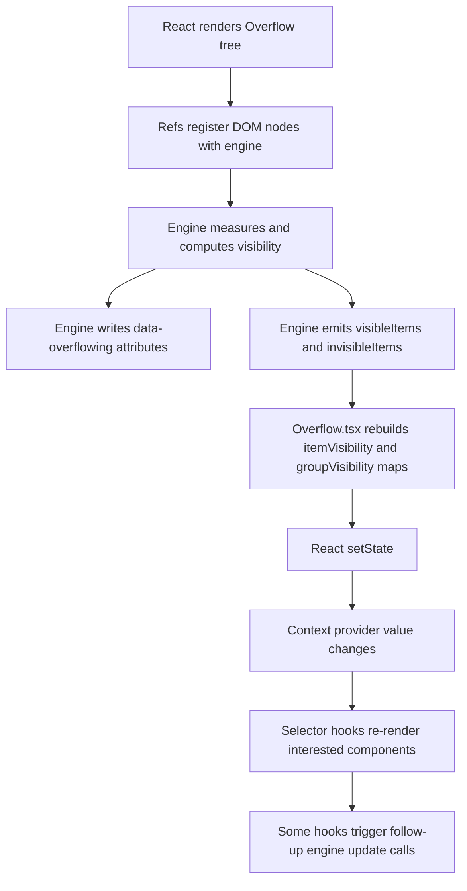
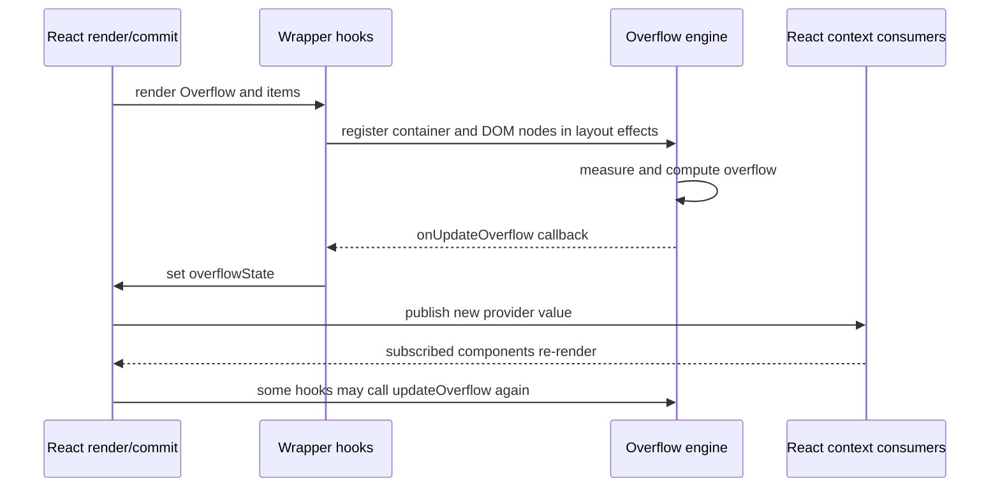

# React Overflow Bridge Spec

This document is the working specification for the bridge between the `@fluentui/priority-overflow` engine and the React package in `@fluentui/react-overflow`.

The key point is that the engine and the React wrapper have different strengths:

- the engine is imperative, DOM-oriented, and measurement-driven
- the React layer is declarative, context-driven, and render-oriented

That mismatch is exactly where some of the current awkwardness and extra cost come from.

## Scope

- React wrapper package: `packages/react-components/react-overflow/library/src/`
- Main wrapper component: `components/Overflow.tsx`
- Registration hooks: `useOverflowItem.ts`, `useOverflowMenu.ts`, `useOverflowDivider.ts`
- Context layer: `overflowContext.ts`

## One-sentence model

The React package turns an imperative DOM overflow manager into a React-facing API by registering DOM nodes through refs, mirroring engine state into React state, and redistributing that state through context selectors.

## Why the bridge is not ideal

The bridge works, but it has structural costs.

The main ones are:

1. it duplicates state that already exists inside the engine
2. it converts imperative updates into React re-renders
3. it sometimes triggers follow-up engine work in response to React state changes
4. it relies on child-cloning and ref plumbing that constrain the API surface

This document is intentionally descriptive. Its job is to explain the current bridge clearly enough that later design discussions can start from a shared understanding instead of from vague dissatisfaction.

## Data flow

## Current bridge architecture

### 1. DOM-first registration via refs

`OverflowItem` and related hooks register items in `useIsomorphicLayoutEffect` after the DOM node exists.

That means the engine lifecycle depends on:

- React committing DOM nodes
- refs resolving correctly
- layout effects running in order

This is pragmatic, but it means the bridge is not a pure data model. It is tightly coupled to commit timing.

### 2. State mirroring in `Overflow.tsx`

The engine emits arrays of visible and invisible items. The wrapper then rebuilds React-friendly maps:

- `itemVisibility: Record<string, boolean>`
- `groupVisibility: Record<string, OverflowGroupState>`
- `hasOverflow: boolean`

This is a second state system layered over the engine's own state.

That has two consequences:

- extra JS work on every engine update
- extra React invalidation even when consumers only need a small slice

### 3. Context redistribution

The wrapper pushes state and registration functions through `OverflowContext`.

Using `react-context-selector` helps, but it does not eliminate all cost. The provider value still changes when:

- `itemVisibility` is rebuilt
- `groupVisibility` changes
- `hasOverflow` changes

So the bridge still turns engine updates into React subscription activity.

### 4. Two visibility channels

There are really two visibility channels in the system:

- DOM attributes written by the engine callback path
- React state exposed through hooks

That duplication is useful for ergonomics, but it means the wrapper is not just a thin type-safe façade. It is a synchronizing layer.

## Concrete pain points

### Pain point 1: full map rebuild on every overflow update

In `Overflow.tsx`, each `onUpdateOverflow` callback rebuilds a fresh `itemVisibility` object from the visible and invisible arrays.

That means:

- every update allocates a new map
- every update touches all items that changed set membership
- even consumers looking up a single item still depend on a rebuilt parent object

This cost is separate from the engine's own work.

### Pain point 2: React re-renders are coupled to engine churn

The hook `useOverflowVisibility()` already warns that it re-renders for every overflow visibility change.

That is a real signal that the bridge is not especially cheap for broad subscriptions.

If an app reads the full visibility map, React work scales with every overflow event, even if the DOM attributes alone would have been enough for hiding.

### Pain point 3: menu state can cause follow-up engine work

`useOverflowMenu()` derives `isOverflowing` from `overflowCount`, and when that becomes true it calls `updateOverflow()` again in a layout effect.

This is understandable because the menu itself changes occupied size, but architecturally it means:

- engine update
- React state update
- React effect
- follow-up engine update

So the bridge can create a second phase of work around menu activation.

### Pain point 4: option changes recreate the engine instance

`useOverflowContainer()` recreates the overflow manager when observed options change after first mount.

That keeps behavior simple, but it means option changes are not incremental. They effectively reset the imperative engine layer.

This is acceptable for infrequent prop changes, but it is not a particularly elegant bridge if options are dynamic.

### Pain point 5: trigger-style child cloning is restrictive

`Overflow` and `OverflowItem` use trigger-style helpers to clone children and merge refs.

That introduces API constraints:

- the child must be ref-compatible
- the wrapper must successfully find and merge the target element ref
- composition is less direct than a hook-only API bound to a known DOM node

This is not necessarily slow in isolation, but it is a sign that the bridge is paying API complexity to adapt imperative registration into React composition.

### Pain point 6: state and DOM can never be truly single-source

The engine is the real source of truth for fit and visibility.

React state is therefore downstream and derived. That means the bridge is always solving synchronization problems, not ownership problems.

This is manageable, but it is a weaker architecture than a model where React owns the state transitions directly or subscribes to a dedicated external store.

## Lifecycle of the React bridge

## Cost model of the React bridge

The bridge cost is mostly not in layout. The engine already dominates geometry work.

The bridge adds cost in three other places.

### 1. Allocation and derivation cost

This includes:

- rebuilding visibility maps
- creating new provider values
- creating memoized derived objects for hooks such as `useOverflowVisibility()`

This is ordinary JS work, but it happens on every update.

### 2. React subscription and render cost

This includes:

- invalidating selector subscribers
- re-running components that consume overflow state
- effect work after state changes, especially around menu registration/update

This is the biggest bridge-specific cost bucket.

### 3. Commit-phase coordination cost

This includes:

- layout effects for item registration
- layout effects for menu registration
- cleanup effects on unmount
- merged-ref and child-cloning overhead

This is not the dominant runtime cost, but it makes the design more intricate and timing-sensitive.

For design directions, refactor ideas, and unresolved questions beyond the current bridge, see `overflow-northstar.md`. This document stays focused on the current bridge and where its cost comes from.

## What the bridge does well

It is not all downside. The bridge gives React consumers a usable API surface:

- `Overflow`, `OverflowItem`, and `OverflowDivider` expose composition-friendly primitives
- selector hooks let components ask narrow questions like "is item X visible?"
- the DOM still gets fast attribute-level visibility updates from the engine path

So the bridge is functional and practical. The problem is not that it fails. The problem is that it duplicates work and couples render updates to engine churn more than an ideal integration would.

## Practical ranking of React bridge issues

If you need to rank the React-side concerns by importance, this is the right order:

1. mirrored visibility state and full map rebuilds
2. React subscription and re-render churn
3. follow-up menu-triggered updates
4. engine recreation on option changes
5. child-cloning and ref-plumbing complexity

## Bottom line

The current bridge is workable, but not ideal.

It is best understood as an adapter between two different worlds:

- an imperative DOM measurement engine
- a declarative React subscription model

That adapter necessarily adds synchronization, re-rendering, and some API awkwardness. The biggest structural weakness is that React mirrors and redistributes state the engine already owns instead of subscribing to a more canonical external store model.

If the question is "what should replace it?", that belongs in `overflow-northstar.md`. The purpose of this document is narrower: explain how the current bridge works, where it pays, and why it feels awkward.

That narrower scope is deliberate. Once the current bridge is described precisely, future improvement discussions can be grounded in specific costs and tradeoffs rather than broad impressions.

## Relevant source files

- `packages/react-components/react-overflow/library/src/components/Overflow.tsx`
- `packages/react-components/react-overflow/library/src/useOverflowContainer.ts`
- `packages/react-components/react-overflow/library/src/useOverflowItem.ts`
- `packages/react-components/react-overflow/library/src/useOverflowMenu.ts`
- `packages/react-components/react-overflow/library/src/useOverflowVisibility.ts`
- `packages/react-components/react-overflow/library/src/overflowContext.ts`
