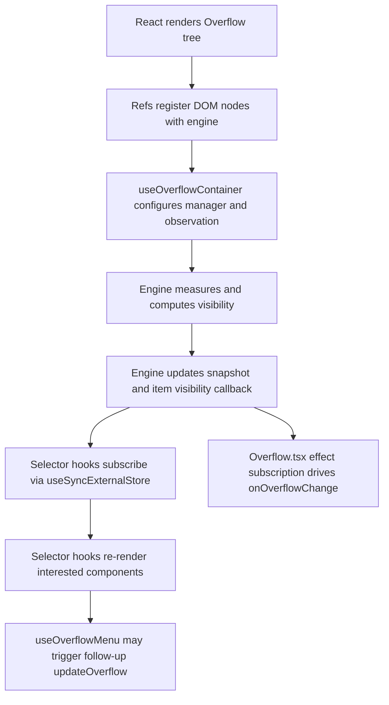
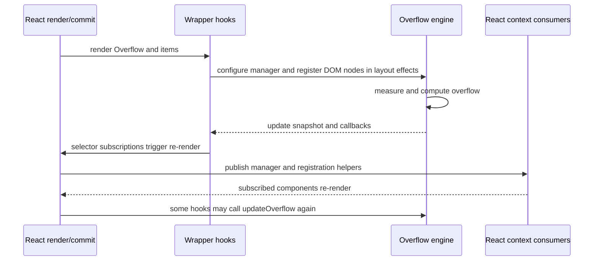

# React Overflow Bridge Spec

This document is the working specification for the bridge between the `@fluentui/priority-overflow` engine and the React package in `@fluentui/react-overflow`.

The key point is that the engine and the React wrapper have different strengths:

- the engine is imperative, DOM-oriented, and measurement-driven
- the React layer is declarative, context-driven, and render-oriented

That mismatch is exactly where some of the current awkwardness and extra cost come from.

## Scope

- React wrapper package: `packages/react-components/react-overflow/library/src/`
- Main wrapper component: `components/Overflow.tsx`
- Registration hooks: `useOverflowItem.ts`, `useOverflowMenu.ts`, `useOverflowDivider.ts`
- Context layer: `overflowContext.ts`

## One-sentence model

The React package turns an imperative DOM overflow manager into a React-facing API by wiring DOM nodes through refs, configuring one long-lived manager per container, exposing the manager through context, and reading manager-owned snapshot state through narrow selector hooks.

## Why the bridge is not ideal

The bridge works, but it has structural costs.

The main remaining ones are:

1. the bridge still converts engine updates into React re-renders for subscribed consumers
2. `useOverflowMenu()` can still trigger a follow-up engine update when the menu first participates in layout
3. the wrapper still relies on child-cloning and ref plumbing that constrain the API surface
4. the selector-hook path still depends on `useSyncExternalStore`

This document is intentionally descriptive. Its job is to explain the current bridge clearly enough that later design discussions can start from a shared understanding instead of from vague dissatisfaction.

## Data flow

## Current bridge architecture

### 1. DOM-first registration via refs

`OverflowItem` and related hooks register items in `useIsomorphicLayoutEffect` after the DOM node exists.

That means the engine lifecycle depends on:

- React committing DOM nodes
- refs resolving correctly
- layout effects running in order

This is pragmatic, but it means the bridge is not a pure data model. It is tightly coupled to commit timing.

### 2. Manager-only provider in `Overflow.tsx`

`Overflow.tsx` no longer subscribes to the full manager snapshot just to republish convenience state.

The provider now publishes:

- `manager`
- registration helpers
- `updateOverflow`

and leaves snapshot reading to the selector-hook layer.

That means the provider is no longer a mirrored overflow-state distributor.

### 3. Context redistribution

The wrapper pushes the manager plus registration functions through `OverflowContext`.

That keeps the provider value much more stable than the earlier mirrored-state version. Context churn is now tied mainly to manager identity and registration helper identity instead of every overflow snapshot change.

### 4. Two visibility channels

There are really two visibility channels in the system:

- DOM attributes written by the engine callback path
- manager snapshot state exposed through selector hooks

That duplication is useful for ergonomics, but it means the wrapper is not just a thin type-safe façade. It is a synchronizing layer.

## Concrete pain points

### Improvement: provider-level mirrored state is gone

`Overflow.tsx` now uses an effect subscription for `onOverflowChange` and no longer republishes visibility state through context.

That removes the weakest external-store subscription in the bridge and eliminates provider churn that was previously tied to every snapshot update.

### Pain point 1: React re-renders are still coupled to engine churn

The hook `useOverflowVisibility()` already warns that it re-renders for every overflow visibility change.

That is a real signal that the bridge is not especially cheap for broad subscriptions.

If an app reads the full visibility map, React work scales with every overflow event, even if the DOM attributes alone would have been enough for hiding.

### Pain point 2: menu state can still cause follow-up engine work

`useOverflowMenu()` derives `isOverflowing` from `overflowCount`, and when that becomes true it calls `updateOverflow()` again in a layout effect.

This is understandable because the menu itself changes occupied size, but architecturally it means:

- engine update
- React state update
- React effect
- follow-up engine update

So the bridge can create a second phase of work around menu activation.

Current recommendation:

- keep this follow-up update path for now
- treat it as an acceptable bridge feedback loop in the current menu participation model
- only revisit it if later profiling or a broader menu/measurement redesign offers a clearly better alternative

Important nuance:

- the follow-up update remains a real logical step
- the timing of that step relative to paint depends on how the surrounding registration and subscription work is scheduled

For the current mount path, the important distinction is the same as in the engine spec:

- the bridge can still perform more than one logical correction step while mounting
- but those steps are expected to collapse into a single visible first paint for correctness purposes on the initial mount path this bridge is centered around

So the existence of a follow-up update does not automatically imply a second visible paint. It means the bridge has a multi-step mount-time convergence model that still aims to finish before the first presented frame.

### Improvement: option changes no longer recreate the engine instance

`useOverflowContainer()` now creates one manager instance per container and reconfigures it through `setOptions()`.

That means option changes are now incremental instead of reconstructive.

### Pain point 3: trigger-style child cloning is restrictive

`Overflow` and `OverflowItem` use trigger-style helpers to clone children and merge refs.

That introduces API constraints:

- the child must be ref-compatible
- the wrapper must successfully find and merge the target element ref
- composition is less direct than a hook-only API bound to a known DOM node

This is not necessarily slow in isolation, but it is a sign that the bridge is paying API complexity to adapt imperative registration into React composition.

### Pain point 4: selector hooks still render from an external store

The selector hook layer still uses `useSyncExternalStore` against the manager.

That keeps the strongest external-store correctness semantics, but it also means the bridge has not fully moved to a mirrored React snapshot model.

Current recommendation:

- keep the selector-hook path on direct external-store reads for now
- do not add custom selector equality
- keep selector reads narrow and only revisit broader equality machinery if profiling proves it necessary

### Pain point 5: state and DOM can never be truly single-source

The engine is the real source of truth for fit and visibility.

React state is therefore downstream and derived. That means the bridge is always solving synchronization problems, not ownership problems.

This is manageable, but it is a weaker architecture than a model where React owns the state transitions directly or subscribes to a dedicated external store.

## Lifecycle of the React bridge

## Cost model of the React bridge

The bridge cost is mostly not in layout. The engine already dominates geometry work.

The bridge adds cost in three other places.

### 1. Allocation and derivation cost

This includes:

- creating new provider values
- creating memoized derived objects for hooks such as `useOverflowVisibility()`

This is ordinary JS work, but it happens on every update.

### 2. React subscription and render cost

This includes:

- invalidating selector subscribers
- re-running components that consume overflow state
- effect work after snapshot changes, especially around menu registration/update

This is the biggest bridge-specific cost bucket.

### 3. Commit-phase coordination cost

This includes:

- layout effects for item registration
- layout effects for menu registration
- cleanup effects on unmount
- merged-ref and child-cloning overhead

This is not the dominant runtime cost, but it makes the design more intricate and timing-sensitive.

This document stays focused on the current bridge and where its cost comes from.

## What the bridge does well

It is not all downside. The bridge gives React consumers a usable API surface:

- `Overflow`, `OverflowItem`, and `OverflowDivider` expose composition-friendly primitives
- selector hooks let components ask narrow questions like "is item X visible?"
- the DOM still gets fast attribute-level visibility updates from the engine path

So the bridge is functional and practical. The problem is not that it fails. The problem is that it duplicates work and couples render updates to engine churn more than an ideal integration would.

## Practical ranking of React bridge issues

If you need to rank the React-side concerns by importance, this is the right order:

1. React subscription and re-render churn for broad consumers
2. follow-up menu-triggered updates
3. selector hooks depending on direct external-store rendering
4. child-cloning and ref-plumbing complexity
5. residual bridge synchronization cost

## Bottom line

The current bridge is workable and materially better than the earlier setter-plus-callback model, but not ideal.

It is best understood as an adapter between two different worlds:

- an imperative DOM measurement engine
- a declarative React subscription model

That adapter still adds synchronization, re-rendering, and some API awkwardness. The biggest remaining structural question is whether the selector-hook path should continue rendering directly from the manager as an external store, or whether the bridge should eventually move back to a mirrored React snapshot model.

The purpose of this document is narrower: explain how the current bridge works, where it pays, and why it feels awkward.

That narrower scope is deliberate. Now that the lifecycle refactor and its follow-up decisions are recorded here and in the engine spec, future improvement discussions can start directly from those two specs rather than from a third design ledger.

## Relevant source files

- `packages/react-components/react-overflow/library/src/components/Overflow.tsx`
- `packages/react-components/react-overflow/library/src/useOverflowContainer.ts`
- `packages/react-components/react-overflow/library/src/useOverflowItem.ts`
- `packages/react-components/react-overflow/library/src/useOverflowMenu.ts`
- `packages/react-components/react-overflow/library/src/useOverflowVisibility.ts`
- `packages/react-components/react-overflow/library/src/overflowContext.ts`
