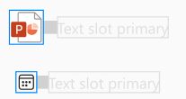
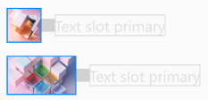
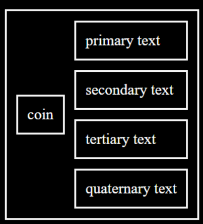
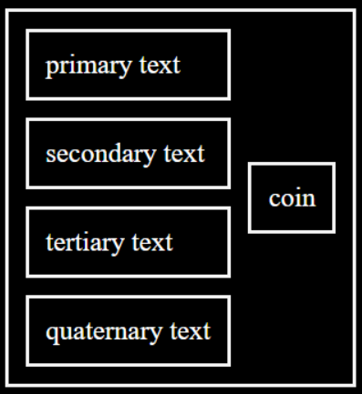

# @fluentui/react-persona Spec

Convergence epic issue: #24213

## Background

A Persona is a visual representation that showcases an Avatar, Icon, Image, or Badge. This composite component is not a card, therefore it will not provide a visual board or a popup when the user hovers the Avatar.

Persona is used in PeoplePicker, Team's left rail and menus, chiclets, and Card.

_**Persona Figma spec:**_ [link](https://www.figma.com/file/ayf1r31NnONkfiE00g9QOv/Persona?node-id=1741%3A2221)

## Prior Art

- OpenUI research: [Avatar/Persona](https://open-ui.org/components/avatar.research)
- v7/v8: [link](https://developer.microsoft.com/en-us/fluentui#/controls/web/persona)
  - > Note: v8's Persona is a combination of v9's Persona and Avatar (v8's Persona has a sub-component PersonaCoin that would count as Avatar, but is not exposed.). In v9 we've taken the approach of having a single component Avatar and another component Persona.
- v0: Does not have equivalent component.

## Anatomy


### Media

v9 Persona will provide three sub-components that provide extra funcitonality for the sizing behavior.

_PersonaAvatar vs PersonaCoin_: v8's Persona is only able to showcase a PersonaCoin while v9 showcases PersonaAvatar (including Avatar + PresenceBadge, Avatar + image, and Avatar + Icon). Note that PersonaCoin does not support custom icons, the only icon options are the size 8 icon shown below and the unknown PersonaCoin.

_PersonaIcon vs PersonaCoin_: PersonaCoin allows you to have icon only when there's no image available or it's the unknown PersonaCoin variant. In v9's PersonaIcon, you have the option of showcasing an icon through the Avatar or only the icon.

- Note: v8 Persona only shows and icon if there's no presence and size is `tiny`, `size8`, or `size16`.

_PersonaPresenceBadge vs PersonaCoin_: PersonaCoin allows you to have only a PresenceBadge when the size of the coin is `tiny`, `size8`, or `size16`. In v9's Persona you are able to render the PersonaPresenceBadge alone.

_Image vs PersonaCoin_: PersonaCoin allows you to have an image only within the Avatar. This can be avoided by rendering a custom coin, but there's still all the dom and styling overhead that comes with PersonaCoin. v9's Persona allows you use a single image and does not resize the image.

### Text lines

Other than styling and naming, the text lines in Persona remain the same.

## Sample Code


Persona with Avatar:

```jsx
<Persona media={<PersonaAvatar name="Kevin Sturgis" />} primaryText="Kevin Sturgis" secondaryText="Software Engineer" />
```


Persona with Avatar + PresenceBadge:

```jsx
<Persona
  media={<PersonaAvatar name="Kevin Sturgis" badge={{ status: 'offline', outOfOffice: true }} />}
  primaryText="Kevin Sturgis"
  secondaryText="Software Engineer"
  tertiaryText="Offline"
/>
```



Persona with icon:

```jsx
<Persona
  media={
    <PersonaIcon>
      <PersonCallRegular />
    </PersonaIcon>
  }
  primaryText="Person Call Icon"
/>
```


Persona with PresenceBadge:

```jsx
<Persona media={<PersonaPresenceBadge status="offline" outOfOffice={true} />} primaryText="Kevin Sturgis" />
```



Persona with image:

```jsx
<Persona
  primaryText="Katri Athokas"
  secondaryText="Software Engineer"
  tertiaryText="CXE"
  quaternaryText="Offline"
  image={}
/>
```

## Variants

There are three alignment variants:

- start: Media on the left and text on the right.
- center: Media on top and text on the bottom.
- end: Media on the right and text on the left.

There are 4 Media variants:

- PersonaPresenceBadge
- PersonaIcon
- PersonaAvatar
- Image

There are 2 sizing variants:

- stretch: When the text lines have a larger height compared to the Media, stretch the Media to fit text lines height.
- fixed: Keep the Media the same size, no matter the height of the text lines.
- > Note: When media is an image, it will not be affected by sizing variants.

**⚠️Responsive text variants will be left out of the initial implementation due to the accessibility concerns, but they are added to this spec to start a discussion⚠️**

There are 4 responsive text variants:

- truncate: simple text truncation when the text doesn't fit in the container.
  - > Note: after talking offline, it was brought up that this might be an accessibility concern. @smhighley mentioned that as long as there's a way to display the full text somewhere else, it should be fine.
- hidden: same as truncate, but has a default `min-width` of 36px. If the width is less than `min-width`, then the text is hidden.
- wrap: simple text wrap. This can be opted in per text slot.
- lineclamp truncate: wraps text until specified number of lines and after those lines it truncates the text.

## API

**Slots**

- `root`: The root slot for Persona.
- `media`: The media slot containing an Avatar, PresenceBadge, Icon, or Image.
- `primaryText`: Primary text.
- `secondaryText`: Secondary text, if provided.
- `tertiaryText`: Tertiary text, if provided.
- `quaternaryText`: Quaternary text, if provided.

**Types**

```ts
type PersonaSlots = {
  root: Slot<'div'>;

  /**
   * Media Slot that can render an Avatar, Icon, PresenceBadge, or Image.
   *
   * Adding media to the slot works as follows:
   * `
   * <Persona media={<Avatar name="Kevin Sturgis" />} primaryText="Kevin Sturgis" />
   * `
   */
  media: NonNullable<Slot<'span'>>;

  /**
   * Primary text to be displayed.
   */
  primaryText: NonNullable<Slot<'span'>>;

  /**
   * Secondary text to be displayed.
   */
  secondaryText?: Slot<'span'>;

  /**
   * Tertiary text to be displayed.
   */
  tertiaryText?: Slot<'span'>;

  /**
   * Quaternary text to be displayed.
   */
  quaternaryText?: Slot<'span'>;
};

/**
 * Persona Props
 */
type PersonaProps = ComponentProps<PersonaSlots> & {
  /**
   * Type of sizing to be used. When using fixed, the Media will not resize. When using stretch,
   * the Media will resize depending on the combined text's height.
   *
   * @default stretch
   */
  sizing?: 'fixed' | 'stretch';

  /**
   * Where the Media is positioned relative to the text.
   *
   * @default start
   */
  position?: 'start' | 'center' | 'end';
};

/**
 * Data that represents whether an Avatar, Icon, or PresenceBadge is used and its size. This is used to determine
 * the sixing of the text slots.
 */
export type PersonaMediaData = {
  avatar?: PersonaAvatarProps['size'];
  icon?: PersonaIconProps['size'];
  badge?: PresenceBadgeProps['size'];
};

export type PersonaContextValue = Pick<PersonaProps, 'sizing'> & {
  /**
   * Number of text lines currently used.
   */
  numTextLines?: number;
  updateMediaData: (data: PersonaMediaData) => void;
};

export type PersonaContextValues = {
  persona: PersonaContextValue;
};
```

PersonaIcon

```ts
export type PersonaIconSlots = {
  root: Slot<'span'>;
};

/**
 * PersonaIcon Props
 */
export type PersonaIconProps = ComponentProps<PersonaIconSlots> & {
  /**
   * Icon's size.
   */
  size?: 12 | 16 | 20 | 24 | 28 | 32 | 48;
};
```

PersonaAvatar and PersonaPresenceBadge keep the same API as their original component.

## Structure

To avoid the [issue](https://github.com/microsoft/fluentui/issues/23386) v8 has, a css grid will be used instead of a flexbox that requires a general wrapper and a text container wrapper.

- _**CSS Grid**_
  - 
  - 
  - 

> ⚠️ Open to feedback: When using `grid-template-areas`, even if the rows are empty, `rowGap`/`columnGap` adds the spacing between them. To avoid this, a padding in the items could be used instead. While it's not a huge problem, it would impact the design.

- _**Internal**_

```jsx
return (
  <PersonaProvider value={contextValues.persona}>
    <slots.root {...slotProps.root}>
      {(position === 'start' || position === 'center') && <slots.media {...slotProps.media} />}
      <slots.primaryText {...slotProps.primaryText} />
      {slots.secondaryText && <slots.secondaryText {...slotProps.secondaryText} />}
      {slots.tertiaryText && <slots.tertiaryText {...slotProps.tertiaryText} />}
      {slots.quaternaryText && <slots.quaternaryText {...slotProps.quaternaryText} />}
      {position === 'end' && <slots.media {...slotProps.media} />}
    </slots.root>
  </PersonaProvider>
);
```

- _**DOM**_

```html
<div class="fui-Persona">
  <div class="fui-Persona__media">{/* Avatar, PresenceBadge, Icon, or Image */}</div>
  <span class="fui-Persona__primaryText">Primary Text</span>
  <span class="fui-Persona__secondaryText">Secondary Text</span>
  <span class="fui-Persona__tertiaryText">Tertiary Text</span>
  <span class="fui-Persona__quaternaryText">Quaternary Text</span>
</div>
```

## Migration

See [MIGRATION.md](./MIGRATION.md) for details.

## Behaviors

_Explain how the component will behave in use, including:_

- _Component States_
  - There are no states for this component, it's a visual representation.
- _Interaction_
  - _Keyboard_
    - Doesn't receive focus.
  - _Cursor_
    - Doesn't interact with cursor.
  - _Touch_
    - Doesn't interact with touch.
  - _Screen readers_
    - It first focuses on the media and then goes through each text line available.

## Accessibility

- There's no need for `aria-*` or/and`role`. Avatar, Badge, Image, and icon are already accessible and the text labels won't need anything as well.
