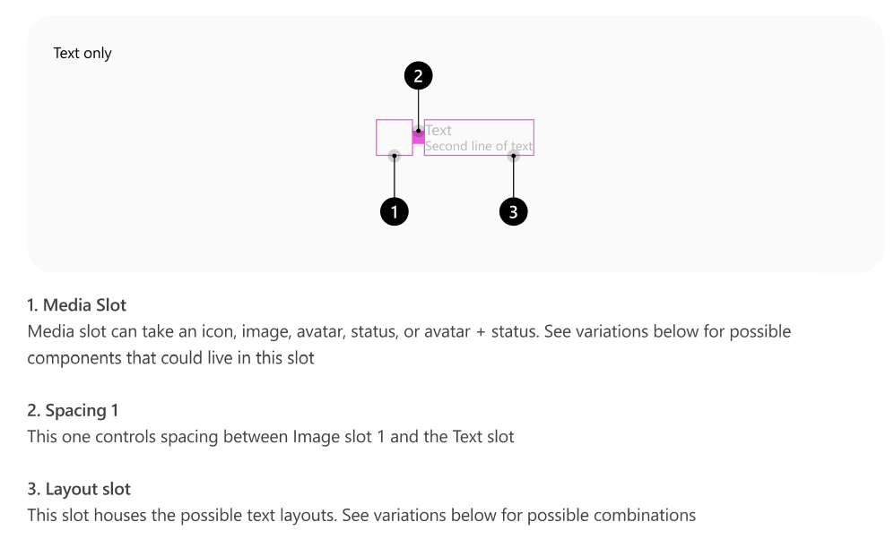
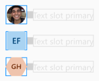
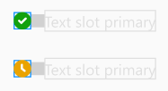
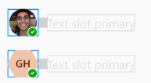
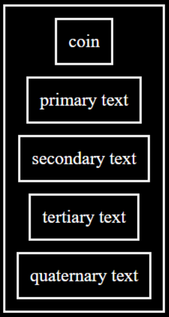
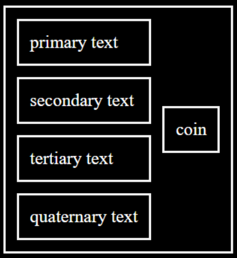

# @fluentui/react-persona Spec

Convergence epic issue: #24213

## Background

A Persona is a visual representation of a person or status that showcases an Avatar, PresenceBadge, or an Avatar with a PresenceBadge. This composite component is not a card, therefore it will not provide a visual board or a popup when the user hovers the Avatar.

Persona is used in PeoplePicker, Team's left rail and menus, chiclets, and Card.

## Prior Art

- OpenUI research: [Avatar/Persona](https://open-ui.org/components/avatar.research)
- v7/v8: [link](https://developer.microsoft.com/en-us/fluentui#/controls/web/persona)
  - > Note: v8's Persona is a combination of v9's Persona and Avatar (v8's Persona has a sub-component PersonaCoin that would count as Avatar, but is not exposed.). In v9 we've taken the approach of having a single component Avatar and another component Persona.
- v0: Does not have equivalent component.

## Anatomy



### Avatar, PresenceBadge, and Avatar + PresenceBadge

v8's Persona has a sub-component `PersonaCoin`, the equivalent in v9 is an Avatar. Currently Avatar is able to display a PresenceBadge, but this behavior will be deprecated in favor of Persona having this behavior.

Persona has a slot for an `Avatar` and `PresenceBadge`, giving the user the ability to display an Avatar, a PresenceBadge, or Combine them into an Avatar with presence.

### Text lines

Other than styling and naming, the text lines in Persona remain the same.

## Sample Code



Persona with Avatar:

```jsx
<Persona name="Kevin Sturgis" primaryText="Kevin Sturgis" secondaryText="Software Engineer" />
```



Persona with PresenceBadge:

```jsx
<Persona presenceOnly presence={{ status: 'offline', outOfOffice: true }} primaryText="Kevin Sturgis" />
```



Persona with Avatar + PresenceBadge:

```jsx
<Persona
  name="Kevin Sturgis"
  presence={{ status: 'offline', outOfOffice: true }}
  primaryText="Kevin Sturgis"
  secondaryText="Software Engineer"
  tertiaryText="Offline"
/>
```

## Variants

> I will refer to the avatar and presence as content.

There are three alignment variants:

- after: Content on the left and text on the right.
- below: Content on top and text on the bottom.
- before: Content on the right and text on the left.

There are 3 content variants:

- Avatar
- PresenceBadge
- Avatar + PresenceBadge

There are 2 sizing variants:

- scaled: The content will be resized based on the number of text lines.
- fixed: The content will remain the same size and the text lines will be styled based on the content's size.

## API

**Slots**

- `root`: The root slot for Persona.
- `avatar`: The Avatar to display and Persona's primary slot.
- `presence`: The PresenceBadge to display.
- `primaryText`: Primary text.
- `secondaryText`: Secondary text.
- `tertiaryText`: Tertiary text.
- `quaternaryText`: Quaternary text.

**Types**

```ts
export type PersonaSlots = {
  root: NonNullable<Slot<'div'>>;

  /**
   * Avatar to display.
   */
  avatar: NonNullable<Slot<typeof Avatar>>;

  /**
   * PresenceBadge to display.
   */
  presence: Slot<typeof PresenceBadge>;

  /**
   * Primary text to display.
   */
  primaryText: Slot<'span'>;

  /**
   * Secondary text to display.
   */
  secondaryText: Slot<'span'>;

  /**
   * Tertiary text to display.
   */
  tertiaryText: Slot<'span'>;

  /**
   * Quaternary text to display.
   */
  quaternaryText: Slot<'span'>;
};

/**
 * Persona Props
 */
export type PersonaProps = Omit<ComponentProps<Partial<PersonaSlots>, 'avatar'>, 'badge'> & {
  /**
   * Whether to display only the presence.
   *
   * @default false
   */
  presenceOnly?: boolean;

  /**
   * Sizing type to use.
   *
   * `fixed`: Text lines adjust to content's size.
   * `scaled`: Content adjusts its size based on the number of text lines used.
   *
   * @default fixed
   */
  sizing?: 'fixed' | 'scaled';

  /**
   * Position the text will be rendered in.
   *
   * @default after
   */
  textPosition?: 'before' | 'after' | 'below';
};
```

## Structure

To avoid the [issue](https://github.com/microsoft/fluentui/issues/23386) v8 has, a css grid will be used instead of a flexbox that requires a general wrapper and a text container wrapper.

- _**CSS Grid**_

  - 
  - 
  - 

- _**Internal**_

```jsx
return (
  <slots.root {...slotProps.root}>
    {!badgeOnly && <slots.avatar {...slotProps.avatar} />}
    {slots.presence && <slots.presence {...slotProps.presence} />}
    {slots.primaryText && <slots.primaryText {...slotProps.primaryText} />}
    {slots.secondaryText && <slots.secondaryText {...slotProps.secondaryText} />}
    {slots.tertiaryText && <slots.tertiaryText {...slotProps.tertiaryText} />}
    {slots.quaternaryText && <slots.quaternaryText {...slotProps.quaternaryText} />}
  </slots.root>
);
```

- _**DOM**_

```html
<div class="fui-Persona">
  <div {/* Avatar, PresenceBadge, or Avatar with PresenceBadge */} />
  <span class="fui-Persona__primaryText">Primary Text</span>
  <span class="fui-Persona__secondaryText">Secondary Text</span>
  <span class="fui-Persona__tertiaryText">Tertiary Text</span>
  <span class="fui-Persona__quaternaryText">Quaternary Text</span>
</div>
```

## Migration

See [MIGRATION.md](./MIGRATION.md) for details.

## Behaviors

_Explain how the component will behave in use, including:_

- _Component States_
  - There are no states for this component, it's a visual representation.
- _Interaction_
  - _Keyboard_
    - Doesn't receive focus.
  - _Cursor_
    - Doesn't interact with cursor.
  - _Touch_
    - Doesn't interact with touch.
  - _Screen readers_
    - It first focuses on the media and then goes through each text line available.

## Accessibility

- There's no need for `aria-*` or/and`role`. Avatar and Badge already accessible and the text labels won't need anything as well.
