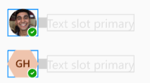

# @fluentui/react-persona Spec

Convergence epic issue: #24213

## Background

A Persona is a visual representation of a person or status that showcases an Avatar, PresenceBadge, or an Avatar with a PresenceBadge. This composite component is not a card, therefore it will not provide a visual board or a popup when the user hovers the Avatar.

Persona is used in PeoplePicker, Team's left rail and menus, chiclets, and Card.

## Prior Art

- OpenUI research: [Avatar/Persona](https://open-ui.org/components/avatar.research)
- v7/v8: [link](https://developer.microsoft.com/en-us/fluentui#/controls/web/persona)
  - > Note: v8's Persona is a combination of v9's Persona and Avatar (v8's Persona has a sub-component PersonaCoin that would count as Avatar, but is not exposed.). In v9 we've taken the approach of having a single component Avatar and another component Persona.
- v0: Does not have equivalent component.

## Anatomy


### Avatar, PresenceBadge, and Avatar + PresenceBadge

v8's Persona has a sub-component `PersonaCoin`, the equivalent in v9 is an Avatar. Currently Avatar is able to display a PresenceBadge, but this behavior will be deprecated in favor of Persona having this behavior.

Persona has a slot for an `Avatar` and `PresenceBadge`, giving the user the ability to display an Avatar, a PresenceBadge, or Combine them into an Avatar with presence.

## Sample Code


Persona with Avatar:

```jsx
<Persona name="Kevin Sturgis" secondaryText="Software Engineer" />
```


Persona with PresenceBadge:

```jsx
<Persona presenceOnly name="Kevin Sturgis" presence={{ status: 'offline', outOfOffice: true }} />
```



Persona with Avatar + PresenceBadge:

```jsx
<Persona
  name="Kevin Sturgis"
  secondaryText="Software Engineer"
  tertiaryText="Offline"
  presence={{ status: 'offline', outOfOffice: true }}
/>
```

## Variants

> I will refer to the avatar and presence as content.

There are three position variants:

- after: Content on the left and text on the right.
- below: Content on top and text on the bottom.
- before: Content on the right and text on the left.

There are two vertical alignment variants:

- start: Content is aligned on top with the text.
- center: Content and text are centered.

There are 3 content variants:

- Avatar
- PresenceBadge
- Avatar + PresenceBadge

There are 6 sizing variants: `extra-small`, `small`, `medium`, `large`, `extra-large`, `huge`.

## API

**Slots**

- `root`: The root slot for Persona.
- `avatar`: The Avatar to display and Persona's primary slot.
- `presence`: The PresenceBadge to display.
- `primaryText`: First line of text in Persona. By default its content will be the content of the `name` prop. It is highly encouraged to only use the `name` prop and only specify the content of `primaryText` when it is not a name.
- `secondaryText`: Second line of text in Persona.
- `tertiaryText`: Third line of text in Persona.
- `quaternaryText`: Fourth line of text in Persona.

**Types**

[Persona.types.ts](../src/components/Persona/Persona.types.ts)

## Structure

To avoid the [issue](https://github.com/microsoft/fluentui/issues/23386) v8 has, a css grid will be used instead of a flexbox that requires a general wrapper and a text container wrapper.

- _**Internal**_

```jsx
const coin = presenceOnly
  ? slots.presence && <slots.presence {...slotProps.presence} />
  : slots.avatar && <slots.avatar {...slotProps.avatar} />;

return (
  <slots.root {...slotProps.root}>
    {(textPosition === 'after' || textPosition === 'below') && coin}
    {slots.primaryText && <slots.primaryText {...slotProps.primaryText} />}
    {slots.secondaryText && <slots.secondaryText {...slotProps.secondaryText} />}
    {slots.tertiaryText && <slots.tertiaryText {...slotProps.tertiaryText} />}
    {slots.quaternaryText && <slots.quaternaryText {...slotProps.quaternaryText} />}
    {textPosition === 'before' && coin}
  </slots.root>
);
```

- _**DOM**_

```html
<div class="fui-Persona">
  <div {/* Avatar, PresenceBadge, or Avatar with PresenceBadge */} />
  <span class="fui-Persona__primaryText">{/* name */}</span>
  <span class="fui-Persona__secondaryText">Secondary Text</span>
  <span class="fui-Persona__tertiaryText">Tertiary Text</span>
  <span class="fui-Persona__quaternaryText">Quaternary Text</span>
</div>
```

## Migration

See [MIGRATION.md](./MIGRATION.md) for details.

## Behaviors

_Explain how the component will behave in use, including:_

- _Component States_
  - There are no states for this component, it's a visual representation.
- _Interaction_
  - _Keyboard_
    - Doesn't receive focus.
  - _Cursor_
    - Doesn't interact with cursor.
  - _Touch_
    - Doesn't interact with touch.
  - _Screen readers_
    - Contents will be read based on dom order.

## Accessibility

- There's no need for `aria-*` or/and`role`. Avatar and Badge already accessible and the text labels won't need anything as well.
