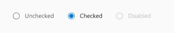
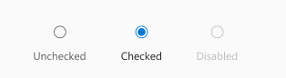
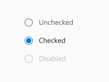
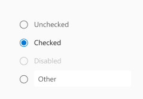
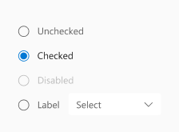

# @fluentui/react-radio Spec

A Radio allows a user to select a single value from two or more options. All Radios with the same `name` are considered to be part of the same group. However, a `RadioGroup` is recommended to add a group label, formatting, and other functionality.

## Background

### Prior Art

- [OpenUI research](https://open-ui.org/components/radio-button.research)
- [Epic](https://github.com/microsoft/fluentui/issues/19953)

### Comparison of [Fabric ChoiceGroup](https://developer.microsoft.com/en-us/fluentui#/controls/web/choicegroup) and [Stardust RadioGroup](https://fluentsite.z22.web.core.windows.net/components/radio-group/definition)

- All mentions of v7 or v8 refer to Fabric - `@fluentui/react` ([docsite](https://developer.microsoft.com/en-us/fluentui#/))
- All mentions of v0 refer to Northstar - `@fluentui/react-northstar` ([docsite](https://fluentsite.z22.web.core.windows.net/))

See Appendix for a detailed comparison of the two components.

In Fabric the Radio component is represented by the [ChoiceGroup](https://developer.microsoft.com/en-us/fluentui#/controls/web/choicegroup) component.
Fabric creates options based on data passed in via the `options` prop.
It uses the option's `key` property as the input value and holds the currently selected value in the `selectedKey` prop.
Fabric also allows an image to serve as a label for an option.

```tsx
<ChoiceGroup
  defaultSelectedKey="B"
  options={[
    { key: 'A', text: 'Option A' },
    { key: 'B', text: 'Option B' },
    { key: 'C', text: 'Option C', disabled: true },
    { key: 'D', text: 'Option D' },
  ]}
  label="Pick one"
  required={true}
/>
```

In Northstar the Radio component is represented by the [RadioGroup](https://fluentsite.z22.web.core.windows.net/components/radio-group/definition) component.
Northstar creates options based on data passed in via the `items` prop.
It uses the option's `value` property as the input value and holds the currently selected value in the `checkedValue` prop.

```tsx
<RadioGroup
  onCheckedValueChange={handleChange}
  items={[
    { key: '1', label: 'Make your choice', value: '1' },
    { key: '2', label: 'Another option', value: '2' },
  ]}
/>
```

## Variants

### Layout

#### Horizonal

Inline positioning of the inputs and labels.



#### Horizonal stacked

Positioning the label at the bottom of the radio inputs.



#### Vertical

Default vertical positioning of Radio items.



#### Vertical with input

Default positioning of Radio items with an input as its last Radio item.



### Vertical with dropdown

Default positioning of Radio items with a dropdown as its last Radio item.



## API

### Components

| Component         | Purpose                                                                         |
| ----------------- | ------------------------------------------------------------------------------- |
| RadioGroup        | Wraps radio inputs. Provides RadioGroupContext and layout for the radio items.  |
| RadioGroupContext | Provides some props like `name` to Radio items that are children of RadioGroup. |
| Radio             | Represents a single radio item (input and label).                               |

### RadioGroup

Link to [RadioGroup.types.ts](https://github.com/microsoft/fluentui/blob/master/packages/react-radio/src/components/RadioGroup/RadioGroup.types.ts)

| Prop           | Type                                                | Default value          | Purpose                                                  |
| -------------- | --------------------------------------------------- | ---------------------- | -------------------------------------------------------- |
| (root)         | slot: `<div role="radiogroup">`                     |                        | The root slot has the radiogroup role.                   |
| `name`         | `string`                                            | `useId('radiogroup-')` | Name property passed to child radios.                    |
| `value`        | `string`                                            |                        | Currently selected value. Used only for controlled mode. |
| `defaultValue` | `string`                                            |                        | Default selected value.                                  |
| `disabled`     | `boolean`                                           | `false`                | Disables all radio items inside the group.               |
| `layout`       | `"vertical" \| "horizontal" \| "horizontalStacked"` | `vertical`             | Specifies the layout of the radio items.                 |
| `onChange`     | `(event, data: { value: string }) => void`          |                        | Callback when a radio item is selected.                  |

### RadioGroupContext

This is a context object provided by RadioGroup that allows all of the child Radio items to have the same name, and coordinate the selected item.

The context contains the following props from RadioGroup:

- `name`
- `layout`
- `defaultValue`
- `value`
- `disabled`

### Radio

Link to [Radio.types.ts](https://github.com/microsoft/fluentui/blob/master/packages/react-radio/src/components/Radio/Radio.types.ts)

| Prop        | Type                         | Purpose                                                             |
| ----------- | ---------------------------- | ------------------------------------------------------------------- |
| (root)      | slot: `<span>`               | Wrapper for the input, indicator, and label                         |
| `input`     | slot: `<input type="radio">` | Hidden input element that handles the radio's behavior.             |
| `indicator` | slot: `<div>`                | The circular indicator to show the radio's checked/unchecked state. |
| `label`     | slot: `<Label>`              | Label that will be rendered next to the radio indicator.            |
| `value`     | `string`                     | The value of the RadioGroup when this Radio is selected             |
| `checked`   | `boolean`                    | Whether the input is checked or not.                                |
| `disabled`  | `boolean`                    | Whether the input is disabled or not.                               |

## Sample Code

A simple `RadioGroup`.

```jsx
<RadioGroup defaultValue="one">
  <Radio value="one" label="Option One" />
  <Radio value="two" label="Option Two" />
  <Radio value="three" label="Option Three" />
</RadioGroup>
```

`Radio` can be used without a `RadioGroup`, but it is then up to the user to add the same `name` to each item:

```jsx
<>
  <Radio name="number" value="one" label="Option One" defaultChecked />
  <Radio name="number" value="two" label="Option Two" />
  <Radio name="number" value="three" label="Option Three" />
</>
```

## Structure

### Expected DOM structure

```html
<div role="radiogroup" class="fui-RadioGroup" name="radiogroup-0">
  <span class="fui-Radio">
    <input type="radio" id="radio-1" name="radiogroup-0" value="one" checked />
    <div class="fui-Radio__indicator">
      <svg><circle /></svg>
    </div>
    <label class="fui-Label" for="radio-1">Option One</label>
  </span>

  <span class="fui-Radio">
    <input type="radio" id="radio-2" name="radiogroup-0" value="two" />
    <div class="fui-Radio__indicator">
      <svg><circle /></svg>
    </div>
    <label class="fui-Label" for="radio-2">Option Two</label>
  </span>

  <span class="fui-Radio">
    <input type="radio" id="radio-3" name="radiogroup-0" value="three" />
    <div class="fui-Radio__indicator">
      <svg><circle /></svg>
    </div>
    <label class="fui-Label" for="radio-3">Option Three</label>
  </span>
</div>
```

## Behaviors

### Mouse/Touch

The Radio's hit target fills the entire space around the indicator and label (including the padding).

### Keyboard

RadioGroup inherits all of its mouse and keyboard behaviors from the browser's handling of `<input type="radio">`.

- It has no special handling of clicks or keypresses for toggling beyond the built-in control.
- The browser handles arrow key selection, and creating a single tab stop for the control.

### Disabled

- Individual Radio items can be disabled, in which case they are grayed out and can't be selected or focused.
  - This interaction is built-into the browser by setting `disabled` on the `<input>` control.
- The entire RadioGroup can be disabled, which uses RadioGroupContext to disable all of the individual Radio items.

### Group Name

- All Radio items in a group must have the same `name` for the browser to handle keyboarding and selection.
- The RadioGroup provides its `name` through RadioGroupContext, and each Radio inside applies the `name`.
- If a `name` is not provided on RadioGroup, a unique name is automatically generated with `useId`.

## Accessibility

### RadioGroup

This implementation based on the [Grouping Controls](https://www.w3.org/WAI/tutorials/forms/grouping/) examples of Web Accessibility Tutorials (that follow WCAG).

- The RadioGroup root is a `<div role="radiogroup">` to provide the default accessibility behavior of a radiogroup.
- If a group label is added, the RadioGroup needs to have `aria-labelledby` referencing the label.

### Radio

- The Radio's primary slot is an `<input type="radio">`, with opacity 0, and covers the root.
  - This way, the Radio's hit target fills the entire space around the indicator and label (including the padding).
- The Radio's label is a `<label>` element with `for={input.id}` to associate it with the input slot.

<!--
## Migration
TBD: Link to Migration guide
-->

# Appendix

## v8 vs v0 comparison

### RadioGroup (v0) vs ChoiceGroup (v8) prop mapping

_⚠️ Props not included in this section are marked as deprecated and will not be considered._

| Purpose                                                                                           | Fabric (v8)        | Northstar (v0)       | Matching                                   |
| ------------------------------------------------------------------------------------------------- | ------------------ | -------------------- | ------------------------------------------ |
| Called after radio group value is changed.                                                        | onChange           | onCheckedValueChange | Matching 🛠️                                |
| The options/items for the group.                                                                  | options            | items                | Matching                                   |
| Additional CSS styles to apply to the component instance.                                         | styles             | styles               | Matching                                   |
| Initial checkedValue value.                                                                       | defaultSelectedKey | defaultCheckedValue  | Matching functionality, not implementation |
| Value of the currently checked radio item.                                                        | selectedKey        | checkedValue         | Matching functionality, not implementation |
| Theme - Override for theme site variables to allow modifications of component styling via themes. | theme              | variables            | Matching                                   |
| ID of an element to use as the aria label for this ChoiceGroup.                                   | ariaLabelledBy     | -                    | -                                          |
| Optional callback to access the `IChoiceGroup` interface.                                         | componentRef       | -                    | -                                          |
| Descriptive label for the choice group.                                                           | label              | -                    | -                                          |
| Accessibility behavior if overridden by the user.                                                 | -                  | accessibility        | -                                          |
| An element type to render as (string or component).                                               | -                  | as                   | -                                          |
| Additional CSS class name(s) to apply.                                                            | -                  | className            | -                                          |
| A vertical radio group displays elements vertically.                                              | -                  | vertical             | -                                          |
| -                                                                                                 | -                  | design               | -                                          |

### RadioItem (v0) vs ChoiceGroupOption (v8) props mapping

| Purpose                                                                         | Fabric (v8)        | Northstar (v0)   | Matching |
| ------------------------------------------------------------------------------- | ------------------ | ---------------- | -------- |
| A required key to uniquely identify the option.                                 | key (required)     | -                | -        |
| The text string for the option.                                                 | text (required) ❓ | label            | Matching |
| Call to provide customized styling that will layer on top of the variant rules. | styles             | styles           | Matching |
| A radio item can appear disabled and be unable to change states.                | disabled           | disabled         | Matching |
| Aria label of the option for the benefit of screen reader users.                | ariaLabel          | -                | -        |
| Props for an icon to display with this option.                                  | iconProps          | -                | -        |
| ID used on the option's input element.                                          | id                 | -                | -        |
| Alt text if the option is an image.                                             | imageAlt           | -                | -        |
| The width and height of the image in px for choice field.                       | imageSize          | -                | -        |
| Image to display with this option.                                              | imageSrc           | -                | -        |
| ID used on the option's label.                                                  | labelId            | -                | -        |
| Used to customize option rendering.                                             | onRenderField      | -                | -        |
| Used to customize label rendering.                                              | onRenderLabel      | -                | -        |
| The src of image for choice field which is selected.                            | selectedImageSrc   | -                | -        |
| Accessibility behavior if overridden by the user.                               | -                  | accessibility    | -        |
| Whether or not radio item is checked.                                           | -                  | checked          | -        |
| The checked radio item indicator can be customized.                             | -                  | checkedIndicator | -        |
| Initial checked value.                                                          | -                  | defaultChecked   | -        |
| The radio item indicator can be customized.                                     | -                  | indicator        | -        |
| The HTML input name.                                                            | -                  | name             | -        |
| Called after radio item checked state is changed.                               | -                  | onChange         | -        |
| Called after radio item is clicked.                                             | -                  | onClick          | -        |
| Whether should focus when checked                                               | -                  | shouldFocus      | -        |
| The HTML input value.                                                           | -                  | value            | -        |
| A vertical radio group displays elements vertically.                            | -                  | vertical         | -        |
| -                                                                               | -                  | as               | -        |
| -                                                                               | -                  | className        | -        |
| -                                                                               | -                  | variables        | -        |
| -                                                                               | -                  | design           | -        |
