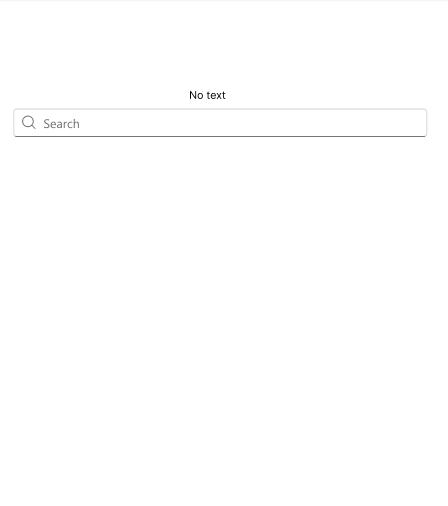
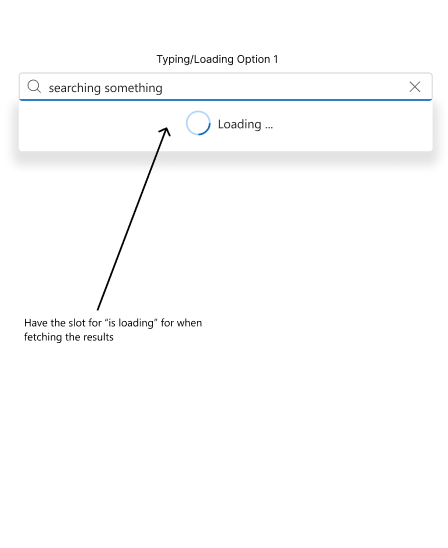
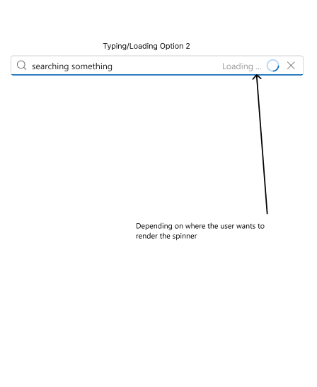
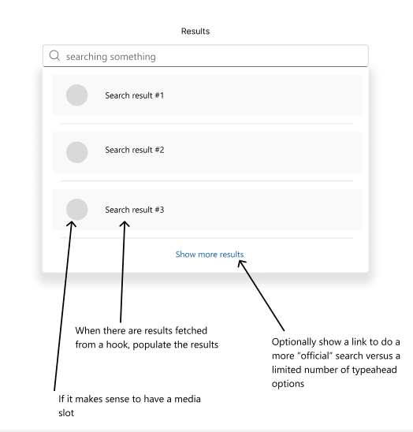

# @fluentui/react-search Typeahead Search spec

## Background

The [FluentUI design docs for SearchBox](https://fluent2.microsoft.design/components/web/react/core/searchbox/usage#content)
give the guidance about search results that render beneath the search box input box. The current
implementation of the Searchbox doesn't have a native typeahead feature.

## Prior Art

- [OpenUI research for ComboBox](https://open-ui.org/components/combobox.research/)
  - A combobox is a close comparison for this kind of typeahead search. However, a combobox
    appears to be better suited to a finite, known set of options, whereas support for dynamically
    fetched options of an unknown size isn't there.
- [FluentUI design docs for SearchBox](https://fluent2.microsoft.design/components/web/react/core/searchbox/usage#content)
  - The design docs make a mention of how to sort results, but how to render those results
    would be left to a developer
- [Autocomplete or typeahead - Azure AI search | Microsoft Learn](https://learn.microsoft.com/en-us/azure/search/search-add-autocomplete-suggestions)
- [FluentUI Blazor Search](https://www.fluentui-blazor.net/Search#documentation)
  - There is an "autocomplete" section
- [Typeahead.js](https://typeahead.js.org/examples/)
  - The examples do mostly have pre-fetched options versus dynamically fetching

## Sample Code

_Provide some representative example code that uses the proposed API for the component_

```typescript
<TypeaheadSearchbox
  onInputChange={handleSearch} // User-defined, using something like TanStack Query
  onItemSelect={handleSelectedResult} // User-defined
  isLoading={isLoading} // User-defined, using something like TanStack Query
  resultList={listOfResults} // User-defined, using something like TanStack Query
>
  // Searchbox
  <SearchBox
    {...props}
    loadingComponent={<Spinner {...props}/>} // If user wants to have a spinner in the searchbox itself
  >
  // Dropdown
  <TypeaheadResultsDropdown
    appearance=""
    loadingComponent={<Spinner {...props}/>} // If user wants to have a spinner in the dropdown
  >
    // List of search results
    {resultList.map(() => {
      // for every search result
      return (
        <ResultItem
          text="something-derived"
          media={<someComponent/>}
          onClick={handleResultSelect} // User-defined; eg. Go to specific url for Result
          disabled={}
        >
          <SomeCustomObject> // Maybe some flexibility of whether there can be a child component
        </ResultItem>
      )
    })}
  </TypeaheadResultsDropdown>
<TypeaheadSearchbox>
```

## Variants

This could be a wrapper around an existing searchbox component - such that there was a searchbox
child component - or maybe this could be a variant/configurable part of the existing searchbox
component.

## API

_List the **Props** and **Slots** proposed for the component. Ideally this would just be a link to the component's `.types.ts` file_

## Structure

### Public

```tsx
<TypeaheadSearchbox onInputChange={} onItemSelect={} isLoading={} resultList={}></TypeaheadSearchbox>
```

- _**Internal**_
- _**DOM** - how the component will be rendered as HTML elements_

## Migration

n/a

## Behaviors

_Explain how the component will behave in use, including:_

- _Component States_ - Input should visually behave like a regular searchbox in most cases

  - Rest: no text has been entered
    

  - Focus: cursor to type ready
  - Focus: typing begins

    - Option 1: The dropdown has a Spinner to indicate the results are loading

      

    - Option 2: The searchbox itself has a slot for a spinner while the results are loading

      

  - Focus: Typing has stopped, results have returned and are rendered in a finite list in a dropdown.
    The results have some indicators of uniqueness (name as text, maybe something like an Avatar
    as media, etc). _Optionally_ there could be a `show more results` to link to a more robust
    search result page.

    

- _Interaction_
  - _Keyboard_: A user of the searchbox should be able to navigate the options using the `ArrowUp` and
    `ArrowDown` keys to traverse the list. To select a result, `Enter` (should achieve the same
    functionality as clicking on the item with a cursor). To clear results, `Escape` or similar key.
  - _Cursor_: A user can click on the result from the list that they want to interact with. If this
    is merely to select a fetched option (like a combobox), that is supported. If the selection
    should navigate to a new page/URL, that is supported.
  - _Touch_: Should behave the same as a cursor
  - _Screen readers_: Should indicate that the items are being fetched when in the `isLoading` state
    is active, and should reader the results list much like a regular dropdown

## Accessibility

Base accessibility information is included in the design document. After the spec is filled and review, outcomes from it need to be communicated to design and incorporated in the design document.

- Decide whether to use **native element** or follow **ARIA** and provide reasons
- Identify the **[ARIA](https://www.w3.org/TR/wai-aria-practices-1.2/) pattern** and, if the component is listed there, follow its specification as possible.
- Identify accessibility **variants**, the `role` ([ARIA roles](https://www.w3.org/TR/wai-aria-1.1/#role_definitions)) of the component, its `slots` and `aria-*` props.
- Describe the **keyboard navigation**: Tab Oder and Arrow Key Navigation. Describe any other keyboard **shortcuts** used
- Specify texts for **state change announcements** - [ARIA live regions
  ](https://developer.mozilla.org/en-US/docs/Web/Accessibility/ARIA/ARIA_Live_Regions) (number of available items in dropdown, error messages, confirmations, ...)
- Identify UI parts that appear on **hover or focus** and specify keyboard and screen reader interaction with them
- List cases when **focus** needs to be **trapped** in sections of the UI (for dialogs and popups or for hierarchical navigation)
- List cases when **focus** needs to be **moved programmatically** (if parts of the UI are appearing/disappearing or other cases)
