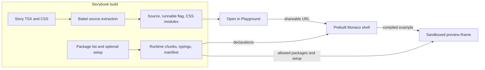

# @fluentui/react-storybook-addon-playground

**Configurable Storybook TSX playground for [Fluent UI React](https://developer.microsoft.com/en-us/fluentui)**

This addon serves a prebuilt Monaco playground shell and adds an **Open in Playground** button next to "Show code" in
Storybook Docs mode. The consumer's Storybook Webpack build produces a separate runtime for React, configured packages,
an optional setup module, and Monaco declarations. User code runs inside a sandboxed preview iframe.



The shell is built and published with the addon. Each consuming Storybook builds its own runtime from installed
packages; the browser never installs packages or fetches code from a runtime CDN. See the
[specification and proposed follow-ups](docs/Spec.md) for the source pipeline, runtime boundaries, and roadmap.

## Features

- Consumer-controlled package list or import map (`options.modules`) compiled by Storybook Webpack and loaded on demand
  in production
- Private registry and workspace packages without a runtime CDN
- Build-time declaration collection for Monaco IntelliSense (from `modules` + optional `typings`), split per module and
  fetched when the code imports it
- Optional TSX `setup` module for branding, themes and provider/render behavior (Fluent defaults when omitted)
- Sandboxed preview (`sandbox="allow-scripts"`), Prettier formatting, error reporting and shareable URL state
- Live preview updates reuse the sandbox and loaded packages, with an explicit restart for a clean environment
- Console panel, type-error count, CSS module tabs you can add and remove, and preview width presets
- Compile errors link to their line in the editor; either pane can be maximized; `Cmd/Ctrl+S` formats the code and
  writes it to the link in the address bar; the active file can be copied from the editor header

## Installation

```sh
yarn add @fluentui/react-storybook-addon-playground
```

The optional `typescript` peer used for declaration parsing must be version 5.0 or newer. The editor itself uses the
TypeScript version bundled with its prebuilt Monaco shell.

## Usage

```js
// .storybook/main.js
const path = require('path');

module.exports = {
  addons: [
    {
      name: '@fluentui/react-storybook-addon-playground',
      options: {
        modules: ['@fluentui/react-components', '@fluentui/react-icons'],
        setup: path.resolve(__dirname, './playground.setup.tsx'), // optional
        // typings: ['@fluentui/react-theme'], // optional declaration-only entries
      },
    },
  ],
};
```

```js
// .storybook/preview.js
import '@fluentui/react-storybook-addon-playground/styles.css';
```

List packages in `modules` when their import names and resolved requests match. React runtime entries are provided
automatically, so they do not need to be listed. `typings` adds declaration-only entries without making them importable.

Use an import map only when an editor import should resolve to a different package or local module:

```js
options: {
  modules: {
    '@fluentui/react-components': '@fluentui/react-components',
    '@fluentui/react-icons': path.resolve(__dirname, './playground-icons.ts'),
  },
}
```

For example, `playground-icons.ts` can re-export only the icons your stories need. This keeps the public
`@fluentui/react-icons` import in examples without exposing the whole icon namespace to the playground.

Production builds load configured modules only when the example imports them. Development includes the modules in eager
chunks, but defers their evaluation until imported, avoiding Storybook's separate-origin lazy-compilation server.
Setup imports and React are always loaded at startup.
Typings load independently and do not block the first preview. React and `typings` declarations always load; each
configured module's declarations are a separate file fetched once the code imports that module, so examples that do not
use `@fluentui/react-icons` skip its large declarations. Declaration collection excludes JavaScript implementations,
falls back to `@types` packages when a runtime package does not ship declarations, and parses imports with the
project's `typescript` (an optional peer; a regular-expression parser is used without it).

The addon reads its options from Storybook's preset options, generates its runtime entry in
`node_modules/.cache/fluentui-playground-runtime/` (next to the Storybook config), and keeps the runtime out of Storybook
pages through `html-webpack-plugin` hooks. The editor packages (`monaco-editor` 0.52 with TypeScript 5.4, Prettier,
PostCSS) are root build-time dependencies, bundled into the prebuilt shell and not installed with the addon. Declarations are collected for the
TypeScript version bundled with Monaco, so packages with `typesVersions` resolve the matching declaration tree.

Configuring the full `@fluentui/react-icons` package still bundles its whole namespace into an on-demand runtime chunk;
lazy loading avoids loading it for examples that do not import icons, but does not split individual icons. Per-icon
chunking is a [documented follow-up](docs/Spec.md#deferred), not part of the initial implementation.

### Live preview updates

The preview keeps its opaque-origin sandbox and loaded packages between edits. Updates run after a 150 ms pause.
TypeScript output is cached by editor model version, and unchanged CSS modules are not recompiled. Shared playground
links use the same live-update behavior.

- JavaScript edits remount the example component and reset its React state. This is runtime reuse, not React Fast Refresh.
- CSS declaration edits use stable file-scoped class names and update the existing component without resetting its state.
  Adding or removing local class names reevaluates the example so its imported class map remains accurate.
- Theme changes reuse the component; a custom setup's render tree can still cause a remount.
- **Run** explicitly reevaluates and remounts the example. **Restart preview** creates a clean sandbox without changing the
  editor code.
- Timers (`setTimeout`, `setInterval`, `requestAnimationFrame`) and `window`/`document` listeners created while the
  example module is evaluated are disposed when a newer version renders. React effect cleanup runs when the component
  unmounts. Other global mutations, and timers or listeners created later (for example inside callbacks), may remain;
  use Restart preview when debugging lifecycle behavior or whenever a clean environment is needed.
- Syntax/import/module-evaluation errors leave the previous preview visible. A component render error can clear the live
  preview; the next valid edit renders again, and Restart preview is available to reset a broken environment.

The sandbox remains `allow-scripts` only; live updates never add `allow-same-origin`.

### Preview sandbox

- The preview is an opaque-origin `srcdoc` iframe with `sandbox="allow-scripts"`. Messages to the shell target the
  shell's origin; messages from the shell are authenticated by source window and a per-sandbox token.
- A Content Security Policy only allows scripts, styles, fonts and network requests from the origins that serve the
  Storybook runtime. `fetch`/XHR/WebSocket to other origins, nested frames and form submissions are blocked. Images and
  media can load from any HTTPS URL.
- `console.*` output is forwarded to the **Console** panel below the preview (rate limited to 100 messages per second).
  It is cleared whenever the example remounts, on **Run** and on **Restart preview**.

### Shared links

Links store the code and CSS modules in the URL hash (`#code=…&css=…&title=…&v=1`), compressed with lz-string. `v` is
the format version; links without it are read as version 1. The optional `title` names the example (the **Open in
Playground** button sets it to `Component: Story`) and is shown in the header and the browser tab. Payloads longer than
200,000 characters are rejected, and decoding stops once the code or styles would exceed 1,000,000 characters, so a
small crafted link cannot expand into a huge document. The playground warns when a link cannot be fully read (for
example when a chat app truncated it) and when **Copy link** produces a URL longer than 8,000 characters.
`readPlaygroundHash` exposes the same parser for tools that create or inspect links.

The shell loads `../runtime/manifest.json` by default. A `?manifest=` query parameter can point it at another runtime
on the same origin (cross-origin manifests are ignored).

The optional setup module default-exports a value created with `definePlaygroundSetup`:

```tsx
import * as React from 'react';
import { FluentProvider, webLightTheme } from '@fluentui/react-components';
import { definePlaygroundSetup } from '@fluentui/react-storybook-addon-playground/setup';

export default definePlaygroundSetup({
  title: 'Fluent UI Playground',
  defaultCode: `import { Button } from '@fluentui/react-components';

export default () => <Button>Hello</Button>;`,
  themes: [{ id: 'web-light', label: 'Web Light', value: webLightTheme }],
  render: ({ Component, theme }) => (
    <FluentProvider theme={theme ?? webLightTheme}>
      <Component />
    </FluentProvider>
  ),
});
```

When `setup` is omitted, the addon's built-in Fluent UI default setup is used.

### Story source

The button reads the story source from `parameters.fullSource`, which is injected at build time by
`@fluentui/babel-preset-storybook-full-source` (registered by `@fluentui/react-storybook-addon-export-to-sandbox`).
Other consumers can populate the same parameter with their own Storybook source transform. The button is not rendered
when `parameters.fullSource` is unavailable, `parameters.fullSourceIsRunnable` is `false`, or the story imports a
package that is not listed in `options.modules` (type-only imports are ignored). The runnable flag describes source
extraction completeness, not package availability; the addon checks the allowlist separately.

`parameters.fullSourceUnsupportedImports` retains diagnostic specifiers and is also checked for compatibility with
older transforms. Legacy or third-party source without the runnable flag remains supported. A non-runnable source
string is still available for Docs source display.

CSS module tabs are enabled by the source transform's `cssModules` option: the transform preserves CSS imports and
attaches `parameters.cssModuleSources`, which the playground passes through its URL state into the editor. The
export-to-sandbox addon currently registers that shared Babel transform; it is not the playground's execution engine.
Separating source extraction from external sandbox export is a [proposed architectural follow-up](docs/Spec.md#follow-ups).

### Disabling per story

```ts
export const MyStory = () => <Button />;
MyStory.parameters = { playground: { disable: true } };
```

## Development (monorepo)

The playground **shell** is a separate webpack bundle (Monaco + UI). The repository Storybooks load the addon's compiled
preset and preview code, not an in-memory TypeScript preset. Build the addon and shell together before loading it:

```sh
yarn nx run react-storybook-addon-playground:build
```

The v9 docsite's Storybook build and development targets use Nx's `^build` dependency graph to prepare the addon,
runtime packages, and declarations. Start it through Nx so those prerequisites are honored:

```sh
yarn nx run public-docsite-v9:start
```

Story source still uses the docsite's normal TypeScript path aliases; those aliases are not used to load the addon.

The **runtime** (configured modules, setup, typings, `manifest.json`) is emitted by Storybook's Webpack build into
`playground/runtime/`. The shell is served at `playground/app/playground.html`.

Browser tests (Playwright) build a small fixture runtime with the addon's real `webpackFinal` hook, serve it next to the
prebuilt shell and cover the default setup, shared links, live CSS/theme updates, error recovery, Restart, lazy
modules, the console panel and CSP, type-error count, CSS module management and preview widths:

```sh
yarn nx run react-storybook-addon-playground:e2e
```

## Limitations

- Only configured packages, the built-in React entries, and CSS modules can be imported. CSS modules shipped with a
  story (via `parameters.cssModuleSources`) or added with the **+** button appear as editor tabs, compile on edit, and
  are injected into the sandbox as hashed class maps plus a `<style>` tag. Other relative imports are not supported.
- Type errors are shown in the editor and counted in the editor header, but do not block running the code.
