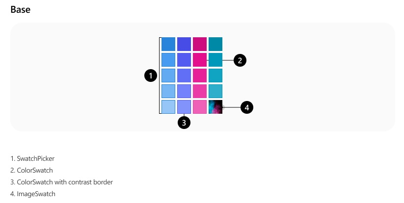
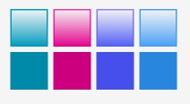
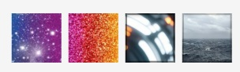
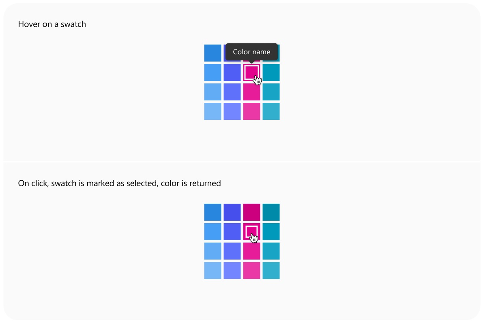
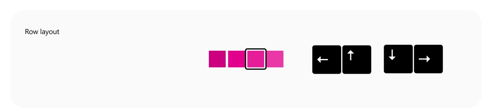
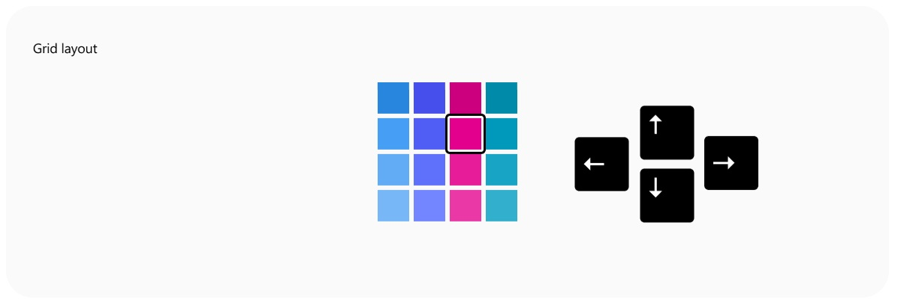
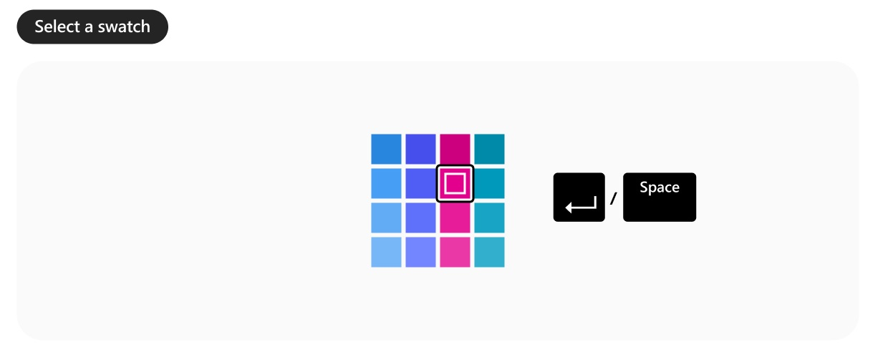
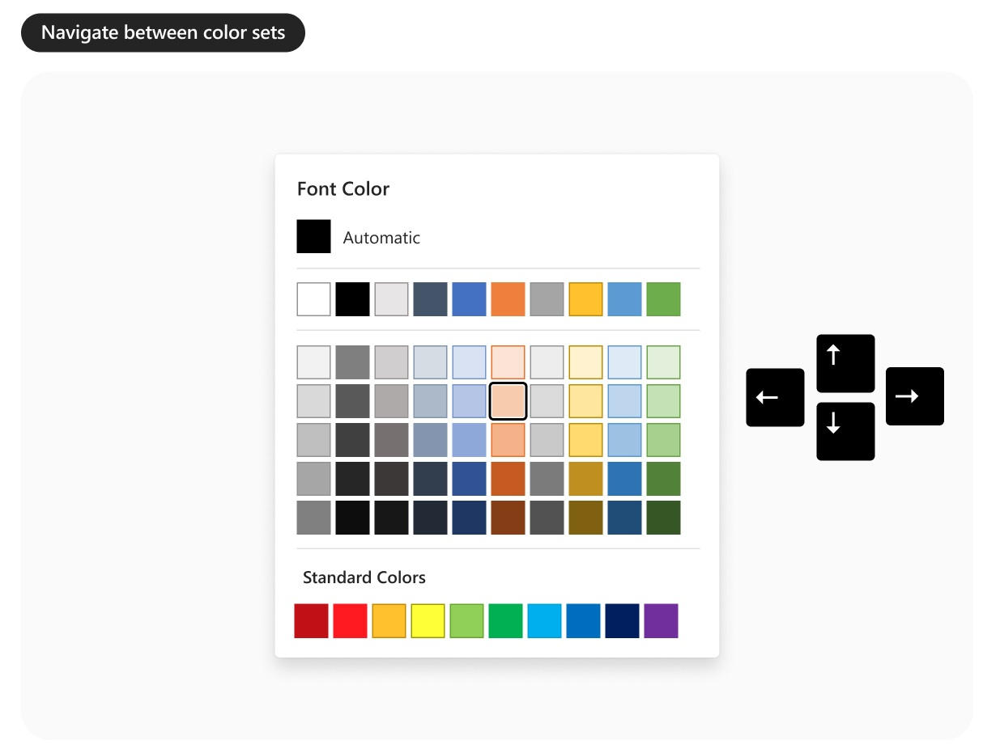
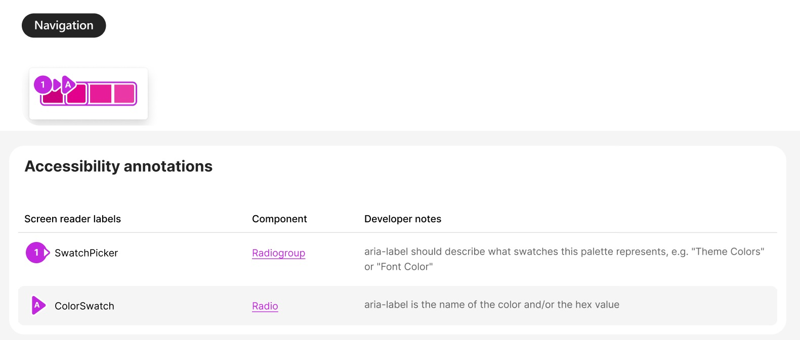
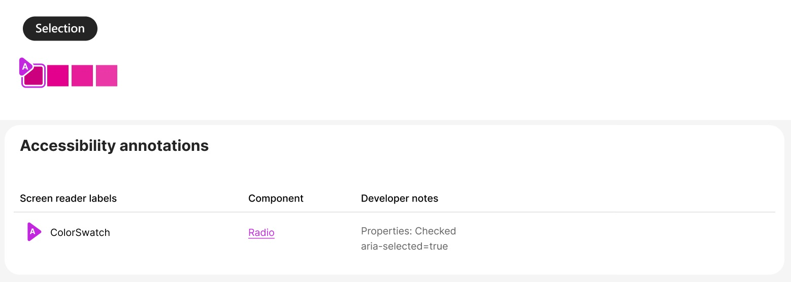

# @fluentui/react-swatch-picker-preview Spec

## Background

A SwatchPicker is used in graphic and text editors.
It allows user to choose a needed color, image or pattern.

The SwatchPicker can be integrated within a popover or used as a standalone feature.

## Prior Art

- [Convergence epic](https://github.com/microsoft/fluentui/issues/28606)

### Fabric (v8)

```jsx
import { IColorCellProps, SwatchColorPicker } from '@fluentui/react/lib/SwatchColorPicker';

const colorCellsExample = [
  { id: 'a', label: 'orange', color: '#ca5010' },
  { id: 'b', label: 'cyan', color: '#038387' },
  { id: 'c', label: 'blueMagenta', color: '#8764b8' },
  { id: 'd', label: 'magenta', color: '#881798' },
  { id: 'e', label: 'white', color: '#ffffff' },
];

export const SwatchColorPickerBasicExample: React.FunctionComponent = () => {
  const [previewColor, setPreviewColor] = React.useState<string>();
  const baseId = useId('colorpicker');

  const swatchColorPickerOnCellHovered = (id: string, color: string) => {
    setPreviewColor(color!);
  };

  return (
    <>
      <div id={`${baseId}-custom-size`}>Simple square swatch color picker</div>
      <SwatchColorPicker
        columnCount={5}
        cellHeight={35}
        cellWidth={35}
        cellShape={'square'}
        colorCells={colorCellsExample}
        onCellHovered={swatchColorPickerOnCellHovered}
        aria-labelledby={`${baseId}-custom-size`}
      />
    </>
  );
};
```

### 3rd party Design Systems

- Adobe Spectrum
  - [SwatchGroup](https://spectrum.adobe.com/page/swatch-group/)
  - [Swatch](https://spectrum.adobe.com/page/swatch/)

### Components

| Purpose                                                      | Fabric (V8)         | V9           | Matching? |
| ------------------------------------------------------------ | ------------------- | ------------ | --------- |
| Component responsible for rendering swatches as row and grid | SwatchColorPicker   | SwatchPicker | ⚠️        |
| Color cell                                                   | ColorPickerGridCell | ColorSwatch  | ⚠️        |
| Image cell                                                   |                     | ImageSwatch  | ❌        |

## Sample Code

```jsx
<SwatchPicker aria-label="Font color" layout="grid" columnCount={3}>
  <ColorSwatch value="#FF1921" aria-label="Red" />
  <ColorSwatch value="#FFC12E" aria-label="Orange" />
  <ColorSwatch value="#FEFF37" aria-label="Yellow" />
  <ColorSwatch value="#00B053" aria-label="Green" />
  <ColorSwatch value="#00AFED" aria-label="Light Blue" />
  <ColorSwatch value="#006EBD" aria-label="Blue" />
  <ColorSwatch value="#712F9E" aria-label="Purple" icon={<SomeIcon />} />
  <ImageSwatch value="./path/image1.png" disabled aria-label="Space craft" />
  <ImageSwatch value="./path/image2.png" aria-label="Planets" />
</SwatchPicker>
```

## Variants

### Layout variants

- Grid
- Row

For the grid layout maximum recommended amount of swatches is 64 - 8x8 grid.
For the row layout it's 8 swatches.

To use grid layout it should be more than 4 swatches.

### Swatch Variants

- Color
- Gradient
- Image
- Pattern / texture

### Shapes

- `square` (default)
- `circular`
- `rounded`

Border radius for rounded shape can be customized via CSS.

### Size

- `extraSmall`: 20px
- `small`: 24px
- `medium` (default): 28px
- `large`: 32px

Custom size can be set by overriding `width` and `height` of the ColorSwatch or ImageSwatch.

### Spacing

- `small`: 2px
- `medium` (default): 4px

### States

- `rest`
- `hover`
- `pressed`
- `selected`
- `selected pressed`
- `selected hover`
- `focused`
- `disabled` - should be used with caution. In case if there are too many disabled swatches it's better to hide them.
- `empty`

## API

### SwatchPicker

| Property             | Values                                   | Default   | Purpose                                |
| -------------------- | ---------------------------------------- | --------- | -------------------------------------- |
| disabled             | `boolean`                                | `false`   | Whether SwatchPicker is disabled       |
| layout               | `row`, `grid`                            | `row`     | Sets layout of the SwatchPicker        |
| onChange             | `function`                               | undefined | Callback called when color is selected |
| shape                | `square`, `circular`, `rounded`          | `square`  | Sets shape                             |
| size                 | `extraSmall`, `small`, `medium`, `large` | `medium`  | Defines size of the Swatch cell        |
| spacing              | `small`, `medium`                        | `medium`  | Sets spacing between rows and cells    |
| selectedValue        | `string`                                 |           | Selected swatch                        |
| defaultSelectedValue | `string`                                 |           | Default selected swatch                |

| Slots | Values | Default | Description                  |
| ----- | ------ | ------- | ---------------------------- |
| root  | `div`  | `div`   | The root of the SwatchPicker |

### ColorSwatch

| Property | Values                                   | Default  | Purpose                          |
| -------- | ---------------------------------------- | -------- | -------------------------------- |
| color    | `string`                                 |          | Color in hex, RGB or named color |
| shape    | `square`, `circular`, `rounded`          | `square` | Sets shape                       |
| size     | `extraSmall`, `small`, `medium`, `large` | `medium` | Defines size of the Swatch cell  |
| disabled | `boolean`                                |          |                                  |
| empty    | `boolean`                                |          |                                  |

| Slots        | Values   | Default  | Description                         |
| ------------ | -------- | -------- | ----------------------------------- |
| root         | `button` | `button` | The root of the ColorSwatch element |
| icon         | `span`   | `span`   | Swatch with icon                    |
| disabledIcon | `span`   | `span`   | Disabled icon                       |

### ImageSwatch

| Property | Values                                   | Default  | Purpose                         |
| -------- | ---------------------------------------- | -------- | ------------------------------- |
| shape    | `square`, `circular`, `rounded`          | `square` | Sets shape                      |
| size     | `extraSmall`, `small`, `medium`, `large` | `medium` | Defines size of the Swatch cell |
| src      | `string`                                 |          | URL of an image                 |
| disabled | `boolean`                                |          |                                 |
| empty    | `boolean`                                |          |                                 |

| Slots        | Values   | Default  | Description                         |
| ------------ | -------- | -------- | ----------------------------------- |
| root         | `button` | `button` | The root of the ColorSwatch element |
| icon         | `span`   | `span`   | Swatch with icon                    |
| disabledIcon | `span`   | `span`   | Disabled icon                       |

## Structure

### Components

| Component    | Purpose                                                              |
| ------------ | -------------------------------------------------------------------- |
| SwatchPicker | Renders SwatchPicker which can represent swatches as a row or a grid |
| ColorSwatch  | Renders a color or an icon                                           |
| ImageSwatch  | Renders an image, texture or a pattern                               |

#### SwatchPicker component



#### DOM

```HTML
<div role="radiogroup" aria-label="Color grid" class="fui-SwatchPicker">
  <!-- Content rendered here -->
</div>
```

#### ColorSwatch component

is used for picking colors:

- solid color
- gradient



#### DOM

```HTML
<button
  role="radio"
  aria-selected="true"
  style="--fui-SwatchPicker--color: #ff0099"
  aria-label="Pink"
  class="fui-ColorSwatch"
>
</button>
<button
  role="radio"
  aria-selected="false"
  style="--fui-SwatchPicker--color: #ff0000"
  aria-label="Yellow with icon"
  class="fui-ColorSwatch"
>
  <span class="fui-ColorSwatch__icon r0">
    <!-- Icon rendered here -->
  </span>
</button>
```

#### ImageSwatch component

is used to pick images:

- image
- texture
- pattern



#### DOM

```HTML
<button
  role="radio"
  aria-selected="true"
  style="--fui-SwatchPicker--image: {url}"
  aria-label="Image name"
  class="fui-ColorSwatch"
>
</button>
```

## Migration

### Fabric (v8) property mapping

#### Props no longer supported with an equivalent functionality in SwatchPicker V9:

- `colorCells ` => Use `children` prop instead.
- `cellBorderWidth` - customizable via CSS.
- `cellHeight`, `cellWidth` and `width` - use `size` prop instead. For custom size use CSS.
- `cellMargin` - use `spacing` instead.
- `cellShape` - use `shape` instead.
- `className` => Slot system supports it by default. We don't need to provide it explicitly.
- `styles` => Use style customization through `className` instead.
- `theme`
- `defaultSelectedId` => use `defaultSelectedValue` instead
- `selectedId` => use `selectedValue` instead

#### Props no longer supported

- `ariaPosInSet`
- `ariaSetSize`
- `doNotContainWithinFocusZone`
- `focusOnHover`
- `getColorGridCellStyles`
- `mouseLeaveParentSelector`
- `onCellFocused`
- `onCellHovered`
- `onRenderColorCell` => Custom render function for the color cell. This can replace the entire button element, including the default focus and hover states.
- `onRenderColorCellContent` => Custom render function for inner content of the color cell. This will retain the cell's default button behavior and overrides just the inner content.
- `shouldFocusCircularNavigate`

#### Props supported

- `columnCount`
- `disabled`
- `onChange`

#### Property Mapping

| v8 `SwatchColorPicker` | v9 `SwatchPicker` |
| ---------------------- | ----------------- |
| `className`            |                   |
| `columnCount `         | `columnCount `    |
| `ariaPosInSet`         |                   |
| `ariaSetSize`          |                   |
| `cellBorderWidth`      |                   |
|                        | `size`            |

## Behaviors

### Mouse

Swatch is highlighted on `hover` and tooltip with color label is shown.

When SwatchPicker is within a popup, it's possible to have a preview of the color on `hover` for a target's object.



Swatch is selected on `click`.

States:

1. Rest
2. OnHover

   Tooltip with color label is shown.
   It's possible to have preview of a color without selecting it.

3. OnClick

   Color is selected.

### Keyboard

#### Navigation

In a `row` layout top/right arrows move to the right, bottom/left arrows move to the left.

**Row layout**


**Grid layout**


When navigating between swatches in a popup, it's possible to preview colors. A target object's color changes but it is not selected. If a user clicks `Esc`, the target object changes back to its original color and the popup is closed.

#### Select a swatch



| Key              | Result                                                |
| ---------------- | ----------------------------------------------------- |
| `Space`, `Enter` | A swatch is selected                                  |
| Arrows           | A swatch is focused/active but color is not selected. |
| `Esc`            | Removes focus/ closes popup                           |
| `Home/PgUp`      | Focus on a first swatch                               |
| `End/PgDn`       | Focus on a last swatch                                |

The SwatchPicker can be used within a popup or a context menu. When a color is selected, the popup or context menu should be closed.

#### Navigation between color sets

Colors within color sets are mutually exclusive, meaning that only one color can be selected across all sets.



| Key    | Result                                              |
| ------ | --------------------------------------------------- |
| `Tab`  | Navigation between color sets                       |
| Arrows | A user can navigate between swatches and color sets |

## Accessibility

Use `tab` key to navigate to the first item in the SwatchPicker or to navigate between color sets.
Use arrows to move between the swatches.

For the set of colors `aria-label` or `aria-labelby` should be provided.

`aria-label` is set for each swatch with the color description. For selected item `aria-selected=true` should be set. All other swathces should have `aria-selected=false`.

SwatchPicker component has role `radiogroup`.
ColorSwatch and ImageSwatch have role `radio`.




