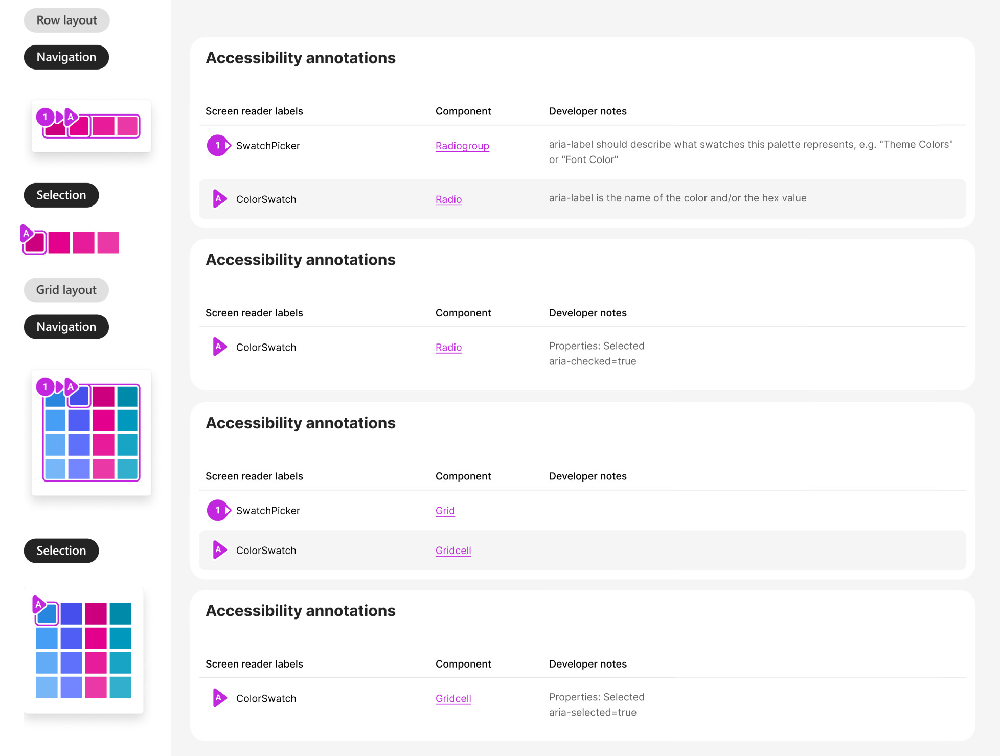

# @fluentui/react-swatch-picker-preview Spec

## Background

A SwatchPicker is used in graphic and text editors.
It allows user to choose a needed color, image or pattern.

The SwatchPicker can be integrated within a popover or used as a standalone feature.

## Prior Art

- [Convergence epic](https://github.com/microsoft/fluentui/issues/28606)

### Fabric (v8)

```jsx
import { IColorCellProps, SwatchColorPicker } from '@fluentui/react/lib/SwatchColorPicker';

const colorCellsExample = [
  { id: 'a', label: 'orange', color: '#ca5010' },
  { id: 'b', label: 'cyan', color: '#038387' },
  { id: 'c', label: 'blueMagenta', color: '#8764b8' },
  { id: 'd', label: 'magenta', color: '#881798' },
  { id: 'e', label: 'white', color: '#ffffff' },
];

export const SwatchColorPickerBasicExample: React.FunctionComponent = () => {
  const [previewColor, setPreviewColor] = React.useState<string>();
  const baseId = useId('colorpicker');

  const swatchColorPickerOnCellHovered = (id: string, color: string) => {
    setPreviewColor(color!);
  };

  return (
    <>
      <div id={`${baseId}-custom-size`}>Simple square swatch color picker</div>
      <SwatchColorPicker
        columnCount={5}
        cellHeight={35}
        cellWidth={35}
        cellShape={'square'}
        colorCells={colorCellsExample}
        onCellHovered={swatchColorPickerOnCellHovered}
        aria-labelledby={`${baseId}-custom-size`}
      />
    </>
  );
};
```

### 3rd party Design Systems

- Adobe Spectrum
  - [SwatchGroup](https://spectrum.adobe.com/page/swatch-group/)
  - [Swatch](https://spectrum.adobe.com/page/swatch/)

### Components

| Purpose                                                      | Fabric (V8)         | V9              | Matching? |
| ------------------------------------------------------------ | ------------------- | --------------- | --------- |
| Component responsible for rendering swatches as row and grid | SwatchColorPicker   | SwatchPicker    | ⚠️        |
| Color cell                                                   | ColorPickerGridCell | ColorSwatch     | ⚠️        |
| Image cell                                                   |                     | ImageSwatch     | ❌        |
| Empty cell                                                   |                     | EmptySwatch     | ❌        |
| Row component for a grid layout                              |                     | SwatchPickerRow | ❌        |

## Sample Code

```jsx
<SwatchPicker aria-label="Font color">
  <ColorSwatch color="#FF1921" value="FF1921" aria-label="Red" />
  <ColorSwatch color="#FFC12E" value="FFC12E" aria-label="Orange" />
  <ColorSwatch color="FEFF37" value="FEFF37" aria-label="Yellow" />
  <ColorSwatch color="00B053" value="00B053" aria-label="Green" />
  <ColorSwatch color="00AFED" value="00AFED" aria-label="Light Blue" />
  <ColorSwatch color="006EBD" value="006EBD" aria-label="Blue" />
  <ColorSwatch color="712F9E" value="712F9E" aria-label="Purple" icon={<SomeIcon />} />
  <ImageSwatch src="./path/image1.png" value="space-craft-img" disabled aria-label="Space craft" />
  <ImageSwatch src="./path/image2.png" value="planets-img" aria-label="Planets" />
</SwatchPicker>
```

## Variants

### Layout variants

- Grid
- Row

For the grid layout maximum recommended amount of swatches is 64 - 8x8 grid.
For the row layout it's 8 swatches.

To use grid layout it should be more than 4 swatches.

### Swatch Variants

- Color
- Gradient
- Icon
- Symbol
- Image
- Pattern / texture
- Empty
- No color

### Shapes

- `square` (default)
- `circular`
- `rounded`

Border radius for rounded shape can be customized via CSS.

### Size

- `extraSmall`: 20px
- `small`: 24px
- `medium` (default): 28px
- `large`: 32px

Custom size can be set by overriding `width` and `height` of the ColorSwatch or ImageSwatch.

### Spacing

- `small`: 2px
- `medium` (default): 4px

### States

- `rest`
- `hover`
- `pressed`
- `selected`
- `selected pressed`
- `selected hover`
- `focused`
- `disabled` - should be used with caution. In case if there are too many disabled swatches it's better to hide them.
- `empty`

## API

### SwatchPicker

| Property             | Values                                   | Default   | Purpose                                 |
| -------------------- | ---------------------------------------- | --------- | --------------------------------------- |
| defaultSelectedValue | `string`                                 |           | Default selected swatch                 |
| layout               | `grid`, `row`                            | `row`     | Sets layout of the SwatchPicker         |
| onSelectionChange    | `function`                               | undefined | Callback called when swatch is selected |
| shape                | `square`, `circular`, `rounded`          | `square`  | Sets shape                              |
| size                 | `extraSmall`, `small`, `medium`, `large` | `medium`  | Defines size of the Swatch cell         |
| spacing              | `small`, `medium`                        | `medium`  | Sets spacing between rows and cells     |
| selectedValue        | `string`                                 |           | Selected swatch                         |

Note:
For grid layout use `SwatchPickerRow` component.

To simplify usage of grid layout use `renderUtils`.

```ts
import { renderSwatchPickerGrid } from '@fluentui/react-swatch-picker-preview';
```

```tsx
<SwatchPicker
  layout="grid"
  aria-label="SwatchPicker default"
  selectedValue={selectedValue}
  onSelectionChange={handleSelect}
>
  {renderSwatchPickerGrid({
    items,
    columnCount: 3,
    renderRow: ({ children, rowId }) => <SwatchPickerRow key={rowId}>{children}</SwatchPickerRow>,
    renderSwatch: item =>
      item.src ? <ImageSwatch key={item.value} {...item} /> : <ColorSwatch key={item.value} {...item} />,
  })}
</SwatchPicker>
```

| Slots | Values | Default | Description                  |
| ----- | ------ | ------- | ---------------------------- |
| root  | `div`  | `div`   | The root of the SwatchPicker |

### ColorSwatch

| Property    | Values                                   | Default  | Purpose                          |
| ----------- | ---------------------------------------- | -------- | -------------------------------- |
| borderColor | `string`                                 |          | Sets border color                |
| color       | `string`                                 |          | Color in hex, RGB or named color |
| shape       | `square`, `circular`, `rounded`          | `square` | Sets shape                       |
| size        | `extraSmall`, `small`, `medium`, `large` | `medium` | Defines size of the Swatch cell  |
| disabled    | `boolean`                                |          |                                  |
| value       | `string`                                 |          | Unique value of the swatch       |

| Slots        | Values   | Default  | Description                                                             |
| ------------ | -------- | -------- | ----------------------------------------------------------------------- |
| root         | `button` | `button` | The root of the ColorSwatch element (contains accessibility attributes) |
| icon         | `span`   | `span`   | Swatch with icon                                                        |
| disabledIcon | `span`   | `span`   | Disabled icon                                                           |

### ImageSwatch

| Property | Values                                   | Default  | Purpose                         |
| -------- | ---------------------------------------- | -------- | ------------------------------- |
| shape    | `square`, `circular`, `rounded`          | `square` | Sets shape                      |
| size     | `extraSmall`, `small`, `medium`, `large` | `medium` | Defines size of the Swatch cell |
| src      | `string`                                 |          | URL of an image                 |
| disabled | `boolean`                                |          |                                 |
| value    | `string`                                 |          | Unique value of the swatch      |

| Slots        | Values   | Default  | Description                         |
| ------------ | -------- | -------- | ----------------------------------- |
| root         | `button` | `button` | The root of the ImageSwatch element |
| icon         | `span`   | `span`   | Swatch with icon                    |
| disabledIcon | `span`   | `span`   | Disabled icon                       |

### EmptySwatch

| Property | Values                                   | Default  | Purpose                         |
| -------- | ---------------------------------------- | -------- | ------------------------------- |
| shape    | `square`, `circular`, `rounded`          | `square` | Sets shape                      |
| size     | `extraSmall`, `small`, `medium`, `large` | `medium` | Defines size of the Swatch cell |

| Slots | Values   | Default  | Description                         |
| ----- | -------- | -------- | ----------------------------------- |
| root  | `button` | `button` | The root of the ColorSwatch element |

## Structure

### Components

| Component       | Purpose                                                              |
| --------------- | -------------------------------------------------------------------- |
| SwatchPicker    | Renders SwatchPicker which can represent swatches as a row or a grid |
| SwatchPickerRow | Renders element with a role `row`. Used for a `grid` layout.         |
| ColorSwatch     | Renders a color or an icon                                           |
| ImageSwatch     | Renders an image, texture or a pattern                               |
| EmptySwatch     | Renders empty swatch                                                 |

#### SwatchPicker component


#### DOM

`row` layout:

```HTML
<div role="radiogroup" aria-label="Color grid" class="fui-SwatchPicker">
  <!-- Content rendered here -->
</div>
```

`grid` layout:

```HTML
<div role="grid" aria-label="Color grid" class="fui-SwatchPicker">
  <!-- Content rendered here -->
</div>
```

#### SwatchPickerRow component

#### DOM

```HTML
<div role="row">
  <!-- Content rendered here -->
</div>
```

#### ColorSwatch component

is used for picking colors:

- solid color
- gradient
- icon
- symbol


#### DOM

`row` layout:

```HTML
<button
  aria-label="Pink"
  role="radio"
  aria-checked="true"
  style="--fui-SwatchPicker--color: #ff0099"
  class="fui-ColorSwatch">
</button>
```

`grid` layout:

```HTML
<button
  aria-label="Pink"
  role="gridcell"
  aria-selected="true"
  style="--fui-SwatchPicker--color: #ff0099"
  class="fui-ColorSwatch">
</button>
```

#### ImageSwatch component

is used to pick images:

- image
- texture
- pattern


#### DOM

`row` layout

```HTML
<button
  aria-label="Image name"
  role="radio"
  aria-checked="true"
  style="background-image: url({url})"
  class="fui-ImageSwatch"
>
</button>
```

`grid` layout:

```HTML
<button
  aria-label="Image name"
  role="gridcell"
  aria-selected="true"
  style="background-image: url({url})"
  class="fui-ImageSwatch"
>
</button>
```

## Behaviors

### Mouse

Swatch is highlighted on `hover` and tooltip with color label is shown.

When SwatchPicker is within a popup, it's possible to have a preview of the color on `hover` for a target's object.


Swatch is selected on `click`.

States:

1. Rest
2. OnHover

   Tooltip with color label is shown.
   It's possible to have preview of a color without selecting it.

3. OnClick

   Color is selected.

### Keyboard

#### Navigation

In a `row` layout top/right arrows move to the right, bottom/left arrows move to the left.

**Row layout**


**Grid layout**


When navigating between swatches in a popup, it's possible to preview colors. A target object's color changes but it is not selected. If a user clicks `Esc`, the target object changes back to its original color and the popup is closed.

#### Select a swatch


| Key              | Result                                                |
| ---------------- | ----------------------------------------------------- |
| `Space`, `Enter` | A swatch is selected                                  |
| Arrows           | A swatch is focused/active but color is not selected. |
| `Esc`            | Removes focus/ closes popup                           |
| `Home/PgUp`      | Focus on a first swatch                               |
| `End/PgDn`       | Focus on a last swatch                                |

The SwatchPicker can be used within a popup or a context menu. When a color is selected, the popup or context menu should be closed.

#### Navigation between color sets

Colors within color sets are mutually exclusive, meaning that only one color can be selected across all sets.


| Key    | Result                                              |
| ------ | --------------------------------------------------- |
| `Tab`  | Navigation between color sets                       |
| Arrows | A user can navigate between swatches and color sets |

## Accessibility

Use `tab` key to navigate to the first item in the SwatchPicker or to navigate between color sets.
Use arrows to move between the swatches.

For the set of colors `aria-label` or `aria-labelby` should be provided.

`aria-label` is set for each swatch with the color description. For selected item `aria-selected=true` should be set. All other swathces should have `aria-selected=false`.

SwatchPicker component has role `radiogroup`.
ColorSwatch and ImageSwatch have role `radio`.


