# @fluentui/react-table Spec

## Background

A table is a control that represents information in a two dimensional format in rows and columns.
A table can also be interactive where the user can navigation each individual cell in the table using
keyboard or nest controls inside table cells. Tables should can include both header and footer cells
that can be used to label the data in the associated cells or facilitate data sorting.

## Prior Art

- https://open-ui.org/components/table.research
- [23983](https://github.com/microsoft/fluentui/issues/23983)

### Comparison of v8 and v0

- v0 [Table](https://fluentsite.z22.web.core.windows.net/components/table/props) component
- v8 [DetailsList](https://developer.microsoft.com/en-us/fluentui#/controls/web/detailslist) component

The equivalent of the proposed Table component is DetailsList for v8 and Table in v0. There are many differences
between the two are the complexity of the built-in features of these components. The v0 Table off-loads more complex
scenarios to the end user rather than built in. The v8 DetailsList owns a lot of the complex features of a table
such as selection, sorting, virtualization and marquee selection.

#### Focusability and interaction

The v0 Table supports row and cell keyboard navigation through focusing. This is done through an accessibility behaviour
prop.

```tsx
<Table header={header} rows={rowsPlain} aria-label="Nested navigation" accessibility={gridNestedBehavior} />
```

The v8 DetailsList supports focusing rows and navigating rows using arrow keys by default.

Row navigation behaves the same way for v0 and v8. Each table row is focusable and navigable using the up and down
arrow keys. Using up or down arrow while focused on a cell will focus the next row.

In v0 if there are nested focusable elements inside a focusable cell, then the user must press `Enter` to move focus
into the cell. The focus inside a cell is trapped and focus can only revert to the cell when the user presses `Escape`. v8
handles this in a completely different way. Cells are not focusable by default but the FocusZone component will allow
horizontal cell navigation by the the focusable elements.

The pattern followed by v0 has a drawback that there is no screen reader prompt to let users know that a table cell
contains interactive elements. The pattern followed by v8 however has a drawback that custom handling is necessary
when the cell contents also need to support arrow key navigation.

#### Selection

The v0 table does not support any built-in selection features. However guidance on how to implement a table with
selectable rows is provided in [prototypes on the docsite](https://fluentsite.z22.web.core.windows.net/0.63.0/prototype-table).

The v8 DetailsList supports row selection by displaying a checkbox on first column that indicates the selection status
of the row. The first column of the header is also a checkbox that can either indicate the selection status of the
rows or can be used to toggle selection of all rows in the list. Additionally, the DetailsList supports marquee selection
where a user can click and drag a selection box that will select every row that is partially contained within the selection box.

v8 uses a non-standard Selection class that is passed as reference through props to get the current selection state of the list.
The architecture choice for selection is most likely related to having to support marquee selection as a composite behaviour.

```tsx
_selection = new Selection({
  onSelectionChanged: () => {
    this.setState({
      selectionDetails: this._getSelectionDetails(),
    });
  },
});

<DetailsList items={items} selectionMode={SelectionMode.multiple} setKey="multiple" selection={_selection} />;

// Marquee selection
<MarqueeSelection selection={this._selection}>
  <DetailsList items={items} selectionMode={SelectionMode.multiple} setKey="multiple" selection={_selection} />;
</MarqueeSelection>;
```

Selection in the DetailsList is also possible with keyboard by holding down the `Shift` key while using up and down
arrow to navigate rows. The next focused row is selected if `Shift` is pressed.

#### Sorting

Both v0 Table and v8 DetailsList provide code samples of sorting data by column that follow the same principle. The component
APIs both allow events for column click which can be used to sort data.

```tsx
// v0
const sortColumnHeader = (title, order, onOrderChange) => ({
  content: `${title} ${order !== 0 ? order === 1 ? <ArrowUp /> : <ArrowDown /> : ''}`
  onClick: () => onOrderChange(order === 0 ? 1 : -order),
});

const header = {
  key: 'header',
  items: columns.map(c =>
    sortColumnHeader(c.title, c.name === sortColumn ? sortDirection : 0, newSortDirection => {
      setSortColumn(c.name);
      setSortDirection(newSortDirection);
    }),
  ),
};

<Table header={header} rows={sortedRows} />;

// v8
const onColumnClick = (ev: React.MouseEvent<HTMLElement>, column: IColumn): void => {
  // sort data
};

const columns: IColumn[] = [
  {
    name: 'File Type',
    fieldName: 'name',
    onColumnClick: onColumnClick,
  },
  {
    name: 'Name',
    fieldName: 'name',
    onColumnClick: onColumnClick,
  },
];

<DetailsList
  items={items}
  columns={columns}
  isHeaderVisible={true}
/>
```

#### Column resizing

Column resizing is only supported by the v8 DetailsList. Columns can be resized without any additional configuration.
In order to support this, every column always has an inline style where the width in pixels is applied.

## Sample Code

```tsx
<Table>
  <TableHeader>
    <TableRow>
      <TableCell> </TableCell>
      <TableCell> </TableCell>
      <TableCell> </TableCell>
    </TableRow>
  </TableHeader>

  <TableBody>
    <TableRow>
      <TableCell> </TableCell>
      <TableCell> </TableCell>
      <TableCell> </TableCell>
    </TableRow>
  </TableBody>
</Table>
```

## Variants

### Sorting

The table header should support design and interactions for sorting the table by column.

### Selectable rows

Table rows can be selected. The table header should also support a 'select all' feature, selecting the
table header should select all rows.

### Primary column

A primary column is generally the first column of the table, however there is no strict requirement on this. This
column has some design differences and supports secondary content which can contain extra instructions or
description.

### Column actions

Each cell can support optional buttons/actions that only appear when focused or the row is hovered.

#### Cell media

A cell can also include a media item such as an icon or an avatar positioned at the start of the cell.

### Sizes

The table supports the following sizes that affect the layout and size of its child components:

- small
- smaller
- medium
- large

## API

### Table

The `Table` component is intended to present data in a tabular format. Apart from sortable headers, the component
is intended to be presentational and not interactive. This component can also be a bail out for end users if
overriding the default interaction behaviour of the `DataGrid` component is too difficult.

- [Table](https://github.com/microsoft/fluentui/blob/master/packages/react-components/react-table/src/components/Table/Table.types.ts);
- [TableHeader](https://github.com/microsoft/fluentui/blob/master/packages/react-components/react-table/src/components/TableHeader/TableHeader.types.ts);
- [TableRow](https://github.com/microsoft/fluentui/blob/master/packages/react-components/react-table/src/components/TableRow/TableRow.types.ts);
- [TableCell](https://github.com/microsoft/fluentui/blob/master/packages/react-components/react-table/src/components/TableCell/TableCell.types.ts);
- [TableCellLayout](https://github.com/microsoft/fluentui/blob/master/packages/react-components/react-table/src/components/TableCellLayout/TableCellLayout.types.ts);
- [TableBody](https://github.com/microsoft/fluentui/blob/master/packages/react-components/react-table/src/components/TableBody/TableBody.types.ts);
- [TableSelectionCell](https://github.com/microsoft/fluentui/blob/master/packages/react-components/react-table/src/components/TableSelectionCell/TableSelectionCell.types.ts);

### DataGrid

- [DataGrid](https://github.com/microsoft/fluentui/blob/master/packages/react-components/react-table/src/components/DataGrid/DataGrid.types.ts);
- [DataGridHeader](https://github.com/microsoft/fluentui/blob/master/packages/react-components/react-table/src/components/DataGridHeader/DataGridHeader.types.ts);
- [DataGridRow](https://github.com/microsoft/fluentui/blob/master/packages/react-components/react-table/src/components/DataGridRow/DataGridRow.types.ts);
- [DataGridCell](https://github.com/microsoft/fluentui/blob/master/packages/react-components/react-table/src/components/DataGridCell/DataGridCell.types.ts);
- [DataGridCellLayout](https://github.com/microsoft/fluentui/blob/master/packages/react-components/react-table/src/components/DataGridCellLayout/DataGridCellLayout.types.ts);
- [DataGridBody](https://github.com/microsoft/fluentui/blob/master/packages/react-components/react-table/src/components/DataGridBody/DataGridBody.types.ts);
- [DataGridSelectionCell](https://github.com/microsoft/fluentui/blob/master/packages/react-components/react-table/src/components/DataGridSelectionCell/DataGridSelectionCell.types.ts);

## Structure

### Table

```tsx
<Table>
  <TableHeader>
    <TableRow>
      <TableCell> </TableCell>
    <TableRow>
  </TableHeader>

  <TableBody>
    <TableRow>
      <TableCell> </TableCell>
    </TableRow>
  </TableBody>
</Table>
```

```html
<table>
  <thead>
    <tr>
      <th></th>
    </tr>
  </thead>

  <tbody>
    <tr>
      <td></td>
    </tr>
  </tbody>
</table>
```

### Table cell with media

```tsx
<TableRow>
  <TableCell>
    <TableCellLayout media={<FileIcon />}>Cell</TableCellLayout>
  </TableCell>
<TableRow>
```

```html
<tr>
  <td><span>FileIcon</span> Cell</td>
</tr>
```

### Table without semantic elements

```tsx
<Table noNativeElements>
  <TableHeader>
    <TableRow>
      <TableHeaderCell>Header</TableHeaderCell>
    </TableRow>
  </TableHeader>
</Table>

// OR

<Table as="div">
  <TableHeader as="div">
    <TableRow as="div">
      <TableHeaderCell as="div">Header</TableHeaderCell>
    </TableRow>
  </TableHeader>
</Table>
```

```html
<div role="table">
  <div role="rowgroup">
    <div role="row">
      <div role="columnheader"><button>Header</button></div>
    </div>
  </div>
</div>
```

### Sortable

```tsx
<Table sortable>
  <TableHeader>
    <TableRow>
      <TableHeaderCell sortDirection="ascending">Header</TableHeaderCell>
    </TableRow>
  </TableHeader>
</Table>
```

```html
<table>
  <thead>
    <tr>
      <th aria-sort="ascending"><button>Header</button></th>
    </tr>
  </thead>
</table>
```

### Primary column

```tsx
<Table>
  <TableBody>
    <TableRow>
      <TableCell>
        <TableCellLayout main="Main content" description="Description" media={<FileIcon />} appearance="primary">
          Children
        </TableCellLayout>
      </TableCell>
    </TableRow>
  </TableBody>
</Table>
```

```html
<table>
  <tbody>
    <tr>
      <td>
        <span aria-hidden="true">icon</span>
        <div>
          <span>Main content</span>
          <span>Description</span>
        </div>
        Children
      </td>
    </tr>
  </tbody>
</table>
```

### Column actions

```tsx
<Table>
  <TableBody>
    <TableRow>
      <TableCell media={<FileIcon />}>
        Content
        <TableCellActions><Button icon={<FileIcon />} /></TableCellActions>
      </TablePrimaryCell>
    </TableRow>
  </TableBody>
</Table>
```

```html
<table>
  <tbody>
    <tr>
      <td>
        <span aria-hidden="true">icon</span>
        Content
        <div>
          <button><span>FileIcon</span></button>
        </div>
      </td>
    </tr>
  </tbody>
</table>
```

### DataGrid

```tsx
<DataGrid
  items={items}
  columns={columns}
  sortable
  selectionMode="multiselect"
  getRowId={item => item.file.label}
  onSelectionChange={(e, data) => console.log(data)}
>
  <DataGridHeader>
    <DataGridRow selectionCell={{ 'aria-label': 'Select all rows' }}>
      {({ renderHeaderCell }) => <DataGridHeaderCell>{renderHeaderCell()}</DataGridHeaderCell>}
    </DataGridRow>
  </DataGridHeader>
  <DataGridBody<Item>>
    {({ item, rowId }) => (
      <DataGridRow<Item> key={rowId} selectionCell={{ 'aria-label': 'Select row' }}>
        {({ renderCell }) => <DataGridCell>{renderCell(item)}</DataGridCell>}
      </DataGridRow>
    )}
  </DataGridBody>
</DataGrid>
```

```html
<div role="grid">
  <div role="rowgroup">
    <div role="row">
      <div role="columnheader"></div>
    </div>
  </div>

  <div role="rowgroup">
    <div role="row">
      <div role="gridcell"></div>
    </div>
  </div>
</div>
```

## Migration

> ⚒️ This section is still being developed and will be completed once APIs for this component become more stable

## Behaviors

### Sortable header cells

Table header cells are only focusable when they are sortable. Focus when tabbing into the Table control should
focus on the first sortable header, if any.

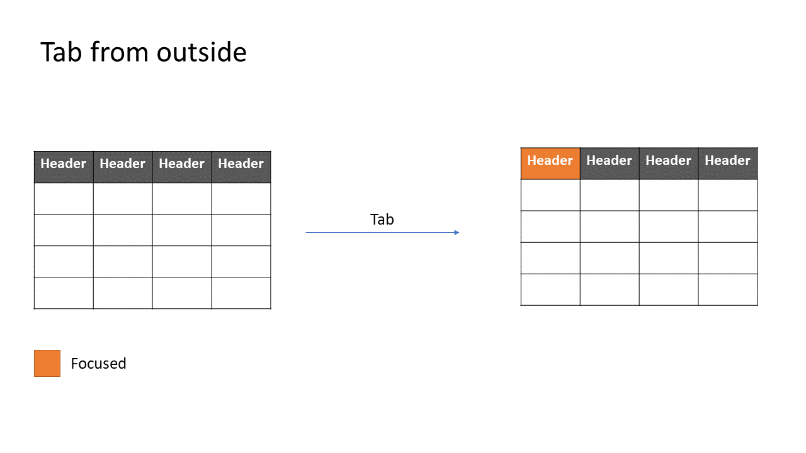
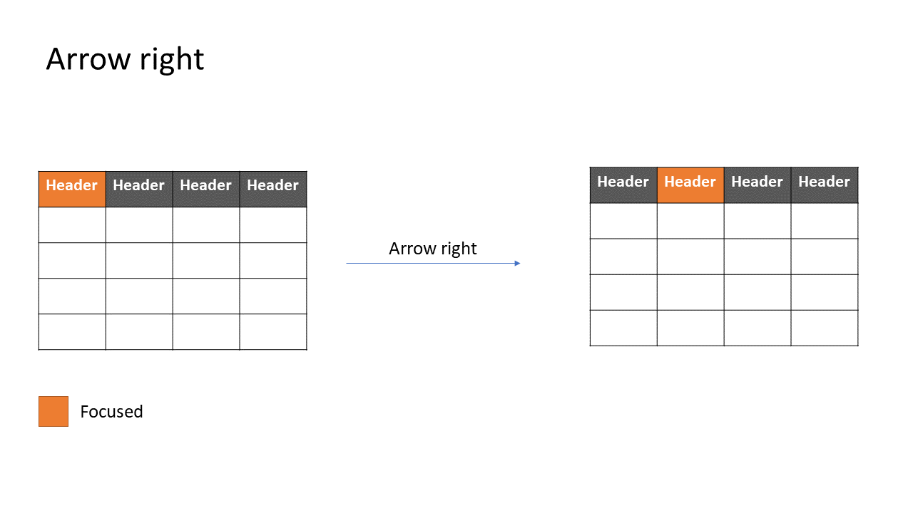
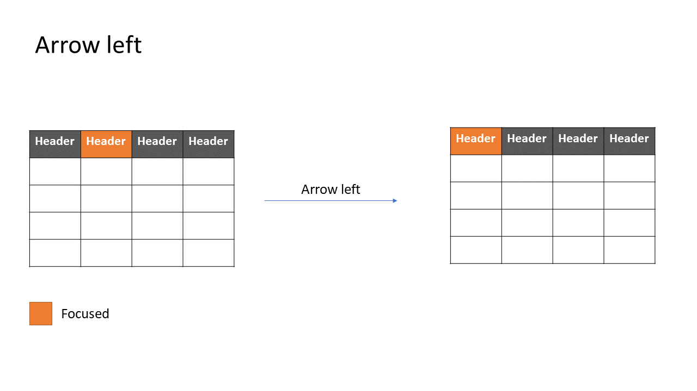

### Navigation modes

The below are the different navigation modes that are possible on a table

#### none

This mode is the default, there is no keyboard navigation possible in the table content. However, this does not
include the header cells which can be sortable. They are covered above.

#### cell

This is the most accessible and screenreader friendly navigation mode. This is what is recommended by the
[WAI APG examples](https://www.w3.org/WAI/ARIA/apg/example-index/grid/dataGrids). Navigation happsn only
on the level of the cell in both directions.

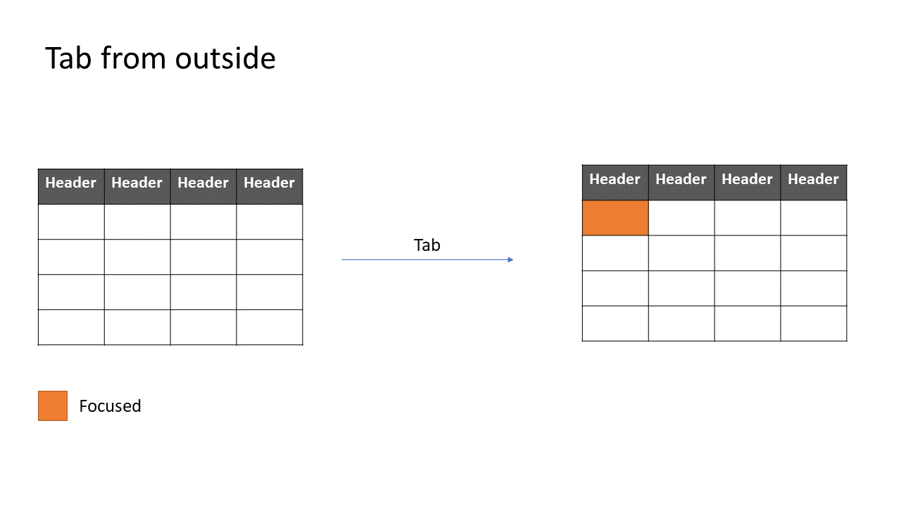
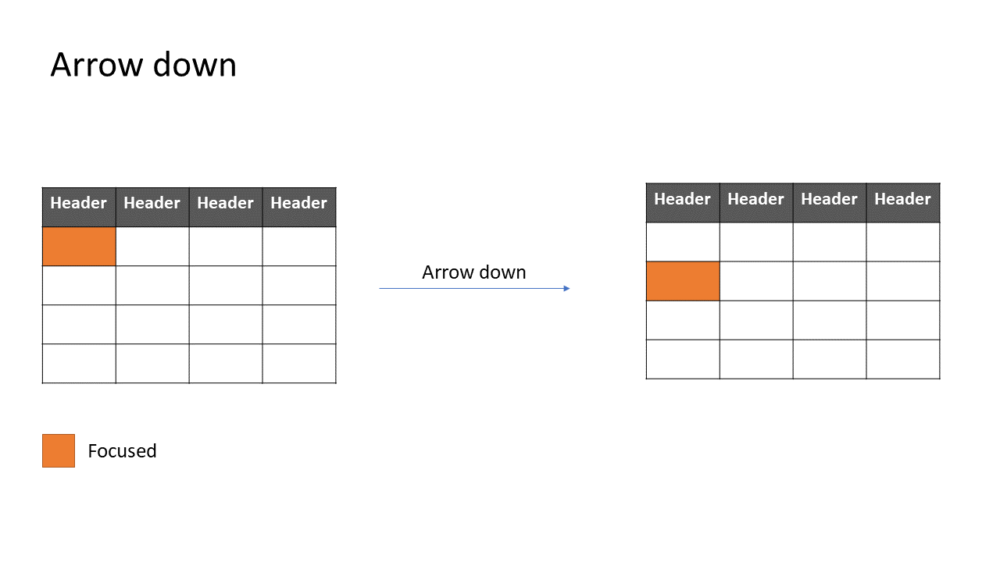
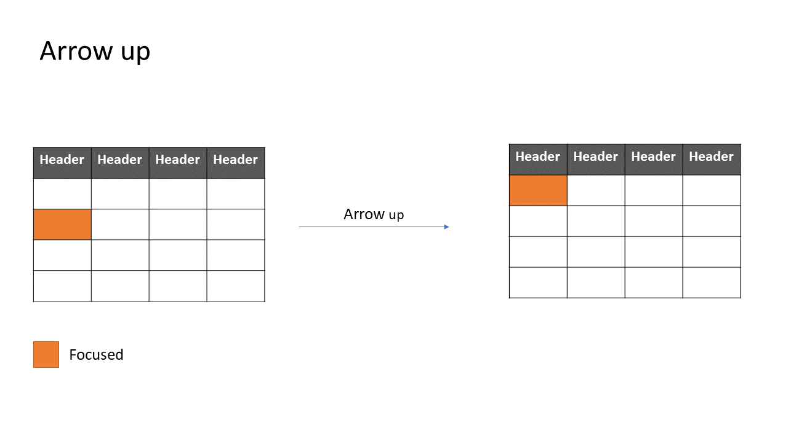
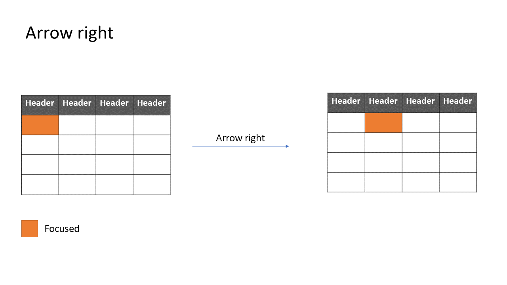
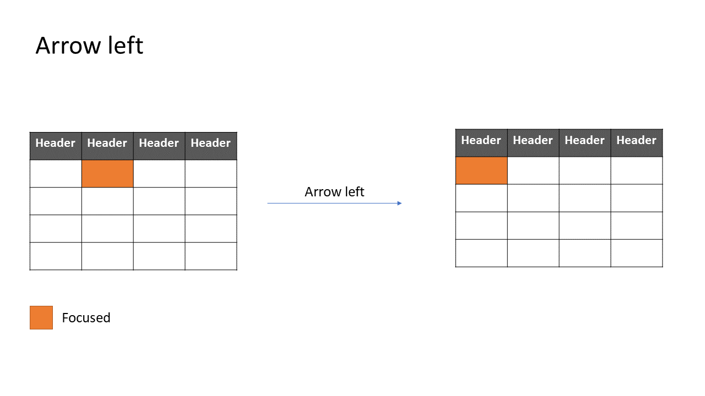

#### row

This navigation mode can cause screen reader issues since tables are not intended to be navigated by row in any mode.
This mode only navigates the table by row and can be useful when row selection is the only interactive feature of
the component

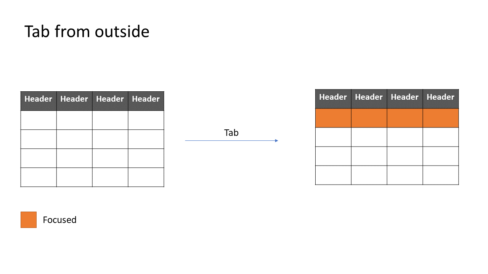
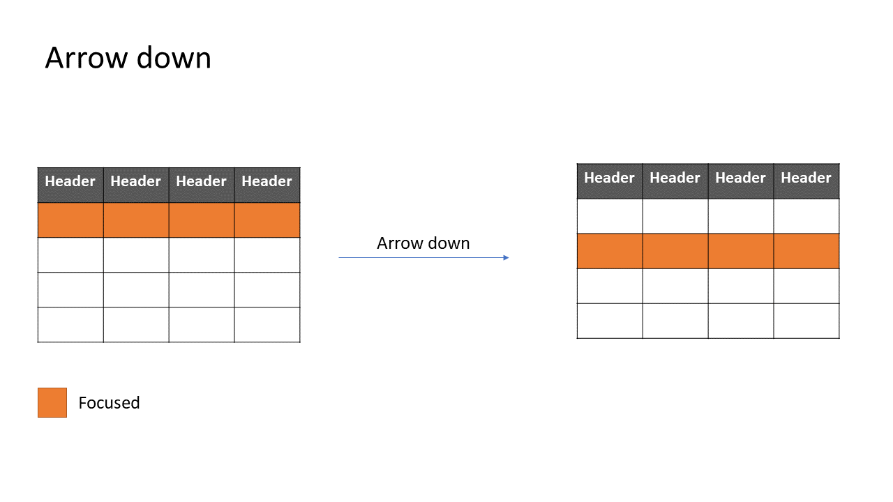
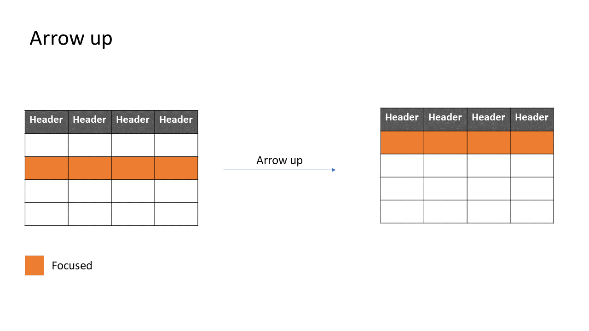

### Nested focusables in cells

#### Single focusable

When there is a single focusable element inside a cell, users are recommended to choose `cell` navigation mode.
In this scenario, cells will be focused on navigation, but the focusable
element inside the cell should be focused if it exists.

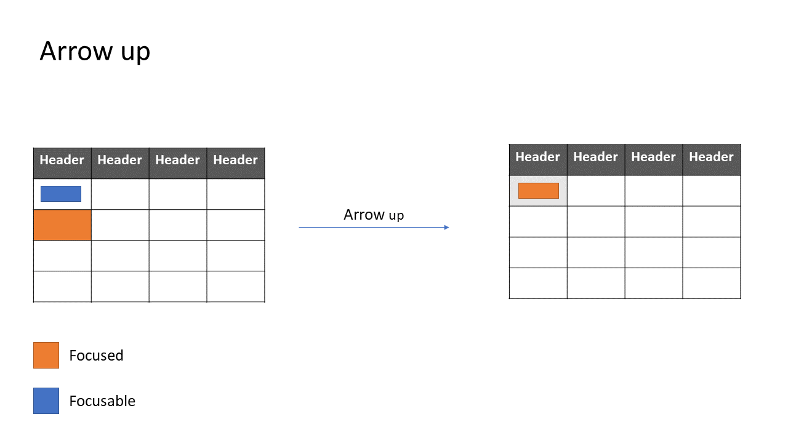
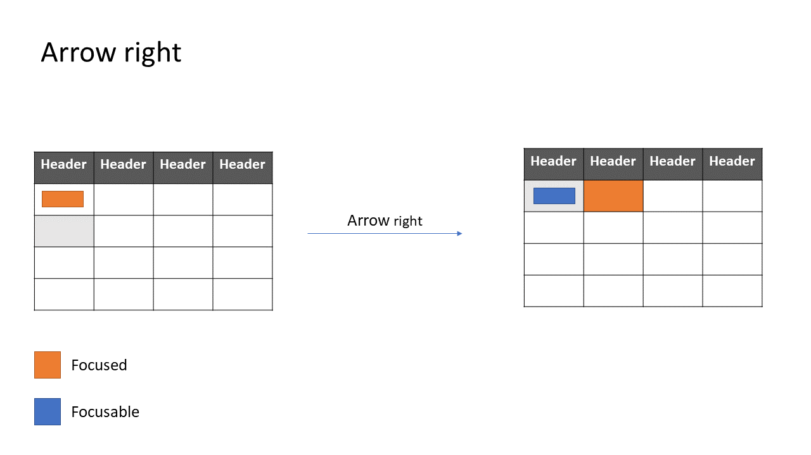

#### Nested focusable

When there are multile focusable elemnts inside a cell, we implement a pattern similar to the [WAI grid pattern](https://www.w3.org/WAI/ARIA/apg/patterns/grid/).
Pressing `Enter` on a cell will move focus and trap focus inside until the user presses `Escape` to revert back to grid navigation.

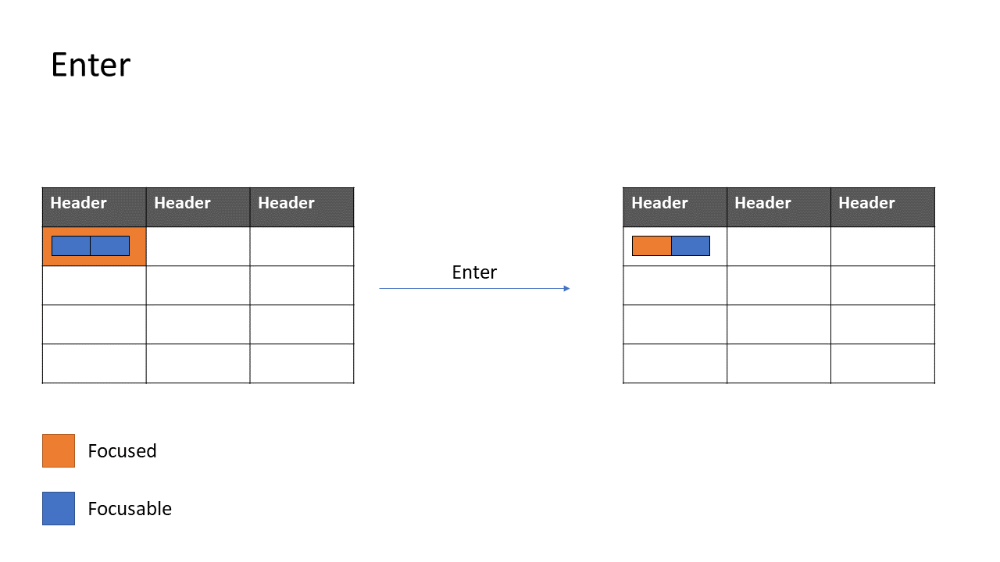

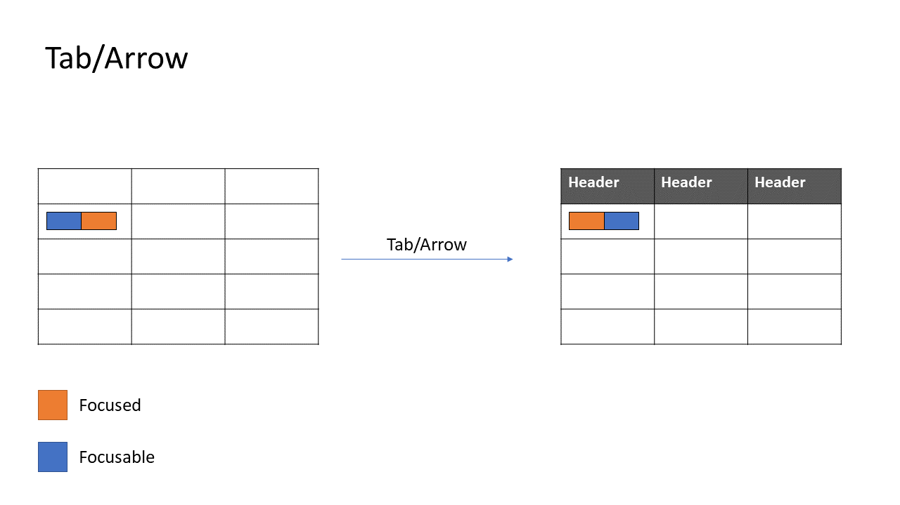
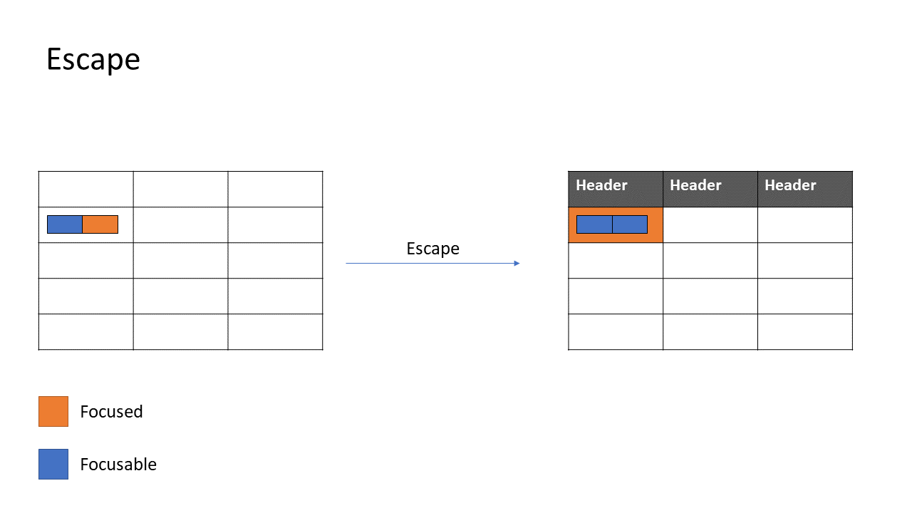
## Accessibility

The spec aims to use the accessibility section as little as possible and building an accessible component by default.
The follow a11y resources were used in the drafting of this spec:

- https://www.w3.org/WAI/ARIA/apg/patterns/grid/
- https://www.w3.org/WAI/ARIA/apg/example-index/grid/dataGrids
- https://www.w3.org/WAI/ARIA/apg/example-index/table/sortable-table.html
- https://www.w3.org/WAI/ARIA/apg/example-index/table/table
- https://developer.mozilla.org/en-US/docs/Web/Accessibility/ARIA/Roles/grid_role
- https://developer.mozilla.org/en-US/docs/Web/Accessibility/ARIA/Roles/table_role
