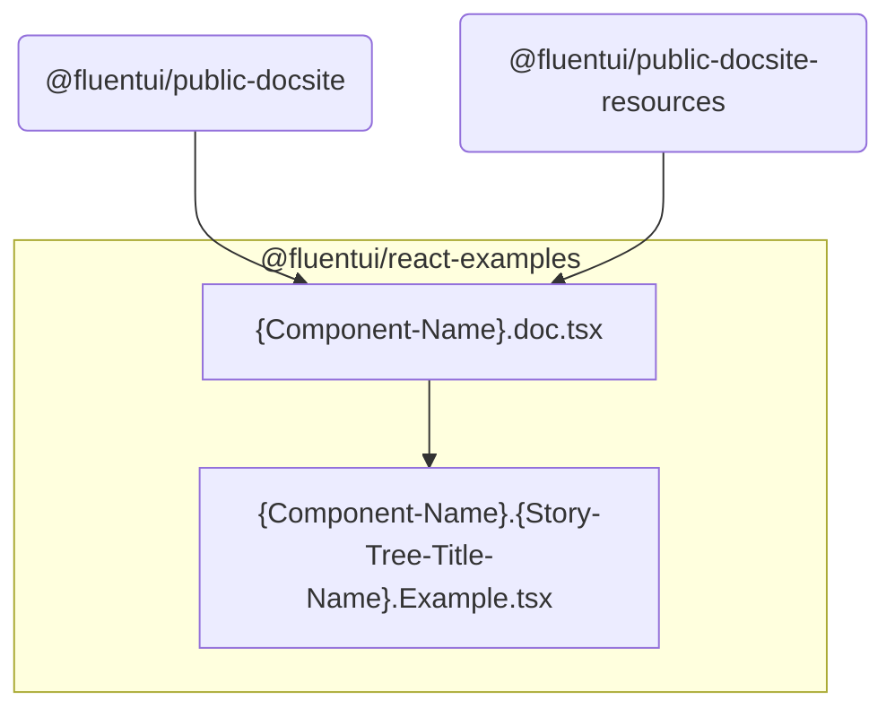
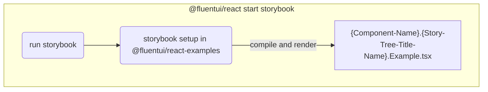

# @fluentui/react-examples

**Examples and documentation for [Fluent UI React](https://developer.microsoft.com/en-us/fluentui)**

This package is only meant to be consumed by variants of the Fluent UI documentation site and therefore has **NO GUARANTEE OF API STABILITY**.

## Architecture

This package contains various root folders within `src`

```sh
|- src/
|--- e2e/
|--- azure-themes/
|--- react/
|--- react-cards/
|--- react-charting/
|--- react-experiments/
|--- react-focus/
```

1. `e2e/` contains helpers for e2e ? TODO
2. rest of the folders contain particular package `stories` and documentation content for `public-docsite` and `public-docsite-resources`

### Structure of documentation/storybook folders

1. Folder name reflects a package name omitting the npm scope.

For example `src/react` contains stories and documentation site content for `@fluentui/react`

2. Sub folders are named by sub-component that is part of the reflected package

For example `src/react/Panel` contains stories and documentation site content for `@fluentui/react` package `Panel` component

**Subfolder contains following types files with enforced naming:**

1. story files: `<Sub-Folder-Name>.<Story-Tree-Title-Name>.Example.tsx`

   - file name needs to match identifier name being exported from the file.

     - > Note that violating this will not render your stories!

   - for example: file named `Panel.Basic.Example.tsx` --needs to export--> `export const PanelBasicExample = () => {...}`

2. documentation file: `<Sub-Folder-Name>.doc.tsx`
3. additional documentation within `doc` folder written in markdown: `doc/*.md`

**Dependency graph:**



### Storybook execution from v8 package


