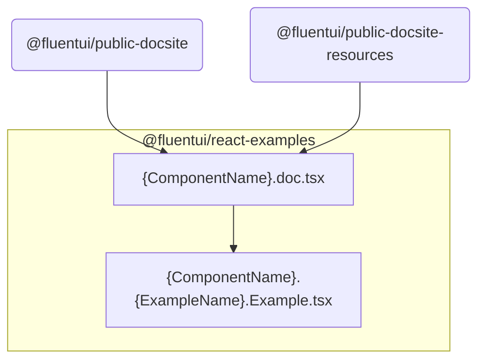
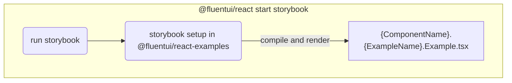

# @fluentui/react-examples

This package contains examples and documentation site content for `@fluentui/react` v8 and related packages, including `@fluentui/react-charting` and `@fluentui/react-experiments`.

Each folder under `src` is the unscoped name of a package, containing examples and documentation content for that package. For example, content for `@fluentui/react` is under `src/react`.

The examples under `react` (plus `react-focus`) are used on the [public documentation site](https://developer.microsoft.com/fluentui) via `apps/public-docsite`, and [aka.ms/fluentdemo](https://aka.ms/fluentdemo) via `apps/public-docsite-resources`.

The other packages' examples are only used for local development and on the PR deploy site ([here for `master`](https://fluentuipr.z22.web.core.windows.net/heads/master/)).

## Background

Examples were originally moved here to resolve circular dependency issues back when we were trying to split `@fluentui/react` into smaller component packages before the v8 release, and during early development of v9 prior to changes in the typescript configuration. (This was with a typescript configuration with strict dependency declaration and package boundaries, rather path resolutions that allow examples/stories to import from any component package even if it's not a dependency.) For example, the goal was to allow `Button`'s examples to use `Toggle` without introducing a dependency on the toggle package in the button package.

Since we mostly didn't end up splitting packages in v8, and went with a different approach for v9, the only package where the circular dep issue is relevant now is `@fluentui/react-focus`. Otherwise, the examples could theoretically be moved back into component packages.

## Local development

### Storybook

To start Storybook for `@fluentui/react`, run:

```
yarn workspace @fluentui/react start
```

The same command works for any other package with examples located under this folder; just be sure to use the _full package name_.

### Legacy demo app

To start the legacy demo app for `@fluentui/react`, run:

```
yarn workspace @fluentui/react start:legacy
```

This also works with `@fluentui/react-charting` and `@fluentui/react-experiments`.

## Architecture

### Structure of package documentation folders

> `src/azure-themes` doesn't follow this convention.

Within each package folder, usually each sub-folder contains the examples and documentation site content for a particular component (or occasionally a category of components, such as `Pickers`).

For example, `src/react/Panel` contains examples and docs for `@fluentui/react`'s `Panel` component.

`src/react-charting` and `src/react-experiments` also have a `demo` sub-folder with legacy demo app configuration.

### File naming conventions

> `src/azure-themes` is not subject to these constraints.

1. Example/story files: `<ComponentName>.<ExampleName>.Example.tsx`

   - By convention, the exported component's name should match the file name.
   - For example: `Panel.Basic.Example.tsx` should export a function component or class component called `PanelBasicExample`.

2. Documentation metadata file:

   - _If your example is missing from this file, it won't show up in the public doc site or legacy demo app (as applicable)!_
   - For `react` and `react-focus`: `<ComponentName>.doc.tsx`
   - For `react-charting` and `react-experiments`: `<ComponentName>Page.tsx`

3. additional documentation within `doc` folder written in markdown: `doc/*.md`

**Dependency graph for public docs and legacy demo app for `@fluentui/react`:**



### Storybook execution from v8 package


