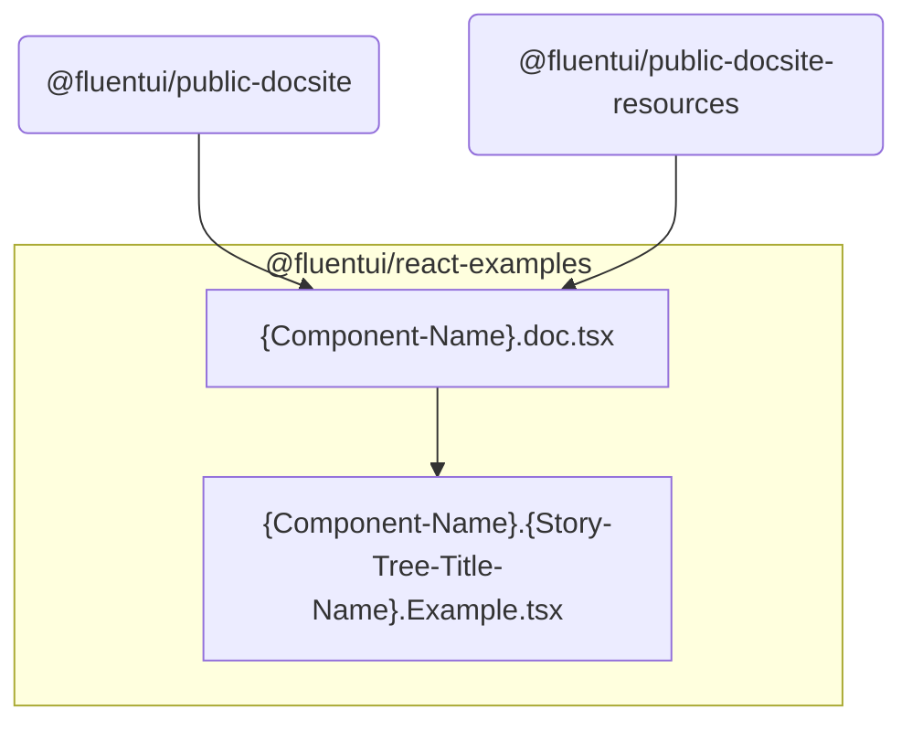
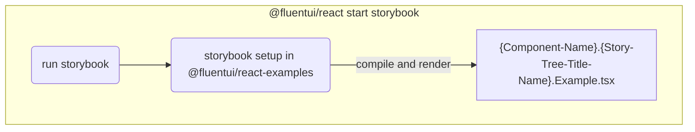

# @fluentui/react-examples

**Examples and documentation for [Fluent UI React](https://developer.microsoft.com/en-us/fluentui)**

This package is only meant to be consumed by variants of the Fluent UI documentation site and therefore has **NO GUARANTEE OF API STABILITY**.

## Architecture

Each folder under `src` is the unscoped name of a package, containing examples for that package. For example, the examples for `@fluentui/react` are under `src/react`.

The examples under `react` (plus `react-focus` and `react-cards`) are used on the [public documentation site](https://developer.microsoft.com/fluentui) via `apps/public-docsite`, and [aka.ms/fluentdemo](https://aka.ms/fluentdemo) via `apps/public-docsite-resources`.

The other packages' examples are only used for local development and on the [PR deploy site](https://fluentuipr.z22.web.core.windows.net/heads/master/).

### Structure of package documentation folders

1. Folder name reflects a package name omitting the npm scope.

For example `src/react` contains stories and documentation site content for `@fluentui/react`

2. Sub folders are named by sub-component that is part of the reflected package

For example `src/react/Panel` contains stories and documentation site content for `@fluentui/react` package `Panel` component

**Subfolder contains following types files with enforced naming:**

1. example/story files: `<ComponentName>.<ExampleName>.Example.tsx`

   - file name needs to match identifier name being exported from the file.

     - > Note that violating this will not render your stories!

   - for example: file named `Panel.Basic.Example.tsx` --needs to export--> `export const PanelBasicExample = () => {...}`

2. documentation file: `<ComponentName>.doc.tsx` -- if your example is not added to this file, it won't show up on the public doc site.
3. additional documentation within `doc` folder written in markdown: `doc/*.md`

**Dependency graph:**

### Storybook execution from v8 package

