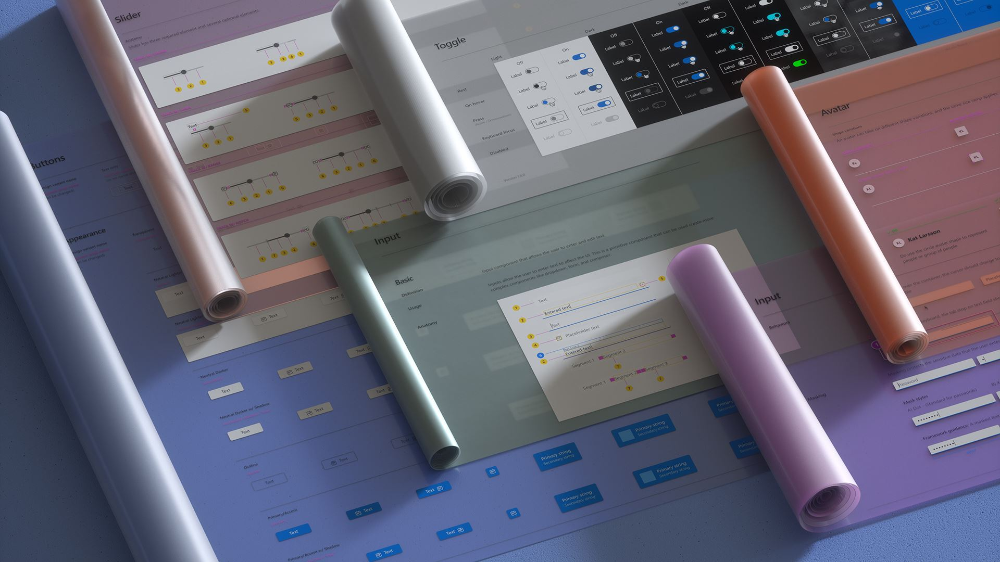

import { Meta } from '@storybook/addon-docs/blocks';
import banner from './fluentui-banner2.jpg';
import './intro.css';

<Meta title="Concepts/Introduction" />

<h1 className="fluent">Fluent UI React vNext</h1>

> **⚠ NOT PRODUCTION READY COMPONENTS - API SURFACES MAY CHANGE WITHOUT NOTICE**

---

<h2 className="fluent">Overview</h2>

Fluent UI vNext is a set of UI components and utilities resulting from an effort to converge the set of React based component libraries in production today: `@fluentui/react` and `@fluentui/react-northstar`.

Each component is designed adhere to following attributes:

- Customizable: Fluent-styled components by default, but easy to integrate your brand and theme​
- Performance: Optimized for render performance​
- Bundle size: Refactored and slimmed down components​ that allow you to include the packages and dependencies you need
- Accessibility: WCAG 2.1 compliant and trusted tester tested​
- Design to Code: Stay up to date with Fluent Design Language changes via Design Tokens

<h2 className="fluent">Questions?</h2>

Reach out to the Fluent UI React team on [Github](https://github.com/microsoft/fluentui)
