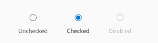
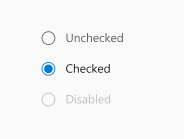
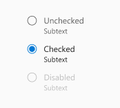

# @fluentui/react-radio Spec

The RadioGroup component lets people select a single value from two or more options.
Use the RadioGroup component to represent two or more available choices, preferably up to 7 options.

## Background

### Prior Art

- [OpenUI research](https://open-ui.org/components/radio-button.research)
- [Epic](https://github.com/microsoft/fluentui/issues/19953)

### Comparison of [Fabric ChoiceGroup](https://developer.microsoft.com/en-us/fluentui#/controls/web/choicegroup) and [Stardust RadioGroup](https://fluentsite.z22.web.core.windows.net/components/radio-group/definition)

- All mentions of v7 or v8 refer to Fabric - `@fluentui/react` ([docsite](https://developer.microsoft.com/en-us/fluentui#/))
- All mentions of v0 refer to Northstar - `@fluentui/react-northstar` ([docsite](https://fluentsite.z22.web.core.windows.net/))

See Appendix for a detailed comparison of the two components.

In Fabric the Radio component is represented by the [ChoiceGroup](https://developer.microsoft.com/en-us/fluentui#/controls/web/choicegroup) component.
Fabric creates options based on data passed in via the `options` prop.
It uses the option's `key` property as the input value and holds the currently selected value in the `selectedKey` prop.
Fabric also allows an image to serve as a label for an option.

```tsx
<ChoiceGroup
  defaultSelectedKey="B"
  options={[
    { key: 'A', text: 'Option A' },
    { key: 'B', text: 'Option B' },
    { key: 'C', text: 'Option C', disabled: true },
    { key: 'D', text: 'Option D' },
  ]}
  label="Pick one"
  required={true}
/>
```

In Northstar the Radio component is represented by the [RadioGroup](https://fluentsite.z22.web.core.windows.net/components/radio-group/definition) component.
Northstar creates options based on data passed in via the `items` prop.
It uses the option's `value` property as the input value and holds the currently selected value in the `checkedValue` prop.

```tsx
<RadioGroup
  onCheckedValueChange={handleChange}
  items={[
    { key: '1', label: 'Make your choice', value: '1' },
    { key: '2', label: 'Another option', value: '2' },
  ]}
/>
```

## Radio

### Variants

The variants of the Radio component include visual styles and behaviour. The Radio component is expected to have the option of adding input or dropdown component as a radio item (represented in the `Vertical with dropdown` and `Vertical with input` sections).

### Horizonal

Inline positioning of the inputs and labels.


### Horizonal stacked

Positioning the label at the bottom of the radio inputs.



### Vertical

Default vertical positioning of Radio items.



### Vertical with input

Default positioning of Radio items with an input as its last Radio item.


### Vertical with dropdown

Default positioning of Radio items with a dropdown as its last Radio item.


### Vertical with subtext

Additional text under the label of Radio items.



## API

### Components

| Component  | Purpose                                                                   |
| ---------- | ------------------------------------------------------------------------- |
| RadioGroup | Wraps radio inputs. Provides API for control group (fieldset and legend). |
| Radio      | Represents a single radio item (input and label).                         |

### RadioGroup

| Prop           | Type                         | Default value | Purpose                                                      |
| -------------- | ---------------------------- | ------------- | ------------------------------------------------------------ |
| defaultValue   | `string`                     | `undefined`   | Which option should be preselected by default.               |
| label (legend) | `string \| (slot)`           |               | Label for the group of radio controls.                       |
| name           | `string`                     |               | Name property passed to child inputs.                        |
| orientation    | `"horizontal" \| "vertical"` | `"vertical"`  | Specifies how the layout in which the controls are rendered. |
| value          | `string`                     |               | Currently selected value. Used only for controlled mode.     |

`orientation` property:

- `horizontal`: The radio inputs are rendered horizontally, referring to the `Horizontal Group` variant.
- `vertical`: The radio inputs are rendered vertically, referring to the `Vertical Group` variant.

### Radio

Link to [Radio.types.ts](https://github.com/microsoft/fluentui/blob/master/packages/react-radio/src/components/Radio/Radio.types.ts)

| Prop                              | Type               | Purpose                                                  |
| --------------------------------- | ------------------ | -------------------------------------------------------- |
| key (root)                        | `string`           | React `key` prop.                                        |
| id (input - id & label - htmlfor) | `string`           | ID passed to input. Also used for input + label pairing. |
| label (label)                     | `string \| (slot)` | Label that will be rendered next to the radio input.     |
| checked (input)                   | `boolean`          | Whether the input is checked or not.                     |
| disabled (input)                  | `boolean`          | Whether the input is disabled or not.                    |
| subtext (label)                   | `string`           | Text shown as subtext to label                           |

`subtext` property refers to the `Radio with subtext` variant.

### Sample Code

```tsx
const iceCreams = [
  'Chocolate',
  'Strawberry',
  'Mango',
]

<RadioGroup label="Which ice cream would you like?" name="ice-cream">
  {iceCreams.map(
    iceCream => (
      <Radio
        key={iceCream}
        id={`ic-${iceCream}`}
        label={iceCream}
      />
    )
  )}
</RadioGroup>
```

## Structure

### Expected DOM structure

```html
<fieldset class="fui-RadioGroup">
  <legend>Which ice cream would you like?</legend>
  <span class="fui-Radio">
    <div>
      <div class="fui-Radio-indicator"></div>
      <input type="radio" id="ic-Mango" name="ice-cream" />
    </div>
    <label for="ic-Mango" class="fui-Label">Mango</label>
  </span>

  <span class="fui-Radio">
    <div>
      <div class="fui-Radio-indicator"></div>
      <input type="radio" id="ic-Strawberry" name="ice-cream" />
    </div>
    <label for="ic-Strawberry" class="fui-Label">Strawberry</label>
  </span>

  <span class="fui-Radio">
    <div>
      <div class="fui-Radio-indicator"></div>
      <input type="radio" id="ic-Chocolate" name="ice-cream" />
    </div>
    <label for="ic-Chocolate" class="fui-Label">Chocolate</label>
  </span>
</fieldset>
```

## Behaviors

- Component States

  - Rest (unchecked)
  - Hover
  - Pressed
  - Checked
  - Disabled

## Accessibility

The RadioGroup component will use the `<fieldset>` native element to provide the default accessibility behaviour of role group. This element requires `<legend>` element to be the main label for the RadioGroup group.
This implementation based on the [Grouping Controls](https://www.w3.org/WAI/tutorials/forms/grouping/) examples of Web Accessibility Tutorials (that follow WCAG).

The Radio items are wrapped in `<span>` element that includes the wrapper of the `<input role="radio">` element and the `<label>` element.

<!--
## Migration
TBD: Link to Migration guide
-->

### Keyboard Navigation based on [ARIA Practices](https://www.w3.org/TR/wai-aria-practices-1.2/#radiobutton):

- `Tab` moves the focus in and out of RadioGroup (the fieldset).
- `Enter` or `space` selects the Radio item.
- `Up` and `down` arrow keys move the focus to the next and previous Radio item.

# Appendix

## v8 vs v0 comparison

### RadioGroup (v0) vs ChoiceGroup (v8) prop mapping

_⚠️ Props not included in this section are marked as deprecated and will not be considered._

| Purpose                                                                                           | Fabric (v8)        | Northstar (v0)       | Matching                                   |
| ------------------------------------------------------------------------------------------------- | ------------------ | -------------------- | ------------------------------------------ |
| Called after radio group value is changed.                                                        | onChange           | onCheckedValueChange | Matching 🛠️                                |
| The options/items for the group.                                                                  | options            | items                | Matching                                   |
| Additional CSS styles to apply to the component instance.                                         | styles             | styles               | Matching                                   |
| Initial checkedValue value.                                                                       | defaultSelectedKey | defaultCheckedValue  | Matching functionality, not implementation |
| Value of the currently checked radio item.                                                        | selectedKey        | checkedValue         | Matching functionality, not implementation |
| Theme - Override for theme site variables to allow modifications of component styling via themes. | theme              | variables            | Matching                                   |
| ID of an element to use as the aria label for this ChoiceGroup.                                   | ariaLabelledBy     | -                    | -                                          |
| Optional callback to access the `IChoiceGroup` interface.                                         | componentRef       | -                    | -                                          |
| Descriptive label for the choice group.                                                           | label              | -                    | -                                          |
| Accessibility behavior if overridden by the user.                                                 | -                  | accessibility        | -                                          |
| An element type to render as (string or component).                                               | -                  | as                   | -                                          |
| Additional CSS class name(s) to apply.                                                            | -                  | className            | -                                          |
| A vertical radio group displays elements vertically.                                              | -                  | vertical             | -                                          |
| -                                                                                                 | -                  | design               | -                                          |

### RadioItem (v0) vs ChoiceGroupOption (v8) props mapping

| Purpose                                                                         | Fabric (v8)        | Northstar (v0)   | Matching |
| ------------------------------------------------------------------------------- | ------------------ | ---------------- | -------- |
| A required key to uniquely identify the option.                                 | key (required)     | -                | -        |
| The text string for the option.                                                 | text (required) ❓ | label            | Matching |
| Call to provide customized styling that will layer on top of the variant rules. | styles             | styles           | Matching |
| A radio item can appear disabled and be unable to change states.                | disabled           | disabled         | Matching |
| Aria label of the option for the benefit of screen reader users.                | ariaLabel          | -                | -        |
| Props for an icon to display with this option.                                  | iconProps          | -                | -        |
| ID used on the option's input element.                                          | id                 | -                | -        |
| Alt text if the option is an image.                                             | imageAlt           | -                | -        |
| The width and height of the image in px for choice field.                       | imageSize          | -                | -        |
| Image to display with this option.                                              | imageSrc           | -                | -        |
| ID used on the option's label.                                                  | labelId            | -                | -        |
| Used to customize option rendering.                                             | onRenderField      | -                | -        |
| Used to customize label rendering.                                              | onRenderLabel      | -                | -        |
| The src of image for choice field which is selected.                            | selectedImageSrc   | -                | -        |
| The subtext string for the option.                                              | subtext            | -                | -        |
| Accessibility behavior if overridden by the user.                               | -                  | accessibility    | -        |
| Whether or not radio item is checked.                                           | -                  | checked          | -        |
| The checked radio item indicator can be customized.                             | -                  | checkedIndicator | -        |
| Initial checked value.                                                          | -                  | defaultChecked   | -        |
| The radio item indicator can be customized.                                     | -                  | indicator        | -        |
| The HTML input name.                                                            | -                  | name             | -        |
| Called after radio item checked state is changed.                               | -                  | onChange         | -        |
| Called after radio item is clicked.                                             | -                  | onClick          | -        |
| Whether should focus when checked                                               | -                  | shouldFocus      | -        |
| The HTML input value.                                                           | -                  | value            | -        |
| A vertical radio group displays elements vertically.                            | -                  | vertical         | -        |
| -                                                                               | -                  | as               | -        |
| -                                                                               | -                  | className        | -        |
| -                                                                               | -                  | variables        | -        |
| -                                                                               | -                  | design           | -        |
