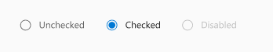
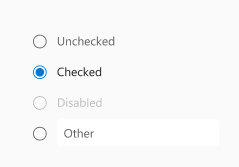

# @fluentui/react-radio Spec

The Radio component let people select a single option from two or more choices. Use radio component to present two or more available choices, preferably up to 7 options.

## Background

Fabric expects the options to be provided through the `options` prop. The selected value is the key of the option using the `selectedKey`.
Fabric allows options to have image instead of a label.

```jsx
<ChoiceGroup
  defaultSelectedKey="B"
  options={[
    { key: 'A', text: 'Option A' },
    { key: 'B', text: 'Option B' },
    { key: 'C', text: 'Option C', disabled: true },
    { key: 'D', text: 'Option D' },
  ]}
  label="Pick one"
  required={true}
/>
```

Northstar's implementation consists of `RadioGroup` that includes two or more `RadioItems`, which are given thorugh the `items` prop.

```jsx
<RadioGroup
  onCheckedValueChange={handleChange}
  items={[
    { key: '1', label: 'Make your choice', value: '1' },
    { key: '2', label: 'Another option', value: '2' },
  ]}
/>
```

### Prior Art

- [OpenUI research](https://open-ui.org/components/radio-button.research)
- [Epic](https://github.com/microsoft/fluentui/issues/19953)

### Comparison of [Fabric ChoiceGroup](https://developer.microsoft.com/en-us/fluentui#/controls/web/choicegroup) and [Stardust RadioGroup](https://fluentsite.z22.web.core.windows.net/0.54.0/components/radio-group/definition)

- All mentions of v7 or v8 refer to Fabric - `@fluentui/react` ([docsite](https://developer.microsoft.com/en-us/fluentui#/))
- All mentions of v0 refer to Northstar - `@fluentui/react-northstar` ([docsite](https://fluentsite.z22.web.core.windows.net/))

_⚠️Props not included in this section are marked as depricated and will not be considered._

_Include background research done for this component_

- _Link to Open UI research_ ✔️
- _Link to comparison of v7 and v0_
- _Link to GitHub epic issue for the converged component_ ✔️

## Variants

TODO: pics
_Describe visual or functional variants of this control, if applicable. For example, a slider could have a 2D variant._

### Horizonal



### Horizonal stacked


### Vertical


### Vertical with input



### Vertical with dropdown


### Vertical with subtext


## API

_List the **Props** and **Slots** proposed for the component. Ideally this would just be a link to the component's `.types.ts` file_

### Components

| Component | Purpose                                                                           |
| --------- | --------------------------------------------------------------------------------- |
| Radio     | Is a wrapper to the items                                                         |
| RadioItem | Represents a single item which is potentially to be used with the Field component |

### Radio

| Prop                | Type                    | Purpose |
| ------------------- | ----------------------- | ------- |
| groupLabel (legend) | -                       | -       |
| defaultSelected     | -                       | -       |
| selectedValue       | -                       | -       |
| orientation         | "horizonal", "vertical" | -       |

### RadioItem

| Prop                              | Type | Purpose |
| --------------------------------- | ---- | ------- |
| key (root)                        | -    | -       |
| id (input - id & label - htmlfor) | -    | -       |
| text (label)                      | -    | -       |
| name (input)                      | -    | -       |
| checked (input)                   | -    | -       |
| disabled (input)                  | -    | -       |

### Sample Code

`Radio` component:

```jsx
//Options as a prop
const items = [
  {text: 'chocolate', key: 'optio1'},
  {text: 'strawberry', key:'option2'},
  {text: 'mango', key:'option3'}
]

<Radio items={items} name="pref" label="Choose your preference?" />
```

```jsx
//Options as a prop
const items = [
  {text: 'chocolate', key: 'optio1'},
  {text: 'strawberry', key:'option2'},
  {text: 'mango', key:'option3'}
]

<Radio name="pref" label="Choose your preference?">
  {items.map(
    ({ key, text }) => <RadioItem key={key}>{text}</RadioItem>
  )}
</Radio>
```

```tsx
// Radio Items as children?  ---> maybe not possible

<Radio label="Choose your preference?" name="pref">
  <RadioItem key="option1"> chocolate </RadioItem>
  <RadioItem key="option2"> strawberry </RadioItem>
  <RadioItem key="option3"> mango </RadioItem>
</Radio>
```

## Structure

- _**Public**_
- _**Internal**_
- _**DOM** - how the component will be rendered as HTML elements_

### DOM structure

```html
<fieldset>
  <legend>What is your preference?</legend>

  <input type="radio" id="option1" name="pref" />
  <label for="option1"> Chocolate </label>

  <input type="radio" id="option2" name="pref" />
  <label for="option1"> Strawberry </label>

  <input type="radio" id="option3" name="pref" />
  <label for="option1"> Mango </label>
</fieldset>
```

<!--
## Migration

_Describe what will need to be done to upgrade from the existing implementations:_

- _Migration from v8_
- _Migration from v0_ -->

## Behaviors

_Explain how the component will behave in use, including:_

- _Component States_
- _Interaction_
  - _Keyboard_
  - _Cursor_
  - _Touch_
  - _Screen readers_

## Accessibility

Base accessibility information is included in the design document. After the spec is filled and review, outcomes from it need to be communicated to design and incorporated in the design document.

- Decide whether to use **native element** or folow **ARIA** and provide reasons
- Identify the **[ARIA](https://www.w3.org/TR/wai-aria-practices-1.2/) pattern** and, if the component is listed there, follow its specification as possible.
- Identify accessibility **variants**, the `role` ([ARIA roles](https://www.w3.org/TR/wai-aria-1.1/#role_definitions)) of the component, its `slots` and `aria-*` props.
- Describe the **keyboard navigation**: Tab Oder and Arrow Key Navigation. Describe any other keyboard **shortcuts** used
- Specify texts for **state change announcements** - [ARIA live regions
  ](https://developer.mozilla.org/en-US/docs/Web/Accessibility/ARIA/ARIA_Live_Regions) (number of available items in dropdown, error messages, confirmations, ...)
- Identify UI parts that appear on **hover or focus** and specify keyboard and screen reader interaction with them
- List cases when **focus** needs to be **trapped** in sections of the UI (for dialogs and popups or for hierarchical navigation)
- List cases when **focus** needs to be **moved programatically** (if parts of the UI are appearing/disappearing or other cases)

# Appendix

### RadioGroup (v0) vs ChoiceGroup (v8) prop mapping

| Purpose                                                                                           | Fabric (v8)        | Northstar (v0)       | Matching                                   |
| ------------------------------------------------------------------------------------------------- | ------------------ | -------------------- | ------------------------------------------ |
| Called after radio group value is changed.                                                        | onChange           | onCheckedValueChange | Matching 🛠️                                |
| The options/items for the group.                                                                  | options            | items                | Matching                                   |
| Additional CSS styles to apply to the component instance.                                         | styles             | styles               | Matching                                   |
| Initial checkedValue value.                                                                       | defaultSelectedKey | defaultCheckedValue  | Matching functionality, not implementation |
| Value of the currently checked radio item.                                                        | selectedKey        | checkedValue         | Matching functionality, not implementation |
| Theme - Override for theme site variables to allow modifications of component styling via themes. | theme              | variables            | Matching                                   |
| ID of an element to use as the aria label for this ChoiceGroup.                                   | ariaLabelledBy     | -                    | -                                          |
| Optional callback to access the `IChoiceGroup` interface.                                         | componentRef       | -                    | -                                          |
| Descriptive label for the choice group.                                                           | label              | -                    | -                                          |
| Accessibility behavior if overridden by the user.                                                 | -                  | accessibility        | -                                          |
| An element type to render as (string or component).                                               | -                  | as                   | -                                          |
| Additional CSS class name(s) to apply.                                                            | -                  | className            | -                                          |
| A vertical radio group displays elements vertically.                                              | -                  | vertical             | -                                          |
| -                                                                                                 | -                  | design               | -                                          |

### RadioItem (v0) vs ChoiceGroupOption (v8) props mapping

| Purpose                                                                         | Fabric (v8)        | Northstar (v0)   | Matching |
| ------------------------------------------------------------------------------- | ------------------ | ---------------- | -------- |
| A required key to uniquely identify the option.                                 | key (required)     | -                | -        |
| The text string for the option.                                                 | text (required) ❓ | label            | Matching |
| Call to provide customized styling that will layer on top of the variant rules. | styles             | styles           | Matching |
| A radio item can appear disabled and be unable to change states.                | disabled           | disabled         | Matching |
| Aria label of the option for the benefit of screen reader users.                | ariaLabel          | -                | -        |
| Props for an icon to display with this option.                                  | iconProps          | -                | -        |
| ID used on the option's input element.                                          | id                 | -                | -        |
| Alt text if the option is an image.                                             | imageAlt           | -                | -        |
| The width and height of the image in px for choice field.                       | imageSize          | -                | -        |
| Image to display with this option.                                              | imageSrc           | -                | -        |
| ID used on the option's label.                                                  | labelId            | -                | -        |
| Used to customize option rendering.                                             | onRenderField      | -                | -        |
| Used to customize label rendering.                                              | onRenderLabel      | -                | -        |
| The src of image for choice field which is selected.                            | selectedImageSrc   | -                | -        |
| Accessibility behavior if overridden by the user.                               | -                  | accessibility    | -        |
| Whether or not radio item is checked.                                           | -                  | checked          | -        |
| The checked radio item indicator can be customized.                             | -                  | checkedIndicator | -        |
| Initial checked value.                                                          | -                  | defaultChecked   | -        |
| The radio item indicator can be customized.                                     | -                  | indicator        | -        |
| The HTML input name.                                                            | -                  | name             | -        |
| Called after radio item checked state is changed.                               | -                  | onChange         | -        |
| Called after radio item is clicked.                                             | -                  | onClick          | -        |
| Whether should focus when checked                                               | -                  | shouldFocus      | -        |
| The HTML input value.                                                           | -                  | value            | -        |
| A vertical radio group displays elements vertically.                            | -                  | vertical         | -        |
| -                                                                               | -                  | as               | -        |
| -                                                                               | -                  | className        | -        |
| -                                                                               | -                  | variables        | -        |
| -                                                                               | -                  | design           | -        |
