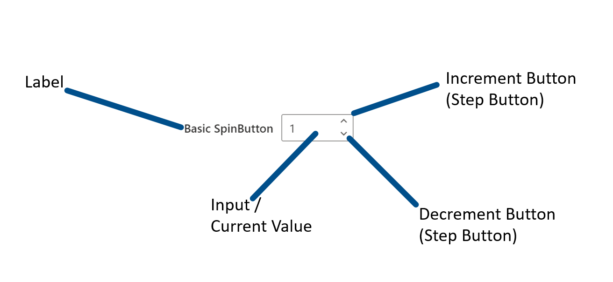
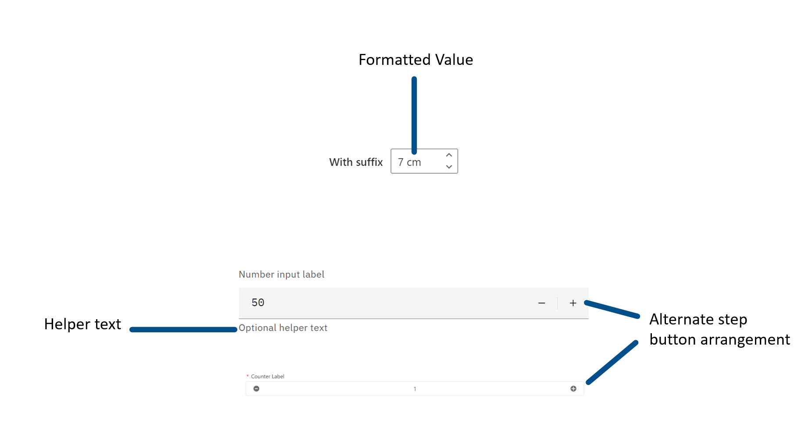

# @fluentui/react-spinbutton Spec

## Background

SpinButtons are used to allow numeric input bounded between minimum and maximum values with button controls to increment and decrement the input value by some step amount.

## Prior Art

- Open UI research: https://github.com/openui/open-ui/pull/431
- Github Epic: https://github.com/microsoft/fluentui/issues/20930
- WAI-ARIA Toolbar Example (font size selector): https://www.w3.org/TR/wai-aria-practices/examples/toolbar/toolbar.html

### Naming

There is little consensus for naming this type of component. Of the design systems surveyed in Open UI there are seven implementations with six different names:

1. InputNumber
2. NumberInput
3. SpinButton (x2)
4. NumberField
5. Counter
6. input-stepper

This specification recommends `SpinButton` as the name for this component. Given the lack of naming consensus in the surveryed design systems and that the ARIA role for this control is `spinbutton` this feels like the closest to a standard name. Additionally, Fluent UI v8 uses the name `SpinButton` so sticking with that is simpler for existing users making the upgrade to the new version.

### Anatomy

`SpinButton` consists of three mandatory parts:

1. **Input**: accepts users input and displays the current value.
2. **Increment Button**: a button that increases the current value by the step amount.
3. **Decrement Button**: a button that decreases the current value by the step amount.

`SpinButton` has several optional parts:

1. **Label**: any input must have a label but whether the label is included as part of the `SpinButton` control varies depending on the design system.
2. **Helper text**: extra text in addition to the label to provide "help", perhaps by offering an example. Typically appears below the input.
3. **Formatted value**: optional formatting applied to the input value. For example, turning "12" into "12 pt" for a font size picker.

#### Base `SpinButton` Anatomy



#### Alternate/Optional `SpinButton` Anatomy



### Common Features

#### Attributes

1. **min**: the minimum valid value for the control
2. **max**: the maximum value value for the control
3. **step**: the step size or amount the value is changed by one increment or decrement

#### Typed Input

All `SpinButtons` surveyed can take input directly by typing into the control's input field. Many clamp this value in the range of `min`-`max` but, notably, the native HTML control does not. Rather, it allows values outside this range but puts the control into an invalid state. The [ARIA spec](https://www.w3.org/TR/wai-aria-practices/#wai-aria-roles-states-and-properties-18) allows for the native control behavior or for values to be restricted to only valid values as determined by users of the control.

#### Step Buttons

All `SpinButtons` have support for incrementing and decrementing the value via step buttons. Clicking a step button changes the current value of the control by a `step` size (e.g., `1`, `0.1`, `10`, etc.).

When using a keyboard step buttons are not focusable, rather the control uses the up and down keyboard arrows to modify the current value with the same rules as clicking a step button.

Unlike directly typing input into the control, step buttons do not allow input outside of the bounds of `min` and `max`.

### i18n

#### RTL (Right to Left Languages)

Most implementations flip the layout of the control for RTL. Using the base example, the step buttons appear on the left with the value on the right as opposed to the LTR version where the value is on the left and the steppers on the right.


### a11y

The [WAI-ARIA spec for SpinButton](https://www.w3.org/TR/wai-aria-practices/#spinbutton) covers this well and provides examples.

### [SpinButton in v8/Fabric](https://developer.microsoft.com/en-us/fluentui#/controls/web/spinbutton)

Fluent UI v8 (Fabric) ships a `SpinButton` control. This control supports directly typing values into the input field, stepping via step buttons, clamping values in a min-max range and suffixes on the displayed value. The control also supports variants like including an icon in the label, label positioning and styling overrides. `SpinButton` has RTL support and implements the correct ARIA attributes for proper accessibility support.

#### Props

Props not directly related to `SpinButton` functionality omitted for brevity. [See the complete implementation list](https://developer.microsoft.com/en-us/fluentui#/controls/web/spinbutton#implementation) all props.

| Prop                     | Description                                                                                                                                                                                                                                                                                                                                                                                                                                                    |
| ------------------------ | -------------------------------------------------------------------------------------------------------------------------------------------------------------------------------------------------------------------------------------------------------------------------------------------------------------------------------------------------------------------------------------------------------------------------------------------------------------- |
| decrementButtonAriaLabel | Accessible label text for the decrement button (for screen reader users).                                                                                                                                                                                                                                                                                                                                                                                      |
| decrementButtonIcon      | Custom props for the decrement button.                                                                                                                                                                                                                                                                                                                                                                                                                         |
| defaultValue             | Initial value of the control (assumed to be valid). Updates to this prop will not be respected. Use this if you intend for the SpinButton to be an uncontrolled component which maintains its own value. For a controlled component, use value instead. (Mutually exclusive with value.)                                                                                                                                                                       |
| disabled                 | Whether or not the control is disabled.                                                                                                                                                                                                                                                                                                                                                                                                                        |
| downArrowButtonStyles    | Custom styles for the down arrow button. Note: The buttons are in a checked state when arrow keys are used to increment/decrement the SpinButton. Use rootChecked instead of rootPressed for styling when that is the case.                                                                                                                                                                                                                                    |
| iconButtonProps          | Additional props for the up and down arrow buttons.                                                                                                                                                                                                                                                                                                                                                                                                            |
| iconProps                | Props for an icon to display alongside the control's label.                                                                                                                                                                                                                                                                                                                                                                                                    |
| incrementButtonAriaLabel | Accessible label text for the increment button (for screen reader users).                                                                                                                                                                                                                                                                                                                                                                                      |
| incrementButtonIcon      | Custom props for the increment button.                                                                                                                                                                                                                                                                                                                                                                                                                         |
| inputProps               | Additional props for the input field.                                                                                                                                                                                                                                                                                                                                                                                                                          |
| keytipProps              | Keytip for the control.                                                                                                                                                                                                                                                                                                                                                                                                                                        |
| label                    | Descriptive label for the control.                                                                                                                                                                                                                                                                                                                                                                                                                             |
| labelPosition            | Where to position the control's label.                                                                                                                                                                                                                                                                                                                                                                                                                         |
| max                      | Max value of the control. If not provided, the control has no maximum value.                                                                                                                                                                                                                                                                                                                                                                                   |
| min                      | Min value of the control. If not provided, the control has no minimum value.                                                                                                                                                                                                                                                                                                                                                                                   |
| onBlur                   | Callback for when the control loses focus.                                                                                                                                                                                                                                                                                                                                                                                                                     |
| onChange                 | Callback for when the committed/validated value changes. This is called _after_ onIncrement, onDecrement, or onValidate, on the following events: - User presses the up/down buttons (on single press or every spin) - User presses the up/down arrow keys (on single press or every spin) - User _commits_ edits to the input text by focusing away (blurring) or pressing enter. Note that this is NOT called for every key press while the user is editing. |
| onDecrement              | Callback for when the decrement button or down arrow key is pressed.                                                                                                                                                                                                                                                                                                                                                                                           |
| onFocus                  | Callback for when the user focuses the control.                                                                                                                                                                                                                                                                                                                                                                                                                |
| onIncrement              | Callback for when the increment button or up arrow key is pressed.                                                                                                                                                                                                                                                                                                                                                                                             |
| onValidate               | Callback for when the entered value should be validated.                                                                                                                                                                                                                                                                                                                                                                                                       |
| precision                | How many decimal places the value should be rounded to. The default is calculated based on the precision of step: i.e. if step = 1, precision = 0. step = 0.0089, precision = 4. step = 300, precision = 2. step = 23.00, precision = 2.                                                                                                                                                                                                                       |
| step                     | Difference between two adjacent values of the control. This value is used to calculate the precision of the input if no precision is given. The precision calculated this way will always be >= 0.                                                                                                                                                                                                                                                             |
| title                    | A more descriptive title for the control, visible on its tooltip.                                                                                                                                                                                                                                                                                                                                                                                              |
| upArrowButtonStyles      | Custom styles for the up arrow button. Note: The buttons are in a checked state when arrow keys are used to increment/decrement the SpinButton. Use rootChecked instead of rootPressed for styling when that is the case.                                                                                                                                                                                                                                      |
| value                    | Current value of the control (assumed to be valid). Only provide this if the SpinButton is a controlled component where you are maintaining its current state and passing updates based on change events; otherwise, use the defaultValue property. (Mutually exclusive with defaultValue.)                                                                                                                                                                    |

### [SpinButton in v0/Northstar](https://fluentsite.z22.web.core.windows.net/0.59.0/components/input/definition)

Northstar lacks a dedicated `SpinButton` component, rather in has `Input` which takes a `type` prop that can be set to `"number"` making the component equivalent of [<input type="number">](https://developer.mozilla.org/en-US/docs/Web/HTML/Element/input/number).

Given that Northstar is only providing the native web platform number input with custom styling applied it will not be considered further. In its place the native number input will be considered as it has behavior similar to `SpinButton`.

### [<input type="number">](https://developer.mozilla.org/en-US/docs/Web/HTML/Element/input/number)

This is a standard HTML control for entering numbers. It includes built-in validation to reject non-numeric values and _optionally_ provides stepper arrows to increment or decrement the value.

#### Element Attributes

This is not an exhaustive list of attributes for this element but a curated list of relevant attributes. For a complete list [see the MDN page for `<input type="number">`](https://developer.mozilla.org/en-US/docs/Web/HTML/Element/input/number#additional_attributes)

| Attribute | Description                                                                     |
| --------- | ------------------------------------------------------------------------------- |
| list      | Allows the input to be associated with a `datalist` to provide suggested values |
| max       | Maximum acceptable value. Must be greater than or equal to `min`                |
| min       | Minimum acceptable value. Must be less than or equal to `max`                   |
| step      | The granualarity of the value when incrementing or decrementing                 |

Despite supporting both `min` and `max` attributes a native number input will allow users to enter values outside the specified bounds. This situation is resolved via a process called [constraint validation](https://developer.mozilla.org/en-US/docs/Web/Guide/HTML/Constraint_validation) that adds CSS pseudo classes to the element for styling purposes and raises validation events.

There are very few options for cross-browser styling of native number inputs. The [::-webkit-inner-spin-button](https://developer.mozilla.org/en-US/docs/Web/CSS/::-webkit-inner-spin-button) pseudo element allows for selecting the spin buttons of a number input but only supported by Webkit and Blink based browsers.

Native number inputs are meant strictly for number input but what constitutes number input is inconsistent across browsers ([see this Bugzilla issue for details](https://bugzilla.mozilla.org/show_bug.cgi?id=1398528)). You can easily see this on [MDN's simple example](https://developer.mozilla.org/en-US/docs/Web/HTML/Element/input/number#a_simple_number_input). In Edge 96 you can enter exponential numbers like "1e+343434" but not arbitrary strings like "cats". On the same example in Firefox 95 you can enter both "1e+343434" and "cats".

Inspecting a native number input with devtools shows that it implements the [spinbutton ARIA attributes as described by WAI-ARIA](https://www.w3.org/TR/wai-aria-practices/#spinbutton)

#### Examples

- [Controlling Step Size](https://developer.mozilla.org/en-US/docs/Web/HTML/Element/input/number#controlling_step_size)
- [Specifying Minimum and Maximum Values](https://developer.mozilla.org/en-US/docs/Web/HTML/Element/input/number#specifying_minimum_and_maximum_values)
- [Allowing Decimal Values](https://developer.mozilla.org/en-US/docs/Web/HTML/Element/input/number#allowing_decimal_values)
- [Offering Suggested Values](https://developer.mozilla.org/en-US/docs/Web/HTML/Element/input/number#offering_suggested_values)

## Sample Code

_Provide some representative example code that uses the proposed API for the component_

### Uncontrolled Example

```tsx
<SpinButton label="Uncontrolled Example" defaultValue="1" />
```

### Controlled Example

```tsx
type SpinButtonChangeData = {
  value: number;
};

const [value, setValue] = useState<number>(2);
const onControlledExampleChange = (_event, data: SpinButtonChangeData) => {
  setValue(data.value);
};

<SpinButton label="Controlled Example" value={value} onChange={onControlledExampleChange} />;
```

### Custom Display Format Example

```tsx
type SpinButtonChangeData = {
  value: number;
};

type SpinButtonFormatter = (value: number) => string;
type SpinButtonParser = (formattedValue: string) => number;

const [value, setValue] = useState<number>(3);
const onControlledExampleChange = (_event, data: SpinButtonChangeData) => {
  setValue(data.value);
};

// Takes a number in and returns a formatted string
// Ex: 12 becomes "12 pt"
const fontFormatter: SpinButtonFormatter = value => {
  return `${value} pt`;
};

// Takes a formatted string in and returns a number
// Ex: "12 pt" becomes 12
const fontParser: SpinButtonParser = formattedValue => {
  return parseFloat(formattedValue);
};

<SpinButton
  label="Controlled Formatted Example"
  value={value}
  formatter={fontFormatter}
  parser={fontParser}
  onChange={onControlledExampleChange}
/>

<SpinButton
  label="Uncontrolled Formatted Example"
  defaultValue={4}
  formatter={fontFormatter}
  parser={fontParser}
/>
```

### Validation

```tsx
const min = 0;
const max = 100;

type SpinButtonValidator = (value: number, formattedValue: string) => boolean;

const fontValidator: SpinButtonValidator = (value, formattedValue) => {
  if (value < min || value > max) {
    return false;
  }

  return /^[\d]+(\s)?pt$/.test(formattedValue);
};

//... other functions from previous examples ...

<SpinButton
  label="Controlled Formatted Example"
  value={value}
  formatter={fontFormatter}
  parser={fontParser}
  validator={fontValidator}
  onChange={onControlledExampleChange}
/>;
```

## Variants

_Describe visual or functional variants of this control, if applicable. For example, a slider could have a 2D variant._

## API

_List the **Props** and **Slots** proposed for the component. Ideally this would just be a link to the component's `.types.ts` file_

## Structure

- _**Public**_
- _**Internal**_
- _**DOM** - how the component will be rendered as HTML elements_

## Migration

_Describe what will need to be done to upgrade from the existing implementations:_

- _Migration from v8_
- _Migration from v0_

## Behaviors

_Explain how the component will behave in use, including:_

- _Component States_
- _Interaction_
  - _Keyboard_
  - _Cursor_
  - _Touch_
  - _Screen readers_

## Accessibility

Base accessibility information is included in the design document. After the spec is filled and review, outcomes from it need to be communicated to design and incorporated in the design document.

- Decide whether to use **native element** or folow **ARIA** and provide reasons
- Identify the **[ARIA](https://www.w3.org/TR/wai-aria-practices-1.2/) pattern** and, if the component is listed there, follow its specification as possible.
- Identify accessibility **variants**, the `role` ([ARIA roles](https://www.w3.org/TR/wai-aria-1.1/#role_definitions)) of the component, its `slots` and `aria-*` props.
- Describe the **keyboard navigation**: Tab Oder and Arrow Key Navigation. Describe any other keyboard **shortcuts** used
- Specify texts for **state change announcements** - [ARIA live regions
  ](https://developer.mozilla.org/en-US/docs/Web/Accessibility/ARIA/ARIA_Live_Regions) (number of available items in dropdown, error messages, confirmations, ...)
- Identify UI parts that appear on **hover or focus** and specify keyboard and screen reader interaction with them
- List cases when **focus** needs to be **trapped** in sections of the UI (for dialogs and popups or for hierarchical navigation)
- List cases when **focus** needs to be **moved programatically** (if parts of the UI are appearing/disappearing or other cases)
